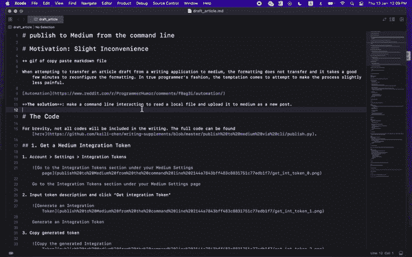
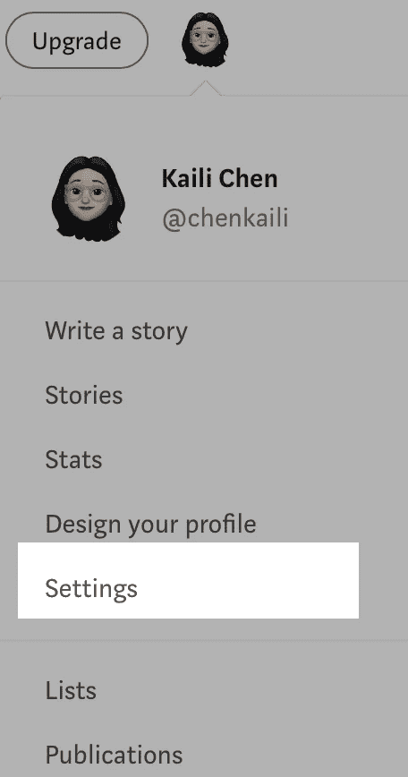
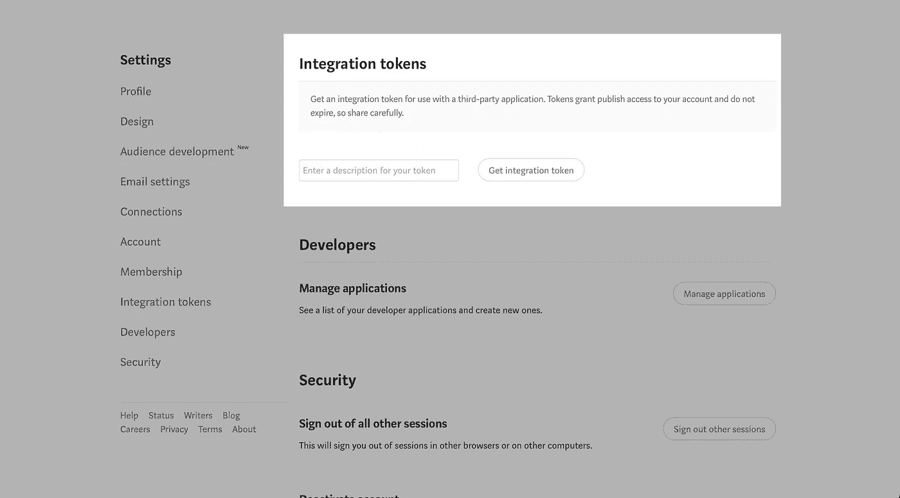
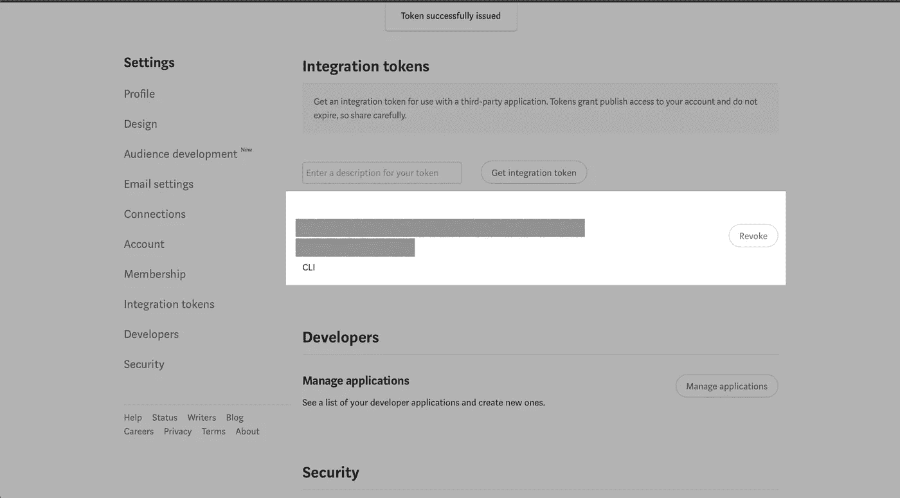
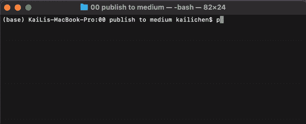
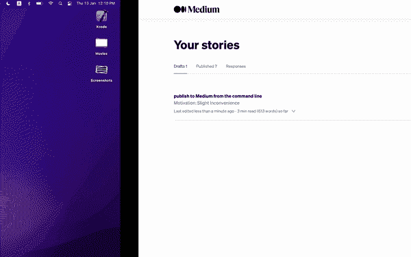

# 使用 Python 以编程方式将降价文件发布为中间故事

> 原文：<https://betterprogramming.pub/programmatically-publish-a-markdown-file-as-a-medium-story-with-python-b2b072a5f968>

## 使用 Medium 的发布 API 从您的终端发布内容(不会丢失太多格式)


谢尔盖·佐尔金在 [Unsplash](https://unsplash.com/s/photos/typing?utm_source=unsplash&utm_medium=referral&utm_content=creditCopyText) 上的照片

# 动机:*轻微*不便



之前:将本地文件上的内容放入一个中等大小的帖子中

# 问题陈述

当试图将文章草稿从本地 markdown 文件(通常是从 Bear 或 concept 等编写应用程序中导出的)传输到 Medium 时，格式粘贴不良，并且需要花费几分钟的时间来重新调整格式。

因此，在真正的程序员的方式中，诱惑导致试图使过程稍微不那么痛苦。

# **解决方案**

进行命令行交互(CLI)以读取本地文件并将其作为新帖子上传到媒体，同时保持大部分预设格式(如标题、链接、代码块)不变。

# 代码

为简洁起见，本文中不会包括所有代码。完整的代码可以在[这里](https://github.com/kaili-chen/writing-supplements/blob/master/publish%20to%20medium%20via%20cli/publish.py)找到。

## 1.获取中等集成令牌

a.帐户>设置>集成令牌



转到“媒体设置”页面下的“集成令牌”部分

b.输入令牌描述，然后单击“获取集成令牌”



生成集成令牌

c.复制生成的令牌



复制生成的集成令牌

d.将生成的令牌作为常量变量添加到 python 文件中

```
# file name: publish.pyTOKEN = 'insert_generated_medium_integration_token'
```

## 2.设置命令行界面

## 3.准备要发布的文件

用于发布的 Medium `post` API 只接受 HTML 和 markdown 内容。下面是读取本地降价文件的 Python 脚本:

现在让我们通过解析文件内容来准备有效负载数据。

## 4.获取作者 ID

要构建发布文章的 URL(稍后在第 5 点中)，需要一个`authorId`。

可以使用带有在点 1 中生成的集成令牌的`Users`端点来获得`authorId`。

## 5.将文件发布到媒体

准备好`authorId`和有效负载后，使用 POST 请求将文件内容发布到媒体。

# 结果

从命令行运行 Python 脚本将本地降价发布到中。

```
python publish.py draft_article.md --title "this is from the cli"
```



从 CLI 添加到 Medium 的同一个文件保留了原始文件的许多格式(如标题、链接、代码块),大大减少了我完成这篇文章的时间。

# 进一步说明

*   曾尝试将其转换为 web 应用程序，但由于 API 目前不支持基于浏览器的身份验证，这一尝试被放弃了
*   API 不会将本地图像引用作为图像上传，快速测试发现，只有 URL 来源的图像会转换为显示在 CLI 发布的帖子中的图像—一个很好的练习是使用 Medium 的图像 API 来处理这种情况

# 参考

*   [介质 API 参考](https://github.com/Medium/medium-api-docs)
*   [python argparse 库](https://docs.python.org/3/library/argparse.html)