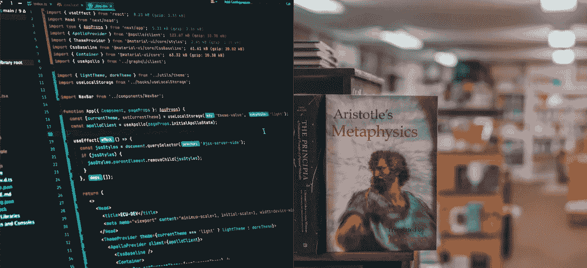

# 程序员是伪装的哲学家吗？

> 原文：<https://betterprogramming.pub/programmers-are-philosophers-in-disguise-b6ece762b984>

## 给初学者的库里-霍华德通信



来自 Unsplash ( [左](https://unsplash.com/photos/mZnx9429i94)、[右](https://unsplash.com/photos/7NzP4i_ej1U))的图像

编程和哲学有什么共同点？比你想象的多得多。这篇文章将解释，在初学者友好的条件下，这种关系看起来如何，以及它是如何被发现的。我将把这个概念分成四个部分:

[逻辑:哲学与编程的关键](#a8e2)
[命题作为类型](#0ca8)
[证明作为程序](#7674)
[对程序员意味着什么](#b222)

# 逻辑:哲学和编程的关键

连接哲学和编程的关键是逻辑。在公元前四世纪，亚里士多德创造了一种逻辑，这种逻辑以命题和结论为基础，构成了所有逻辑的基础。

> 命题:所有人都会死。
> 
> 命题:所有希腊人都是男人。
> 
> 结论:所有希腊人都是凡人。

命题是我们提出的为真的事实，在综合考虑所有的命题后，我们可以得出为真的结论。

在接下来的几个世纪里，这些思想将被建立并进化成新的逻辑类型，允许提出更复杂的命题和结论，并最终创造出我们今天所知道的现代数学。

在 20 世纪 30 年代，逻辑继续发展，但是现在正在探索一个新的科学领域:计算机科学。在接下来的 30 年里，两位科学家得出了一个将永远改变数学和计算机科学的结论:

> 数理逻辑和计算机程序是平等的！

这两个人是数学家哈斯克尔·库里和逻辑学家威廉·阿尔文·霍华德，他们的发现被命名为库里-霍华德通信。

那么，库里-霍华德对应到底是什么，它是如何告诉我们逻辑和程序是平等的？为了回答这个问题，我们来看两个关系:命题和类型，证明和程序。

# 命题作为类型

逻辑命题允许我们陈述关于我们周围世界的知识，证据告诉我们这些知识是否准确。库里-霍华德的通信告诉我们，我们也可以用计算机类型来陈述知识，并用计算机程序来证明。为了证明这一点，考虑这个简单的数学问题:

> Hello + 5 =？

如果你认为这是一个愚蠢的问题，你就对了！但是为什么没有意义呢？嗯，当我们使用`+`符号时，我们期望将两个数字加在一起，而单词“hello”并不是一个数字。我们可以用一个逻辑命题来陈述这一点:

> 对于任何两个相加在一起的东西，这两个东西都是数字。

库里和霍华德的通信告诉我们，我们可以用类型来表达同样的意思。在这种情况下，我们给出加法函数的类型。

加法是一个接受两个数字作为输入，并返回一个新数字作为输出的函数。

```
Function Plus
Input : Number, Number
Output : Number
```

这称为函数的类型签名—它标识函数，就像您的签名标识您一样。

所以，现在我们有了我们的逻辑命题和我们的计算机类型，我们可以使用库里-霍华德对应来表明`hello + 5`在逻辑证明和计算机程序中没有意义。

# 作为程序的证明

让我们从逻辑方面开始:

> 对于任何两个相加在一起的东西，这两个东西都是数字。

在我们的`*hello + 5*`的例子中，我们将两件事情加在一起:

*   “你好”
*   5

我们的命题告诉我们，加在一起的两个东西都是数字，而我们的陈述告诉我们不同的东西:它们中只有一个是数字——这在逻辑上是不一致的。

所以，我们用逻辑来说明为什么我们的陈述没有意义——现在我们可以用计算机程序来做同样的事情。

记住我们的函数有这样的类型签名:

```
Function Plus
Input : Number, Number
Output : Number
```

那么，当我们用输入`hello`和`5`来尝试我们的功能时，会发生什么呢？

```
> Hello + 5 
Type Error: Expected type "Number", recieved type "String"
```

我们的程序无法运行，给了我们一个类型错误。在试图把我们的输入加在一起之前，计算机检查了输入的类型。我们称之为类型检查，它遇到了一个问题:类型检查失败。

所以，逻辑和计算机都告诉我们`hello + 5`没有逻辑不一致和类型错误的意义。根据库里和霍华德的对应关系，我们知道这不是巧合，事实上，逻辑和程序在做同样的事情。

# 这对程序员意味着什么

虽然表明`hello + 5`没有意义并不是一个革命性的结果。库里和霍华德的通信对于程序设计和哲学的研究至关重要。

Curry-Howard 通信允许计算机科学家、数学家和哲学家使用相同的语言，一起工作来开发新的软件、理论和框架。

当类型、逻辑理论和程序变得更加复杂时，Curry-Howard 通信的含义可以用来创建复杂的模型和证明程序的属性。

学习计算机科学的基础对成为一名更好的程序员很重要。如果您想以一种初学者友好的方式学习更多关于这些基本的计算机科学概念，请继续关注我未来的文章，涵盖类型理论和函数式编程。

# **参考文献**

1.  [威廉·霍华德:“建构的公式式概念”致 HB 库里:组合逻辑、λ演算和形式主义论文集 44(1980):479–490。](https://www.dcc.fc.up.pt/~acm/howard2.pdf)
2.  皮埃尔-玛丽·佩德罗。"假人的库里-霍华德同构."(2015)