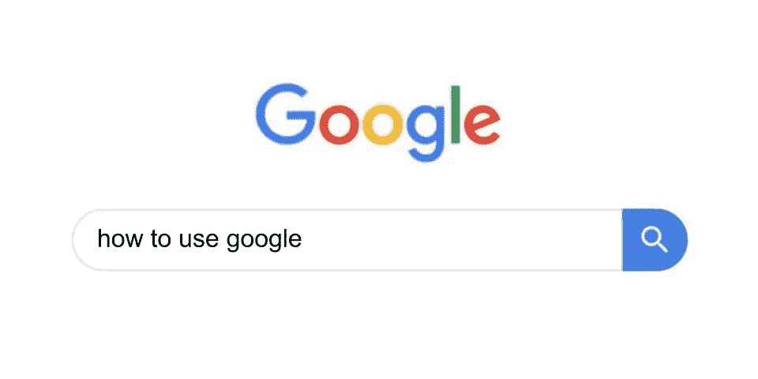
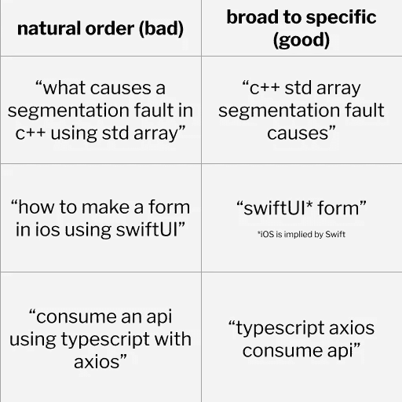
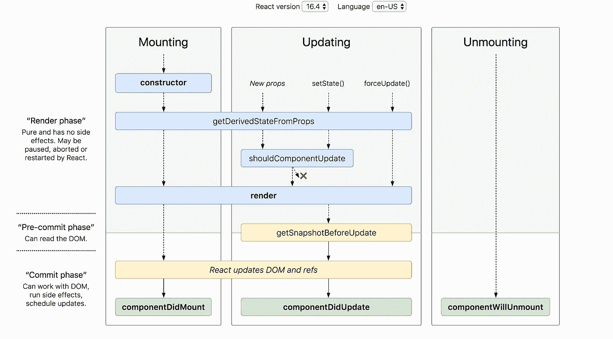

# 程序员:你用错了谷歌，浪费了你宝贵的时间

> 原文：<https://betterprogramming.pub/programmers-youre-using-google-wrong-and-it-s-costing-you-valuable-time-5477c3f0ff1a>

## 在网上寻找答案时，让您的工作效率加倍

图片来源:作者

在编程中有一个被滥用的笑话，世界上许多重要的系统运行在从堆栈溢出复制和粘贴的代码上。

但是许多程序员知道这不完全是一个笑话。虽然我们可能不会仅仅因为代码有数百张赞成票就借用它，但绝对正确的是，程序员依赖于像 Medium 教程、堆栈溢出问题和 JSFiddle 片段这样的资源——而不仅仅是官方文档。因此，足智多谋是有效开发人员的必备素质也就不足为奇了。

但是在一大堆毫无帮助和毫无关联的结果中找到一个可行的解决方案通常比编程本身更困难。有些人可能会争辩说，这不仅是软件工程的重要部分，甚至是最难的部分。

我们都非常了解谷歌搜索一个查询结果却看到一个完全不同的问题的沮丧。或者当你进入搜索结果的第二页时感到沮丧，因为你已经接受了这个事实，这一次，谷歌救不了你了。

一个好的谷歌人不仅知道在哪里以及如何找到有用的结果，还知道如何快速找到它们。有效的程序员通过输入更短、更精确的查询，并快速浏览结果以仅找到相关的查询，来获得他们非凡的生产力——至少部分如此。

通过遵循下面的策略，你可以用一半的时间找到有用的资源和结果，大大提高你的工作效率。

# 1.废话少说

就像好的写作一样，好的搜索查询是简短的。但与写作不同，搜索查询不应该是语法性的，因为搜索引擎很少关心(甚至理解)语法和句子结构。一个好的查询依赖于对关键词的保守但精确的使用，从而将搜索引擎的焦点缩小到你的确切查询。

## 不要问问题——寻找答案

接收相关结果不太取决于单词的顺序，而更多地取决于包括和排除哪些单词。

忘记“什么”、“如何”和其他只起语法作用的词。使用有意义的和描述性的动词要求答案。

图片来源:作者

## 给出相关的上下文，仅此而已

你的目标是给谷歌尽可能多的上下文来理解你在问什么——仅此而已。

例如，如果您在开发 React 应用程序时遇到一个 bug，它可能是 JavaScript 问题或 React 问题。如果您怀疑这是 JavaScript 问题，您的查询应该包括“js”而不是“react”。如果你怀疑是 react 的问题，应该包括“React”而不是“js”(因为所有 React 都是 JavaScript)。

如果你不确定罪魁祸首，从最狭窄的上下文开始——在这种情况下，做出反应——以排除可能的原因。

## 从宽泛到具体排列关键字

谷歌搜索的有效使用需要对建议查询的巧妙利用。这不仅提高了搜索速度(因为你不必再思考或输入)，还提高了搜索结果的质量(因为其他人已经搜索过这个查询)。

为了尽快获得有效的推荐，从最宽泛的关键词开始，然后向最狭窄的关键词移动。记住避免冗余——例如，如果你在问一个关于 Django 的问题，没有必要在查询中包含“Python”。但是如果你问一个关于 Android 开发的问题，你会想包括“Java”或者“Kotlin”。

图片来源:作者

# 2.使用谷歌搜索的鲜为人知的功能

谷歌搜索通过强制搜索引擎在特定参数下运行来提供扩展普通查询能力的关键词。通过声明这些参数，您可以通过自动排除那些您知道没有帮助的结果来缩小结果的范围。

以下是谷歌搜索支持的一些最常用的操作符。[这里有一个更全面的列表，列出了您可以使用的所有运营商。](https://support.google.com/websearch/answer/2466433?hl=en)

## “”

想象一下，你正在搜索 Vue 3 项目中的一个小错误。当你搜索这个错误时，你只能找到关于 Vue 2 的结果——即使你在查询中包括 Vue 3。

要强制 Google 只返回包含精确文本“Vue 3”的结果，请在搜索查询中使用双引号。每个结果都保证包含引号内的文本，与您输入的完全一样。

## 网站:

有时候你只想要某个网站的结果。例如，当了解 Firestore 时，您可能希望将结果缩小到官方文档，即来自 firebase.google.com 的任何结果。

为此，将“site: firebase.google.com”添加到您的搜索中，您将只能看到来自该域的结果。

## -(减号)

假设您想使用 Node.js 创建一个服务器，但是出于某种原因，您想避免使用 Express。告诉谷歌避免使用某些词的最直接的方法是使用减号关键字。

所以，不要“node . js create server without express”，而要尝试“node.js create server -express”。谷歌将保证搜索结果中不会包含文字“express”

# 3.将图像用于图表和可视化

如果你在寻找简短的信息，一张图片通常比阅读一墙文字要好。幸运的是，从任何搜索页面只需点击一下谷歌图片。(不需要去 images.google.com——只需搜索任何查询并点击图像选项卡。)很多时候，图片会包含简洁和信息丰富的图形，这些图形会比网页更快地回答你的问题。

例如，假设您想知道在渲染之前 React 组件的生命周期中发生了什么事件。不要搜索一些复杂的查询和筛选结果，只需搜索“反应生命周期”，点击图片，你的答案将立即显现。

这是谷歌图片搜索“反应生命周期”的第一个结果:

来源:https://programmingwithmosh.com/

# 4.使用谷歌进行计算

从小到大，我们总是被告知口袋里不会有计算器。就这么多了。

我看到很多开发人员打开他们操作系统的计算器(甚至拿出一个物理计算器)来做数学。忘掉这一切。除了最复杂的问题，谷歌会知道答案。只要在你的搜索框里输入任何数学问题，比如“49+18*6”。

## 文字，不是数学(1)

需要求平方根？在谷歌里输入“sqrt 289”。

正弦函数？《辛毗》。

日志基础？" 440 的对数基数为 10 "。

你明白了。如果你用你的话，谷歌很可能能理解你的意思。

## 文字，不是数学(2)

拼写单词不仅仅对操作员有用。当处理大量的数字和零时，它也能节省你的时间(和头痛)。

例如，将“4000000000/2000”改为“40 亿/2 千”。谷歌甚至会以同样的形式返回答案(“200 万”)。

# 奖励 1:有用的网站和资源

虽然与谷歌搜索没有直接关系，但作为软件工程师或程序员，这里有一些资源和网站可能对你有用。

**Reddit** 通常被认为是主流社交媒体，但它包含了许多有趣而微妙的关于不同框架和语言利弊的讨论。例如，如果你不确定你的项目是使用 React 还是 Vue，Reddit 上的用户会提供更深入的讨论，比中等文章或官方文档有更多不同的观点。

如果你需要一个库、框架或语言的快速参考，搜索它的**备忘单**。备忘单几乎总是比官方文档提供更快更直接的参考。这为我节省了大量时间，尤其是在使用像 Moment.js 这样的大型接口库时。

最后，如果你的工作涉及高等数学，Wolfram Alpha 是一个很好的复杂计算工具，谷歌可能无法完成，比如积分和绘图。

# 奖励 2:热键

这个建议可能只会对速度有一点点帮助，但是这些时间会越积越多——会让你觉得自己像个键盘上的忍者。

当人们想进行谷歌搜索时，他们通常会按下新标签按钮打开一个新标签，键入他们的查询，一旦找到他们的结果，按下 X 按钮关闭标签。过度使用鼠标会减慢这个过程，并且更容易误点击——谁不讨厌误点击呢？

为了大大加快这个过程，记住 **Ctrl+T** 和 **Ctrl+W** 热键，它们分别打开一个新标签页和关闭当前标签页。这样，你就可以完成整个谷歌搜索，而无需触摸鼠标或触控板。(一旦你打开一个新标签，光标焦点会自动跳到地址栏。)

哦，别忘了还有 **Ctrl+Shift+T** ，它会重新打开你上次关闭的标签页。当你意识到你仍然需要一个你认为已经结束的网站时，这非常有用。

这只是触及了有用的(和鲜为人知的)热键的表面，这些热键可以大大加快你的谷歌搜索。这里是 Chrome 浏览器和火狐浏览器热键的完整列表。

# 结论

每个雄心勃勃的程序员都想提高他们的生产力。影响工程师产出的因素有很多，但足智多谋也许是最重要的。通过遵循上面的一些策略，你将能够在更短的时间内找到更多有用的结果。

然而，仅仅遵循指导方针和建议不会让你一夜之间成为一名优秀的谷歌人。像任何其他技能一样，谷歌的有效使用需要大量的练习和完善——但是掌握它可以保证提高生产力和减少麻烦。