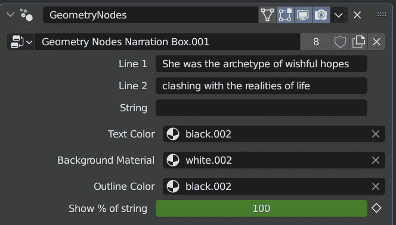

# 在 Blender 中编程 3D 漫画语音泡泡

> 原文：<https://betterprogramming.pub/programming-3d-comic-speech-bubbles-in-blender-ab4306648eb7>

## 因为代码的艺术允许我们编码艺术

大多数程序员可能都没有意识到在 3D 艺术世界里有多大的市场在等着他们。

我们通常认为艺术是更有创造性的东西，而不是 T2 技术，并且很容易忽视自动化、脚本、插件和程序材料的巨大潜力。

就我而言，我一直很喜欢马克思·佩恩游戏使用 2D 的方式，漫画般的过场动画来推进故事的讲述——事实证明 Blender 使你有可能创造自己的故事。下面是我制作的例子，带有可以在 3D 空间转换的动态调整大小的语音气泡:

很漂亮，不是吗？为了制作它，我使用了免费的可用资源，我唯一花钱买的东西是漫画着色器的[，因为它绝对值 20 美元。这相当于最低工资的两个小时，仅仅在这个项目上就很容易地为我节省了这么多。](https://blendermarket.com/products/inkwood)

为了制作演讲气泡，我使用了程序上的“几何节点”,这对 Blender 来说是相当新的。它们允许你可视化地编写一大堆从简单到令人难以置信的东西(这里有一个人制作了一个[程序废弃建筑生成器](https://blenderartists.org/t/procedural-abandoned-house-with-geometry-nodes/1363024))。

本质上，我使用的过程是基于一个名为“边界框”的节点，它动态生成仍然包围父对象所有元素的最小可能框。在我的例子中，对象是文本——也是动态的——这是一个 Blender 特性，可以以各种有趣的方式转换为 3D 网格。

有了这个边界框，我就可以创建一个平面，将它转换到文本的下方，然后为文本和语音气泡背景分配两种不同的材质。

我从外部配置了材质，以及基于百分比值的显示字符数。这最后一部分允许我制作文本框的动画，免费获得一个我甚至不打算包括的输入效果——只是观看文本操作教程的一个旁注。

同样的，我做了言语泡泡和思想泡泡，箭头指向左边或者右边。它们最多可以有三行，我做了一些 if-then-else 的工作，根据这三行是否都填充了文本来处理不同比例的乘数。

说到底，这个项目是我尝试过的最有趣的项目之一，无论是常规编程还是 3D 艺术——更不用说它最终获得了成功。

最酷的部分是，现在，我可以在 Blender 中创建所有的漫画，包括动画和静态的，甚至不需要另一个工具。最重要的是，能够在 3D 空间中旋转和移动盒子允许一些非常酷的效果，如视差或使气泡飞过打开的窗户等。

这可以做很多事情，例如，在角色头上盘旋并跟随他们运动的语音气泡。