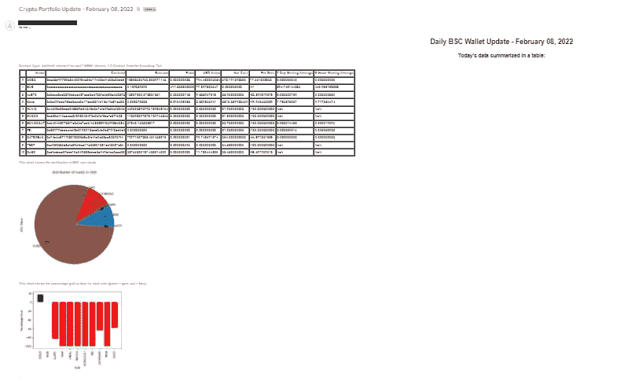

# 为币安智能连锁控股公司设计加密钱包仪表板

> 原文：<https://betterprogramming.pub/programming-a-crypto-wallet-dashboard-4d421d866e05>

## 使用共价的 API 生成一个最新的仪表板


由 [Austin Distel](https://unsplash.com/@austindistel?utm_source=medium&utm_medium=referral) 在 [Unsplash](https://unsplash.com?utm_source=medium&utm_medium=referral) 拍摄

当我在 2022 年 2 月初写这篇文章时，加密市场(以及股票市场)正在经历一场相当糟糕的衰退。但在此之前，当我开始这个项目时，crypto 看到了一轮令人印象深刻的牛市，比特币在 2021 年 11 月 10 日达到了 69，000 美元的历史高点。具有创新技术的严肃项目，以及唯一目的是潜在迷因的硬币(或加密领域亲切地称为“shitcoins ”,如我最喜欢的 DogeBonk)正在蓬勃发展。

虽然我也投资严肃的项目，但我真的很喜欢交易替代硬币，即币安智能链(BSC)上的那些。很明显，这只是一种赌博形式，但跟随社区生成的 shitcoins 迷因是一种享受。

然而，我遇到的一个缺点是跟踪你的硬币和当前利润的能力。熟悉 BSC 令牌的人会知道 BSCscan 和`poocoin.app`，但这些网站在相对容易地跟踪您的交易方面有局限性。

我决定建立一个仪表板表，它将每天自动通过电子邮件发送给我，并将提供我希望看到的 BSC 令牌的统计数据，我计划一步一步地介绍我是如何实现这一点的。

# 入门指南

你首先要前往[https://www.covalenthq.com/](https://www.covalenthq.com/)并获得一个 API 密匙。共价慷慨地提供了一个免费的 API 与吨的端点和支持区块链网络，我用共价的 API 的大部分功能在这个项目中。


共价支持的区块链列表。来自 covalenthq.com 的照片

我们要做的第一件事是使用下面的函数获取我们钱包的更新快照。

“地址”指的是你钱包的 42 位地址。Hidelist 是一个简单的加密代码列表(“ETH”等)。)你不想在你钱包的结果中显示出来。

通常情况下，诈骗令牌会尝试添加您的钱包作为诈骗的一部分，请隐藏这些令牌，这样您就不用担心它们了。还请注意，如果使用 BSC 以外的网络，您将需要一个不同的编号，而不是 API URL 中的“56”。参考共价的其他网络 id 的文件。

## 获取定价数据

有了从`get_wallet()`函数返回的字典数据的钱包列表，我们现在想要获得最新的、准确的价格。虽然共价 API 将价格作为 API 终点，但我发现价格数据是滞后的。我用了 PancakeSwap 的 API 来代替。

然后我们可以用这些更新的价格修改我们的钱包列表。我还生成了一个不同的列表，稍后用作过滤器来删除价格为“0”的任何响应(被删除的令牌或收集数据的 API 有问题)。

```
# Update wallet prices
for i in wallet:
    for j in current_prices:
        if j['Name'] == i['Name']:
            i['Price'] = j['Price']# Generate filter to remove '0' prices
zerodrop = []
for i in current_prices:
    if float(i['Price']) == 0:
        if i['Name'] != 'BNB':
            zerodrop.append(i['Name'])
```

接下来我们想要的是我们所有交易的累计金额。下一个函数从上一个函数中读入我们的钱包数据，并计算交易代币的等价 BNB 值乘以交易时 BNB 的美元值，以获得我们每个代币的所有交易总和的美元值。这为我们的钱包中的每个代币提供了以美元计的净成本。

太好了！现在我们可以将这个输出添加到我们的钱包数据中。

```
# Update wallet list of dicts with net cost value
for i in wallet:
    for j in netcost:
        if j['Name'] == i['Name']:
            i['Net Cost'] = j['Net Cost']
```

在运行这段代码的 Jupyter 笔记本中，我将钱包响应转换为数据帧，清除了一些格式，更新了 USD 值列，并生成了“Percent Gain”列。

我还想包括一些移动平均值—一周和六周。下面我加入了一周移动平均线的代码:

# 生成可视化

我们需要做的最后一件事是生成包含这些信息的仪表板，并将其发送到我的电子邮件中。

我开始添加到仪表板上以在电子邮件中发送的两个数字是资金分布，或者我的 BSC 加密钱包如何在不同硬币之间分割，以及一个显示我钱包中每个硬币的损益百分比的数字。

我从共价网收集的数据可以产生很多其他的可视化效果。

例如，如果您每天将从共价返回的数据保存到一个 SQL 表中，那么您可以随时间跟踪您的投资组合价值。

现在，我们将继续使用 dataframe 表和我们在最后一个嵌入式代码块中生成的两个可视化。

# 发送电子邮件

为了配置要发送到我的电子邮件的投资组合数据，我借用并修改了一些伟大的代码，这些代码是我在[张秀坤·波尔泽](https://medium.com/u/3ab8d3143e32?source=post_page-----4d421d866e05--------------------------------)的一篇媒体文章中找到的，在这里找到。

我创建了一个新的 Gmail 账户，专门用于用 Python 自动发送电子邮件(在我写的另一篇文章中，我用这个账户发送股票通知[这里](https://jspitzer.medium.com/using-python-to-generate-product-in-stock-notifications-b793fa3db066))。我建议不要用你的主邮箱来完成这个任务。

配置完邮件凭证后，我们就可以设置要发送的消息了。在本例中，我将 dataframe 对象和 dashboard 对象转换为 HTML，以确保它们在电子邮件中正确显示。

这是发送到我收件箱的邮件截图:



为了每天自动发送电子邮件，我将`.ipynb`文件转换为`.bat`文件，并设置任务调度程序每天运行一次任务。查看我关于自动库存通知的文章[这里](https://medium.com/@jspitzer/using-python-to-generate-product-in-stock-notifications-b793fa3db066)，了解更多关于如何设置任务调度程序来运行脚本的信息。

感谢阅读，我希望你喜欢这篇文章。如果你有任何问题，请随时告诉我。完整的代码可以在我的 Github [这里](https://github.com/jspitze/Crypto-Token-Tracker)找到。