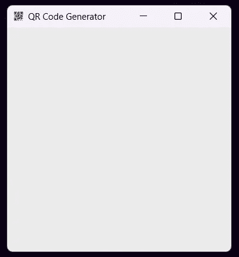
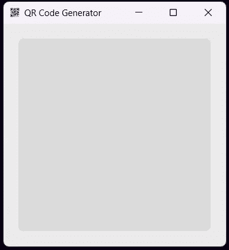
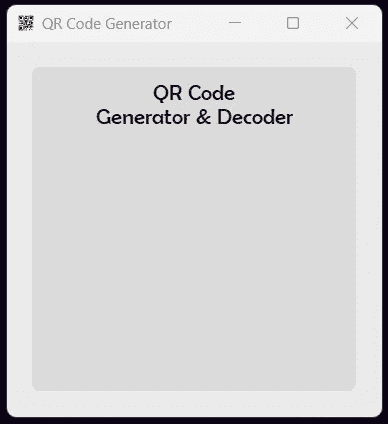
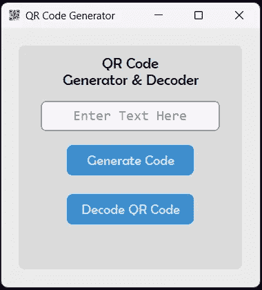
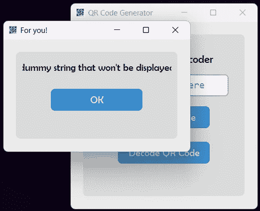
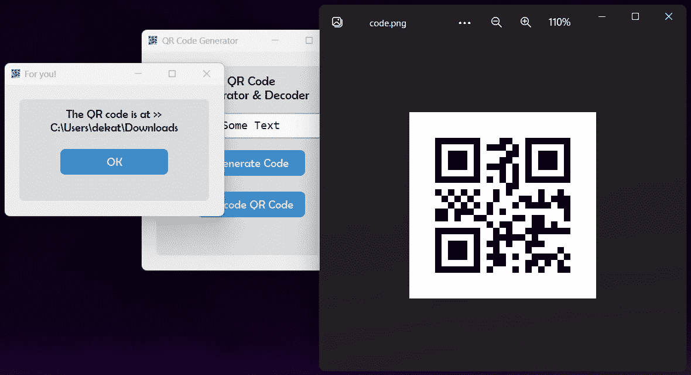
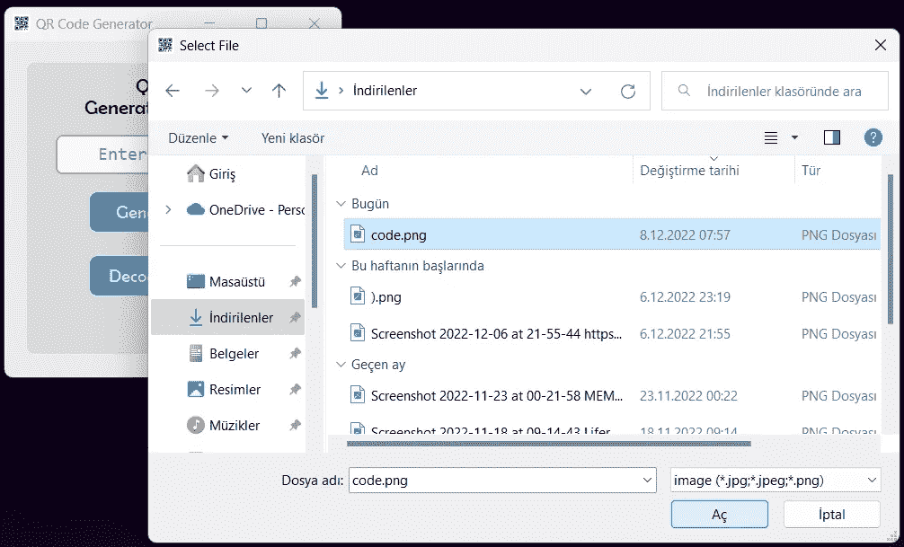
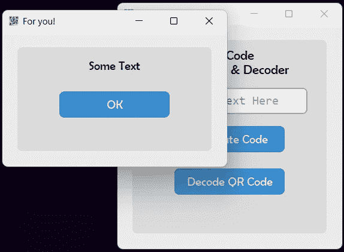

# 用 Python 开发二维码生成器应用程序

> 原文：<https://betterprogramming.pub/programming-a-qr-code-generator-app-in-python-91fa248bfe86>

## 带有自定义 Tkinter 和 OpenCV


当我在第二年学习计算机工程时，我真的迷上了应用程序开发(特别是 web 应用程序),我尝试了不同语言的不同框架等等。

在练习我的前端技能时，我用 Tkinter 开发了 python 中的 QR 码生成器/解码器应用程序，后来我用自定义 Tkinter 对其进行了改进，这是一个基于 Tkinter 的模块，用于开发 Python 应用程序的 GUI。

像往常一样，第一步是导入我们将用来开发应用程序的库。

对于这个项目，我使用 OpenCV (cv2)和 QRcode 作为条形码，使用`tkinter`和 custom `tkinter`作为 GUI，使用 os 模块来定位用户的下载文件夹。所使用的模块可通过以下线路安装:

```
pip install opencv-python
pip install qrcode
pip install tkinter
pip install customtkinter
```

一旦我们安装了它们，我们现在可以导入它们。从 Tkinter 我们将只导入图标的`PhotoImage`和解码二维码时打开文件对话窗口的`filedialog`。我们为 GUI、T4 和二维码导入自定义 Tkinter，以处理和生成二维码:

```
from tkinter import PhotoImage, filedialog
import customtkinter
import qrcode
import cv2
import os
```

现在我们已经有了自己的库，我们在任何项目(包括前端)中想要做的第一件事就是在屏幕上显示一个空白窗口。所以首先我们使用`customtkinter.CTk`作为基类来定义我们的`App`类。`CTk`是自定义的`tkinter`等价于`Tk`，它是我们应用程序主体(窗口)的类，将成为我们应用程序的根窗口。

首先，为了添加标题，我们使用 self 的`title`属性(我们应用程序的根)。

在我们的应用程序中添加一个标题后，为了去掉图标(这部分是可选的，你不想麻烦它)，我们首先使用`PhotoImage`加载图像，然后使用`iconbitmap`属性为我们的应用程序设置一个图标(你可以使用任何你喜欢的带有“ico”文件扩展名的图标)。

最后，为了设置应用程序窗口的尺寸，我们使用`geometry`属性来设置它们。您以字符串`(300x300)`的形式设置尺寸。

对于这个应用程序，我使用了 300 乘 300 的尺寸，因为它们似乎是合适的尺寸。

```
class App(customtkinter.CTk):
    def __init__(self):
        super().__init__()

        self.title("QR Code Generator")
        icon = PhotoImage("icon.ico")
        self.iconbitmap(icon)

        height = 300
        width = 300
        self.geometry(f"{width}x{height}")

if __name__ == "__main__":
  app = App()
  app.mainloop()
```

运行代码后，我们应该会看到一个 300 x 300 的空窗口，类似于下面的内容:



空白应用程序窗口

现在我们可以在屏幕上显示一个空白窗口，我们现在可以开始向它添加元素。首先，我们将添加一个框架，它实际上是父根窗口(父容器)中的一个容器。

我们将调用`CTkFrame`来将帧添加到我们的应用程序中。我们将把`self`(在我们的例子中是根)设置为它的`master`(父容器)，然后我们将使用`pack`属性让它显示在我们的屏幕上。然而，在我们最终完成之前，我们将在所有四个侧面增加 20 个单位的衬垫，使用`padx`和`pady`使它看起来不那么拥挤，我们将让它填充“两个”方向并扩展。我们的类和应用程序应该如下所示。

```
class App(customtkinter.CTk):
    def __init__(self):
        super().__init__()

        self.title("QR Code Generator")
        icon = PhotoImage("icon.ico")
        self.iconbitmap(icon)

        height = 300
        width = 300
        self.geometry(f"{width}x{height}")

        frame = customtkinter.CTkFrame(master=self)
        frame.pack(pady=20,padx=20, fill="both", expand=True)
```



带框架的应用程序窗口

现在我们有了一个容器，我们将使用`CTkLabel`添加一个标签(文本元素)。它将显示一个文本说`“QR Code\nGenerator & Decoder”` (\n 是一个新的一行)，它将使用“柏林无 FB”字体，字体大小为 18。

在调用它之后，我们将再次使用`pack`属性让它显示在我们的应用程序上。同样，我们将使用`padx`和`pady`给它 10 个单位的水平和垂直填充。我们的应用程序现在应该看起来像这样。

```
class App(customtkinter.CTk):
    def __init__(self):
        super().__init__()

        self.title("QR Code Generator")
        icon = PhotoImage("icon.ico")
        self.iconbitmap(icon)

        height = 300
        width = 300
        self.geometry(f"{width}x{height}")

        frame = customtkinter.CTkFrame(master=self)
        frame.pack(pady=20,padx=20, fill="both", expand=True)

        label = customtkinter.CTkLabel(master=frame, text="QR Code\nGenerator & Decoder", font=("Berlin Sans FB", 18))
        label.pack(pady=10, padx=10)
```



添加标签后的应用程序窗口

**注意:**在 custom Tkinter 或`tkinter`中，您应该可以使用安装在您电脑上的任何字体。对于 windows，如果你想知道你的电脑上安装了什么样的字体，你可以去你的 windows 搜索栏输入“font ”,然后从字体设置中查看。

现在我们知道了如何添加一个小部件，我们想做的第一件事是使用`CTkEntry`添加一个入口小部件，然后使用`CTkButton`添加两个按钮，一个用于生成二维码，一个用于解码二维码。

对于我们的条目字段，我们将把`frame`定义为它的父字段(主字段),它的`width`将为 200。将会有占位符文本显示`“Enter Text Here”`，为了使文本在输入字段内居中，我们将使用`justify="center"`。

最后，我们希望它使用字体大小为 16 的“Consolas”字体。然而，在我们显示它之前，我们将使用`ipadx`和`ipady`在每个方向添加 5 个单位的顶部和底部填充以及 5 个单位的内部填充。

对于我们的按钮，我们将使用`CTkButton`。对于第一个，它的父容器将再次是`frame`，它将显示文本`“Generate Code”`，并使用字体大小为 16 的“Berlin Sans FB”字体。我们将`pack`它的 x 和 y 填充为 10，所有方向的内部填充为 5。

对于第二个按钮，我们将复制并粘贴第一个按钮，使用不同的变量名和文本“`Decode QR Code”`”。至此，我们的代码和应用程序应该看起来有点像这样。

```
class App(customtkinter.CTk):
    def __init__(self):
        super().__init__()

        #Previous code

        frame = customtkinter.CTkFrame(master=self)
        frame.pack(pady=20,padx=20, fill="both", expand=True)

        label = customtkinter.CTkLabel(master=frame, text="QR Code\nGenerator & Decoder", font=("Berlin Sans FB", 18))
        label.pack(pady=10, padx=10)

        url_input = customtkinter.CTkEntry(master=frame, placeholder_text="Enter Text Here",justify="center",width=200, font=("Consolas", 16))
        url_input.pack(ipady=5,ipadx=5,pady=5)

        btn_gen = customtkinter.CTkButton(master=frame, text="Generate Code", font=("Berlin Sans FB", 16))
        btn_gen.pack(ipady=5,ipadx=5,pady=10,padx=10)

        btn_dec = customtkinter.CTkButton(master=frame, text="Decode QR Code", font=("Berlin Sans FB", 16))
        btn_dec.pack(ipady=5,ipadx=5,pady=10,padx=10)
```



添加输入字段和按钮后的应用程序窗口

现在，我们已经完成了主应用程序窗口，我们现在可以工作的功能。但在此之前，我们将创建一个弹出窗口，稍后在添加功能时会用到它。

我们首先定义一个名为 pop_up 的函数，它有一个字符串参数 msg，这是将显示在弹出窗口上的消息。

在函数内部，我们首先将使用`CTkTopLevel`为弹出窗口定义一个根。我们给它加上标题`“For you!”`(因为这是给用户的消息，我认为它适合:D)，将其大小锁定为 300 乘 180。在添加图标之前，我们通过设置一个`minsize`和`maxsize`使其相等，就像在主应用程序窗口中一样(使用`iconbitmap`)。代码应该是这样的。

```
def pop_up(msg:str):
        win = customtkinter.CTkToplevel()
        win.wm_title("For you!")
        win.maxsize(300,180)
        win.minsize(300,180)
        icon = PhotoImage("code.ico")
        win.iconbitmap(icon)
```

为了测试弹出窗口，我们可以调用它作为我们的一个按钮的`command`,如下所示。请注意，当调用这个函数时，我们需要使用`lambda`，因为我们需要给这个函数传递一个参数。

```
btn_gen = customtkinter.CTkButton(master=frame, text="Generate Code", font=("Berlin Sans FB", 16), command=lambda:pop_up("dummy string that won't be displayed"))
btn_gen.pack(ipady=5,ipadx=5,pady=10,padx=10)
```

单击该按钮后，应该会出现以下弹出窗口。


空白弹出窗口

既然我们可以显示弹出窗口，我们可以开始向它添加元素。

首先，我们将添加一个在每个方向上有 20 个填充单位的框架，一个将显示输入参数的标签，该输入参数使用“Berlin Sans FB”作为其字体，字体大小为 16，在每个方向上有 10 个填充单位，最后一个按钮将在按下后关闭弹出窗口。我们通过调用`win.destroy`来实现，它将关闭(摧毁)它曾经调用过的自我。

最后，给我们的按钮每个方向 5 个内部填充，每个方向 10 个外部填充，一个显示文本`“OK”`，字体选择“Berlin Sans FB ”,字体大小为 16。一旦我们做了所有的事情，代码和弹出窗口应该如下所示。

```
def pop_up(msg:str):
        win = customtkinter.CTkToplevel()
        win.wm_title("For you!")
        win.maxsize(300,180)
        win.minsize(300,180)
        icon = PhotoImage("code.ico")
        win.iconbitmap(icon)

        frame = customtkinter.CTkFrame(master=win)
        frame.pack(pady=20, padx=20,fill="both", expand=True)

        label = customtkinter.CTkLabel(master=frame, text=msg, font=("Berlin Sans FB", 16))
        label.pack(pady=10, padx=10)

        btn = customtkinter.CTkButton(master=frame, text="OK", font=("Berlin Sans FB", 16),command=win.destroy)
        btn.pack(ipady=5,ipadx=5,pady=10,padx=10)
```



添加了元素的弹出窗口。

**注意:**对于正在显示的字符串来说，窗口宽度可能有点太小，所以请不要犹豫将它变大。

既然我们已经完成了所有与 GUI 相关的部分，现在我们可以开始实现应用程序的功能了，这可能会让人感到惊讶，但却是应用程序中最简单的部分。

对于二维码生成，我们将从定义一个名为`generate_code`的函数开始。它将有一个名为`url`的字符串类型的参数。使用`qrcode.make`我们将把它变成一个二维码。在我们保存它之前，我们首先需要使用`os.getenv(‘USERPROFILE’)`定位用户下载(这部分是可选的，但是在下载中保存它更有意义)并在它的末尾添加`“\\Downloads”`。

之后，我们使用`code.save`保存代码。一旦一切完成，弹出窗口将会显示“代码在`C://user/downloads/folder`”。代码应该如下所示。

```
def generate_code(url:str):
    code = qrcode.make(url)
    downloads = f"{os.getenv('USERPROFILE')}\\Downloads"
    code.save(downloads + '/code.png')
    pop_up("The QR code is at >>\n" + downloads)
```

然而，在我们使用它之前，我们需要将按钮的命令从`pop_up`改为`generate_code`，并从输入框中获取字符串。要从输入框中获取字符串，我们可以使用`entry.get`，它返回输入框中的字符串，并将其作为参数传递给我们的函数。

```
btn_gen = customtkinter.CTkButton(master=frame, text="Generate Code", font=("Berlin Sans FB", 16), command=lambda:generate_code(url_input.get()))
btn_gen.pack(ipady=5,ipadx=5,pady=10,padx=10)
```

一旦一切都做好了，下面应该就是结果了。



弹出生成的二维码

现在，我们已经完成了所有其他工作，我们需要做的最后一件事是向我们的应用程序添加解码功能。

首先，我们需要能够选择一个包含二维码的文件进行解码。为此，我们将使用来自`tkinter`的`filedialog`和`((“image”, “.jpg”), (“image”, “.jpeg”), (“image”, “.png”))`的文件类型。一旦我们能够选择要解码的文件，我们将使用`cv2.QRCodeDetector`来解码它。但是，在此之前，我们需要使用`cv2.imread`将其作为图像加载到我们的检测器。一旦一切完成，一个弹出窗口将显示代码中的文本。

```
def decode():
    qr_code = filedialog.askopenfilename(initialdir="/", title="Select File", filetypes=(("image", ".jpg"), ("image", ".jpeg"), ("image", ".png")))
    code_detector = cv2.QRCodeDetector()
    code_str, _, _ = code_detector.detectAndDecode(cv2.imread(qr_code))
    pop_up(code_str)
```

在添加了这个功能作为我们解码按钮的命令后，我们的 app 现在可以解码二维码了。



用于解码的文件对话框



弹出解码信息

最后，我们有了一个功能齐全的应用程序。如果您希望获得完整的代码，可以在以下位置找到:

[](https://github.com/dekaottoman/QR-code-generator-decoder) [## GitHub-dekaotoman/QR-code-generator-decoder:一个我编程的 QR 码生成器和解码器…

### 一个二维码发生器和解码器，我用二维码，cv2 和 Tkinter 模块编程。- GitHub …

github.com](https://github.com/dekaottoman/QR-code-generator-decoder)