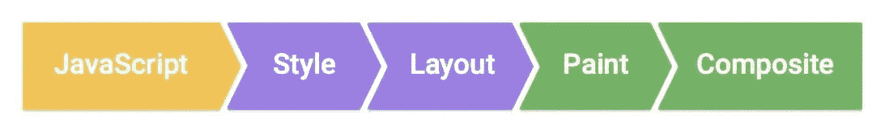
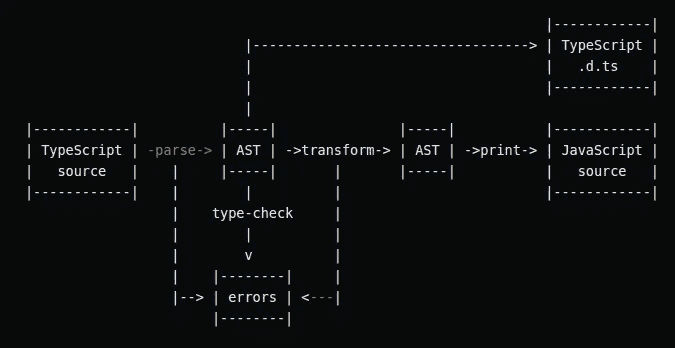

# 作为网络开发人员，你的老板希望你知道的 11 个流行词汇

> 原文：<https://betterprogramming.pub/programming-buzzwords-9e94a3544eed>

## [软件工程](https://rakiabensassi.medium.com/list/software-engineering-7a179a23ebfd)

## 获得关于工具箱中术语的更多见解


[沃洛德梅尔·赫里先科](https://unsplash.com/@lunarts?utm_source=medium&utm_medium=referral)在 [Unsplash](https://unsplash.com?utm_source=medium&utm_medium=referral) 上的照片

随着时间的推移，现代 web 开发发展得越来越快。如果你不注意变化并跟上步伐，很容易在市场消息抢先你一步的时候落后。

为了帮助您掌握软件开发行业的创新和趋势，我们将在本文中分解 11 个 web 开发术语。

让我们开始吧。

```
**Contents****1\.** [**JS Rendering**](#5d9b)
**2\.** [**Virtual DOM**](#de1e)
**3\.** [**Server-Side Rendering (SSR)**](#d4e9)
**4\.** [**JSX**](#fcd3)
**5\.** [**AST**](#c898)
**6\.** [**Tree Shaking**](#0d86)
**7\.** [**Transpiler**](#e0ab)
**8\.** [**Linter**](#18f0)
**9\.** [**Prettier**](#9db1)
**10\.** [**Headless Browser**](#d155)
**11\.** [**Accessibility (A11y)**](#ae4c)
[**Final Thought**](#ccb9)
```

# 1.JS 渲染

在输出有意义的代码并显示给请求它的客户机(浏览器或搜索引擎爬虫)之前，应该准备并呈现 JavaScript 代码。

下面是一个内容示例，除非执行 JavaScript，否则人、浏览器或搜索引擎无法读取、理解或用于索引:

JavaScript 支持的内容的例子

呈现 JavaScript 支持的内容比呈现 HTML 内容花费更多的时间。



[JavaScript 渲染过程](https://developers.google.com/web/fundamentals/performance/rendering/)

# 2.虚拟 DOM

如果你在过去几年中做过前端开发人员，你可能听说过虚拟 DOM (VDOM)。它是由 React 引入的编程概念，在现代 [JavaScript](/javascript-history-and-future-71b0ceb737aa) 框架中使用。

它是关于在内存中保存用户界面的理想或“虚拟”表示，并通过一个库(如 ReactDOM)将其与“真实”DOM 同步。

VDOM 经常被认为比真正的 DOM 更快，但是像 Svelte 这样的框架认为它是纯粹的开销。虽然比 React、 [Angular](/angular-10-new-features-dbc779061dc8) 和 Vue 快，但是 Svelte 不使用它。

# 3.服务器端呈现(SSR)

我们的 web 开发术语纲要中的下一项是与用户体验相关的。

由于十年前现代 JS 框架的兴起，前端开发人员开始通过依赖在浏览器上执行的 JavaScript 来遵循一种新的呈现类型——客户端呈现(CSR)。

CSR 需要初始下载命中，并且在良好可靠的连接下可以很好地工作。但是使用服务器端渲染(SSR)可能会更好。

SSR 是 PHP 和 WordPress 使用的传统渲染方法。对于有大量静态内容的网站来说，这是一个非常好的策略。使用 SSR，服务器托管页面的所有资源。然后，当用户请求页面时，浏览器从服务器获取页面，最终呈现给用户。

在过去几年中，SSR 在机构群体中的影响力越来越大，这背后有三个主要原因:

1.  它通过搜索引擎优化(SEO)为网络爬虫提供便利。
2.  它通过提高低功率设备和移动设备上的[性能](/angular-onpush-change-detection-f629cbce0bfa)，为用户提供快速体验。
3.  它允许使用[第一个内容丰富的颜料(FCP)](/build-me-an-angular-app-with-memory-leaks-please-36302184e658) 快速显示第一页。

> 第一次内容丰富的描绘(FCP)是当浏览器呈现来自 DOM 的第一点内容时，向用户提供页面实际正在加载的第一个反馈— [Mozilla](https://developer.mozilla.org/en-US/docs/Glossary/First_contentful_paint)

# 4.JSX

React 框架中使用的 JSX 代表 JavaScript XML。它允许您在 JavaScript 中编写 HTML 元素，并将它们放在 DOM 中。这里有一个例子:

[TypeScript 4.1](/typescript-new-release-19f1238c6a68) 通过两个新的编译器选项支持`jsx`和`jsxs`工厂函数。

特别是对于初学者来说，这种方法可能会让人感觉很不舒服，因为 HTML 元素——在这里是`<h4>Yes I can do it!</h4>`——可能会显得格格不入。

# 5.大西洋时间

AST 是抽象语法树的缩写。这是一种将源代码转换成优化的抽象语法树的方法，然后按照这种树结构执行程序——或者使用它来生成实时(JIT)本机代码。

AST 是 TypeScript transpiler 体系结构中的一种中间格式，它保持全局程序结构和语句之间的关系。



[TypeScript Transpiler 架构](https://github.com/ikatyang/angular-html-parser/blob/master/packages/compiler/design/architecture.md)

# 6.树摇晃

树抖动是 JavaScript 模块绑定上下文中常用的一个术语。它依赖于对 ES2015 模块语法的静态结构的分析，即`import`和`export`，以消除死代码——任何不使用的代码。

这个概念被称为实时代码包含:我们包含开始时需要的部分，并在稍后阶段删除不需要的部分。

# 7.运输工具

transpiler 是一个在高级语言之间进行翻译的程序。这种类型的[编译器](/compiler-vs-interpreter-d0a12ca1c1b6)也被称为代码转换器。

**例子:**

*   将 C/C++转换成 JavaScript 代码。
*   Babel:将 JS 代码从 ES6+转换为 ES5，可以由较老的 JS 引擎运行。
*   Cfront:最初的 C++编译器，可以追溯到 1983 年。它创建的 C 代码没有缩进样式，也没有漂亮的 C 中间代码。生成的代码通常不适合人类阅读。

# 8.棉绒

林挺是一个静态代码分析的过程，它将标记编程错误、bug、风格错误和可疑的构造。执行这一过程的工具称为棉绒或棉绒。

代码翻译器使用 AST 来分析代码，找出违规之处，然后就在那个地方修复代码。

# 9.较美丽

漂亮是一个支持多种语言的代码格式化程序。

代码格式化程序总是比 linter 更快地修复代码，它可以保证整个代码库中 100%的代码一致性。它使用 AST 并直接从中重新生成代码。

# 10.无头浏览器

> 无头浏览器在类似于流行的 web 浏览器的环境中提供对网页的自动控制，但是它们是通过命令行界面或使用网络通信来执行的。它们对于[测试](https://en.wikipedia.org/wiki/Functional_testing)网页特别有用，因为它们能够像浏览器一样呈现和理解 HTML，包括页面布局、颜色、字体选择以及 JavaScript 和 Ajax 的执行等样式元素。”— [维基百科](https://en.wikipedia.org/wiki/Headless_browser)

无头浏览器是没有图形用户界面的浏览器。它的主要使用案例是:

1.  运行自动化测试
2.  截图
3.  自动化网页交互，如导航、执行用户操作以及在页面上下文中运行注入的 JavaScript。
4.  [网页抓取](/data-scraping-tools-7cb76eeab89e)

使用自动打开网页

上面的代码打开一个网页，在加载时，将截图保存到一个文件`smart-minds.png`，然后退出。

**无头浏览器的例子:**

*   PhantomJS 就是一个很著名的例子，但是从 2018 年 3 月就已经停产了。
*   Google Chrome(从 59 版开始)和 Firefox(从 56 版开始)提供了对浏览器远程控制的原生支持。

# 11.可访问性(A11y)

Web accessibility，缩写为 A11y，可以说是我们列表中最有力的流行语之一。这是一个正在以令人难以置信的速度增长的概念，它值得更多的关注。

那么，这个耐人寻味的流行语是什么？

基本上，术语可访问性——或 [508 合规性](https://www.section508.gov/about-us) —指的是通过遵循[美国残疾人法案(ADA)](https://www.circlesstudio.com/blog/best-practices-to-ensure-your-website-is-ada-compliant/) 概述的指导方针，使 web 应用程序对残疾人可用。


照片由[西格蒙德](https://unsplash.com/@sigmund?utm_source=medium&utm_medium=referral)在 [Unsplash](https://unsplash.com?utm_source=medium&utm_medium=referral) 拍摄。

当[构建一个符合 508 标准的应用](/frontend-architecture-376e6323ef9b)时，你需要确保字体清晰易读，图像有标签，图像的名字可以被视障人士读出，等等。

由于其对[用户体验](/angular-dynamic-layout-with-ngtemplate-8b6faa995a8f)的改进，这种方法不仅仅是政府网站所需要的。确保你的应用程序尽可能符合标准总是一个好主意，即使最终用户没有残疾。使用键盘代替鼠标，我们可以在更短的时间[内完成工作，这已经不是什么秘密了。](/angular-keyboard-listeners-good-practices-b208edc6bf89)

# 最后的想法

作为开发人员，我们使用了很多行话。随着每一个新的基于信息技术的创新的发展，都会出现一波额外的词汇。结识最重要的人是你不想错过的。

我希望通过理解这 11 个流行语，你能洞察到该期待什么，或者在哪里投入你的努力。

🧠💡感谢阅读！我为一群聪明、好奇的人写关于工程、技术和领导力的文章。 [**加入我的免费电子邮件简讯，独家获取**](https://rakiabensassi.substack.com/) 或在此注册 Medium [。](https://rakiabensassi.medium.com/membership)