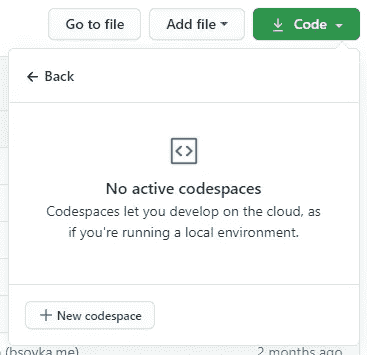

# 在你的浏览器中编程(几乎)在这里

> 原文：<https://betterprogramming.pub/programming-in-your-browser-is-almost-here-a6a68ce63b60>

## 先睹为快新的 GitHub 代码空间测试版

GitHub 制作的动画。

今年早些时候，GitHub 在其卫星 2020 活动期间宣布了一些[新功能](https://medium.com/better-programming/4-new-github-products-that-will-change-how-you-code-27933401faa0?source=friends_link&sk=d298a554ccb7d9c5d5c6bd8f48a9d777)，以帮助全球开发者。这些新特性之一是[代码空间](https://github.com/features/codespaces)，GitHub 称之为“你的即时开发环境”。

Codespaces 的目标是允许任何人立即启动一个开发环境，这样他们就可以立即为任何项目做出贡献，所有必要的工具和依赖项都已设置好，随时可以使用。

> “Codespaces 是一个在线开发环境，由 GitHub 托管，由 Visual Studio 代码提供支持，允许您完全在云端进行开发。”— [GitHub](https://docs.github.com/en/github/developing-online-with-codespaces/about-codespaces)

在最近获得了有限的测试版后，我已经测试了这种有趣的新编码方式，我很高兴地说它非常有效。

# 它是如何工作的

作者截图。

进入任何一个 GitHub 库，点击三个按钮，你会在 30 秒内进入浏览器中的 VS 代码窗口。在这个选项卡中，可以比以往任何时候都更快地编码、构建、测试和部署。

通过现成的终端和在代码空间中安装 VS 代码扩展的能力，这种可能性得到了进一步的扩展。您甚至可以使用 [Visual Studio Codespaces](https://marketplace.visualstudio.com/items?itemName=ms-vsonline.vsonline) 扩展连接到您自己机器上的 VS 代码中的代码空间。

存储库还可以有特定的设置来进一步定制代码空间，包括自动安装扩展、转发端口等等。这是在一个新的`devcontainer.json`文件中完成的，并被[很好地记录下来](https://docs.github.com/en/github/developing-online-with-codespaces/configuring-codespaces-for-your-project)。

使用代码空间的一个好处是，新开发人员可以在几秒钟内准备好提供帮助，同时减少错误。新的贡献者可以立即访问第一次提交项目所需的所有工具和信息。

请看来自 Satellite 2020 主题演讲的视频片段，了解代码空间的现场演示:

# 当你能使用它的时候

目前，Codespaces 处于有限的测试阶段，这意味着只有一小部分用户可以访问。我花了将近四个月的时间才在候选名单中找到自己的位置。

定价尚未最终确定，但计划采用简单的现收现付模式。目前，测试版用户一次只能使用两个代码空间。

目前，这个特性只能在您自己的存储库和公共存储库中使用。这意味着一个组织拥有的私有回购协议还不能使用代码空间。

# 结论

对于新的贡献者来说，Codespaces 是一个很好的主意，也是帮助 GitHub 上任何项目的好方法。只需几次点击和几秒钟，任何人都可以在他们的浏览器中拥有一个全功能的开发环境。

无论您只是需要做一点小小的改变还是添加一个全新的特性，代码空间都是一条可行之路。

感谢您抽出时间阅读，祝您度过美好的一天！

# 资源

*   [代码空间专题页面](https://github.com/features/codespaces)
*   [代码空间文档](https://docs.github.com/en/github/developing-online-with-codespaces)
*   [卫星 2020 开幕主题演讲](https://www.youtube.com/watch?v=L618Pp0n7us)