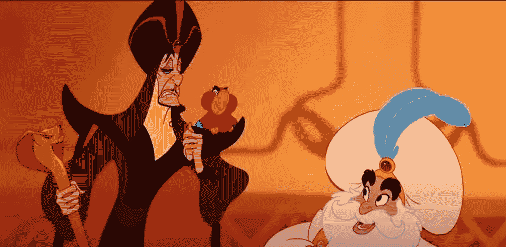
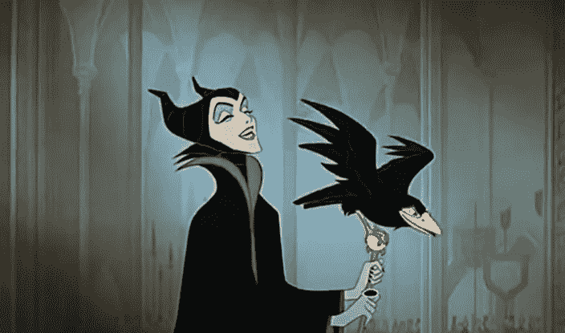
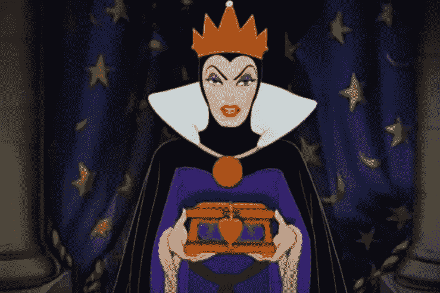
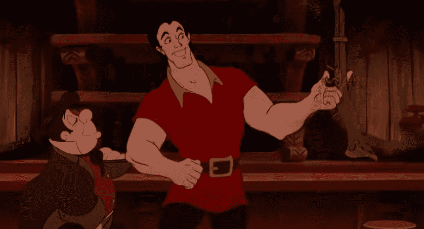

# 如果编程语言是迪斯尼人物

> 原文：<https://betterprogramming.pub/programming-languages-as-disney-villains-feb5b17c01ea>

## 让我们开心地将编程语言比作迪士尼的恶棍

艾米·汉弗莱斯在 [Unsplash](https://unsplash.com?utm_source=medium&utm_medium=referral) 上的照片

说实话，你永远不会老到不喜欢迪斯尼电影。这类电影只有*的*最佳角色和*的* 最佳情节，即使我们不希望他们这样做，即使看他们完全是浪费时间。

编程同样会让人上瘾，但也许并不总是以最好的方式:虽然与迪士尼电影不同，编程实际上是有用的，但每种语言都有极其具体的语法要求，人们不禁将编程语言比作迪士尼的恶棍。所以，我们在这里，调查每一种流行的编程语言可以作为哪个标志性的迪士尼反面角色。

# 爪哇的乌苏拉

独一无二的乌苏拉(来自迪士尼电影《小美人鱼》(1989)

经典编程语言 Java 设法窃取了所有其他编程语言的话语权。它是最受欢迎的语言，尤其是在关于算法的教科书中。只有厄休拉是它的完美匹配才有意义。

# 作为贾法尔的 Python

独一无二的贾法尔(来自迪士尼的“阿拉丁”(1992 年))

虽然 Java 非常受欢迎，但它作为编程语言女王的地位并非没有受到挑战。作为发展最快的编程语言， [Python 已经吸引了超过 600 万开发人员的注意力](https://www.zdnet.com/article/programming-languages-javascript-has-most-developers-but-rust-is-the-fastest-growing/#:~:text=Python%20is%20the%20fastest%20growing,%2C%20Facebook's%20PyTorch%2C%20and%20NumPy.),这看起来像是一种黑魔法和纯粹的魔法。这就是为什么没有比贾法尔更适合蟒蛇的了(特别是因为那家伙有一根很酷的蛇杖，可能是也可能不是蟒蛇)。

# SQL 作为 Maleficent

唯一的玛琳菲森(迪士尼“睡美人”(1959)中的形象)

没有人比 SQL sever 更好地存储数据，也没有人比迪士尼的 Maleficent 更记仇。自然，他们是天造地设的一对。

# 作为邪恶女王的 HTML/CSS

独一无二的邪恶女王(来自迪士尼的《白雪公主和七个小矮人》(1937 年))

我知道你在想什么:“HTML 和 CSS 并不是真正的编程语言”。你完全正确。HTML 和 CSS 有点假，而且奇怪的是，它们还痴迷于外表。这就是为什么 HTML/CSS 和邪恶女王必须成为最好的朋友。

# JavaScript as Gaston

独一无二的加斯顿(来自迪士尼《美女与野兽》(1991 年)的形象)

加斯顿被看作是一个不太聪明、不太强壮、也不太好看的小坏蛋，他在 JavaScript 上遇到了对手。虽然与 Gaston 不同，JavaScript 实际上非常棒，但它仍然一直受到嘲笑(尤其是那些宣誓效忠 Java 的开发人员)。

# c 为疤痕

唯一的伤疤(来自迪士尼的《狮子王》(1994 年))

聪明，狡猾，两面派，Scar 遇到了他与 C 的对手。C 的跟踪记录显示它自己是 C#，C++，天知道接下来会发生什么，就像 Scar 一样，它根本不能被信任。

感谢您的阅读！显然，有更多的迪士尼电影，甚至更多的编程语言，我们可以潜在地配对在一起。如果你有任何我错过的好主意，请随时告诉我。

祝你愉快！