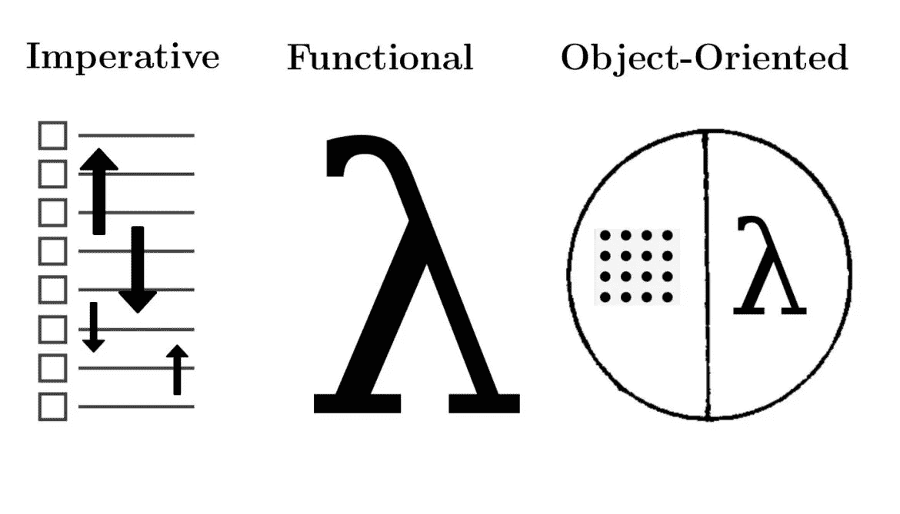

# 编程范例:面向对象与过程化

> 原文：<https://betterprogramming.pub/programming-paradigms-object-oriented-vs-procedural-f89eda302b0e>

## 比较两者



编程范式只是编写程序的一种方式。我倾向于将编程范式视为程序员独特风格的一部分，因为两个程序员很少会产生相同的代码——即使代码是为相同的目的而构建的。

当开始他们的面向对象编程之旅时，大多数初学者从过程化编程方法开始。过程化编程非常简单，一次一步地处理动作。

```
# **Procedural Programming**: Code is organized by sequence, going one step at a time for execution.a = 1
b = a
a += bputs a
puts b
```

下面是我用 Ruby 写的一个快速程序，是关于井字游戏的程序化编程方法。几乎没有什么结构，程序开始一步一步、一行一行地执行。这个程序很大程度上依赖于局部变量，一个循环结构封装了所有的游戏性。这就是我所说的 *chunky* 代码，意思是这些代码被聚集成一个巨大的依赖块(主要是局部变量)。

当代码运行时，您可以用它玩井字游戏，但是实际的代码很难阅读，因此很难维护。有一种更有条理的方法来组织这些代码，那就是使用面向对象的编程范例。

对这样的程序采用面向对象的方法指的是将功能分组到类和对象中的能力:

```
**Classes/Nouns of Program:** Board, Player, Computer, Square, Game
**Verbs/Behavior of Program:** Mark Square, Display Board, Alternate players
```

利用这些功能，我可以用从问题描述中提取的名词和动词对类和方法进行分组。使用面向对象范例的程序的初始设置(峰值)如下所示:

与过程化方法相比，这看起来更加结构化和清晰(与基于过程的编程相比，我的 OOP 编程能力更强)。

使用面向对象的方法，我可以开始将行为分离或封装到单个数据单元中。我还可以显式定义哪些方法在类的公共接口上可用，并且可以被任何需要该数据的类或对象访问。

上面的代码是一个完整的面向对象的井字游戏的例子。这段代码更容易阅读，它的功能在具体的单元中有明确的定义。不需要向公众公开的数据被封装在类中，行为与特定的类型(`User`、`Player`和`Computer`)相关联，通过继承来专门化基类。`User`专修了`Player`班。`Computer`还专门研究了`Player`基类。

随着程序变得越来越复杂，对更少的依赖性、更大的灵活性和更好的可读性的需求也在增加。面向对象编程是允许这些好处的许多不同编程范例之一。面向对象编程将结构化结合到基于过程的方法的非结构化和高度依赖的形式中。

# 摘要

这篇文章的写作是为了完成以下任务:

*   阐明使用面向对象编程相对于过程化编程方法的好处。
*   给出解决编码问题的面向对象方法的代码示例。
*   定义什么是编程范例。
*   回答这个问题:什么是好的代码？
*   解释为什么使用面向对象编程。