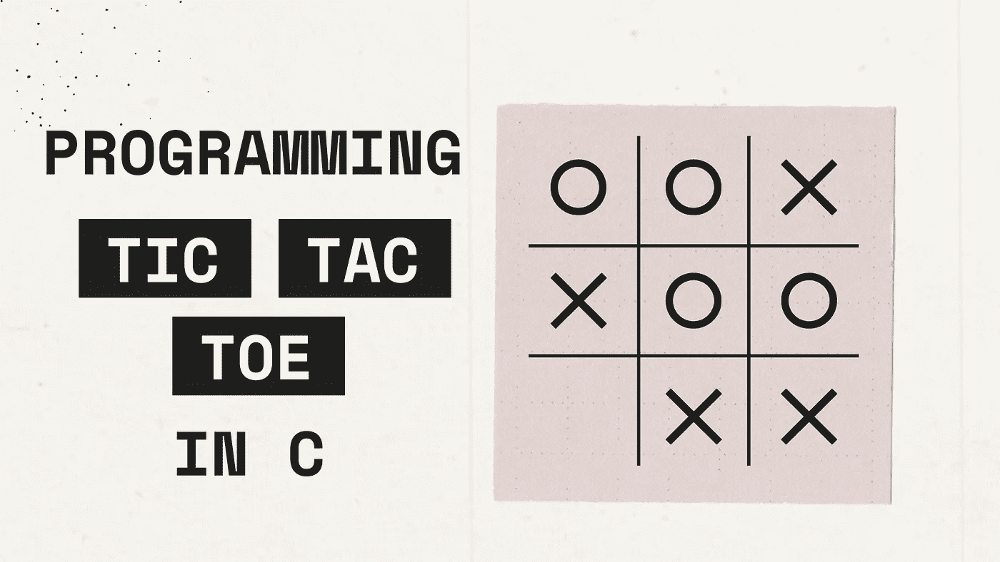

# 用 C 语言编码井字游戏

> 原文：<https://betterprogramming.pub/programming-tic-tac-toe-in-c-6ba4b6965ba3>

## C 语言编程



编程井字游戏是一个初学者级别的练习，世界上许多 Python 学习者都在练习，包括我自己。c 语言是我的主要编程语言，我想试试看我能否用 c 语言构建同样的游戏。

第一步是决定如何实现游戏。为此，我需要 5 个不同的功能；

*   显示表(板)的功能
*   函数将“X”或“O”插入到表格中
*   一个功能，检查是否有人赢了
*   检查平局的函数
*   帮助转弯的附加功能

有了这个大纲，第一件事就是在我的主要职能范围内创建董事会；

```
char board[] = { ‘-’,’-’,’-’,’-’,’-’,’-’,’-’,’-’,’-’ };
```

每个元素中的连字符表示那里的单元格是空的，我们稍后会用到它。

之后，我们编写我们的表格显示函数如下所示；

```
void display_table(char board[]) {                              
   int i;
   for (i = 0; i < 9; i++) {
      printf("%c ", board[i]);
      if (((i + 1) % 3) == 0) {
         printf("\n");
      }
   }
}
```

注意，我们在输出每 3 个单元格后打印一个新行。我们这样做是为了在游戏板上创建下一行。当我们测试我们的函数时，输出应该是这样的。

```
- - -
- - -
- - -
```

在这之后，我们希望能够发挥作用，因此“插入”功能。insert 函数将获取轮到谁了(即“X”或“O”)，并简单地将其插入给定索引的单元格中，如下所示；

```
...//We write this inside our main function to store who's turn it is
char turn = 'X';
...void insert(char board[],char *turn) {
   int index;
   printf("Turn of %c\nEnter index : ", *turn);
   scanf("%d", &index);
   if (index == SENTINEL) {
      exit(0);
   } 
   board[index - 1] = *turn;
}
```

注意:作为程序中的一个出口，我在实现中定义了一个 SENTINEL 值-999。这一步是可选的。

在一个玩家玩完他/她的回合后，我们需要切换到另一个玩家。这就是切换转弯功能的用武之地；

```
void switch_turn(char *turn) {
   if (*turn == 'X') {*turn = 'O';}
   else {*turn = 'X';}
}
```

这个函数相当简单。如果玩家“X”已经玩了他/她的回合，则“O”的值被分配给回合变量。如果玩家“O”已经玩了他/她的回合，则“X”的值被分配给它。

下一步是检查是否有玩家赢了，这一步实际上比大多数尝试这一步的人一开始所想的要简单得多。我们先总结一下赢的条件；

*   一名玩家将他/她的 3 个符号水平放置在同一行
*   一名玩家将他/她的 3 个符号垂直放置在同一列上
*   一名玩家将他/她的 3 个符号对角放置在其中一个轴上

为了检查是否满足这些条件，我们可以使用它们各自的索引(如下所示)检查每个单元格，以检查它们是否匹配。

*   对于水平:(0，1，2)，(3，4，5)，(6，7，8)
*   对于垂直:(0，3，6)，(1，4，7)，(2，5，8)
*   对于对角线:(0，4，8)，(2，4，6)

如果这些指数组中的任何一组中的字符匹配，我们就可以说玩家赢了。我们使用下面的函数来实现这一点:

```
bool check_win(char board[]) {
   bool win = false;//Row 1
   if (board[0] != '-') {
      if (board[0] == board[1]) {
         if (board[0] == board[2]) {
            win = true;
         }
      }
   }...//Column 1
   if (board[0] != '-') {
      if (board[0] == board[3]) {
         if (board[0] == board[6]) {
            win = true;
         }
      }
   }...//Axis 1
   if (board[0] != '-') {
      if (board[0] == board[4]) {
         if (board[0] == board[8]) {
            win = true;
         }
      }
   }...return win;
}
```

在这个函数中，我们用 win 变量来表示是否满足了任何条件。

在每个条件的开始，我们检查每个组的第一个单元格是否为空(等于“-”)。如果它是空的，我们不检查该组。如果不是空的，我们要做的是检查每组中的单元格是否包含相同的字符。

在这种情况下，真正的布尔值被分配给 win 变量，它被返回以指示玩家是否已经赢了。

最后，我们需要检查听牌。为此，我们需要创建一个变量来存储在我们的主函数中已经玩了多少回合。之后，我们将简单地检查已经玩了多少回合。如果少于 9，那么游戏可以继续。如果所有 9 个单元格都满了(意味着已经过了 9 轮)，游戏将产生平局。

```
...
int turn_count = 0;
...
bool check_draw(int turn_count) {
   if (turn_count < 9) {
      return false;
   }
   else {
      return true;
   }
}
```

在这最后一个函数之后，我们需要在我们的主函数中取整这些函数，来完成游戏。

在我们的主函数中，我们将创建一个游戏变量，该变量将被赋予真实值。之后，我们将使用游戏变量作为条件创建一个无限 while 循环。首先在这个循环中，我们将展示棋盘，让其中一个玩家使用他们的回合。在一个玩家使用他/她的回合后，我们将检查是否有任何玩家赢了，或者游戏的结果是平局。如果两个条件都不满足，回合将会转换，下一个玩家将被提示使用他/她的回合。

```
int main() {
   char turn = 'X', board[] = { '-','-','-','-','-','-','-','-','-' };
   bool game = true;
   int turn_count = 0; while (game) {
      display_table(board);
      insert(board, &turn);
      turn_count++;
      //We check for a win
      if (check_win(board)) {
         display_table(board);
         printf("%c Wins!!!", turn);
         getch();
         exit(0);
      }
      //We check for a draw
      if (check_draw(turn_count)) {
         display_table(board);
         printf("Draw!!!");
         getch();
         exit(0);
      }
      switch_turn(&turn);
   }
}
```

完整代码可在以下网址找到:

[](https://github.com/dekaottoman/tic-tac-toe-C) [## GitHub-dekaotoman/井字游戏

### 此时您不能执行该操作。您已使用另一个标签页或窗口登录。您已在另一个选项卡中注销，或者…

github.com](https://github.com/dekaottoman/tic-tac-toe-C)