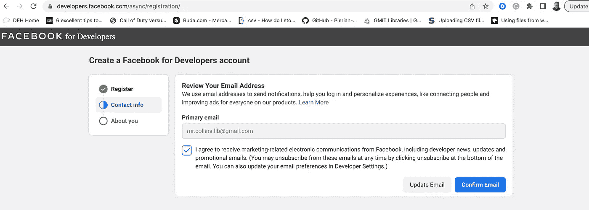
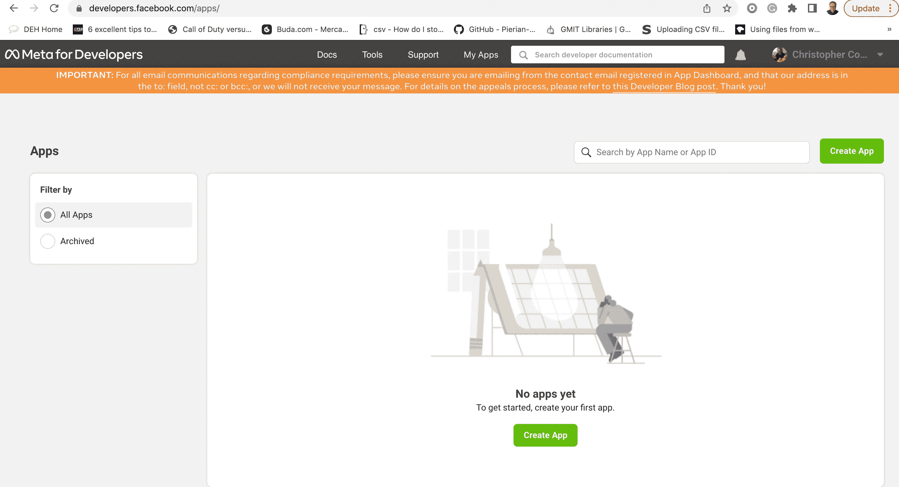
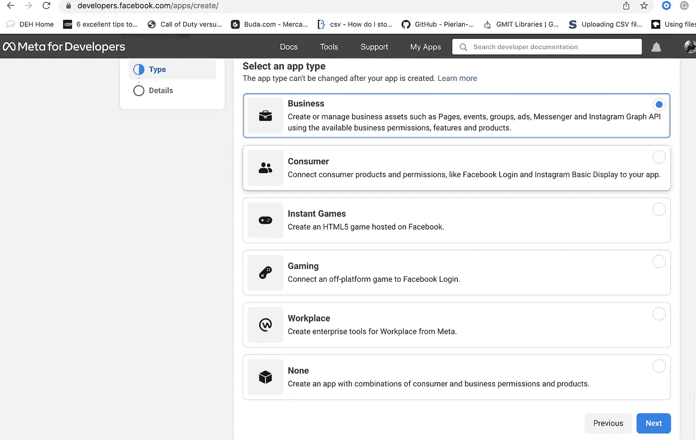
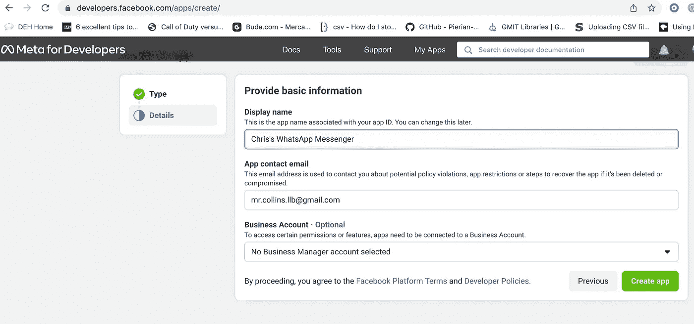
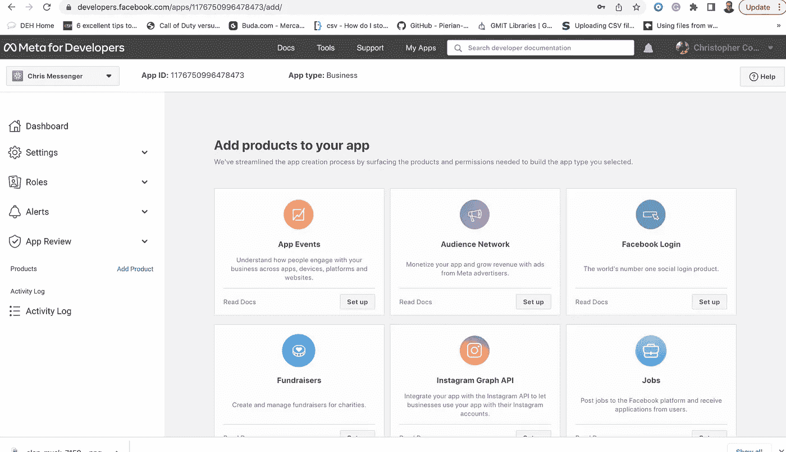
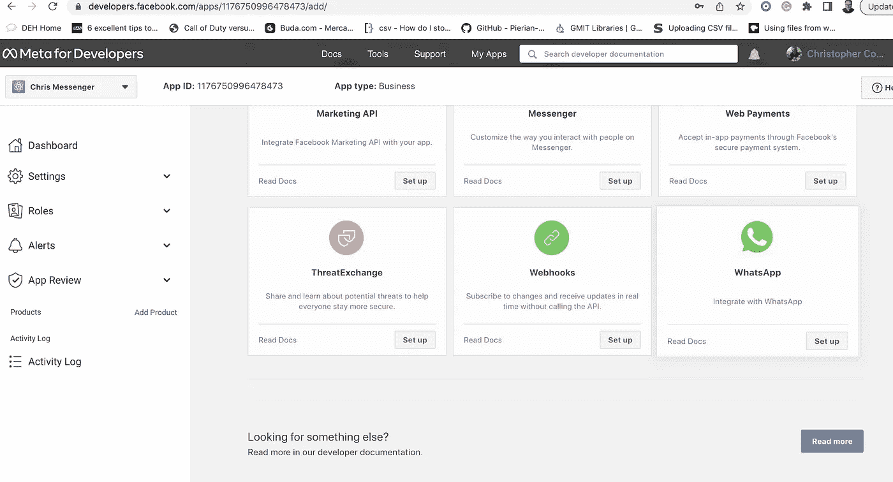
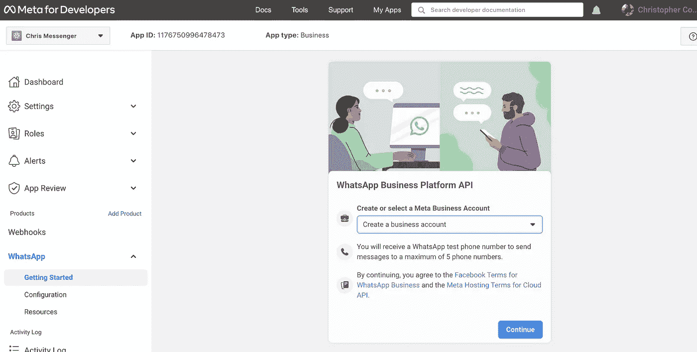
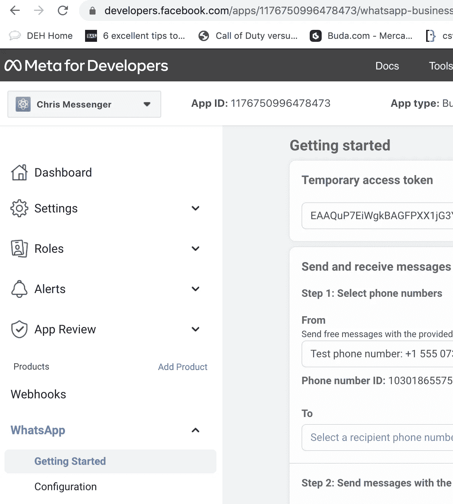

# 见见 Heyoo——WhatsApp 云 API 的开源 Python 包装器

> 原文：<https://betterprogramming.pub/programming-whatsapp-is-now-even-easier-for-python-developers-e1a4343deed6>

## 对于 Python 开发者来说，现在编写 WhatsApp 更容易了


[Eyestetix 工作室](https://unsplash.com/@eyestetix?utm_source=medium&utm_medium=referral)在 [Unsplash](https://unsplash.com?utm_source=medium&utm_medium=referral) 拍摄的照片

WhatsApp 是一个免费的多平台信息程序，允许你通过互联网进行视频和电话对话，发送短信等。WhatsApp 在生活在其他国家并希望保持联系的朋友和家人中非常受欢迎，拥有超过 20 亿活跃用户。

# 用于开发 WhatsApp 应用的 python 库

WhatsApp 最近开放了其云 API，以使开发者更容易与其消息服务集成，但入门可能很难。

`Heyoo`是由 [Neurotech](https://github.com/Neurotech-HQ/heyoo) 开发的开源 Python 包装器，使集成更加容易。

# 支持的功能

*   消息发送
*   媒体分发(图像、音频、视频和文件)
*   发送位置
*   发送交互式按钮
*   发送消息模板

# 走吧

要开始使用`heyoo`，您必须首先安装库，手动或使用 pip。

# 直接安装

您可以用 git 克隆项目存储库，或者直接下载它，如下所示。

```
$ git clone https://github.com/Neurotech-HQ/heyoo
$ cd heyoo
heyoo $ python setup.py install
```

# 安装

```
# For Windows 

pip install  --upgrade heyoo

#For Linux | MAC 

pip3 install --upgrade heyoo
```

# 入门指南

要运行这个包中的代码，你需要一个**令牌**和一个**测试 WHATSAPP 号**。

您必须在[脸书开发者门户](https://developers.facebook.com/)设置一个脸书开发者账户，稍后系统会提示您设置一个脸书商业账户。

[https://developers.facebook.com/](https://developers.facebook.com/)



一些入门指南。

*   转到您的应用程序。
*   **创建应用程序**



*   **选择业务> >业务:会要求你填写一些基本的 app 信息。**



*   接下来，系统会提示您在应用中加入产品。应该包括 WhatsApp Messenger。



*   创建一个商业帐户后，你会注意到你的令牌和测试 WHATSAPP 号码就在那里。



*   最后，仔细检查您将在 To 字段中用于测试的号码。
*   完成前面的步骤后，就可以开始研究包装器了。

# 证明

如何验证您的应用程序？

```
from heyoo import WhatsApp
messenger = WhatsApp('TOKEN',  phone_number_id='104xxxxxx')
```

一旦你验证了你的应用程序，现在你可以开始使用上述功能，如上所示。

# 发送消息

以下是发送信息的方法:

```
messenger.send_message('Your message ', 'xxxxxxxxxxx') # put mobile number where there is xxxxxxxxxxx
```

# 例子

```
messenger.send_message('Hi there just testing', 'xxxxxxxxxxx') # put mobile number where there is xxxxxxxxxxx
```

# 发送图像

使用相同的方法传输媒体(图像、视频、音频、gif 和文档)时，可以指定包含媒体的链接，也可以指定对象 id。

默认情况下，所有的 media 方法都假设你正在发送一个带有 media 的链接，但是你可以通过指定`link=False`来改变这一点。

```
messenger.send_image(image="https://i.imgur.com/Fh7XVYY.jpeg",
        recipient_id="255757xxxxxx",)
```

# 发送视频

```
messenger.send_video(video="https://www.youtube.com/watch?v=K4TOrB7at0Y",recipient_id="255757xxxxxx",)
```

# 发送音频

这里有一个例子:

```
>>> messenger.send_audio(
        audio="https://www.soundhelix.com/examples/mp3/SoundHelix-Song-1.mp3",
        recipient_id="255757xxxxxx",
    )
```

# 发送文档

```
messenger.send_document(
        document="http://www.africau.edu/images/default/sample.pdf",
        recipient_id="255757xxxxxx",
    )
```

# 发送位置

```
messenger.send_location(
        lat=1.29,
        long=103.85,
        name="Singapore",
        address="Singapore",
        recipient_id="255757xxxxxx",
    )
```

# 发送交互式按钮

```
messenger.send_button(
        recipient_id="255757xxxxxx",
        button={
            "header": "Header Testing",
            "body": "Body Testing",
            "footer": "Footer Testing",
            "action": {
                "button": "Button Testing",
                "sections": [
                    {
                        "title": "iBank",
                        "rows": [
                            {"id": "row 1", "title": "Send Money", "description": ""},
                            {
                                "id": "row 2",
                                "title": "Withdraw money",
                                "description": "",
                            },
                        ],
                    }
                ],
            },
        },
    )
```

# 发送模板消息

以下是如何发送预先批准的模板消息。

```
messenger.send_template("hello_world", "255757xxxxxx")
```

查看 Neurotech 的 Heyoo [GitHub 库](https://github.com/Neurotech-HQ/heyoo)。