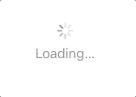
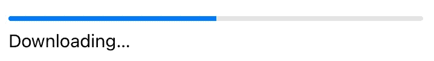
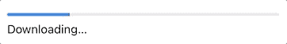
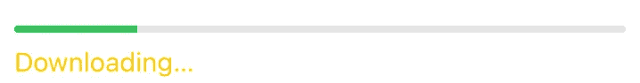

# SwiftUI 中的进度视图

> 原文：<https://betterprogramming.pub/progressview-in-swiftui-fa15d412f1e>

## ProgressView 在 WWDC 2020 上推出，它为您带来了一个循环和线性的进度视图，可以轻松地从头开始创建


照片由 [Aditya Vyas](https://unsplash.com/@aditya1702?utm_source=medium&utm_medium=referral) 在 [Unsplash](https://unsplash.com?utm_source=medium&utm_medium=referral) 上拍摄。

*注意:这个只支持 iOS 14 及以上版本，只能在 Xcode 12+中使用。*

# 先决条件

要学习本教程，您需要了解以下方面的一些基本知识:

*   迅速发生的
*   至少 Xcode 12+

# 不确定的进展

不确定指的是不间断的动画，默认情况下，它处于一种无休止旋转的不确定行为中:

```
ProgressView("Loading…")
```



# 线性进展

为了创建线性进度视图，您必须指定当前值和总值。该值当前被设置为`50`，是总数的一半:

```
ProgressView("Downloading…", value: 50, total: 100)
    .padding()
```


您甚至可以看到它在运行，线性进度视图继续前进。首先，您将创建一个状态，在该状态下它将跟踪其当前进度:

```
@State private var currentProgress = 0.0
```

然后，您将使用以下代码创建一个计时器:

```
let timer = Timer.publish(every: 0.1, on: .main, in: .common).autoconnect()
```



接下来，在进度视图中使用当前进度:

```
ProgressView("Downloading…", value: currentProgress, total: 100)
```

向进度视图添加一个动作，它将不断添加`1`，直到到达`100`:

```
.onReceive(timer) { _ in
    if currentProgress < 100 {
        currentProgress += 1
    }
}
```

因此:



# 定制

`accentColor`允许您编辑条形的颜色:

```
.accentColor(.green)
```

`foregroundColor`允许你编辑标题的颜色:

```
.foregroundColor(.yellow)
```



感谢阅读！