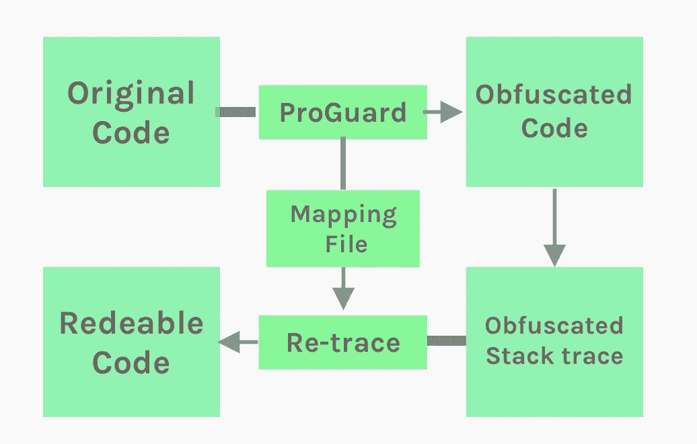
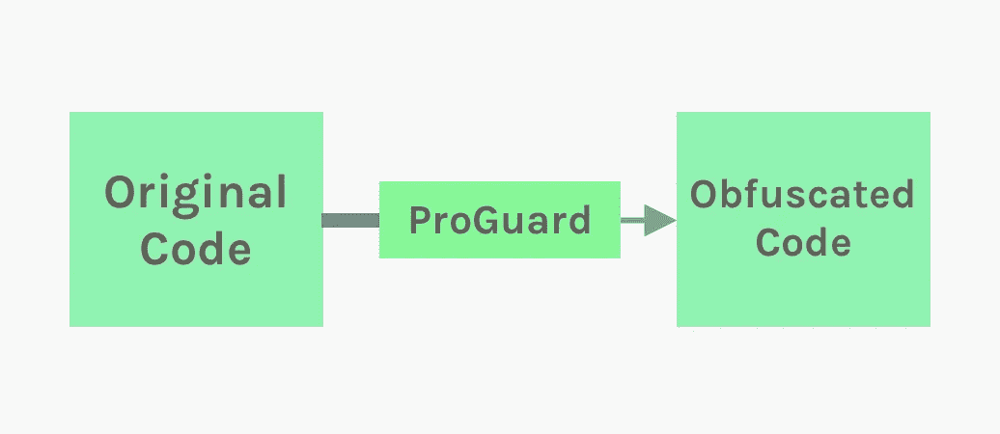
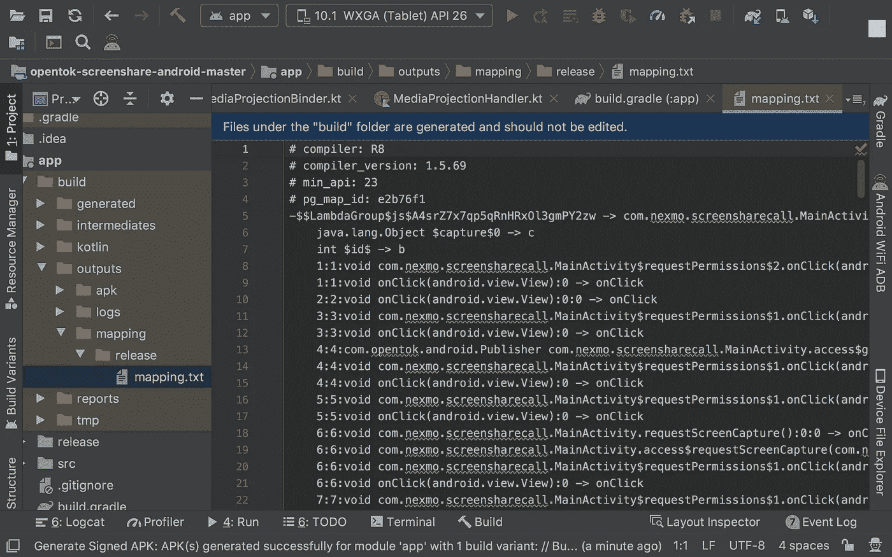

# ProGuard:Android 应用程序代码库的安全屏障

> 原文：<https://betterprogramming.pub/proguard-a-security-shield-for-your-apps-codebase-70d6453df42b>

## 以最少的配置保护您的 APK 免受代码窃取



图片来源:作者

# 介绍

在当今世界，安全对于我们生活的几乎每个方面都变得非常重要。这同样适用于我们为应用程序编写的代码。PlayStore 中的任何 APK 文件都可以播放。这里我们谈论的是 APK 文件的逆向工程。我们在开发过程中所做的就是努力将我们的想法转换成代码，然后将它们打包成 APK 文件进行部署。

但是黑客所做的只是简单地选择我们的 APK 文件，从任何第三方网站下载，并去除 APK 文件的精华以生成我们开发的源代码文件或资源。不保护您的代码库就投入使用通常不是一个好主意。如果您还没有解决这个代码安全问题，请花时间来解决它。

没有安全性的 APK 文件就像没有 pin 的 ATM 卡:任何人都可以访问它或为自己的目的使用它。我们在这里创造我们的竞争对手。看看 PlayStore，看看有多少重复的应用程序。警惕代码盗窃。

# 什么是 ProGuard？

这个名字本身就表明它是我们应用程序代码库的守卫。ProGuard 是 Android 中的一个工具，用于缩小、混淆和优化我们的应用程序。我会说这不是完整的解决方案，但这将是一个很好的起点，可以通过最小的更改来保护我们的代码库。

*   **混淆:**将我们的类和它们的成员重命名为一些随机的短格式，这导致了 DEX 文件大小的减小。反编译的代码将很难阅读和理解。
*   **优化:**对代码进行分析和优化。
*   **收缩:**将未使用的部分从最终 APK 中移除。这基本上分两个阶段完成:

1.  **代码收缩—** 检测并安全删除未使用的变量、方法、类等。，来自我们的应用程序及其库依赖项
2.  **资源收缩** —从我们的应用程序及其库依赖项中移除未使用的资源文件

ProGuard 是 SDK 中的内置工具，随时可用，因此无需添加额外的依赖项。



图片来源:作者

# 为什么我们需要 ProGuard？

为了用最少的配置保护我们应用程序的代码库不被窃取，我们可以使用 ProGuard。在反编译一个应用了 ProGuard 的 APK 文件后，会使事情变得难以理解和重用。当应用 ProGuard 时，变量、方法和类名将被一些难以阅读和理解的无意义的名称或字符所取代。这样我们可以在一定程度上保护自己。

除了模糊处理，它还提供了减少 APK 文件大小、优化等好处。使用 ProGuard 将产生较小的 APK 文件，这是逆向工程的困难。此外，我们不需要花时间从代码和资源中删除不用的东西。

# 如何获取堆栈跟踪的模糊信息

在模糊处理过程中，ProGuard 实际上做的是创建一个映射文件。映射文件包含字段、方法和类的原始名称和模糊名称之间的关系。映射文件将有助于将来追溯一些错误或混淆代码中我们无法理解的东西。比如我们应用了 ProGuard，在 PlayStore 上发布了 app。如果出现一些错误，它会在主要情况下显示模糊的名称，这将很难调试。所以要分析或解决事情，最好有这个模糊映射信息。

一个示例映射文件:



# 如何使用 ProGuard

使用 ProGuard 需要最少的努力，因为我们只需在应用程序级的`build.gradle`文件中添加几个标志。

**minifyEnabled** **—** 它支持代码收缩、混淆和优化。

**shrink resources****—**启用资源收缩，由 Android Gradle 插件执行。

**ProGuard files—**ProGuard 的配置是通过指定默认的 ProGuard 规则来完成的(`proguard-android-optimize.txt`文件是 SDK 的一部分)。

## proguard-android-optimize.txt

它一般位于文件夹路径`sdk/tools/proguard`下。以下是我的 Mac 上的路径，您的路径可能会有所不同，但理想情况下，它将位于 SDK tools 文件夹下。

```
/Users/username/Library/Android/sdk/tools/proguard/proguard-android-optimize.txt
```

## proguard-rules.pro

如果我们的应用程序有多个模块，每个模块都有一个文件，我们可以在其中指定指令或规则，以便在模糊处理期间排除哪些内容。

# 普罗瓜德如何打破你的释放 APK

应用 ProGuard 并生成签名的内部版本可能会由于某些引用丢失或任何其他与代码相关的问题而导致警告。我们最终可能会修复它们，这需要时间来理解。或者我们可以简单地指定`[-dontwarn](https://www.guardsquare.com/en/proguard/manual/usage#dontwarn)`规则来跳过警告。错误将显示在消息日志中。

如果您是第一次应用 ProGuard，那么您需要在部署之前仔细构建和测试签名的发布 APK 文件。在大多数情况下，我们会以一些崩溃或错误结束，比如“找不到类”等。由于 ProGuard 应用的混淆。我们需要正确地指定一些类的规则来消除这些错误。

在部署之前，对已签署的发布版本进行全面检查是一个值得推荐的习惯。

# 最常用的程序规则

在代码收缩过程中，R8 很难分析死代码或不可达代码，所以有时 ProGuard 可能会删除在遍历时没有检测到的可用代码。这些情况可能包括使用反射来访问其他地方没有使用的类，或者 JNI 库方法在运行时调用的类。

因此，如果我们正确地测试了我们的应用程序，那么我们就可以检测到由不恰当地删除代码所导致的任何错误。我们还可以通过[生成删除代码的报告](https://developer.android.com/studio/build/shrink-code#usage)来检查删除了哪些代码。

要修复此类错误并强制 R8 保留某个代码，请在 ProGuard 规则文件中添加一个带有指定类名的`[-keep](https://www.guardsquare.com/en/products/proguard/manual/usage#keepoptions)`行。例如:

```
-keep public class MyClass
```

如果我们在应用程序中使用 JavaScript 接口函数，上面的例子会很常见。JavaScript 方法将被删除，因为它们是不可追踪的。所以我们需要在`proguard-rules.pro`中添加 keep 选项:

```
-keepclassmembers class * {
	@android.webkit.JavascriptInterface <methods>;
}
-keepattributes JavascriptInterface
```

接下来，如果我们使用任何第三方库，我们必须遵循他们指定的 ProGuard 规则。

```
####### Glide #######
-keep public class * implements com.bumptech.glide.module.GlideModule
-keep public class * extends com.bumptech.glide.module.AppGlideModule
-keep public enum com.bumptech.glide.load.ImageHeaderParser$** {
  **[] $VALUES;
  public *;
}##== Wootric ==
-keep class com.wootric.** { *; }

### Agora ###
-keep class io.agora.**{*;}### Retrofit ###-keep class retrofit2.** { *; }
-keepclasseswithmembers class * {
    @retrofit2.http.* *<methods>*;
}
```

我们不能指定所有，所以我在上面添加了几个规则。根据所使用的依赖关系，可能还需要其他规则。对于[改造](https://github.com/square/retrofit)，这是一个常见的网络库，检查[改造程序规则](https://github.com/square/retrofit/blob/master/retrofit/src/main/resources/META-INF/proguard/retrofit2.pro)。

如果出现警告，我们需要查看给出这些警告的日志，并在`proguard-rules.pro`中指定`-dontwarn` :

```
*-dontwarn <classes_name>
-dontwarn retrofit2.**
-dontwarn okio.***
```

如果我们继续谈论，有很多规则要讨论，所以让我们在我即将发表的文章中查看这一部分。

始终保持你的模型或 POJO 类，否则你会遇到`classnotFound`的问题。

# 要记住的事情

*   ProGuard 的不当使用可能会导致不想要的或意想不到的结果，如崩溃，这将有很大的影响。
*   即使应用了 ProGuard，黑客也可以获得部分代码或资源，因此我们可能需要使用高级工具，如 DexGuard，它以一定的代价提供了完全的安全性。
*   始终对第三方库和模型类使用 keep 规则。

# 摘要

尽管我们还可以做更多的事情，但 ProGuard 是一个很容易实现的基本配置，即使是初学者也可以轻松实现。我想这对外面的一些人会有帮助。

伙计们，就这样吧。让我们在另一篇文章中详细讨论保护我们代码库的 R8 收缩和高级工具。请让我知道你的建议和意见。

感谢您的阅读。

# 参考

[缩小、混淆和优化您的应用](https://developer.android.com/studio/build/shrink-code)

[程序手册](https://www.guardsquare.com/en/products/proguard/manual/usage#dontwarn)