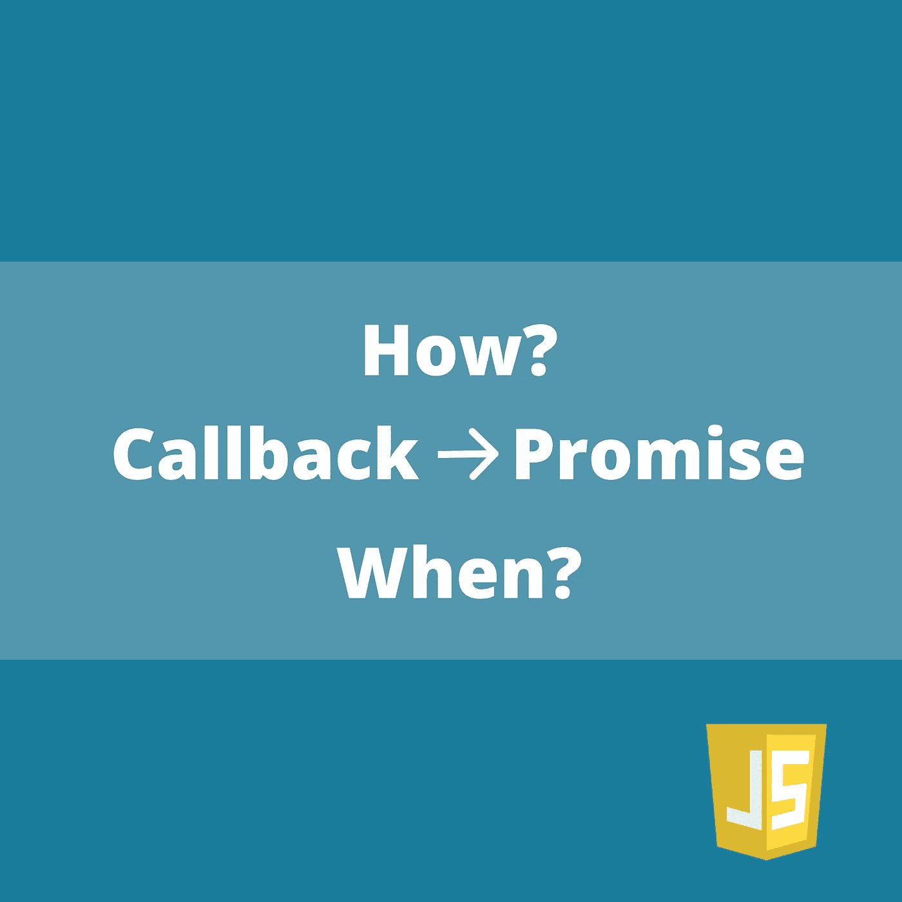
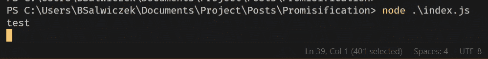

# JavaScript 中的允诺:如何以及何时是安全的？

> 原文：<https://betterprogramming.pub/promisification-in-javascript-how-to-and-when-is-it-safe-1794e3c69b32>

## 如何将接受回调的函数变成承诺

作为 JavaScript 开发人员，我们大多数人都讨厌使用回调。你们中的许多人可能听说过[回调地狱](http://callbackhell.com/)以及它如何破坏应用程序的可读性。如果我们正在编写代码，我们可以选择使用承诺，但是可能有内置函数或者来自外部库的函数使用回调。

为什么不把它们变成承诺呢？

在这篇文章中，我将向你展示如何做到这一点，以及什么时候这样做是安全的——因为这会带来一些后果。

# 例子

先说个例子。假设您有一个接受回调的函数:

为了运行这个函数，我们需要提供一个回调函数，它有两个参数——结果和潜在错误。

现在假设您想在您漂亮的`async/await`代码中使用它。有两条路可以走。

# 短路径

最好也是最简单的方法是使用一个已经实现的方法，将接受回调的函数转换成承诺。如果你正在使用 node.js，在`utils`包中有适合它的`promisify`方法。在前端，你可以使用一个流行的 [es6-promisify](https://www.npmjs.com/package/es6-promisify) 包。

来自`utils`的`promisify`的例子:

使用`promisify`后，我们的功能变成了承诺。我们现在可以在它上面使用`.then` / `.catch`或者`await` / `try-catch`。

> 使用内置`promisify`时，你要承诺的函数必须遵循一个标准:
> 1。将 callback 作为最后一个参数。
> 2。回调需要以这种精确的顺序将错误和结果作为参数。
> 你可以在这里阅读如何克服这个限制[。](https://nodejs.org/dist/latest-v8.x/docs/api/util.html#util_custom_promisified_functions)

但是…引擎盖下到底发生了什么？

# 手动路径

为了更好地理解它，让我们自己来承诺一下所提供的功能。让我们从定义我们想如何称呼它开始。这将类似于`utils`中的`promisify`:

下面是`customPromisify`的一个可能实现:

有点复杂，我们来分解一下。

1.  `line #2` : `customPromisify`返回一个函数，我们将把原始函数的参数传递给它。在给定的例子中，`'a'`和`'b'`参数将出现在`args`数组中。
2.  `line #3`:返回的函数返回一个承诺，所以我们可以给它附加`.then`和`.catch`(或者使用`await`)。
3.  `lines #4–7`:在一个承诺中，我们创建了一个定制的回调函数，它将相应地`resolve`或`reject`一个承诺。
4.  `line #8`:然后我们需要将自定义回调添加到参数列表中，这样它就被传递给一个函数(`fn`)并在需要时执行。
5.  `line #9`:最后，我们在包含`customCallback`的`args`数组上调用提供的函数(`fn`)。

就是这样！我们有一种方法来约定一个函数。`customPromisify`可扩展接受更多回调或非标准回调。

> 如果你想看更多自定义的 promisification 的例子，你可以查看[如何在 26 个步骤中为媒体开发 React Chrome 扩展](https://medium.com/@bsalwiczek/how-to-develop-react-chrome-extension-for-medium-in-26-steps-d0401149e3a2)中的第 10 个步骤。

现在你知道*如何*了。让我们来回答*什么时候*去做。

# 承诺什么时候安全？

要回答这个问题，我们需要认识到承诺和回电之间的一个重要区别。

> 承诺只能有**一个**结果，而回调可能被调用**多次**。

结果是，在将接受回调的函数更改为承诺时，您需要非常小心。在承诺之后，有些功能可能不会像你想的那样发挥作用。

## 不安全承诺

你知道`setInterval()`功能吗？它将一个自定义函数作为回调函数，每隔 X 毫秒执行一次。这里有一个例子:

它将在每个`1000ms`打印`"test"`，直到您终止该进程或使用`clearInterval()`。

让我们把它变成一个承诺:

`customPromisify`针对这种情况做了一点改动。回调现在只接受一个参数。它也被作为第一个参数添加到`args`列表中，因此它匹配`setInterval`的实现方式。

这是上面代码的执行过程:

`"test"`打印一次，因为承诺只能解决一次。而且 setInterval 从来不清零，所以程序挂起。

## 结论

`setInterval`不是许诺的好人选。实际上，任何多次调用回调函数的函数都不应该被承诺。

# 最终注释

我希望在读完这篇文章后，你能理解如何把一个接受回调的函数变成一个承诺。更重要的是，您现在知道它并不总是安全的，所以您应该仔细查看文档，并检查回调现在是否将被多次执行。