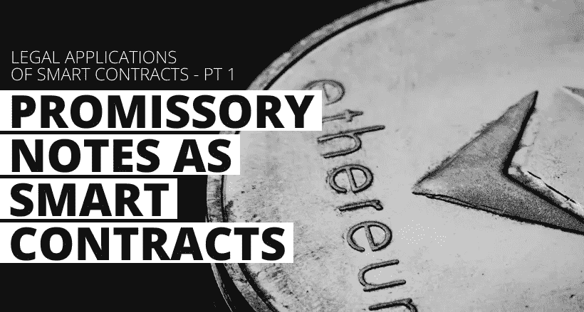
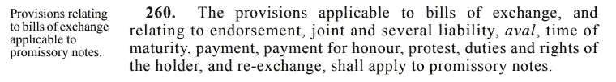
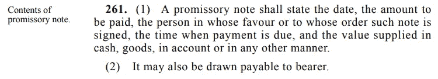
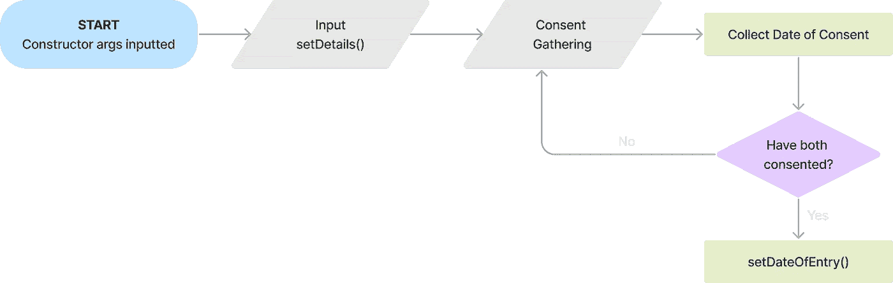
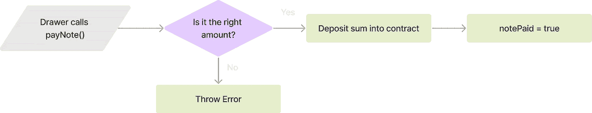
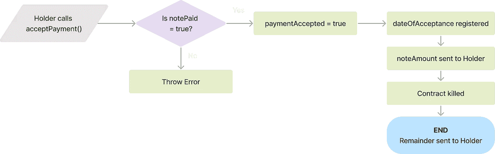
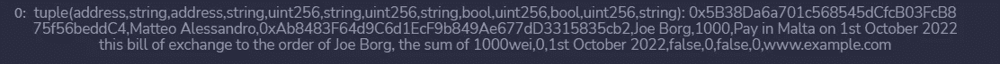

# 作为智能合同的本票

> 原文：<https://betterprogramming.pub/promissory-notes-as-smart-contracts-8bb10c59f55c>

## 智能合同的法律应用—第 1 部分

作者图片

本文是我尝试将法律工具应用到代码中的系列文章的第一篇。

首先，我将解释马耳他法律中的概念，然后解释如何将它们应用到智能合同中。本解释将使用伪代码来解释自然语言中的编码概念。在此基础上，我将尝试将这些概念发展成一个 Solidity smart 契约，然后为每篇文章提供一个到 GitHub repo 的链接。

这些文章将假设读者对区块链技术有一个基本的工作知识，但是，所有的概念将尽可能解释清楚。

> **关于语言选择的说明**
> 
> 我选择使用坚实作为选择的语言，纯粹是因为我用它最舒服。智能合约可以用其他语言编码，这取决于它们操作的区块链，比如索拉纳区块链的 Rust 语言。

# 马耳他法律下的本票

[Adeolu Eletu](https://unsplash.com/@adeolueletu?utm_source=medium&utm_medium=referral) 在 [Unsplash](https://unsplash.com?utm_source=medium&utm_medium=referral) 上的照片

本票是一种书面付款命令，一方承诺根据要求或在预定日期向另一方支付一笔固定金额的款项。简单来说就是一张欠条。它创造了一种自成一格的执行所有权，这种所有权不同于汇票，因为它“不被任何中间方支取”( [Tsakatoura，2002](https://www.inter-lawyer.com/lex-e-scripta/articles/e-finance1.htm#_ftn2) )。

这意味着它管理的关系是两方之间的关系:承诺付款的人和被承诺付款的人。为了赋予本票行政所有权，必须提交一份司法信函([马斯喀特，2010](https://www.um.edu.mt/library/oar/handle/123456789/2582) )。[商业法典](https://legislation.mt/eli/cap/13/eng/pdf)第七篇(第 13 章。《马耳他法》第 102 条)对本票作出了规定，该条将适用于汇票的大部分规定适用于本票。

《商法》第 260 条

# 使用案例

早在 2010 年，马斯喀特就在考虑本票采用数字形式的可能性，认为本票必须是“书面的”和“签名的”，才能有效。克利福德·钱斯·LLP(2021)研究了这一概念，质疑智能合同是否能满足这些标准。然而，[英格兰和威尔士法律委员会(2021)](https://s3-eu-west-2.amazonaws.com/lawcom-prod-storage-11jsxou24uy7q/uploads/2021/11/6.7776_LC_Smart_Legal_Contracts_2021_Final.pdf) 得出结论，智能合同确实可以被视为具有法律约束力。

[Camilleri (2019)](https://www.academia.edu/41182825/Blockchain_based_Smart_Contracts_Legal_Enforceability_in_Malta_and_the_UK_A_Square_Peg_in_a_Round_Hole) 认为智能合同可以满足马耳他合同法的要求，只要“双方确保协议的目的和原因始终合法。”然而，也有人指出，身份核实面临问题，因为这是确立有效同意的重要前提(Camilleri，2019 年)。

本票的效率是它最好的特点之一。利用技术支持这些特征可能非常有用，而无法识别本票的数字版本可能是有害的。正如 Muscat (2010 年)所引用的，Tsakatoura (2002 年)认为:

> “为了使汇票和本票形式的流通票据在第三个千年保持其在国际贸易中的便利性，它们必须被承认为电子形式的有效票据。”

[波兰数字事务部(2018)](https://www.gov.pl/attachment/e3ff4c9d-72f0-4ae4-89ac-f952f8ea666f) 也审查了区块链技术在本票上的应用，认为:

> “[……]区块链技术使我们能够以这样一种方式模拟物质世界，即我们可以创建数字等同物来移交文件、进行注释、删除其条款，甚至完全销毁它。”

本票提供了一个干净、简单的协议，在检查智能合同对法律工具的使用时进行测试。它通常不包含很多可移动的部分，这使得它更容易以智能合同的形式实现，例如，与成熟的 20 页合同相比。那么，如何才能做到呢？

# 建立本票智能合同

这个实验基于几个假设，即:

*   用于身份验证和数字许可捕获的方法是可用的，并且是合法接受的
*   法院愿意接受智能合同的有效性
*   双方都有足够的知识来利用智能合同

根据商业代码，智能合同将收集或生成以下信息:

根据第 261 条:

《商法》第 261 条

*   双方的身份识别——使用他们的姓名和钱包地址
*   与票据本身相关的信息，即输入日期(自动生成)、要支付的金额、如何给出价值、到期日期、在哪里开具以及应该在哪里支付
*   双方的同意，以及同意的日期

可以肯定的是:

*   笔记的自然语言版本的 URL

这些被存储在一个叫做注释的“数据结构”中，该结构存储这些信息的变量，并遵循`noteInfo`模板。这可以在下面的伪代码中看到:

名为 noteInfo 的数据结构模板的伪代码，并基于它初始化一个名为 note 的数据结构。

如果你想更多地了解所使用的变量类型，你可以在这里查阅 Solidity 语言文档。

# 合同结构和流程

智能合约将按如下方式工作:

1.  智能合同由`Holder`发起，他提供他们的名字。
2.  `Holder`通过`setDetails` 功能输入纸币信息。

用于初始化契约和通过 setDetails()函数设置细节的伪代码

3.合同然后记录`Holder`和`Drawer`的同意，记录给予同意的日期。

4.如果双方都同意，则生成票据的输入日期，即票据被开具的时间。

用于记录同意和同意日期的伪代码。如果双方都同意，则设置日期

创建本票的合同第一部分的流程图

5.然后，契约具有函数`payNote`，该函数允许`Drawer`将金额支付到智能契约中，前提是该金额是正确的金额。

payNote()函数的流程图

6.一旦金额被存入,`Holder`可以接受付款，这将金额发送到他们的钱包并终止合同。

acceptPayment()函数流程图

用于将票据支付到智能合约、接受支付、转移到持有人以及合约终止的伪代码

## 合同代码

既然合同的基本框架已经建立，我试图将它转化为一个可靠的智能合同。我绝不是可靠性方面的专家，我仍在不断增强使用它的信心——所以欢迎任何反馈！这是我写的合同代码:

本票智能合同的可靠性代码

如您所见，我还引入了函数‘kill’，它自毁契约，以及函数`getInfo`，它以元组的形式返回注释中的信息。然而，这种查看信息的格式并不理想。我仍在努力寻找一种方法将它翻译成 JSON 元数据文件。

当前 getInfo()函数的结果

我在筹码深度上也做了相当大的努力。由于合同接受了很多变量，而以太坊虚拟机的堆栈大小只有 16 个变量，所以我不得不多次修改合同以使其正确。如你所见，在最后，我有几个修饰语——这些只是基于检查一个语句是否为真来实现 if/then 逻辑的一种更干净的方式。如果你想深入研究，你可以在这里查看 GitHub 回购。

# 如何让它变得更好？

有许多方法可以改进这份合同，其中有几个我太没有经验而没有注意到。但是，以下是我将要做的工作，因为我相信它们可以提供更高水平的确定性和功能性:

1.  第一个主要改进是开发了一个铸造 NFT 的函数，该函数具有链上元数据，表示在注释中找到的信息。然后，这个 NFT 被发送给`Holder`，T1 将其作为本票的“令牌”保留。一旦付款被接受，这个代币就可以自动烧录。用 JSON 文件——人类可读的语言——表示信息也将使它更容易解释。这个文件的例子可以在[这里](https://github.com/matteoalessandro-eth/legal-smart-contract/blob/main/promissory-notes/metadata/example.json)找到。
2.  第二是开发一个脚本和界面，可以与智能合同的功能进行交互，以使其对用户友好。
3.  第三是将合同拆分成更小的分包合同，提高效率。我也强烈建议确保合同的安全性符合标准。Wohrer 等人在 2018 年提出了许多设计模式，以在以太坊区块链上实现更好的智能合约，这是一个 GitHub 回购协议，提供模板，可以在这里找到。
4.  最后一步是对数据进行加密，使当事人的个人信息和笔记信息只对当事人可见，以及他们选择显示给谁看。

这就对了。通过智能合约实现本票的相对简单的方法。这只是一个概念的证明，还远远不能用于实际的商业应用。在接下来的文章中，本系列将重点讨论这些潜在的应用程序，比如文档验证、租赁协议和在线身份验证。

感谢阅读。敬请关注更多内容。