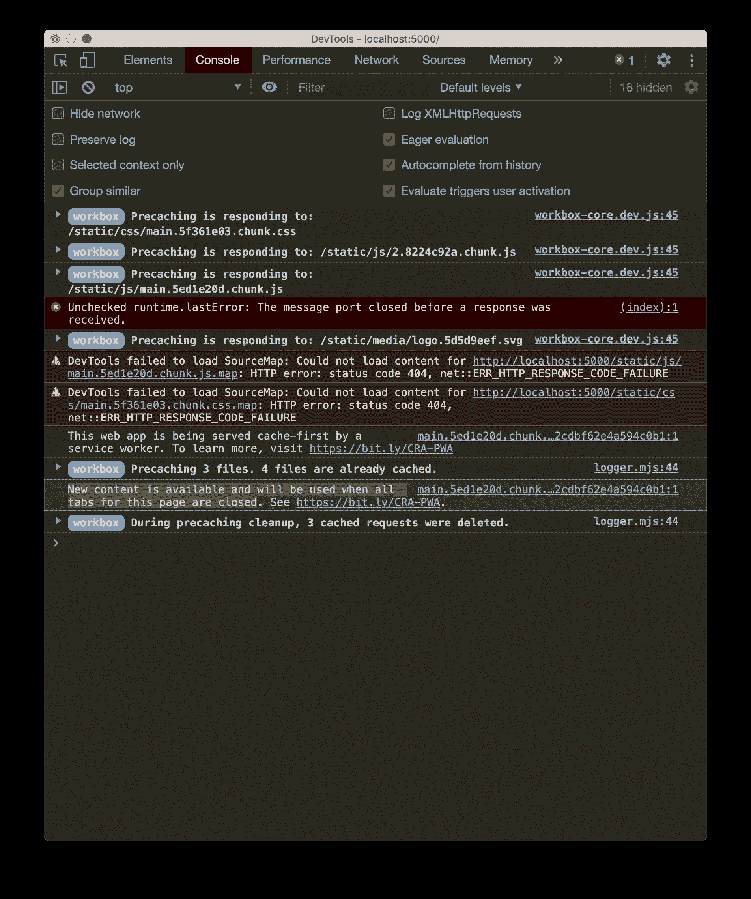
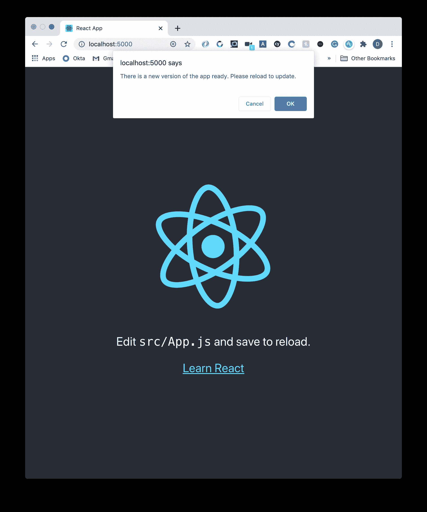
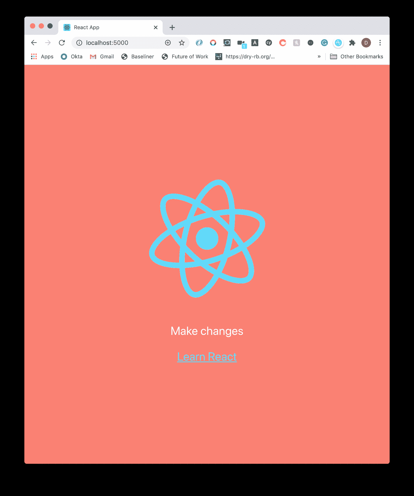

# 如何用 React 中的服务人员提示用户新的 App 版本

> 原文：<https://betterprogramming.pub/prompting-new-app-versions-with-the-service-worker-and-create-react-app-bf3350d3bed1>

## 创建一个 React 应用和一个服务人员来提醒您的用户


作者照片(背景由 [Clément H](https://unsplash.com/@clemhlrdt) 上 [Unsplash](https://unsplash.com/) )。

服务人员可以成为提高应用程序性能的强大工具。它们提供了一些强大的缓存机制和现代功能。但是，它们在 web 开发中普遍被误解。

一个常见的误解是，当新内容可用时，它只会在渐进式 web 应用程序的所有选项卡都关闭后加载。

虽然这可能是默认行为，但是您可以通过跳过等待并提示用户更新来加快这个过程。

在这个简短的教程中，我们将对一个 [Create React App](https://create-react-app.dev/) 设置进行同样的操作。

# 创建 React 应用程序

我们将使用`npx create-react-app`并在全球范围内安装 [Vercel](https://vercel.com/) 的`serve`来服务我们的构建:

在建造之前，让我们更新一下`index.js`:

在这里，我们正在为 CRA 为我们提供的开箱即用的`onUpdate`处理程序添加我们的神奇代码。

在这段代码中，我们将检查是否有服务人员在等待文件更改。如果是这样，我们只需添加一个状态改变事件，并向`SKIP_WAITING`发送一条消息。

现在，下一次我们重新加载应用程序时，我们将被提示一个“确认”对话框来重新加载我们最新更新的页面！

如果用户愿意，他们仍然可以选择拒绝更改。

# 建造和服务

让我们建立并运行:

现在在港口 5000(或无论你有什么)，你会看到通常的基本 CRA 已经建成。

让我们做一些改变，看看我们的提示在行动中！

# 对 React 应用程序进行更改

更新应用程序，拥有你想要的一切。这可以包括改变风格等。(我在下面的例子中已经做到了):

一旦你高兴了，就简单地运行`yarn build`。

*注意:在服务器运行时，在另一个选项卡中执行此操作。这里没有真正的原因，除了防止自己怀疑为什么会发生变化。*

如果您在端口 5000 上重新加载 React 应用程序，过一会儿，您会在控制台中看到以下内容:

```
New content is available and will be used when all tabs for this page are closed.
```



事实上，该日志是我们自定义的`onUpdate`钩子发挥作用之前的前兆。同时，屏幕上会出现一个窗口对话框:



如果我们接受(如果您愿意，您可以取消)，您将看到我们更新的应用程序！



胜利！

当然，你不必使用窗口对话框。一旦收到通知，你就可以随心所欲地让用户知道他们可以在重新加载时更新应用程序。事实上，你可以粗鲁地在它们上面重新加载页面(虽然我不会！).

最后一点，大多数主流浏览器都支持这一功能，但是 Safari iOS [不支持这一功能](https://developer.mozilla.org/en-US/docs/Web/API/ServiceWorkerRegistration/waiting)。取舍由你决定！

# 资源和进一步阅读

1.  [窗口对话框](https://developer.mozilla.org/en-US/docs/Web/API/Window/confirm)
2.  [维修工人 API](https://developer.mozilla.org/en-US/docs/Web/API/Service_Worker_API)
3.  [服务人员发布消息](https://googlechrome.github.io/samples/service-worker/post-message/)
4.  [服务人员等待兼容性](https://developer.mozilla.org/en-US/docs/Web/API/ServiceWorkerRegistration/waiting)