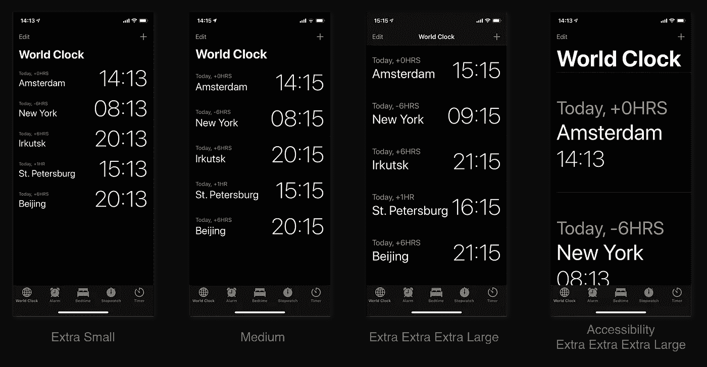
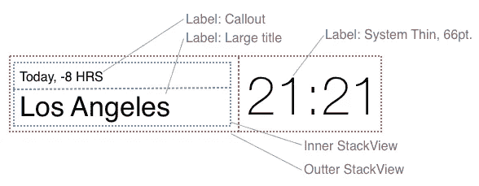
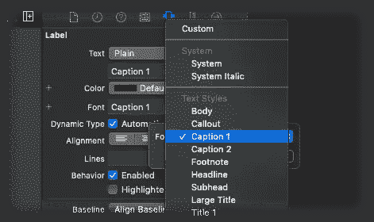
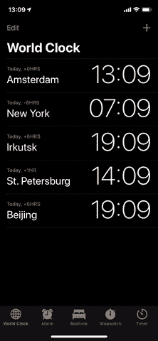

# 适当的字体缩放对你的用户很重要

> 原文：<https://betterprogramming.pub/proper-font-scaling-matters-to-your-users-515b1b878606>

## 如何在不破坏布局的情况下将字体缩放应用到 iOS 应用程序


照片由[克莱门特·法利泽](https://unsplash.com/@centelm?utm_source=unsplash&utm_medium=referral&utm_content=creditCopyText)在 [Unsplash](https://unsplash.com/?utm_source=unsplash&utm_medium=referral&utm_content=creditCopyText) 拍摄

大多数读到这篇文章的开发者都有很好的眼力。但是很有可能，并不是所有的用户都这么幸运。

近视、(部分)色盲或其他障碍可能会影响一个人对你的应用程序的看法，或者更重要的是:如果一个人能够浏览你的应用程序。

设计师可能更喜欢极简设计，包括小而漂亮的字体和浅色调色板。通常，为元素分配的字体大小和空间是经过深思熟虑的选择，以确保界面看起来美观和平衡。

然而，你的应用程序的可读性很可能会受到这些设计选择的影响:看起来漂亮的东西可能并不是最好的。话说回来，这真的重要吗？你更愿意拥有一个漂亮的应用程序还是一个可用的应用程序？

另一方面，我是那些喜欢将文本大小设置为最小的人之一，我希望我使用的应用程序能够坚持这一选择。

不符合我偏好的应用程序感觉格格不入，使用它们可能会变成一件令人讨厌的事情，而不是一种乐趣。

在实践中，我建议如下:设计你的应用程序，使其在默认的内容大小比例下看起来很棒，然后遵循用户的偏好，相应地调整你的 UI。

幸运的是，苹果让你很容易帮助你的用户。有许多 API 可以帮助你帮助他人。首先，您应该考虑记住以下几个方面:

*   文本:字体大小和文本粗细应该符合用户的喜好。
*   颜色:确保颜色之间有足够的对比度，如果用户启用了此设置，最好增加对比度。
*   可访问性属性:组件应该设置诸如`accessibilityLabel`和`accessibilityValue`的属性。这有助于`VoiceOver`读出关于元素的有用信息。

我们将重点关注文本缩放和布局，因为这是一个非常好的起点，并且很容易在您的应用程序中实现。

要了解苹果是如何做到这一点的，看看 iOS 中提供的任何默认应用程序，如时钟应用程序:



改变设备的内容大小会影响界面的外观。您可以查看文章底部，了解如何在您的设备上更改文本大小的提示。

有几件有趣的事情需要指出。

## 按钮不可缩放

这适用于标签栏和导航栏中的按钮。这也是您将在自己的应用程序中创建的`UIButton`实例的默认行为。

但是，当在“设置”中启用“粗体文本”时，它们将变为粗体。
这种行为似乎有些违反直觉，可以通过改变`titleLabel`属性来改变。

## 时间标签会改变位置

当字体变得太大时，应用程序会改变布局，以确保标签不会被剪掉而变得无用。

## 并非所有标签都具有同等的伸缩性

请注意，城市名称的变化没有它上面的时区标签变化大。

此外，时间标签根本不会改变它的大小。背后的原因很简单:这些标签已经很大了，放大太多实际上会降低可读性。

# 将此应用于代码

有一组 API 可以帮助您在自己的应用程序中实现相同的行为。我们以时钟 app 为例，试着模仿一下。就布局而言，单元的设置可以像这样简单:



三个 UILabels 和两个 UIStackViews 来设置单元。请注意，左侧的标签具有文本样式集。

## 自动缩放字体

`UIFont`有一个很好的 API 来指定你需要什么样的字体。使用`TextStyle`，您可以向系统请求一种理解当前界面特征的字体:

```
UIFont.preferredFont(forTextStyle: .caption1)
```

这非常方便，给定的字体非常适合正在使用的设备，如果需要可以自动缩放。下一步是告诉组件遵循大小变化:

您也可以在故事板中实现这一点:



从故事板中选取文本样式，请确保同时选择“自动调整字体”。

现在真正的乐趣开始了。一旦字体适当缩放，你可能会发现不是所有的文本都适合你分配给它的空间。一个好的开始是让更多的标签多行。但是如果你想改变布局呢？

## 当字体大小改变时改变布局

构成设备配置的许多元素被定义为特征。这些特征被放在一个`[UITraitCollection](https://developer.apple.com/documentation/uikit/uitraitcollection)`里。`UIView`和`UIViewController`的两个子类都有一个检查其性状信息的属性。

这里可以找到很多信息，但是在我们的例子中，我们想要检查文本大小类别:

```
// Get this property from any UIView or UIViewController:
traitCollection.preferredContentSizeCategory
```

假设您将标签放在了`UIStackView`中，这将允许您根据内容大小类别快速更改轴:

现在，如果在应用程序运行时字体大小发生变化，您还会希望界面进行更新。`UIView`和`UIViewController`还有一个功能你可以`UIoverride`监听变化:

就是这样！您可以使用“环境覆盖”按钮从调试器中直接测试它:


# 额外提示

## 在设备上切换文本大小

也可以直接从设备上的控制中心切换文本大小。在*设置*下，进入*控制中心*，然后*自定义控件*，包含*文本样式*。



## 超大文本尺寸

默认情况下，不启用超大文本大小。要测试它们，您可以在*设置*、*辅助功能*、*显示&文本大小*、*大文本*下启用这些。


如何为辅助功能启用更大的文本尺寸