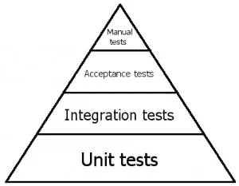
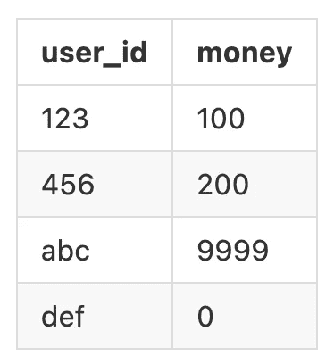

# 基于属性的节点测试框架

> 原文：<https://betterprogramming.pub/property-based-testing-framework-for-node-1ca702ad30bc>

## 通过一个实例了解快速检查是如何工作的


照片由[派恩瓦特](https://unsplash.com/@pinewatt?utm_source=medium&utm_medium=referral)在 [Unsplash](https://unsplash.com?utm_source=medium&utm_medium=referral) 拍摄

*务实的程序员*介绍了一种叫做基于属性的测试方法，其中用 Python 给出了一个例子，使用框架[假设](https://hypothesis.readthedocs.io/en/latest/)。

假设的使用非常直观和简单，并且完美地呈现了基于属性的测试的概念。所以我也想在 Node 中找到一个等价的替代品。其中有两个在 Github 上的星评很高，1.6K 星的 [JSVerify](https://github.com/jsverify/jsverify) 和 2.8K 星的[快查](https://github.com/dubzzz/fast-)。所以我花了一些时间稍微学习了一下，试图更贴近我的日常工作。

这篇文章是一个回顾，一个简单的例子来记录经验。

# 为什么要进行基于属性的测试？

在提供例子之前，让我们解释一下为什么我们使用基于属性的测试。事实上，我不喜欢以财产为基础这个词。用我的话来说，就是“极高量”的测试。

我们都知道测试金字塔如下。



测试金字塔

在我之前的文章中，我提到了[单元测试和集成测试的区别](https://medium.com/interviewnoodle/whats-difference-between-unit-test-and-integration-test-aae6ef13220)。在金字塔的较低层次，需要更多的测试用例。

即便如此，也很难产生大量的测试用例。我们通常会根据已知的条件或产品规格编写相应的测试，有时我们可能会记得编写边界测试(有时不会)，有时我们可能会依靠简单的随机验证功能，例如 [faker](https://fakerjs.dev/guide/) 。

然而，一般来说，即使我们努力想出测试用例，我们也不能覆盖所有场景，我们把这种测试方法称为基于实例的测试。这是因为我们想出的测试用例基本上都是从某个例子延伸出来的，不能覆盖所有未知的上下文，也不能测试所有的边界条件。

在这一点上，我们希望有一个框架自动生成足够多的场景(合理或不合理的场景)来验证我们编写的代码，我们编写的测试用例只需要确保它们的“属性”是正确的。这就是基于属性的测试的起源。

# 然而

> 现实是，集成测试与单元测试大致相同。

我在很多机构工作过，从大型的民族企业到小型的创业公司。无论我是开发人员还是导师，从过去的经验来看，单元测试和集成测试一样重要。

对于大多数开发人员来说，正确划分单元测试和集成测试并不是一件容易的事情。为了能够完全拆分测试用例，他们需要具备设计模式、依赖注入、依赖倒置等技能。能够做好这件事。所以大部分测试环境都是基于特定的测试环境，比如使用`docker-compose`生成一次性的数据库和测试数据，并在上面进行测试。

`fast-check`的文档是基于单元测试的标准编写的，似乎只提供了验证布尔，也就是`fc.assert`，所以我花了一些时间研究编写了一个接近日常使用的测试用例。

一般我需要几种能力。

1.  能够测试异步/等待。
2.  能够验证更多的上下文，比如`assertEqual`。

# 快速检查简介

在我们开始编写测试用例之前，让我们来看看`fast-check`的基本用法。

首先介绍一下`fast-check`的结构。

*   `Assertion (fc.assert)`
*   `Properties (fc.property or fc.asyncProperty)`

`fc.assert`的作用是验证属性自动生成的所有测试都是正确的。需要这些属性来描述两个重要的块。

*   跑步者
*   套利

Runner 是要测试的上下文，即目标。另一方面，arbitraries 是目标的输入参数，它是由属性自动生成的，我们所要做的就是为它们提供规则，例如，只有整数。

下面是一个简单的例子。

```
fc.assert(
  fc.property(fc.integer(), fc.integer(), (i, j) => {
    return i + j === add(i, j);
  })
);
```

两个`fc.integer()`是套利，后面的匿名函数是 runner，带两个自变量`i`和`j`，对应前面的套利。我们要验证函数`add`是否真的正确地对两个参数求和，所以`add`的结果应该和`+`一致。

让我们回顾一下我们刚刚提到的两个要求。

1.  `fast-check`能够测试 async/await，runner 可以是一个承诺，而`fc.assert`本身也是一个承诺。
2.  虽然我们的测试目标是`add`，但是在 runner 中很好地集成一些条件可以做出不仅仅是布尔的效果。

# 快速检查示例

现在让我们来看一个更实际的例子。假设我有一个数据库表，其中有每个用户的钱。



有一个函数`async function getMoney(limit)`，它将按升序对货币进行排序，并根据参数确定返回多少货币。

现在我们想测试这个黑匣子。

让我简单解释一下。

1.  只是简单地验证功能是否真的有效，没有使用`fast-check`。
2.  给定一个任意整数，返回结果的长度应该在 0 到 10 之间，因为我们在`before`中只创建了十条记录。
3.  给定一个整数范围，返回的长度应该等于给定的长度。
4.  验证整个数组的顺序确实是升序的。从这个 runner 可以看出，即使是非常复杂的条件也可以验证，但是要注意不要在测试用例中制造 bug 导致需要一个测试用例的测试用例。

如果检测到问题，`fast-check`还会告诉你它使用什么样的套利来检测问题。举个例子，

> *反例:[-1234567890]*

这意味着测试用例在`i = -1234567890`时失败。可能是负数没有被正确处理，或者“大”负数没有被正确处理。这是编写一个真正的单元测试(或集成测试)和验证的时候了-1234567890，这样一个失败的案例可以在以后用作回归测试。

# 结论

理想情况下，当像这样测试数据库行为时，我们将使用依赖注入等技术来隔离物理数据库，以便提高测试性能。但是正如我前面所说的，根据开发人员的经验和技能，将代码从外部依赖中恰当地分离出来并不容易。

所以在许多组织中，我们仍然看到大多数测试用例不得不依赖物理数据库进行测试。但我不得不说这是不正确的。

在本文中，我通过一个真实的例子解释了`fast-check`的用法，以及它是如何贴近实际的。尽管如此，我还是希望我们不用再面对这个了，至少看完[我之前的文章](https://medium.com/interviewnoodle/whats-difference-between-unit-test-and-integration-test-aae6ef13220)，让我们试着翻一翻那些不合理的测试案例。