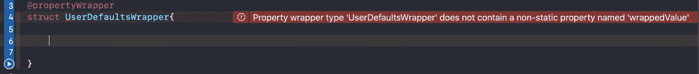

# 了解 Swift 5 中的属性包装器

> 原文：<https://betterprogramming.pub/property-wrappers-in-swift-b8011c47545d>

## 用属性包装清理你的代码


照片由[布雷特·赛勒斯](https://www.pexels.com/@brett-sayles?utm_content=attributionCopyText&utm_medium=referral&utm_source=pexels)从 [Pexels](https://www.pexels.com/photo/green-grass-field-2388571/?utm_content=attributionCopyText&utm_medium=referral&utm_source=pexels) 拍摄

属性包装器是一种实现模式。在属性包装器的帮助下，您可以像创建库一样创建自己的逻辑。它将支持 XCode 11 和 Swift 5 或更高版本。

这是在 Swift 论坛 SE-0258 上提出的。你可以写`@propertyWrapper`来定义。

# 我们开始吧

从头开始，我们将为[用户默认值](https://medium.com/better-programming/userdefaults-in-swift-4-d1a278a0ec79)编写第一个`@propertyWrapper`。



属性包装的错误

这是确认`wrappedValue`时对`@propertyWrapper`的基本警告。

```
@**propertyWrapper**
struct **UserDefaultsWrapper**<Value> **{**
    let key: **String**
    let defaultValue: **Value**
    let userDefaults: **UserDefaults** = .standard

    var **wrappedValue**: Value{
        **get** {
            return userDefaults.object(forKey: key) as? **Value**??    **defaultValue**
        }
        **set** {
            userDefaults.set(**newValue**, forKey: key)
        }
    }
**}**
```

在这里，我们为`userDefaults`写了`@propertyWrapper`。

# 如何使用它

为`@propertyWrapper`定义你的结构。

```
struct **UserDefaultsConfig**{
    @**UserDefaultsWrapper**(key: "com.user.session", 
                defaultValue: false)
    static var **sessionStarted**: Bool

    @**UserDefaultsWrapper**(key: "com.user.details", 
                defaultValue: [:])
    static var **userDetails**: [String: String]
}
```

# 保存和检索值

## *存储一个布尔值*

```
**UserDefaultsConfig**.sessionStarted = true
print(**UserDefaultsConfig**.sessionStarted)   //**true**
```

## *存储字典值*

```
**UserDefaultsConfig**.userDetails = **[**“userName”: “Anand”, 
                                  “country”: “India”**]**
print(**UserDefaultsConfig**.userDetails) // **["userName": "Anand", "country": "India"]**
```

# 重置值

```
**UserDefaultsConfig**.sessionStarted = true
**UserDefaultsConfig**.userDetails = [:]
```

*   如果有人试图将您的`@propertyWrapper`对象的值设置为`nil`，那么需要进行一些更改以避免代码崩溃。

# 为可选值创建协议

```
private protocol **AnyOptional**{
     var isNil: **Bool** { get }
}
```

## **检查扩展可选是否有值**

```
private extension **Optional**: **AnyOptional**{
      var isNil: Bool { self == nil }
}
```

我们将协议和扩展设为私有，因为在其他类中不需要它们。

# **最终属性包装代码**

用户默认值的属性包装

这是`@propertyWrapper`的基本用途，但是你也可以为其他用途编写它——没有限制。有了它，我们可以让我们的`UserDefault`代码更加高级。这只是开始。

## 另一个例子

```
@**propertyWrapper**
struct **CapitalFirstLetter** {
    private(set) var value: **String** = ""var **wrappedValue**: String {
        get **{** value **}**
        set **{**
            let first = **String**(newValue.prefix(1)).**capitalized**
            let other = **String**(newValue.dropFirst())
            value = first + other
        **}**
    }
}// *Model -* 
struct **UserDetails{**
    @**CapitalFirstLetter** var userName: **String**
    @**CapitalFirstLetter** var lastName: **String**

    **init**(userName: **String**, lastName: **String**) {
        self.**userName** = userName
        self.**lastName** = lastName
    }
**}***//Uses -* 
let userDetails =  **UserDetails**(userName: "anand", lastName: "nimje")
**print**(userDetails.userName) //Anand 
**print**(userDetails.lastName) // Nimje
```

你已经在 SwiftUI 里面看到了`@State`、`@Binding`和`@FetchRequest`。这些是`@propertyWrapper`。

# 结论

在这一部分，我已经介绍了`@propertyWrapper’`的基本用途。减少我们的代码并增加其可重用性是非常有用的。这将减少你的代码中的大量样板文件，以及当前代码所需的最小改动。

有很多方法可以使用`@propertyWrapper`。它很容易使用，但需要 Swift 5 和 Xcode 11 或更高版本。

我希望你喜欢它。感谢阅读！