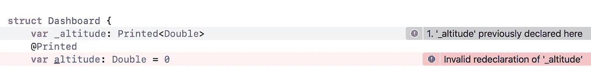

# iOS 14 属性包装器已打开

> 原文：<https://betterprogramming.pub/property-wrappers-unwrapped-155cc1dbad2a>

## 了解 Swift 的最新主要功能之一

亨利·阿斯克罗夫特在 [Unsplash](https://unsplash.com?utm_source=medium&utm_medium=referral) 上拍摄的照片

Swift 获得一个非常有趣的特性 *property wrappers 已经有一段时间了。*该功能被认为主要是为了方便 SwiftUI 和组合 API 而设计的，所以我们(现代 Swift 开发人员)不得不立即面对它，没有时间慢慢开始并探索它的内部。

但是说实话:我们所有人对这个特性实际上是如何实现的以及它是如何工作的有一个坚实而深刻的理解吗？

例如，是什么使得设置一个`let`常量(或者不可变的`self`)的`[@State](https://developer.apple.com/documentation/swiftui/state)`标记的属性而不会得到一个`Cannot assign to property`错误成为可能？或者说，我们用来从`[@Published](https://developer.apple.com/documentation/combine/published)`属性中获取实际的`Publisher`的那个神秘的`$`前缀的确切含义是什么？

如果它仍然有一种神秘的气氛，让我们试着更好地了解它。乍一看，属性包装特性可能看起来令人生畏，而且比实际情况更复杂。它可能看起来像一个黑匣子在做一些用 Swift 语言的任何其他手段都做不到的事情。

但是一旦我们理解这个特性只不过是在处理属性时减少样板代码的一个捷径，一个所谓的语法糖，它就会变得更加温和。并且它尽可能少地隐藏编译器的魔力。让我们打开属性包装，把它们看作是透明和简单的。

现在，已经有大量优秀的文章提供了属性包装器可以解决的具体任务的各种例子。我不会再发明了。

这一系列的 2-3 篇文章，也就是你正在阅读的第一篇，旨在解释它们背后的直觉，并对它们的内部实现以及一些陷阱和天生的限制给出更深入的看法。

最后，有几个关于这个特性的方法和最佳实践，我觉得很有用，我想分享一下。希望它能帮助您更加自信地使用自定义属性包装器代码，并帮助您更好地理解它们在 SwiftUI 和 Combine 中的作用。

# 入门指南

属性包装器特性(让我们简称它们为 *PWs* )在 [Swift Evolution proposal](https://github.com/apple/swift-evolution/blob/master/proposals/0258-property-wrappers.md) 中有相当详尽的描述。我已经为你完成了阅读这长卷的枯燥工作，基于这神圣的知识，我们来看看后台发生了什么。

但在进入正题之前，让我再次简要概述一下基本概念。所以 PW 包含两个互补的部分。第一个基本上是一个您自己创建的几乎规则的结构，您用`@propertyWrapper`属性标记它。

这种结构的唯一特点是，一旦标记了这个属性，它就必须拥有一个名为`wrappedValue`的任意类型的非静态属性。

让我们首先考虑一个实际上什么都不做的虚拟例子——来看看完整的两部分语法是什么样子的。这是第一部分:

就是这样——只是一个被限制为具有特定名称的属性的结构。其余的一切不受任何事物的约束或限制。让我们称这样的结构为 *PW-struct。*

现在，通过将这个属性添加到`MyCustomWrapper`结构中，我们已经生成了我们的自定义属性`@MyCustomWrapper`(前缀为@符号的结构的确切名称)，它现在可以应用于任何其他类或结构中的任何类型为`String`的存储属性(因为 PW-struct 中的`wrappedValue`是`String`)。

顺便说一下，PW 是迄今为止在 Swift 中创建某种自定义属性的唯一方法。然而，我们不耐烦地期待着更多。

但是回到我们的例子。这个应用于另一个结构或类中的属性的新生属性实际上是 PWs 整个机制的第二部分:

显然，这应该使`EnclosingStruct`的`originalProperty`以某种方式绑定到`MyCustomWrapper`的`wrappedValue`属性。也就是说:一旦我们将该属性应用于`originalProperty`，对该属性的控制就委托给了`MyCustomWrapper`的`wrappedValue`，因此`originalProperty`的值现在可以被观察、处理，甚至由`wrappedValue`提供。

顺便说一下，这就是 PW 特性最初被称为*属性委托的原因。*让我们暂时对这个委托机制保持模糊。请耐心听我说，我们会看到这一切究竟是如何在幕后发生的。

但首先，让我们忘记之前的玩具例子，考虑一个更有意义的例子。这增加了一些真正的功能，尽管它仍然非常简单:

我们这里的`Printed`属性包装器只是一个结构体，它在设置了`wrappedValue`之后打印它的值。注意这里的`wrappedValue`是泛型类型——我们稍后会关注这一部分。

在这个例子中，我们使用了`didSet`属性观察者来部署封装在这个 PW 中的实际功能或业务逻辑。但是，我们也可以采用任何其他方式来处理 Swift 属性。

根据语义上下文，您应该决定让这个`wrappedValue`成为存储属性还是计算属性。然后，您将分别使用`willSet` / `didSet`或一个 getter/setter 对来处理它的值。至于选择哪一个，完全由开发人员决定。

但是让我们回到我们的例子，看看第二部分是什么样子的:

从输出中，我们看到每次我们为每个标有`@Printed`的`Dashboard`的原始属性设置一个新值时，`Printed`的`wrappedValue`的`didSet`就会被调用，它收到的实际值就是原始属性的确切值。

如果我们实现了`willSet`，或者如果`wrappedValue`具有 computed 属性，那么`get`和/或`set`也会发生同样的情况。

花点时间考虑这个例子。它展示了 PW 最简单也可能是主要的预期目的——优化处理相似属性的重复任务。更具体地说:我们使用 PW struct 作为盒子来封装我们希望在代码库中重用的具有多个属性的任何代码，这样就消除了样板文件。

如果没有 PW，我们将需要为做相同工作的每个属性指定相同的`didSet`块。

在我们的例子中，我们选择将`wrappedValue`作为存储属性，因此使用属性观察者来编排原始属性值。

那么 computed 属性和 getter/setter 选项呢——它的经典例子可以在这里的[中找到](https://github.com/apple/swift-evolution/blob/master/proposals/0258-property-wrappers.md#user-defaults)，其中 PW 只是作为一个代理来存储用户默认值中的一个值。它还显示了 PW struct 当然可以有除了`wrappedValue`之外的属性，但是我们将在以后的文章中更加关注这一部分。

关于我们的 PW-struct `@Printed`中包装值的类型，只说几句:这通常是一个声明泛型类型的`wrappedValue`的好习惯，而不是具体类型的。

这使得它更符合 PWs 的可重用性和适应性的思想。这可以通过将 PW struct [设为泛型](https://docs.swift.org/swift-book/LanguageGuide/Generics.html#ID184)并将该泛型占位符(在我们的示例中为`WrappedType`)指定为一种类型的`wrappedValue`属性来实现。当然，我们不应该滥用这种方法——有时属性包装结构的具体类型正是我们所需要的。

而且在很多情况下，约束泛型的普遍性是有意义的，这个例子也展示了这点。`Printed`结构可以作为符合`CustomStringConvertible`协议的任何类型的 PW，所以我们统一使用它的`Double`和`String`属性。

# 它是如何工作的

这就是它的工作原理。其意义的模式和示意性轮廓似乎是清楚的，但它可能仍然会留下一种焦虑不安的感觉在空气中挥之不去。它存储的`Printed`结构的实例在哪里？哪一刻出生，哪一刻死亡？对于它所包装的每个属性，它是独立的，还是静态存储的，并且可以有一些共享状态？

让我立即通过证明文章开头的陈述来平息您所有的恐惧:正如您所能想象的那样，PWs 的实现只包含很少的编译器魔法。

对于一些比我们的玩具例子更复杂的情况，这种知识是必要的——比如处理共享资源，一些需要最终清理的东西，或者一些异步任务。毕竟，出于纯粹的兴趣，pw 与封闭结构`Dashboard`的相应属性到底有什么关系？

为了摘掉他们的面具，我建议冒险一试:在`Dashboard`结构中，让我们尝试声明另一个名为`_altitude`(或`_velocity`或 _ any-other-existing-property)的属性。砰的一声。错误。

一个不该有的错误🤷🏾‍♂

又是 Xcode bug？如果不是，为什么说已经申报了？嗯，确实是。显然是编译器隐式地为我们做了这件事。

我们只是“意外地”发现了 PW 是如何在幕后实现的。结果是，对于每个标有 PW-custom 注释的属性，编译器都会用我们“意外”选择的名称合成另一个属性。

这不是秘密——在 Swift [文档](https://docs.swift.org/swift-book/LanguageGuide/Properties.html#ID617)中有描述，也在上面提到的进化提案中有描述，但是我们都需要一些戏剧性，对吗？文档还描述了生成的其他内容。

为了保持更集中，让我们只考虑`altitude`房产的例子，忽略其他的。所以编译器创建了一个新的存储属性`_altitude`，它的类型是`Printed<Double>`，这就是为什么我们会有那个`invalid redeclaration`错误。

原始属性`altitude`现在被 PW 的机制转换为计算属性，因此它只是一个设置和获取这个新存储属性的`wrappedValue`的代理。看看`Dashboard.altitude`和`Printed.wrappedValue`之间的神奇纽带可以通过常规 Swift 多简单地重建:

一旦我们使用属性包装器，上面的代码就是我们将免费得到的:

这可能看起来没什么大不了的——直到我们记住没有 PW，我们需要为每个属性添加相同的样板文件。

顺便说一下，对于我们中那些碰巧抓住 Objective-C 的活化石来说，这种模式可能非常类似于由实例变量支持的 Obj-C 属性。

不过，在我们对属性包装器的重构中，有一点是缺失的。这个东西是合成隐藏属性的一个实例的初始化，我将在下一篇文章中讨论这个主题。但是在我们结束这个之前，让我们来谈谈上面揭示的隐式实现的一些方面。

# 关于实现的更多信息

我们已经看到，对属性编译器应用 PW 做了一件非常重要的事情:它将原始属性从存储属性转变为计算属性，因此现在由 PW-struct 来处理它的内存存储。这可能会造成一种错觉，以为 PW 可以绕过财产价值的实际存储。

事实上，原来的属性现在只是 PW-struct 的一个代理，而 PW-struct 反过来可以让它的`wrappedValue`成为可计算的(并且没有其他存储的属性)，因此完全不需要存储任何东西。

在某些情况下，这样的漏洞看起来很有趣，也很有帮助。但事实并非如此(这是我想分享的个人小失望)。因为还记得我们还有那个隐藏的`_whatever`存储属性吗？从某种意义上来说，这种额外的存储抵消了已经消失的存储属性。将这一条添加到我承诺的 PWs 限制列表中:

*   不幸的是，不可能将属性包装的属性添加到 Swift 扩展中——即使相应 PW 的`wrappedValue`被计算出来
*   此外，PW 不能应用于计算的属性。它已经变成了一个幕后计算的程序，所以另一个`get`或`set`程序块(或两者)会与 PW 机制隐式合成的程序块冲突。
*   出于类似的原因，它不能应用于`lazy`属性。显然，惰性初始化机制已经处理了 getter、setter 和一些后备存储本身，这阻止了它与 PW 一起使用。然而，很可能 Swift 迟早会获得基于本机属性包装器的懒惰机制(`@Lazy`)来取代硬编码到编译器中的机制。

毕竟，将存储属性转换为计算属性的行为会导致存储属性和计算属性概念的混淆，并且会导致 PWs 的某些副作用。在接下来的几篇文章中，我们将进一步研究这一点。

但是以一个更好的注解来结束这个节目:当然，在 PWs 的实现中隐藏着一些令人愉快的东西。

例如，委托机制足够智能，可以将属性`wrappedValue`的 getter 和 setter 的可变性转化为原始属性的隐式 getter 和 setter。

下面是本文介绍中一个难题的答案:如何设置一个`let`常量(或一个不可变的`self`)的`[@State](https://developer.apple.com/documentation/swiftui/state)`属性而不出现`Cannot assign to property`错误？那么，线索是`@State`的`wrappedValue`的设置者被标记为`nonmutatin`，因此，任何标记有`@State`的原始属性的隐式设置者也是`nonmutating`。

本文到此为止。在接下来的一篇文章中，我们将回答这里列出的一些问题。我们还将看到如何使用仪表板改进我们的示例，以及在这方面有哪些关于属性包装器的新发现等待着我们。感谢您的阅读，下次再见。

UPD:最后，[第二部分](https://vbragin.medium.com/swift-property-wrappers-unwrapped-part-2-48745a12d706)准备好了。