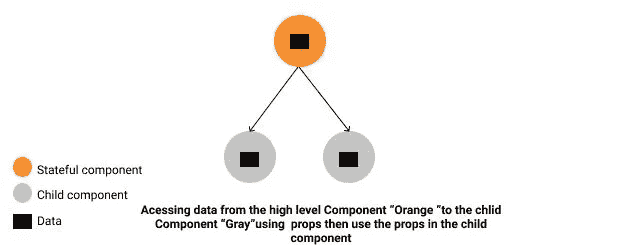
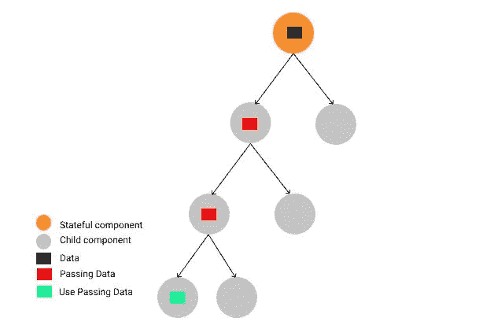

# React 中的道具演练

> 原文：<https://betterprogramming.pub/props-drilling-in-react-12da084aaf51>

## 什么是道具钻，有没有更好的方法？

轮廓-图像

本文将涵盖两个主题:

*   什么是道具钻？
*   如何回避道具演练

# 什么是道具钻？

首先，让我们回顾一下我们所知道的道具概念。道具是我们传递或可以访问的数据，从顶级组件到我们网站上任意数量的子组件。请看这张图表:

**图表 1。**

图 2 显示了支柱钻孔(也称为螺纹钻孔):

图表 2。

Props drilling(线程)指的是将数据从父组件传递到*确切的*子组件的过程。*但是，*在这两者之间，拥有*道具的其他组件只是将它向下传递。*

那么，道具钻和我们的数据有什么联系呢？

嗯，利奥已经获得了 7 次奥斯卡提名，他只是因为在电影《荒野猎人》中的角色而获奖然而，在 React.js 的世界里，他的名字是你传递给*不止一级的道具，即使他们不需要它，直到它到达你使用道具的那一级。*

**你可以在这个** [**链接**](https://codesandbox.io/s/propsdriling-qhm6i?file=/src/App.js) **看到代码。**

# 如何回避道具演练？

避免支柱钻孔有几种解决方案:

*   反应上下文 API。
*   作文。
*   渲染道具。
*   特设。
*   Redux 或者 MobX。

# 通过使用 React 上下文 API 钻取来避免道具

首先，您需要初始化上下文。你可以在 js 文件中或者在父组件的顶部这样做:`**const** MyContext = React.createContext() ;`

之后，继续创建您的提供者并在其中使用上下文。然后，我们需要使用上下文并使用它来扭曲组件，这将在其中注入上下文参数。

之后，事情就很简单了。你可以像使用道具一样使用上下文。

*注:这里* *可以看到* [的代号。](https://codesandbox.io/s/avoid-props-drilling-using-context-api-8cbfi)

恭喜你，你做到了！

# 2.避免道具钻构图

简单地说，要组成 react 组件，必须将组件分为容器和呈现者——有状态的和无状态的。然后你把数据当道具传给孩子。

因此，主要组件将是这样的:

电影组件列表将包含所有组件，如下所示:

这里，将道具传递给亡灵组件:

你可以在这里找到完整的代码。

感谢阅读！

# **资源:**

*   [构成 Vs 继承](https://reactjs.org/docs/composition-vs-inheritance.html)
*   [从地面反应出构图模式 U](https://medium.com/@alexkrolick/react-composition-patterns-from-the-ground-up-8401aaad93d7)
*   [避免与上下文 API](https://dev.to/spukas/avoid-prop-drilling-in-react-with-context-api-1ne5) 中的道具钻取