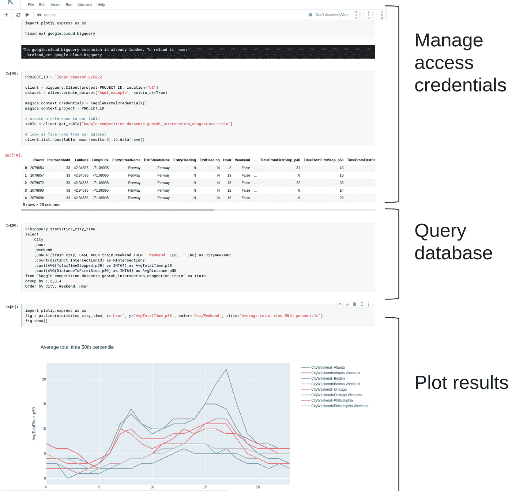
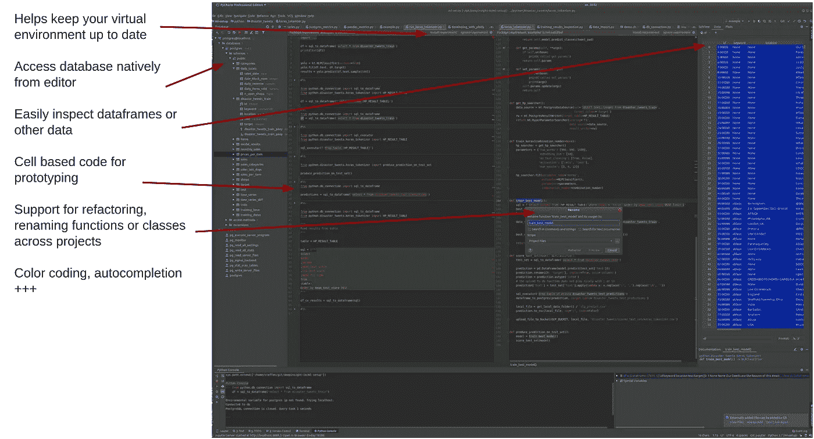

# 使用 Jupyter 笔记本作为数据科学工作编辑器的利与弊

> 原文：<https://betterprogramming.pub/pros-and-cons-for-jupyter-notebooks-as-your-editor-for-data-science-work-tip-pycharm-is-probably-40e88f7827cb>

## **TL；博士:皮查姆可能更好**

图片由 [Gerd Altmann](https://pixabay.com/users/geralt-9301/) 从 [Pixabay](https://pixabay.com/photos/bulletin-board-laptop-computer-3233653/) 拍摄

Jupyter 笔记本电脑有三大优势:

*   它们非常适合展示你的作品。您可以看到代码和结果。Kaggle 的笔记本就是一个很好的例子。
*   很容易用别人的作品作为出发点。您可以逐个单元格地运行，以便更好地理解代码的作用。
*   非常容易托管服务器端，这是有益的安全目的。许多数据都是敏感的，应该受到保护，而实现这一点的一个步骤就是不将数据存储在本地机器上。服务器端 Jupyter 笔记本安装程序可以免费为您提供这一功能。

在原型制作时，Jupyter 笔记本基于单元的方法非常棒。但是你很快就结束了几个步骤的编程——而不是着眼于面向对象的编程。

## **Jupyter 笔记本的缺点**

当我们在单元格而不是函数/类/对象中编写代码时，你很快就会得到做同样事情的重复代码，这是非常难以维护的。

不要从强大的 IDE 中获得支持。

**代码重复的后果:**

*   实际上很难与 Jupyter 在代码上合作——因为我们从彼此那里复制代码片段，所以很容易失去同步
*   很难维持一个版本的真相。这些笔记本中哪一个有 *xyz 数字的唯一正确解？*

还有一个与绘图相关的棘手问题。您如何在数据科学团队之外分享图表？起初，Jupyter Notebook 是一种很好的分享情节的方式——只是分享笔记本！但是你如何确保那里的数据是新的呢？很简单，让他们查一下笔记本就行了。

但是在大型组织中，您可能会遇到很多问题，因为您不希望太多的用户直接访问底层数据(无论是 GDPR 问题还是其他问题)。实际上，在工作场所，我们注意到 Jupyter 的图表通常通过复制/粘贴到 PowerPoint 中来共享。每当数据发生变化时，让您的数据科学家进行复制/粘贴循环是非常低效的。

## **一个例子**

让我们来看一个来自 Kaggle 的[示例笔记本](https://www.kaggle.com/c/bigquery-geotab-intersection-congestion)。

这很容易开始。我只是从介绍性示例中复制了一些单元格，然后自己进行了探索。但在这里，我们也看到了不利的一面——访问凭据管理现在在所有笔记本上都是重复的。如果他们改变了呢？然后，每个笔记本也需要更换。

数据集很有趣。但是没有规范的方法——所以如果您想重用它，您就要复制 SQL 语句。

如果缺乏纪律性，您还会陷入奇怪的版本问题，开始积累多个 Jupyter 笔记本，而没有人记得它们。

## **受益于 IDE**

作为 Jupyter 笔记本的替代品，您可以使用 Spyder 和 PyCharm。

Spyder 有一个有趣的特性，它非常擅长重载代码，同时保持当前会话的状态。因此，如果您试图在 pandas 或本地机器上的其他工具中完成大部分转换，Spyder 非常有用。如果您选择的是 Python 发行版，它还附带了 Anaconda。

PyCharm 非常擅长构建适当的 Python 代码并获得可复制的结果。有很多功能可以提高工作效率。Spyder 和 PyCharm 都支持使用代码中的`#%%`注释进行基于单元格的处理，因此我们仍然可以像在 Jupyter Notebook 中一样构建代码原型。

对于我们以前的一个客户，我们希望提高代码质量，但不允许访问任何本地机器上的数据。因此，我们努力用 PyCharm 启动虚拟机，以安全的方式访问数据。它很快得到了回报——开发速度和代码质量提高了*倍。*代码也让它更快地投入生产。

## **将机器学习投入生产**

需要考虑的是计算在哪里运行。对于易于放入 Docker 的代码，将其部署到任何云解决方案都很容易。对于笔记本电脑来说，也有不错的选择，尽管你更倾向于特定的解决方案。

如果你确实想看看 Jupyter 笔记本，那绝对值得看看[亚马逊 SageMaker](https://aws.amazon.com/sagemaker/) 和/或 [Kubeflow](https://www.kubeflow.org/docs/notebooks/) 。这些解决方案可以更轻松地将笔记本电脑中的代码部署到生产环境中。

我们通过以下方法取得了巨大成功:

*   使用 PyCharm(它大大提高了代码质量)
*   数据的每一次转换都需要准确地存在于我们的存储库中的一个位置。(因此，任何与该转换相关的问题都需要在*中解决。*)
*   每个转换都需要在生产中进行(作为表/文件/输出可用)，以便其他数据科学家可以在他们的模型中重用它。如果这种转换得到改进，所有后续的管道也会自动得到改进。

# **结论**

你应该完全移除笔记本吗？笔记本有很多优点。这取决于你在哪里，你主要关心的是什么

*   如果所有的机器学习都已经在云上了，只需要一些简单的脚本——笔记本可能是最简单的方式
*   当数据工程团队人手不足或数据科学家团队不成熟时，要小心对笔记本电脑的严重依赖，因为这是你可以在短时间内积累大量不可收拾的坏习惯和技术债务的时候
*   如果您的问题相当独特，并且需要大量自行开发的代码，Jupyter 笔记本的大小和复杂性将会增加，难以维护
*   团队越大，我们就越担心团队成员之间的协作编码和结果重用，我们应该远离 Jupyter
*   如果你有跨职能的团队，既有软件工程师又有数据科学家，充分利用版本控制和面向对象编程就更容易了。如果你有一个跨职能团队，离开 Jupyter 你可能会得到更多的好处。