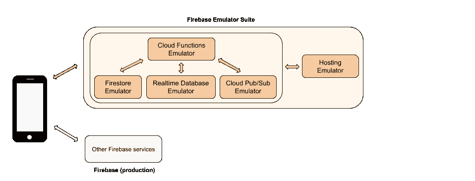
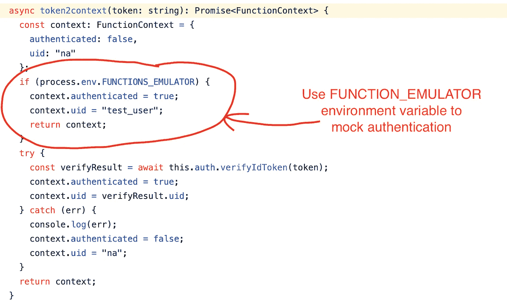
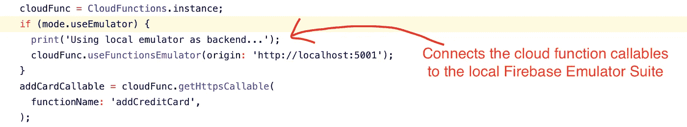
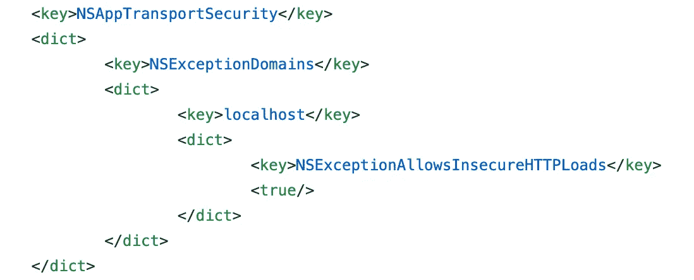
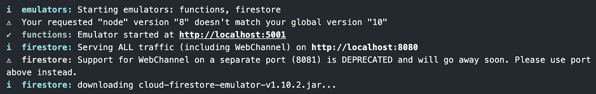
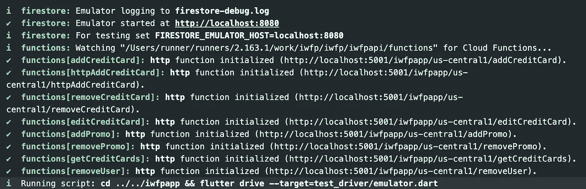
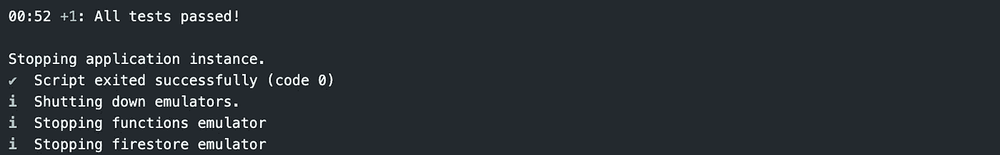

# 具有颤振和燃烧基础的局部原型

> 原文：<https://betterprogramming.pub/prototype-locally-with-flutter-and-firebase-db8907222bea>

## 永远不要再搞乱你的在线数据库


在 [Unsplash](https://unsplash.com/s/photos/teamwork?utm_source=unsplash&utm_medium=referral&utm_content=creditCopyText) 上拍摄的“我的镜头人生”

[Flutter](https://flutter.dev/) 是跨平台的 app 前端框架 [Firebase](https://firebase.google.com/) 是 app 后端平台。它们经常一起使用。

由于 Flutter 和 Firebase 使用不同的语言( [Dart](https://dart.dev/) 和 Node.js)，在一个包含的本地环境中同时测试/原型化这两者是一个不小的问题。

注意:在线测试并不可取，因为它会破坏数据库，并且需要复杂的设置(部署和版本匹配)。

我们可以用模拟的 Firebase 服务 [Firebase 模拟器套件](https://firebase.google.com/docs/emulator-suite)实现本地测试。

下图显示了 Flutter 应用程序如何与 Firebase 仿真器套件进行交互:



信用: [Firebase 文档](https://firebase.google.com/docs/emulator-suite)

让我们一步一步地了解如何在 Firebase 模拟器套件中使用 Flutter。

注:本文中用来说明的代码来自于[我的副业](https://github.com/tianhaoz95/iwfp)。虽然我们主要关注 Firebase 的颤振，但经过一些修改，它也适用于 X + Firebase，其中 X 可以是本地反应，等等。

# 步骤 1:安装 Firebase 模拟器套件

Firebase 模拟器套件附带 Firebase CLI，可以使用以下命令安装:

```
npm install -g firebase-tools
```

# 步骤 2:绕过仿真中的身份验证步骤

如上图所示，Firebase 身份验证不是 Firebase 模拟器套件的一部分。因此，数据认证/授权不能在本地工作，所以它们必须被模仿。

有许多方法可以模拟身份验证。我使用 Firebase 模拟器套件设置的环境变量来模拟:



来自[天昊 95/iwfp](https://github.com/tianhaoz95/iwfp) 的模拟认证实现示例

# 步骤 3:将 Flutter 应用程序连接到 Firebase 模拟器套件

我们希望将 Firebase 云函数调用连接到本地主机:



[从](https://github.com/tianhaoz95/iwfp/blob/master/iwfpapp/lib/services/data_store.dart#L38)[天昊 95/iwfp](https://github.com/tianhaoz95/iwfp) 将 Firebase 云函数调用连接到 Firebase 仿真器套件的示例

注意:我们希望使用顶级环境来控制本地和云。有许多方法可以实现这一点。例如，设置环境变量或使用不同的入口点。

下面是一个使用不同入口点的示例:

[](https://flutter-academy.com/build-flavors-environment-specific-configuration/) [## 构建风味和环境特定的配置| Flutter Academy

### 在构建移动应用程序时，通常会使用多种环境。例如，开发环境用于…

flutter-academy.com](https://flutter-academy.com/build-flavors-environment-specific-configuration/) 

# 步骤 4:启用 HTTP(无“S”)连接(仅限 iOS)

默认情况下，iOS 不允许任何 HTTP 请求。

要仅允许 HTTP 连接到本地主机，请将以下代码片段添加到`[flutter_project_root]/ios/Runner/info.plist`:



[iOS 配置](https://github.com/tianhaoz95/iwfp/blob/master/iwfpapp/ios/Runner/Info.plist)来自[天昊 95/iwfp](https://github.com/tianhaoz95/iwfp) 灵感来自[本期 GitHub](https://github.com/flutter/flutter/issues/38452)

# 步骤 5:在本地开始测试

在 Firebase 项目目录中运行以下命令将启动测试:

```
npm run build &&
firebase emulators:exec --only functions,firestore \"cd ../../flutter_app && flutter drive --target=test_driver/emulator.dart\""
```

注意:

*   `firebase emulator:exec`接受第二个参数作为在启动模拟器时执行的命令。在我们的例子中，那是`cd ../../flutter_app && flutter drive --target=test_driver/emulator.dart`，意味着我们想首先导航到 Flutter 并开始我们的集成测试。
*   `npm run build`在这里很重要，因为模拟器只接受编译过的代码。
*   将脚本作为`npm run hermetic-device-test`添加到您的`package.json`中也是一个好主意，这样您就不必记住这么长的命令。
*   或者，您可以单独运行仿真器和 Flutter 应用程序，以便在一个终端中使用`firebase emulators:exec --only functions,firestore`而在另一个终端中使用`flutter run`进行交互式调试/开发。

# 第六步:喝杯咖啡

测试将如下所示(参考每个执行阶段的图像标题):



Firebase 仿真器套件从[天昊 95/iwfp](https://github.com/tianhaoz95/iwfp) 启动



天昊 95/iwfp 的 Firebase 仿真器套件 API 部署



在[天昊 95/iwfp](https://github.com/tianhaoz95/iwfp) 的 Firebase 仿真器套件中运行的颤振综合测试结果

现在，您再也不用担心开发中的应用程序会再次搞乱数据库。快乐黑客与颤振和 Firebase。

## 更新:

这是我用 Flutter + Firebase emulator 做的一个现场编码会话，它可以直观地演示在原型制作中使用 Firebase emulator 的感觉: