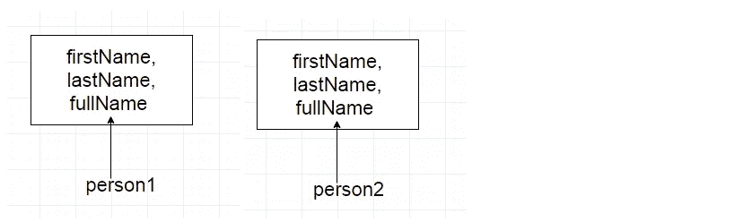
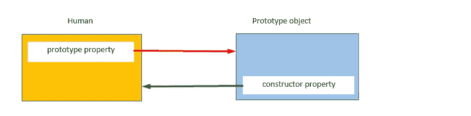
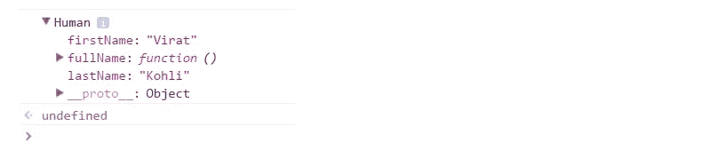
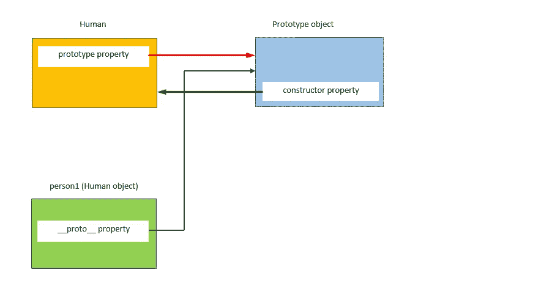
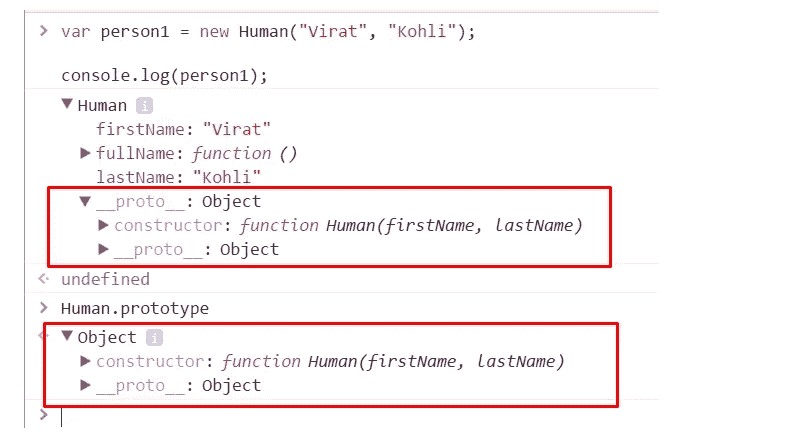
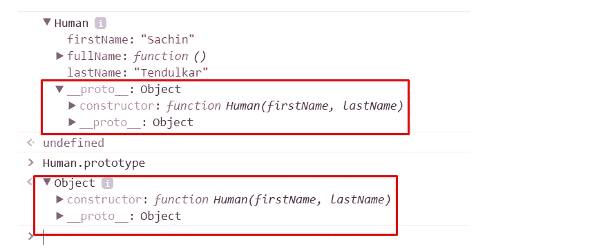
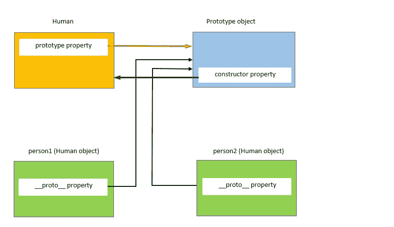
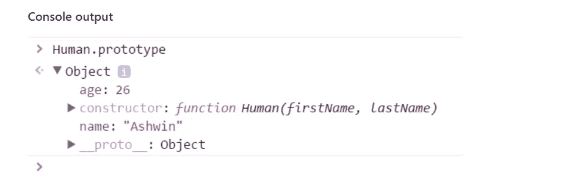
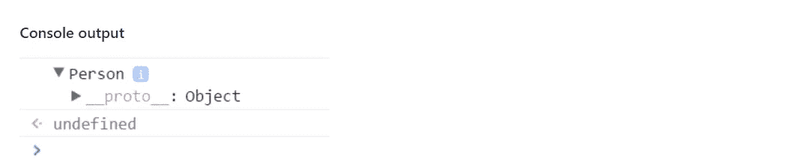
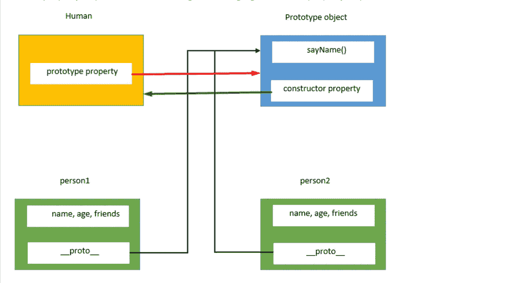

# JavaScript 中的原型

> 原文：<https://betterprogramming.pub/prototypes-in-javascript-5bba2990e04b>


照片由[德拉诺尔 S](https://unsplash.com/@dlanor_s?utm_source=unsplash&utm_medium=referral&utm_content=creditCopyText) 在 [Unsplash](https://unsplash.com/search/photos/javascript-code?utm_source=unsplash&utm_medium=referral&utm_content=creditCopyText) 上拍摄

在这篇文章中，我们将讨论什么是 JavaScript 中的原型，它们如何帮助 JavaScript 实现面向对象编程的概念。

在之前的[文章](https://medium.com/@happymishra66/create-objects-in-javascript-10924cfa9fc7)中，我们已经学习了用 JavaScript 创建对象的各种方法。在 JavaScript 中创建对象的方法之一是使用`constructor`函数。

**用构造函数创建对象的问题:**

考虑下面的`constructor`函数:

让我们使用`Human`构造函数创建对象`person1`和`person2`:

```
var person1 = new Human("Virat", "Kohli");
var person2 = new Human("Sachin", "Tendulkar");
```

在执行上述代码时，JavaScript 引擎将创建构造函数的两个副本，分别用于`person1`和`person2` *。*



也就是说，使用构造函数创建的每个对象都有自己的属性和方法副本。让函数`fullName`的两个实例做同样的事情是没有意义的。为每个对象存储单独的函数实例会导致内存浪费。随着我们的前进，我们会看到我们如何解决这个问题。

**原型**

当用 JavaScript 创建一个函数时，JavaScript 引擎会向该函数添加一个`prototype`属性。这个`prototype`属性是一个默认情况下具有`constructor`属性的对象(称为原型对象)。`constructor`属性指回`prototype` 对象为属性的函数。我们可以使用`functionName.prototype`来访问函数的原型属性。



如上图所示，`Human` 构造函数有一个`prototype`属性指向`prototype` 对象。`prototype` 对象有一个`constructor`属性，指向`Human` 构造函数。让我们看下面的例子:

```
console.log(person1);
```



要访问`Human`构造函数的 prototype 属性，使用以下语法:

```
console.log(Human.prototype)
```


从上图可以看出，函数的*原型*属性是一个对象(*原型*对象)，有两个属性:

1.  `constructor`属性指向*人类*函数本身
2.  属性:我们将在解释 JavaScript 中的*继承*时讨论这个问题

**使用构造函数创建一个对象**

当用 JavaScript 创建一个对象时，JavaScript 引擎会给新创建的对象添加一个名为 *dunder proto* 的`__proto__` 属性。 *dunder proto* 或`__proto__` 指向构造函数的原型对象。



如上图所示，使用人类构造函数创建的`person1` 对象有一个 *dunder proto* 或`__proto__` 属性，该属性指向构造函数的原型对象。

```
//Create an object person1 using the Human constructor function
var person1 = new Human("Virat", "Kohli");
```



从上图可以看出，无论是`person1’s` *dunder proto 还是* `__proto__`属性和`Human.prototype` 属性都是相等的。让我们使用`===`操作符检查它们是否指向同一个位置

```
Human.prototype === person1.__proto__ //true
```

这说明`person1’s` *dunder proto* 属性和`Human.prototype`指向同一个对象。

现在，让我们使用`Human`构造函数创建另一个对象`person2`

```
var person2 = new Human("Sachin", "Tendulkar");
console.log(person2);
```



上面的控制台输出显示，即使是`*person2’s*` *dunder proto* 属性也等于`Human.prototype`属性，并且它们指向同一个对象。

```
Human.prototype === person2.__proto__ //trueperson1.__proto__ === person2.__proto__ //true
```

上述语句证明了`person1’s`和`person2’s` dunder proto 属性指向`Human`构造函数的原型对象。



**构造函数的原型对象由使用构造函数创建的所有对象共享。**

**原型对象**

由于原型对象是一个对象，我们可以将属性和方法附加到原型对象上。因此，使用构造函数创建的所有对象都可以共享这些属性和方法。

可以使用点符号或方括号符号将新属性添加到构造函数的 prototype 属性中，如下所示:



`name`*`age`*属性已经添加到`Human`原型中**

****例子****

**我们来分析一下做`console.log(person.name)`的时候发生了什么。让我们检查 person 对象是否有一个`name`属性**

```
**console.log(person1);**
```

****

**我们可以看到`person1` 对象是空的，除了它的 *dunder proto* 属性之外，它没有任何属性。那么`console.log(person.name)` 是如何输出`Ashwin`的呢？**

**当我们试图访问一个对象的属性时，JavaScript 引擎首先试图找到该对象的属性，如果该属性存在于该对象上，它就输出它的值。但是，如果该属性不存在于对象上，则它会尝试在原型对象或对象的 *dunder proto* 上查找该属性。如果找到该属性，则返回值，否则 JavaScript 引擎尝试在对象的 *dunder proto* 上找到该属性。这个链继续下去，直到 *dunder proto* 属性为`null`为止。在这些情况下，输出将是`undefined`。**

**因此，当调用`person1.name` 时，JavaScript 引擎检查属性是否存在于`person1` 对象上。在这种情况下，`name`属性不在`person1’s`对象上。所以，现在 JavaScript 引擎检查`name` 属性是否存在于 *dunder proto* 属性或`person1’s`对象的原型上。在这种情况下，`name` 属性位于 *dunder proto* 属性或`person1’s`对象的原型上。因此，输出被返回`Ashwin`。**

**让我们使用`Person` 构造函数创建另一个对象`person2` 。**

```
**var person2 = new Person();
//Access the name property using the person2 object
console.log(person2.name)// Output: Ashwin**
```

**现在，让我们在`person1` 对象上定义一个属性`name`**

```
**person1.name = "Anil"
console.log(person1.name)//Output: Anil
console.log(person2.name)//Output: Ashwin**
```

**这里`person1.name`输出“Anil”。如前所述，JavaScript 引擎首先尝试查找对象本身的属性。在这种情况下，`name` 属性出现在对象`person1`本身上，因此 JavaScript 引擎输出`person1` *的`name`属性的值。***

**在`person2`的情况下，name 属性不存在于对象上。因此，输出`person2’s`原型对象的属性`name` *。***

# ****原型的问题****

**因为原型对象在所有使用构造函数创建的对象之间共享，所以它的属性和方法也在所有对象之间共享。如果一个`object A`修改了原型的一个具有原始值的属性，其他对象不会受到影响，因为`object A`会在它的对象上创建一个属性，如下所示。**

> ***在这里(第 1 行和第 2 行)，两个* `*person1*` *和* `*person2*` *都没有* `*name*` *属性，因此它们访问原型* `*name*` *属性，因此两者的输出相同。***

**当`person1` 想要为`name`属性设置不同的值时，它会在其对象上创建一个`name` 属性。**

## **考虑另一个例子，当原型对象包含引用类型的属性时，显示原型的问题**

**在上面的例子中，`person1` 和`person2`指向原型对象的同一个`friends'`数组。`person1` 通过在数组中添加另一个字符串来修改`friends` 属性。**

**由于`friends'` 数组存在于`Person.prototype`上，而不存在于`person1`上，所以`person1`对象对`friend’s`属性所做的更改也反映在`person2.friends`上(指向同一个数组)。**

**如果目的是让所有实例共享一个数组，那么这个结果是可以的。但在这里，情况并非如此。**

## **组合构造器/原型**

**为了解决原型的问题和构造函数的问题，我们可以将构造函数和函数结合起来。**

1.  **构造函数的问题:每个对象都有自己的函数实例**
2.  **原型的问题:使用一个对象修改属性也会反映另一个对象**

**为了解决这两个问题，我们可以在构造函数中定义所有特定于对象的属性，并在原型中定义所有共享属性和方法，如下所示:**

**这里我们希望每个对象都有自己的`name`、`age`、*、*和`friends`、*、*属性。因此，我们使用`this`在构造函数中定义了这些属性。但是，由于`sayName` 是在原型对象上定义的，所以它将在所有对象之间共享。**

**在上面的例子中，`person2`的`friend’s` 属性并没有随着`person1` *的`friends'` 属性的改变而改变。***

**

*如果你喜欢我的文章，觉得它们很有用，请给我买杯咖啡。谢谢！*

*[](https://www.buymeacoffee.com/rupeshmishra)*

*你也可以在 medium 和 Twitter 上关注我[@**happy rupesh 123**](https://twitter.com/happyrupesh123)*

***其他文章:***

1.  *[JavaScript 内部:JavaScript 引擎，运行时环境& setTimeout Web API](https://blog.bitsrc.io/javascript-internals-javascript-engine-run-time-environment-settimeout-web-api-eeed263b1617)*
2.  *[ReactJS 初学者指南](https://medium.com/free-code-camp/a-beginners-guide-to-getting-started-with-react-c7f34354279e)*
3.  *[JavaScript 之旅:从下载脚本到执行](https://medium.com/@amasand23/the-journey-of-javascript-from-downloading-scripts-to-execution-part-i-967cc1112b4f)*
4.  *[为什么渐进式网络应用很棒，以及如何构建一个这样的应用](https://medium.com/free-code-camp/benefits-of-progressive-web-applications-pwas-and-how-to-build-one-a763e6424717)*
5.  *[让我们一劳永逸地得到这个‘这个’](https://hackernoon.com/lets-get-this-this-once-and-for-all-f59d76438d34)*
6.  *[服务人员](https://hackernoon.com/service-workers-62a7b14aa63a)*
7.  *[服务人员实现](https://hackernoon.com/building-pokemon-app-to-evaluate-the-power-of-berries-service-worker-176d7c4e70e3)*
8.  *[JavaScript 中的执行上下文](https://medium.com/@happymishra66/execution-context-in-javascript-319dd72e8e2c)*
9.  *[了解 Web 共享 API](https://blog.bitsrc.io/understanding-web-share-apis-d987ea3648ad)*
10.  *[ReactJS 中的虚拟 DOM](https://medium.com/@happymishra66/virtual-dom-in-reactjs-43a3fdb1d130)*
11.  *[JavaScript 的原型](https://medium.com/@happymishra66/prototypes-in-javascript-5bba2990e04b)*
12.  *[JavaScript 中的‘this’](https://medium.com/@happymishra66/this-in-javascript-8e8d4cd3930)*
13.  *[JavaScript 中的 object . create](https://medium.com/@happymishra66/object-create-in-javascript-fa8674df6ed2)*
14.  *[JavaScript 中的继承](https://medium.com/@happymishra66/inheritance-in-javascript-21d2b82ffa6f)*
15.  *[用 JavaScript 创建对象](https://medium.com/@happymishra66/create-objects-in-javascript-10924cfa9fc7)*
16.  *[JavaScript 中的对象](https://medium.com/@happymishra66/objects-in-javascript-2980a15e9e71)*
17.  *[Python 中的 Zip](https://medium.com/@happymishra66/zip-in-python-48cb4f70d013)*
18.  *[Python 中的装修工](https://medium.com/@happymishra66/decorators-in-python-8fd0dce93c08)*
19.  *[在 Python 中连接两个列表](https://medium.com/@happymishra66/concatenating-two-lists-in-python-3cf9051da17f)*
20.  *[Python 中的 lambda，map，和 filter](https://medium.com/@happymishra66/lambda-map-and-filter-in-python-4935f248593)*
21.  *[用 Python 列出理解](https://medium.com/@happymishra66/list-comprehension-in-python-8895a785550b)*