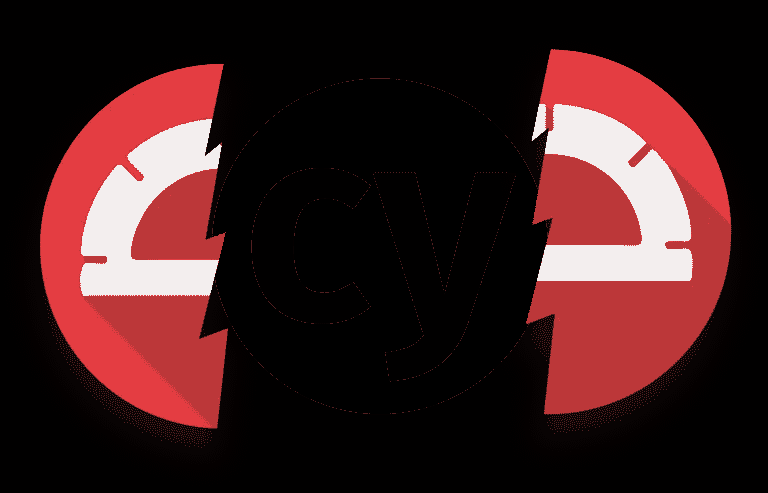
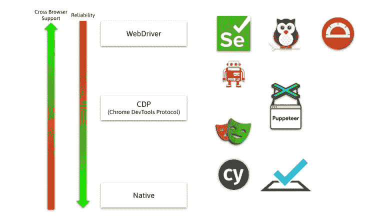
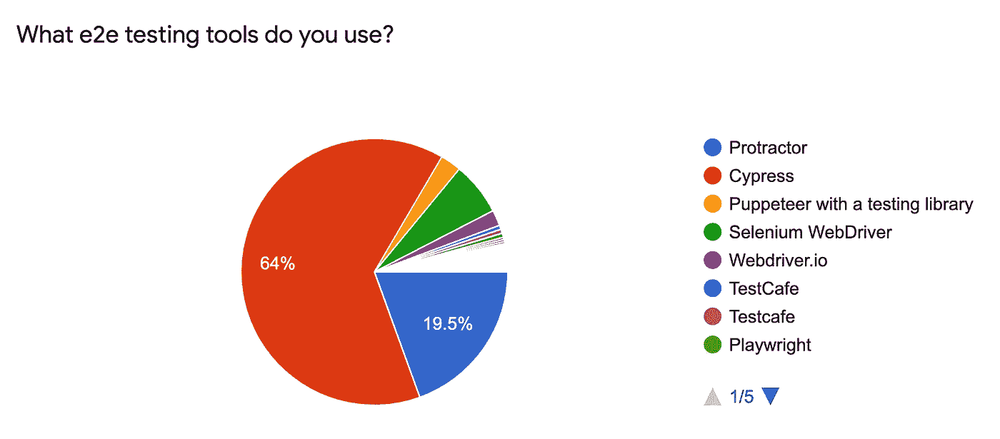

# 量角器死了，柏树万岁

> 原文：<https://betterprogramming.pub/protractor-is-dead-long-live-cypress-3f0c6bdd62e6>

## E2E 框架的前景正在发生变化

作者图片

4 月 24 日，Angular 宣布放弃他们的端到端(E2E)测试工具，量角器。目前还不清楚 Angular 是否会有一个继任者，或者是否会将这一任务委托给它的用户。在撰写本文时，WebDriver。IO、TestCafé和 Cypress 已经提出了 Angular CLI 的原理图。

在本文中，我将简要概述各种 E2E 框架之间的区别，并解释为什么应该使用 Cypress。在这篇文章的后续文章中，我将帮助您开始使用 Cypress。

如果你喜欢看而不喜欢读，那么我这篇演讲的录音是给你的。

# E2E 测试框架的前景

## 基于 web 驱动程序

我们可以将可用的工具大致分为两组:基于 WebDriver 的工具和基于 Chrome DevTools 协议(CDP)的工具。

Selenium 于 2004 年发布。它与一个叫做 WebDriver 的类似工具合并了。硒仍然是一个主要的玩家，量角器或多或少是它的包装。

有了 Selenium/WebDriver，开发人员就有了一个通用的 API 来自动化浏览器。每个受支持的浏览器都提供了一个驱动程序，WebDriver 使用它来使这些框架能够跨浏览器。这意味着您可以在 Safari、Chrome、移动浏览器等上运行相同的测试。

随着时间的推移，Selenium 中的核心技术 WebDriver 成为了 W3C 标准，这为其他供应商基于 WebDriver 创建自己的框架打开了大门。

不幸的是，基于 WebDriver 的测试名声不佳。如果在相同的情况下多次运行测试，它们可能会失败，也可能会成功。这对测试框架来说是非常糟糕的。你花了相当多的时间来构建应该保证应用程序稳定性的测试，然后你甚至不能相信测试的结果。

## Chrome DevTools 协议

两个相当受欢迎的选择是木偶师和剧作家。它们不依赖于 WebDriver，而是通过 Chrome DevTools 协议(CDP)直接与浏览器对话。这给了他们更好的控制，从而导致更稳定的测试。

CDP 绑定到基于 Chrome 的浏览器，包括 Chrome 和 Edge。尽管 Firefox 也支持 CDP，但 WebDriver 支持的那种跨浏览器测试是不可能的。

剧作家背后有一些木偶剧的原创开发者。因此，人们可以把剧作家看作是木偶戏的改写。它也使用 CDP，但也支持 Safari，因为它带有补丁浏览器。

WebdriverIO 是一个混合框架；它提供了对 CDP 和 WebDriver 的访问。

柏树属于哪一类？Cypress 依赖于 CDP，但是与木偶师不同，Cypress 只使用 CDP 来管理测试。测试本身根本不使用 CDP，而是直接在浏览器中运行。测试和浏览器之间不再有任何层。您的测试代码可以直接访问 DOM，而不是通过 CDP 或 WebDriver 间接访问，所以测试和应用程序代码是一体的。

碰巧的是，这与 Selenium 在与 WebDriver 合并之前采用的方法相同。看来历史重演了。

## 片状与跨浏览器

从一个非常高层次的角度来看，我们的测试和浏览器之间的抽象越多，测试就越容易变得古怪。另一方面，抽象使得跨浏览器测试变得更加容易。我们离浏览器越近，测试就越稳定。然而，我们必须承认，我们只能在一种特定的浏览器技术上运行测试，即 Chromium。

在未来，所有的浏览器都可能支持 CDP，或者即将到来的 WebDriver BiDi 将为 WebDriver 世界带来稳定性，但事情仍在发展。

E2E 框架的景观。图片作者。

# 为什么你应该使用柏树

首先，Cypress 不使用 WebDriver，而是直接在浏览器中运行测试。这些使得测试稳定可靠——这正是我们最初想要的。

第二个原因是开发经验(DX)。Cypress 的作者投入了大量的精力使其尽可能易于使用。这不仅仅意味着 API 易于使用。工具、社区工作，尤其是文档都棒极了。

好吧，所以柏树比量角器好。你为什么要选择赛普拉斯而不是其他 E2E 图书馆呢？

作为 Angular 开发人员，我们总是赞赏我们得到了一个“固执己见的框架”,它为我们预先选择了各种工具。虽然看起来 Angular 给 E2E 留下了空缺，但还有另一个大玩家:Nx。Nx 多年来一直为角度应用提供最好的工具。

Nx 是 CLI 的包装器。它最初是作为 MonoRepositories 的候选，但是多年来变得越来越像一个 Angular CLI++。事实上，如果我开始一个新的角度应用，我个人会选择 Nx。没有锁定，也没有开销。我只是得到了更好的工具，可以继续使用 Angular CLI。

你猜怎么着？Nx 用 Cypress 代替了量角器。所以 Nx 很注意 Angular 和 Cypress 的配合。

最后一个争论是 Cypress 在 Angular 开发者中的使用。在公开反对之前，Angular 做了一项调查。他们询问用户他们使用的是什么 E2E。那次调查显示 64%的人选择了柏树；你可以称之为政治上的压倒性胜利。请记住，那是量角器还是官方工具的时候！量角器最终只有 19%。

来源:https://github.com/angular/protractor/issues/5502

# 为什么你不应该使用柏树

根据您的使用情况，Cypress 可能不符合您的需求:

*   没有跨浏览器测试:如果你需要在 Safari、其他浏览器甚至移动设备上运行你的 E2E 测试，你需要使用另一个工具。柏树绝对是错误的选择。
*   在一个测试中切换域:如果您的应用程序跨越多个域，您也不会喜欢 Cypress。
*   切换标签:也不可能。

如果你想一想 Cypress 是如何工作的，这只是一个合乎逻辑的结果。测试在浏览器内部运行，如果你改变了 URL 或者标签，测试就会消失。

# 摘要

Cypress 为您提供了稳定性和出色的开发体验。大多数 Angular 开发者已经在使用它了。

如果您正在量角器中运行 E2E，现在是迁移的时候了！如果你到现在还没有写过《E2E 》,看看《赛普拉斯》。你会惊讶它是多么容易。

切换到 Cypress 意味着重写您的 E2E 测试。你可以用一种渐进的方式来做。柏树和量角器并不互相排斥；它们可以在同一个角度项目中运行。

请注意，Cypress 可能不符合您的需求。如果跨浏览器支持是绝对必须的，你应该看看像 WebDriverIO 和上面提到的其他浏览器。

# 进一步阅读

*   [网络驱动/远程协议](https://wiki.mozilla.org/WebDriver/RemoteProtocol)
*   [W3C 网络驱动协议](https://w3c.github.io/webdriver/webdriver-spec.html)
*   [角度 E2E 的未来&量角器计划发行#5502 角度/量角器](https://github.com/angular/protractor/issues/5502)
*   [自动化协议](https://webdriver.io/docs/automationProtocols)
*   [剧作家与木偶师](https://blog.logrocket.com/playwright-vs-puppeteer/)
*   [柏树与硒:为什么柏树是更好的选择](https://blog.logrocket.com/cypress-io-the-selenium-killer)
*   [什么是 Selenium RC:与 Webdriver 的区别](https://www.browserstack.com/guide/selenium-rc-tutorial)
*   [Nightwatch.js](https://nightwatchjs.org/gettingstarted/)
*   [赛普拉斯与其他参赛选手](https://glebbahmutov.com/blog/cypress-vs-other-test-runners/)
*   书:学习硒测试工具—第三版，Raghavendra Prasad MG

*原载于 2021 年 6 月 2 日*www.rainerhahnekamp.com