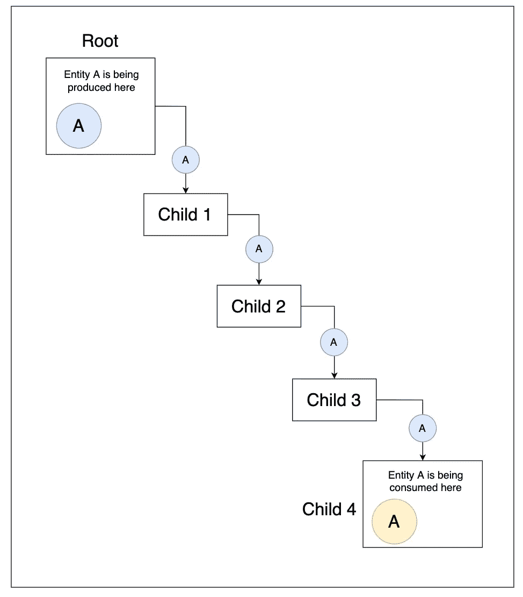
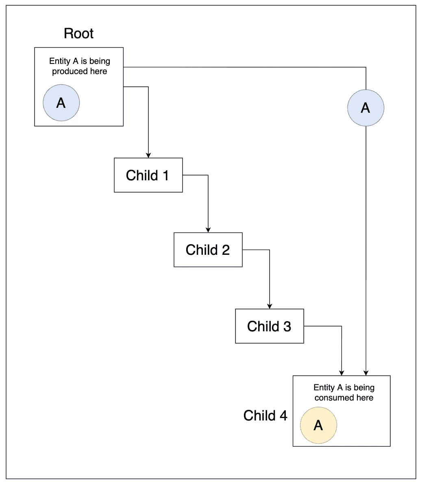
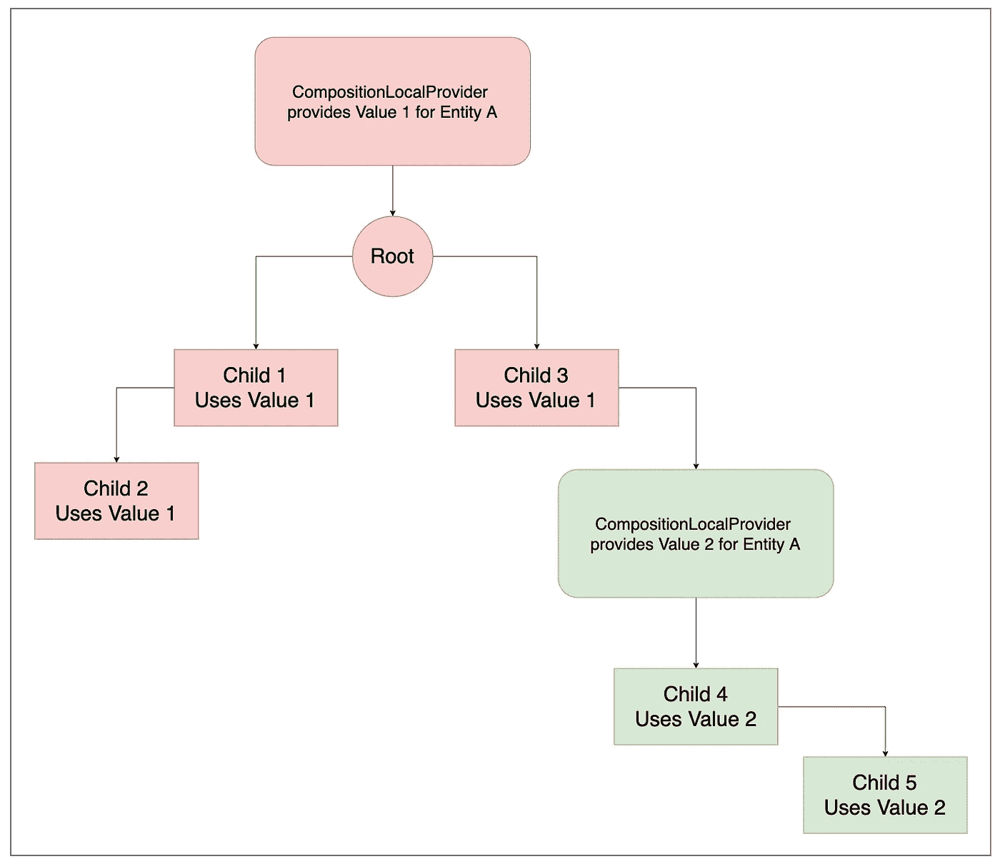

# Jetpack 撰写中的提供者模式

> 原文：<https://betterprogramming.pub/provider-pattern-in-jetpack-compose-bb4f4e27185e>

## 使用`CompositionLocalProvider`，将提供者模式引入 Jetpack Compose 领域

[Braňo](https://unsplash.com/@3dparadise?utm_source=medium&utm_medium=referral) 在 [Unsplash](https://unsplash.com?utm_source=medium&utm_medium=referral) 上拍照

# 介绍

自从模式转向将 Jetpack Compose 作为一个可靠的 UI 框架以来，现代 Android 应用程序的开发已经飞速发展。新的声明式和直观的 UI 框架正在帮助 Android 应用程序快速构建，并提高了性能。

Jetpack Compose 实际上有一个树状结构(例如，与 Flutter 中看到的一样)，其中我们指定所有要呈现的节点，并基于所提供的属性，在屏幕上绘制元素。

我们知道，属性或状态在树上向下传递到最后一个节点，生成的事件向上传播以便处理。这种模式有时会变得很乏味，必须传递某个实体，该实体只在较高的节点产生，沿着树向下传递到目标节点。

在本文中，我们将讨论这个问题，以及 Jetpack Compose 如何提供一个优雅的解决方案。

# 先决条件

我们在这里提到了 Jetpack Compose 的一个高级概念，以及一些“使用 Hilt 的依赖注入”概念。在阅读这篇文章的时候，最好有关于这些的基本知识。

# 理论

将下面的用例视为一个组合 UI 树:

根节点产生一个实体 A，它在第 4 级子节点(子节点 4)上被消费。a 不是单例的，因为它的实例不能从根节点之外的任何地方创建，所以创建的实例必须沿着树向下传递到子节点 4。在这种情况下，子节点 1 到 3 不必要地持有 A 的实例，这对这些节点没有用。我们想以某种方式直接从子 4 访问 A:

在 Flutter 中，这个问题可以通过使用 Provider 模式来解决，在这种模式下，可以在树中全局提供项目，然后可以从任何地方访问它。我们将看到如何在 Jetpack Compose 中实现这一点。

# 输入“CompositionLocalProvider”

`CompositionLocalProvider`可以提供对树中较高层的某个对象的引用，任何子代都可以直接访问提供的值。

这在内部使用了一个`CompositionLocal`，它的作用域是一个子树。如果我们将它放在 UI 树的根级别，它将覆盖下面的整个树，从而表现为一个全局提供者。

# 说暗号，伙计！

## 用例

我们在这里讨论的典型用例是，通过点击按钮，记录来自可组合函数的 Firebase 分析事件..

我们已经创建了一个由 Hilt 辅助的`AnalyticsManager`类，作为在应用程序中记录各种分析事件的抽象。在`ViewModel` 类中，这可以直接注入，但是当涉及到可组合函数时，我们不能在函数参数中直接注入这个类的实例。

## 声明组合本地

在按钮点击直接调用任何分析事件的记录的情况下(也就是说，不传递这个事件给`ViewModel`来处理)，我们需要提供一个`AnalyticsManager`的实例。现在，不要将这个实例在树中向下传递给有这样一个按钮的可组合组件，让我们看看如何使用一个`CompositionLocalProvider`来提供所需的实例:

在全局(静态)级别，我们为我们的`AnalyticsManager`类声明了一个`CompositionLocal`创建者，命名为`LocalAnalytics`。这是通过使用`staticCompositionLocalOf<T>`函数声明一个`StaticProvidableCompositionLocal`并提供一个默认初始值来实现的。这将创建一个`CompositionLocal`的静态实例，然后可以提供给 UI 树的相关部分。

> *ℹ️* 请注意，因为我们不能为我们的柄辅助`AnalyticsManager`类提供默认值，所以我们将它设置为空。在这种情况下，可以解决这个问题，因为我们稍后将设置一个适当的非空值。但是最好提供一个非空的缺省初始值。
> 
> *ℹ️* 我们可以用另一个函数`compositionLocalOf<T>`代替`staticCompositionLocalOf<T>`。它们的不同之处在于树是如何根据所提供的值的变化而重新呈现的。在[官方 Android 文档中阅读更多相关信息](https://developer.android.com/jetpack/compose/compositionlocal#creating-apis)。

## 为组合本地提供价值

我们的代码中有一个主要的`ComponentActivity`,它管理可组合的函数，处理导航等等，在这里我们可以注入`AnalyticsManager`类的初始实例，然后可以提供它..

我们已经使用了`CompositionLocalProvider`来提供我们注入的`AnalyticsManager`类的实例。该实例将替换初始的“null”值，并将提供一个有效值。请注意，我们在声明 UI 树之前已经声明了它，因此所提供的实例对于整个应用程序都是可用的。在这种情况下，我们使用了`provides`功能；我们可以添加更多这样的条款，以在全球范围内提供多个实体！

## 提供商的消费者

在消费者端，我们可以将提供的价值用作:

`LocalAnalytics`是一个静态声明的属性，我们可以通过使用`LocalAnalytics.current`来访问它的最新实例。由于我们已经将`AnalyticsManager`声明为可空，所以我们有一个空安全的访问，但是这并不是对所有情况都是正确的。请注意，我们没有向下传递任何参数，它都是全局提供的！

## 如果我们需要改变提供的值呢？

因为我们在 UI 树的根级别声明了我们的`CompositionLocalProvider`,所以整个树获得了提供的实例。但是我们可以通过在新的`CompositionLocalProvider`下包装一个子树来改变这个值。这样，下面的子树将使用最新的值，而先前的值将被覆盖。这只适用于被包装的子树；其余的其他节点将继续获取在根级别提供的值:

使用`CompositionLocalProvider`，我们将提供者模式引入了 Jetpack Compose 领域。关于任何特殊功能或模块的深入细节，您可以随时查看[官方组合本地文档](https://developer.android.com/jetpack/compose/compositionlocal)。