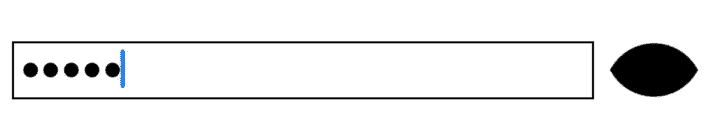
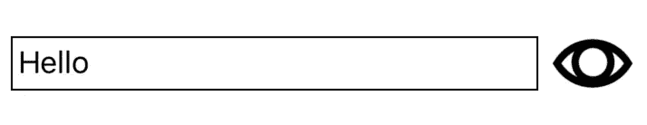
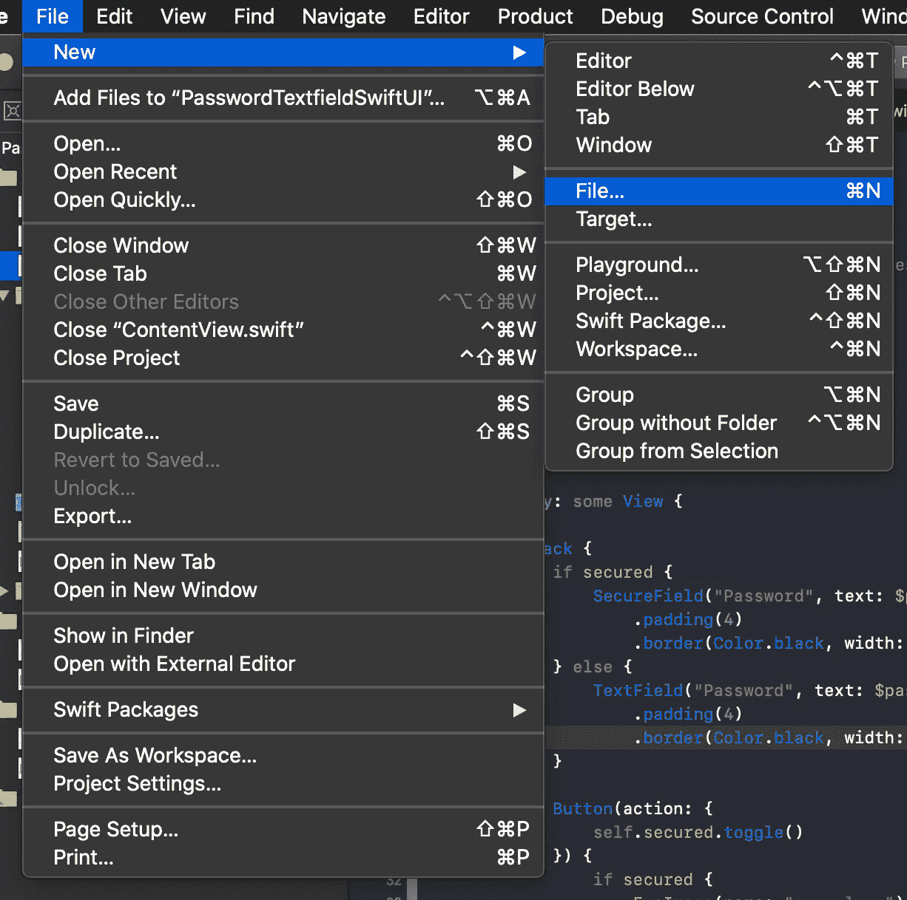

# 如何在 SwiftUI 中构建更好的密码输入

> 原文：<https://betterprogramming.pub/providing-a-convenient-way-to-enter-a-password-in-swiftui-2cf29adf042c>

## 在您的密码文本字段中添加显示/隐藏密码按钮

谢恩·艾弗里在 [Unsplash](https://unsplash.com/s/photos/password?utm_source=unsplash&utm_medium=referral&utm_content=creditCopyText) 上拍摄的照片

许多大型应用程序——如 YouTube、Twitter 和 Amazon——允许用户在需要输入密码时在安全文本字段和普通文本字段之间切换。这是一个很好的用户体验，因为你的用户需要多次尝试登录，仅仅因为他们有一个复杂的密码和一个拼写错误，这将是非常令人沮丧的。

在这篇文章中，我们将探索如何在 SwiftUI 中重新创建这个功能。首先，我们将看到如何使用`SecureField`来模糊输入的文本。接下来，我们将添加一个按钮，在这种文本字段和普通的将内容显示为纯文本的`TextField`之间切换。

下面的两张图片显示了本教程的最终结果:在左边的图片中，密码被遮住了，所以看不到，但是在右边的图片中，用户可以看到输入了什么。当密码不可读时，用于切换可见性的按钮将显示一个闭着的眼睛图标，当密码可读时，将显示一个睁开的眼睛图标。

添加一个按钮来显示和隐藏文本字段中的密码。左:密码隐藏。右:显示密码。来自[www.flaticon.com](http://www.flaticon.com/)的 [Freepik](https://www.flaticon.com/authors/freepik) 制作的图标。

# 履行

首先，让我们从添加一个新的 SwiftUI 视图开始。您可以通过文件→新建→文件…或按 Cmd+N 来添加新文件。

创建新的 SwiftUI 视图—添加新文件

接下来，您需要选择 SwiftUI 视图模板。您可以在名为“用户界面”的部分中找到它，或者使用过滤器文本字段找到它。

创建新的 SwiftUI 视图—选择 SwiftUI 视图模板

这将创建一个新的视图，它将显示一个简单的“Hello，World！”在一个标签里。从这个模板开始，我们可以开始设计和实现我们的 UI。首先，用以下内容替换默认结构的内容:

`// 1` —我们将使用两个代表州的属性。第一个是名为`password`的属性，它将保存输入的文本。下一个是`secured`，它会跟踪文本是否可读。

`// 2` —通过使用一个`HStack`，文本字段和按钮将被放置在一起。稍后，这两个元素都将在这个堆栈中定义。如果你愿意，你也可以使用`VStack`将它们放在一个垂直的堆栈中，或者使用`ZStack`将一个放在另一个的上面。

下一步是添加我们正在使用的两个文本字段:

`// 1` —在 SwiftUI 中，您可以简单地使用`if`根据条件显示不同的视图。`secured`的值将决定我们是使用模糊密码的`SecureField`还是普通的`TextField`。

`// 2` —显示一个`SecureField`就像调用初始化器并传入一个占位符文本(本例中为`Password`)和一个绑定一样简单。这里，我们将文本字段绑定到我们的属性`password`，这样输入的文本将被存储为该属性的值。我们还添加了填充和边框，使它看起来很漂亮。

`// 3` —在`else`分支中，我们处理`secured`为假的情况。在这种情况下，我们可以使用一个简单的`TextField`，其设置方式与之前的`SecureField`相同。

现在我们已经添加了文本字段，让我们添加按钮在它们之间切换:

`// 1` —按钮将采取一个动作并关闭定义视图。每当按钮被按下时，我们将通过调用`.toggle()`来翻转`secured`的值。

`// 2` —在这个例子中，我们可以将按钮的实际视图的定义移动到一个单独的 SwiftUI 视图中，使其可重用。因此，我们只需要检查`secured`的值，并用两个眼睛图像之一创建一个`EyeImage`。下一步我们会看到`EyeImage`的定义。

最后，让我们看看如何为`EyeImage`使用专用的 SwiftUI 视图:

`// 1`—`EyeImage`的一个实例可以通过将一个图像的名称传递给初始化器来构造。该名称将存储在属性`imageName`中。

`// 2` —我们将在`body`中使用这张图片。这是协议`View`要求的计算属性。这里我们创建一个新的`Image`，并通过设置它的颜色和大小来配置它。

# 结论

这就是让用户看到文本字段中输入的内容所需要做的一切。虽然与普通登录相比，这只是一个小小的改进，但这将防止他们感到沮丧——而且可能会让你的用户更高兴。这不就是一个 app 的真正目标吗？

这可能看起来像很多代码，但是，实际上，加在一起只有大约 45 行。SwiftUI 的简洁和表现力真的让人惊叹。你可以在这里找到[的全部文件](https://gist.github.com/DavidPiper94/ae4cc6048470faa8437223c61cb5bf44)。如果您不喜欢眼睛图标，您也可以使用任何其他图像，甚至使用简单的按钮在两个文本字段之间切换。

# 资源

这是我在这个例子中使用的两个眼睛图标。由 www.flaticon.com[的](http://www.flaticon.com/) [Freepik](https://www.flaticon.com/authors/freepik) 制造，可以在[flat icon](https://file000.flaticon.com/downloads/license/license.pdf)的许可下使用。

 [## leers auge kosten lose Vektor-Icons entworfen von free pik

### 在 SVG-、PSD-、PNG-、EPS-格式或 als 网络字体中加载这些 kostenlose 图标。Flaticon，die gréte daten bank…

www.flaticon.com](https://www.flaticon.com/de/kostenloses-icon/leeres-auge_14777)  [## 自由女神像

### 在 SVG-、PSD-、PNG-、EPS-格式或 als 网络字体中加载这些 kostenlose 图标。Flaticon，die gréte daten bank…

www.flaticon.com](https://www.flaticon.com/de/kostenloses-icon/geschlossenes-auge_13523)