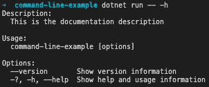
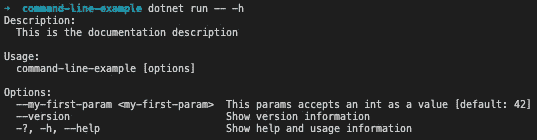
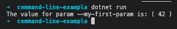
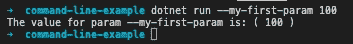
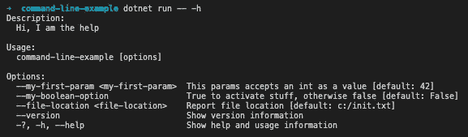
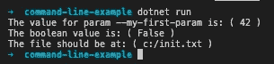
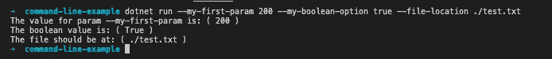

# 为您的控制台应用程序提供帮助

> 原文：<https://betterprogramming.pub/providing-help-to-your-console-apps-c686e2d5f6c1>

## 通过提供命令行应用程序信息和参数使用说明，让您的控制台应用程序用户更加轻松

照片由 [Yan Krukov](https://www.pexels.com/pt-br/@yankrukov?utm_content=attributionCopyText&utm_medium=referral&utm_source=pexels) 从 [Pexels](https://www.pexels.com/pt-br/foto/borrao-mancha-nevoa-morena-4458411/?utm_content=attributionCopyText&utm_medium=referral&utm_source=pexels) 拍摄

控制台应用程序(也称为命令行应用程序)是一种不提供 GUI(图形用户界面)的应用程序，用户交互仅通过命令文本进行，大多数控制台应用程序(如 grep、curl 和 git)都有大量的文档，提供有关参数的使用方法信息，避免用户必须搜索其他来源来了解如何使用该应用程序。

创建控制台应用程序是一项非常常见的任务，但为所有参数添加自定义帮助文本可能是一项非常痛苦的任务，我甚至可以说，我过去使用的大多数控制台应用程序都没有为用户提供任何帮助，迫使他们检查源代码或外部文档才能使用它。

幸运的是,`System.CommandLine`工具为我们的。net 核心应用程序，它的使用很简单，正如你在我将要展示的下一步中所看到的。

# 创建控制台应用程序

要创建新的应用程序，运行命令`dotnet new console -n command-line-example`，它将在新的命令行示例文件夹中创建一个新的控制台应用程序，然后运行`cd command-line-example`来访问项目并使用`dotnet run`运行

# 系统。命令行

[系统。命令行](https://github.com/dotnet/command-line-api/blob/main/docs/Your-first-app-with-System-CommandLine.md)包提供了一个行解析器、命令行帮助文档和其他特性。

要将它添加到项目中，只需运行`dotnet add package System.CommandLine — prerelease`，它就会被下载并安装。

# 添加应用程序帮助描述

当在执行中提供`-h`或`-help`时，刚刚创建的应用程序不会显示任何信息，但`RootCommand`类将允许轻松地向应用程序添加描述，如下所示:

添加应用描述

运行`dotnet run -- -h`将显示应用描述

控制台应用程序帮助文本描述

# 添加参数帮助信息

现在让我们添加新的参数，并为其提供解析和帮助文本，我将首先尝试一个整数。

我们可以使用有几个构造函数的`System.CommandLine.Option<T>`泛型类来做到这一点，我选择了一个非常普通的构造函数，在这里我们传递它的游戏，一个带有默认值的函数，最后是它的描述。

添加参数描述

现在运行`dotnet run -- -h`也会显示参数帮助文本。

应用程序和参数帮助信息

要访问参数，我们可以使用`SetHandler`方法，它有许多签名，最常见的是接受一个动作，然后输入参数列表。

处理输入参数值

正如我们在下面看到的，用`dotnet run`命令运行应用程序将显示所提供的输入值的默认参数值。

使用默认参数值

提供输入参数

我们可以创建其他参数并以同样的方式使用它们，下面我们可以看到添加一个布尔值和一个系统后的完整代码。IO.FileInfo 参数:

现在`-h`选项将显示其他参数

当不提供输入参数时，将使用所有默认值

默认值

并且，将使用提供的值而不是默认值:

提供的输入值

# 火龙果

[火龙果项目](https://www.nuget.org/packages/System.CommandLine.DragonFruit)为`System.CommandLine`提供了一个实验模型，我们可以完全像以前那样做，但要简单得多，如果你喜欢简单，这可能是一个很好的选择。

# 了解更多信息

像往常一样，我刚刚解释了使用该工具的一个非常简单的方法，要了解更多信息，只需深入了解[系统。命令行](https://github.com/dotnet/command-line-api/blob/main/docs/Your-first-app-with-System-CommandLine.md)文档，玩得开心。

我希望这篇文章能帮助你改进你的项目，让你的用户生活更轻松，谢谢你的阅读，下次再见。