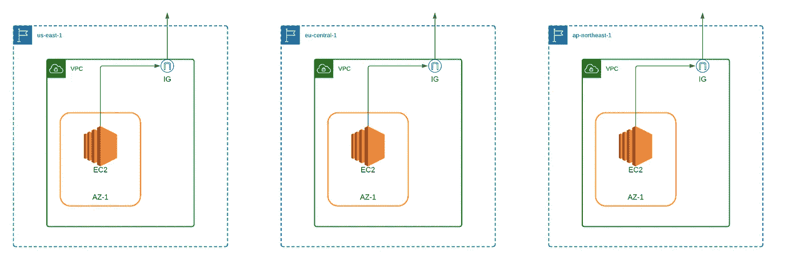

# 使用 Terraform 调配您的云基础架构

> 原文：<https://betterprogramming.pub/provision-your-cloud-infrastructure-with-terraform-7b581b8fe38f>

## AWS 上的多区域基础设施



多区域基础设施(图片来源:作者)

基础设施即代码的概念允许您以声明的方式管理整个云基础设施。AWS 提供 CloudFormation 服务，以自动方式使用文本文件或编程语言对整个基础设施和应用程序资源进行建模。尽管它很容易学习和使用，但它的主要缺点是它只与 AWS 相关，如果您管理的是由部署在 AWS、Azure、Google Cloud 等中的应用程序组成的多云基础架构。，那么您将使用 Terraform 在整个云中以安全和可重复的方式构建、更改和管理基础架构。

在本文中，将向您介绍 Terraform 允许您通过其配置语言 HCL 定义基础设施的方式。之后，我们将对 AWS 上的多区域基础设施进行建模和应用更改，该基础设施将由多个定制 VPC 和 ec2 组成。

# **地形介绍**

使用 Terraform 的起点是按照 HashiCorp 官方网站的说明进行安装。安装完成后，您需要创建一个空目录和一个`.tf`文件，文件名由您选择。您将使用该文件来定义整个云基础架构，但我们很快就会谈到这一点。

创建新项目时，Terraform 会创建一个状态文件。此本地状态用于创建计划和对您的基础架构进行更改，它是将配置更改与所调配的基础架构相匹配的唯一事实来源。在任何操作之前，Terraform 都会进行刷新，以更新真实云基础架构的状态。

要创建状态，您需要通过调用`terraform init`命令，在创建`.tf`文件的同一个目录中初始化一个新的 Terraform 项目。

现在，我们可以通过理解 Terraform 的工作原理来开始定义架构。Terraform 基础设施声明的起始构建块是一个*提供者*，它是一个提供资源类型集合的插件。提供商通常提供资源来管理单个云或内部基础架构平台。提供程序与 Terraform 本身是分开分发的，但是 Terraform 可以在初始化工作目录时自动安装大多数提供程序。我们将专注于 AWS，所以我们需要的提供者是 AWS 插件，配置如下所示。

在我们深入研究之前，您可能会想:既然 Terraform 需要与 AWS 帐户进行交互，以便提供所需的架构，我们难道不应该为此指定一些访问键吗？

当然啦！您需要通过 IAM 控制台创建一个具有编程访问权限的新用户，并在安装 Terraform 的同一台计算机上下载和安装 AWS CLI。然后，您需要使用 `**aws configure — profile terraform**`配置 AWS 凭证，并输入关于您刚刚创建的访问键的相应数据。您可以通过在提供者中指定凭据配置文件来指示 Terraform 使用这些凭据。

下一步是开始调配基础架构。首先，我们将按照以下步骤自下而上定义基础架构:

*   创建自定义 VPC
*   创建自定义子网
*   创建互联网网关并连接到 VPC
*   创建路由表，关联 IGW 和自定义子网
*   使用 HTTP 和 SSH 规则创建自定义安全组
*   创建密钥对以安全地登录到 EC2 实例
*   创建 EC2 实例

现在首先想到的是，我们不能以任何顺序提供这些资源:我们首先需要创建一个定制的 VPC，以便在那个 VPC 中启动 EC2 实例。Terraform 使这变得非常容易:我们可以通过将资源与以前提供的资源的 id 相链接来指定资源之间的隐式依赖关系。

## A.创建自定义 VPC

作为第一步，我们将通过指定`cidr_block`和其他选项来创建自定义 VPC，以便在该 VPC 中启用 DNS 解析。我们通过创建一个 Terraform 资源来实现这一点，这个资源的定义如下:`RESOURCE_FROM_PROVIDER RESOURCE_NAME RESOURCE_CONFIG`

因为我们只处理 aws 资源，所以 RESOURCE_FROM_PROVIDER 将以前缀“AWS”开头下面的代码演示了 VPC 的定义。

```
resource "aws_vpc" "custom-vpc-1" {

  cidr_block = "10.0.0.0/16"

  enable_dns_support = true

  enable_dns_hostnames = true

}
```

## B.创建自定义子网

通过指定关于 VPC 的这些细节，Terraform 无法在资源实际初始化之前推断出其唯一的随机 ID，因此为了指定依赖资源，我们将引用 VPC ID，如下面的代码片段所示，用于定义自定义子网。通过说明`vpc_id = aws_vpc.vpc-1.id`，我们定义了一个隐含的依赖关系，即 VPC 必须在子网之前创建。

```
resource "aws_subnet" "custom-subnet-1" {

  cidr_block = "10.0.1.0/24"

  vpc_id = aws_vpc.vpc-1.id

  map_public_ip_on_launch = true

}
```

## C.创建互联网网关

下面的代码片段显示了 internet 网关的定义及其对先前定义的 VPC 的附件。

```
resource "aws_internet_gateway" "custom-igw-1" {

  vpc_id = aws_vpc.custom-vpc-1.id

}
```

## D.创建并关联自定义路由表

如您所知，创建 VPC 时，会创建默认路由表，但我们不会对其进行修改。相反，我们将创建一个新的自定义路由表，并将其与 internet 网关和自定义子网相关联。我们可以这样做，首先创建一个路由表，添加一个指向网关的自定义路由`0.0.0.0/0`，然后创建一个路由关联，将自定义子网与它关联起来。

## E.使用 HTTP 和 SSH 规则创建自定义安全组

下一步是创建一个 EC2 实例，我们可以通过最少的配置轻松完成——它将创建一个默认的安全组。但是我们希望定义一个定制的安全组，允许 HTTP 和 SSH 流量到达它所连接的任何实例。我们使用下面的代码片段来实现:

首先，我们将安全组与自定义 VPC 相关联，并定义入口规则以允许来自端口 22(对于您的系统，不允许来自端口 22 上任何地方的流量，因为这是一个安全会议)和端口 80 的流量。我们还需要提供出口规则，以允许 EC2 实例与互联网对话。

## F.创建密钥对以安全登录 EC2 实例

作为定义 EC2 实例的最后一步，我们需要使用 RSA 架构定义一个密钥对，以允许我们 SSH 到实例中。我们可以这样做，首先在本地生成一个公钥和私钥(使用`ssh-keygen`)，然后使用下面的代码片段定义密钥对。

```
resource "aws_key_pair" "custom -kp1" {

  key_name = "terraform-key"

  public_key = "PASTE_PUBLIC_KEY_HERE"

}
```

## G.创建 EC2 实例

现在，我们准备在自定义 VPC 内的自定义子网中创建 EC2 实例。这里有几件事要记住:

*   `ami` —对于每个实例，您必须指定您将使用的 AMI 的 ID。您可以在 AWS 控制台中获得这一信息，但是请注意，您可以在特定区域使用相同的 AMI。
*   `instance type` —这是将用于启动 EC2 的实例类型。在本例中，我们选择`t2.micro`，它符合自由层条件。

下面的代码片段显示了 EC2 实例的定义以及它分别与之前定义的子网、安全组和密钥对的关联。

现在，您已经准备好部署基础设施了，但是在此之前，您需要使用`terraform plan`命令检查哪些更改将应用于您的帐户。该命令的输出如下所示:

您可以看到输出中列出了实例的属性及其值。声明为“应用后已知”的值表示它们将仅在基础架构中预配资源后生成。

一旦您确认 Terraform 计划中的一切正常，您就可以使用`terraform apply`命令部署基础设施。这应该需要几秒或几分钟的时间，您可以注意到 AWS 帐户中所有新创建的组件。

注意:为了在进行成本分析时更好地识别资源，给所有资源添加标签是个好主意。

# **定义多区域基础设施**

既然我们已经完成了单个区域架构的定义，我们可以轻松地继续在多个区域中定义相同的架构。原因可能是您想要构建一个全球性的弹性架构，在多个地区复制，并且您可以向 Route53 添加一个加权策略，以便在不同地区平等地路由流量。但是我们将把 Route53 配置留给另一篇文章，尽管它使用起来很简单。

正如您所提到的，我们在 Terraform 的开始定义了一个 AWS 提供者，声明了 region `us-east-1`。现在我们还想在另外两个地区部署资源，`eu-central-1`和`ap-northeast-1`，我们需要为每个地区定义提供商。

请注意，您只能有一个具有相同名称和别名组合的提供者。我们可以为每个地区定义更多具有不同别名的提供者。并且在定义资源时，我们可以使用方案 PROFILE_NAME 引用特定的概要文件。别名(如`aws.eu`)。按照这个逻辑，我们可以简单地复制和粘贴资源，并为每个资源指定各自的概要文件。

对于剩余的资源，您可以遵循相同的逻辑。然而，我想指出一个简单层次的可重用性，这在为不同区域定义安全组时会很方便。

由于安全组可以生活在特定的地区和 VPC，我们需要为每个地区创建安全组。这些安全组将拥有相同的入口和出口规则，因此我们需要重用这些代码。

在 Terraform 中，我们可以定义变量，并在整个代码中引用这些变量。这就是为什么我们将在变量中定义入口和出口规则，如下所示。变量定义非常简单，在`default`块中指定数据，在`type`块中指定数据类型。

一旦定义了变量，我们就可以在为动态块中的每个区域定义安全组时引用它们，如下所示:

你可以在下面的要点中找到完整的代码:

现在，您可以使用`terraform plan`命令来检查将应用于您已经拥有的单个区域基础架构的更改，一旦您确认一切正常，您就可以继续使用`terraform apply`来供应剩余的资源。

# **破坏基础设施**

摧毁基础设施很容易。您可以简单地使用`terraform destroy`命令来完成，这将销毁所有已配置的资源。

我希望您喜欢这篇文章，并且它确实帮助您开始使用 Terraform 来管理您的云基础设施。敬请关注更多 Terraform 文章。

保重。