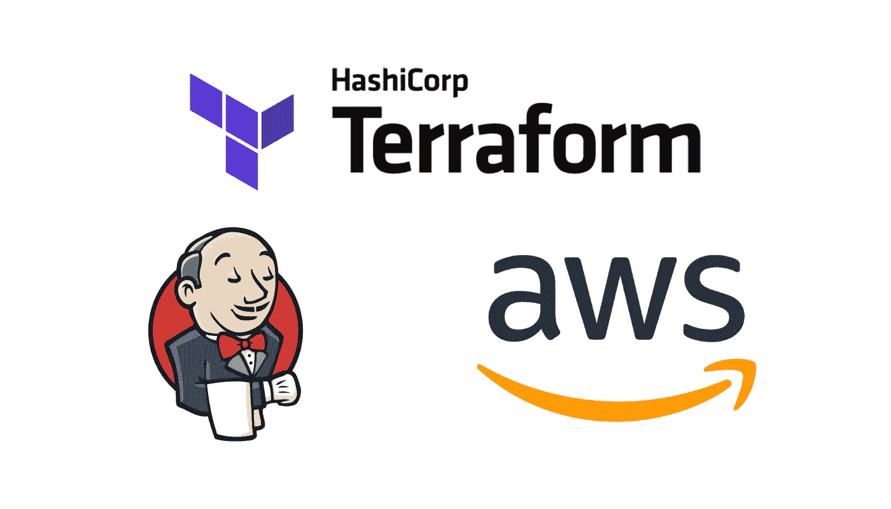
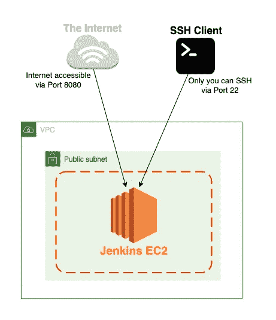
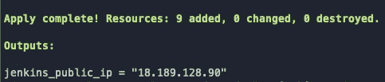
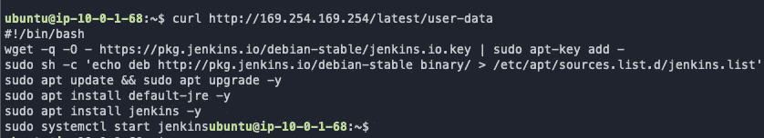
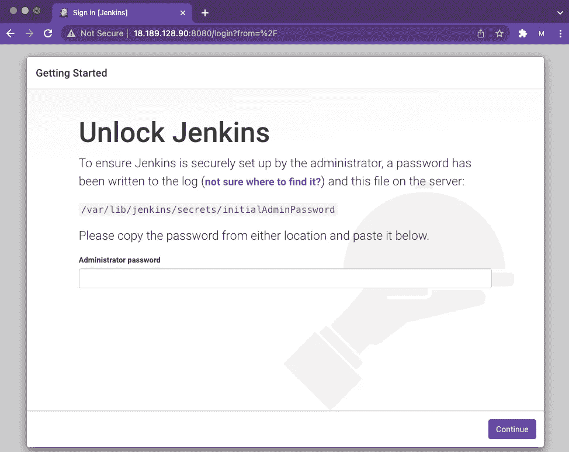

# 使用 Terraform 在 AWS 上配置 Jenkins 服务器

> 原文：<https://betterprogramming.pub/provisioning-a-jenkins-server-on-aws-using-terraform-4cd1351b5d5f>

## 在本教程中，我们将使用 Terraform 在 AWS 中配置 Jenkins 服务器。



# 背景

## 方案

您的团队一直在本地使用 Jenkins 服务器作为 CI/CD 渠道，现在希望将其迁移到云中。你的任务是在 AWS 上设置一个 Jenkins 服务器。

## 要求

*   Jenkins 服务器必须部署在 EC2 实例上
*   EC2 实例应该可以通过互联网的端口 8080 进行访问
*   应该只有您能够通过 SSH 访问 EC2 实例
*   将 Terraform 用于基础设施作为代码

## **我们将如何使用 Terraform 完成这项任务？**

1.  创造 VPC
2.  创建 Internet 网关，并使用路由表将其连接到 VPC
3.  创建一个公共子网，并将其与路由表相关联
4.  为 EC2 实例创建一个安全组
5.  创建一个脚本，在 EC2 实例上自动安装 Jenkins
6.  创建 EC2 实例，并为其附加一个弹性 IP 和密钥对
7.  验证一切正常

## 先决条件

*   安装并配置 AWS CLI
*   [地形](https://www.terraform.io/downloads)安装完毕



通过本教程，我们将在 AWS 中创建的架构图

# 设置项目目录

首先，我们需要建立我们的目录。这就是该说的都说了，该做的都做了之后的样子。

```
terraform-jenkins/
├─ main.tf
├─ outputs.tf
├─ secrets.tfvars
├─ modules/
│  ├─ compute/
│  │  ├─ main.tf
│  │  ├─ outputs.tf
│  │  ├─ install_jenkins.sh
│  ├─ security_group/
│  │  ├─ main.tf
│  │  ├─ outputs.tf
│  ├─ vpc/
│  │  ├─ main.tf
│  │  ├─ outputs.tf
```

您可以运行以下命令从上面创建目录结构:

```
mkdir -p terraform-jenkins/modules/{compute,security_group,vpc} && cd terraform-jenkins && touch main.tf outputs.tf secrets.tfvars && cd modules/compute && touch main.tf outputs.tf install_jenkins.sh && cd ../security_group && touch main.tf outputs.tf && cd ../vpc && touch main.tf outputs.tf
```

继续在你最喜欢的 IDE 中打开 **terraform-jenkins** 文件夹。现在让我们从填写变量和秘密文件开始。

## 变量和秘密

打开 **variables.tf** 并用以下代码填充:

现在打开`secrets.tfvars`并填入以下内容:

```
my_ip="0.0.0.0" // replace 0.0.0.0 with your IP address
```

# 配置地形

既然已经创建了变量和秘密，我们可以开始处理我们的模块了。

## 第一步——创建 VPC

打开文件`./modules/vpc/main.tf` 并填写以下代码:

## 第二步—创建互联网网关，并使用路由表将其连接到 VPC

既然 VPC 已经创建，我们需要让它访问互联网。我们将创建一个互联网网关和一个路由表。在文件`./modules/vpc/main.tf` **，**里面添加以下内容:

## 第三步—创建一个公共子网，并将其与路由表相关联

现在我们已经创建了路由表和 internet 网关，VPC 可以访问 Internet 了。现在，我们需要做的就是创建我们的公共子网，并将其与我们的公共路由表相关联，以便它可以访问 internet。在文件`./modules/vpc/main.tf`中，添加以下代码:

这就是我们建立 VPC 的目的。我们还有最后一件事要做，那就是创建一些输出。打开文件`./modules/vpc/outputs.tf` ，添加以下代码:

## 第四步—为 EC2 实例创建一个安全组

我们的 VPC 已经设置和配置好了。现在让我们转到 EC2 实例的安全组。打开`./modules/security_group/main.tf` 文件，添加以下代码:

这就是我们创建安全组的目的，现在让我们向我们的`./modules/security_group/outputs.tf` 文件添加一个输出:

## 第五步——创建一个脚本，在 EC2 实例上自动安装 Jenkins

在我们开始处理 EC2 实例之前，让我们创建 bash 脚本，我们将使用它来自动安装 Jenkins。我们将把它作为用户数据附加到 EC2 实例，这将在创建 EC2 实例时运行。打开`./modules/compute/install_jenkins.sh`，添加以下代码:

## 第六步——创建 EC2 实例，并为其附加一个弹性 IP 和密钥对

在我们开始创建 EC2 实例和弹性 IP 之前，让我们快速创建我们的密钥对。运行以下命令创建密钥对:

```
ssh-keygen -t rsa -b 4096 -m pem -f tutorial_kp && mv tutorial_kp.pub modules/compute/tutorial_kp.pub && mv tutorial_kp tutorial_kp.pem && chmod 400 tutorial_kp.pem
```

太好了。现在已经创建了密钥对，让我们创建 EC2 实例和弹性 IP。打开`./modules/compute/main.tf`并添加以下代码:

我们快完成了！让我们在`./modules/compute/outputs.tf` 文件中创建一个输出。这个输出将输出我们 EC2 实例的公共 IP 地址。

## 第 7 步—验证一切正常

让我们初始化我们的 terraform 项目。

```
terraform init 
```

现在让我们运行我们的 terraform 项目。

```
terraform apply -var-file="secrets.tfvars"
```

出现提示时，输入:Yes

如果成功，您应该会看到类似这样的内容:



太棒了。标记为“jenkins_public_ip”的 ip 地址是我们的 jenkins 服务器的 IP 地址。让我们看看是否可以 SSH 到我们的 EC2 实例。

```
ssh -i tutorial_kp.pem ubuntu@$(terraform output -raw jenkins_public_ip)
```

我们进去了。让我们检查一下我们的用户数据脚本是否正在运行。

```
curl http://169.254.169.254/latest/user-data
```



果然是这样！现在，让我们看看是否可以从 web 浏览器访问 Jenkins 服务器。在地址栏中输入 IP 地址，后跟:8080



瞧，就是这样！如果您想从 EC2 实例获取管理员密码，回到终端并运行以下命令:

```
sudo cat /var/lib/jenkins/secrets/initialAdminPassword
```

这将为您提供 Jenkins 服务器的管理员密码，并允许您继续设置过程。

## 拆毁

为了确保 AWS 不会产生任何不必要的费用，请继续运行以下命令:

```
terraform destroy -var-file="secrets.tfvars"
```

出现提示时，输入:Yes

如果您在本教程中有任何问题，您可以在这里将您的代码与 GitHub repo 进行比较:[https://github.com/dispact/terraform-jenkins](https://github.com/dispact/terraform-jenkins.git)

# 恭喜你！

哇哦，你做到了！在本教程中，您学习了如何使用 Terraform 和利用基础设施作为代码，在 AWS 上的自定义 VPC 内的 EC2 实例上创建 Jenkins 服务器。