# 从 Docker 向 Kubernetes 提供 Postgres

> 原文：<https://betterprogramming.pub/provisioning-postgres-from-docker-to-kubernetes-48b812d4b67a>

## 在 Kubernetes 吊舱中部署 Postgres

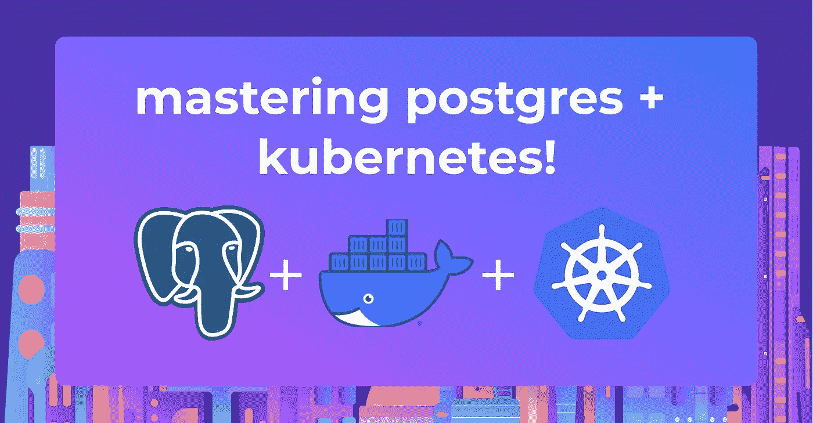

在这篇文章中，我们将看到如何使用 Docker 创建一个 [Postgres 容器，并在不丢失数据的情况下重启 Postgres 容器。在本文的最后，我们将在 Kubernetes pods 中部署 Postgres，并使用 ConfigMaps 和 StatefulSets 进行定制部署。](https://arctype.com/postgres/install/docker-mac-postgres)

# 为什么要使用容器化的数据库？

与简单地将数据库安装在服务器上相比，为数据库创建容器似乎会增加不必要的开销。然而，它允许用户将容器的所有优点带到他们的数据库中。

## **将数据和数据库分开**

容器化允许用户分离数据库应用程序和数据。因此，它提高了容错能力，使用户能够在应用程序出现故障时启动新的容器，而不会影响底层数据。此外，容器化还允许用户相对容易地扩展和增加数据库的可用性。

## **便携性**

容器的可移植性有助于用户将数据库部署和迁移到任何受支持的容器化环境中，而无需更改任何基础设施或配置。它们还使用户能够对数据库应用程序进行配置更改，而对生产环境中的底层数据影响很小甚至没有影响。此外，这些容器可以提高资源利用率，降低总体成本，因为[与虚拟机](https://www.atlassian.com/continuous-delivery/microservices/containers-vs-vms#:~:text=The%20key%20differentiator%20between%20containers,above%20the%20operating%20system%20level.)等其他解决方案相比，它们本质上是轻量级的。

# 创建容器化的数据库

首先，我们需要一个图像作为容器的基础。虽然我们可以从头开始创建一个映像，但在大多数情况下这是不必要的，因为像 Postgres 这样的常用软件提供了官方容器映像，并带有定制容器的选项。因此，我们将使用 Docker hub 中的[官方 Postgres 映像来创建这个数据库容器。](https://hub.docker.com/_/postgres)

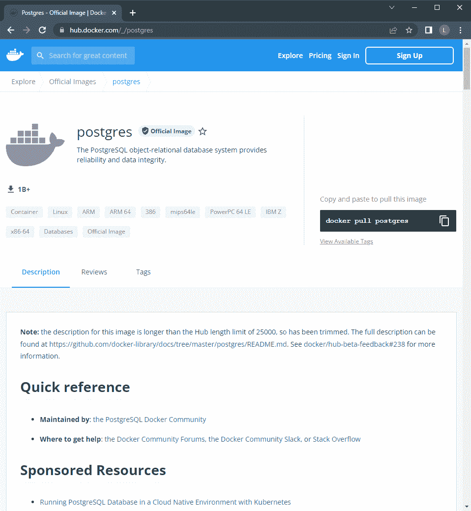

接下来呢。创建容器配置的时间。这可以通过 docker-compose 文件轻松完成[。](https://docs.docker.com/get-started/08_using_compose/#:~:text=Docker%20Compose%20is%20a%20tool,or%20tear%20it%20all%20down.)

```
version: '3.1'
services:
	postgres-db:
		container_name: postgres-db
		image: postgres:latest
		restart: always
		environment:
			POSTGRES_USER: testadmin
			POSTGRES_PASSWORD: test123
			POSTGRES_DB: testdb
			PGDATA: /var/lib/postgresql/data/pgdata
		volumes:
			- postgres-db-data:/var/lib/postgresql/data
		ports:
			- 5432:5432
volumes:
	postgres-db-data:
		name: postgres-db-data
```

在上面的配置中，我们创建了一个 docker 卷来存储 Postgres 数据。由于该卷可重复使用，因此即使容器被移除，您也可以恢复底层数据。对于 Postgres 容器，我们使用最新的 Postgres 映像和环境变量来设置容器中的用户、密码、数据库和数据位置。在卷部分，我们将内部容器数据位置映射到我们的卷，并公开端口 5432。

一旦创建了文件，我们就可以运行`docker-compose up`命令来启动容器。

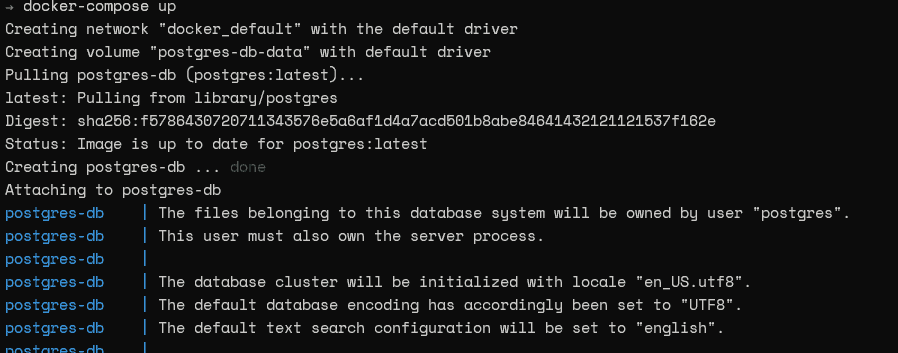

接下来，我们可以运行`docker ps`命令来查看容器是否成功运行。

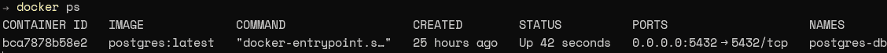

就是这样。我们成功地创建了一个集装箱化的 Postgres 数据库。有用吗？我们可以通过一个 SQL 客户端连接到数据库来验证这一点。因此，让我们使用 [Arctype SQL 客户端](https://arctype.com/)来初始化一个测试连接。首先，提供数据库连接的详细信息。在这个实例中，我们将使用 Docker 主机的 IP、端口和创建容器时提供的凭证。然后，正如您在下图中看到的，我们可以成功地初始化到数据库的连接。

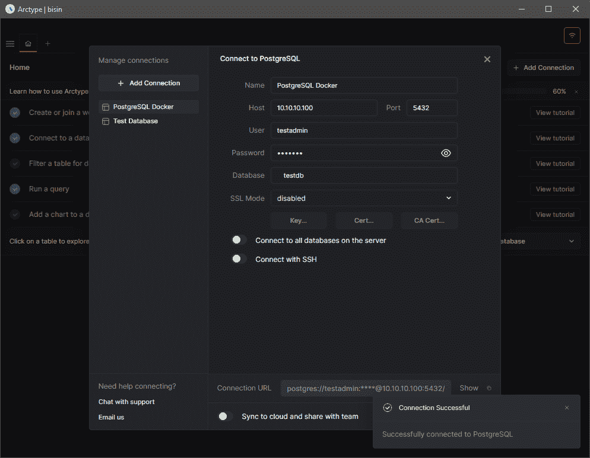

# 创建可重复的配置

如前所述，容器允许用户将数据库数据从应用程序中分离出来，并实现可重复的配置。例如，假设您在数据库软件中遇到了一个错误。在传统安装中，这可能会导致灾难性的后果，因为数据和应用程序是绑定在一起的。甚至回滚也是不可能的，因为它们会导致数据丢失。但是，容器化允许您删除出错的容器，启动新的实例，并立即访问数据。

让我们在实践中看看这个场景。首先，让我们[创建一个名为`test_data_table`的表](https://docs.arctype.com/managing-tables/view-table-schema#view-and-edit-full-table-schema)，并使用 Arctype 客户端向其中插入一些记录。

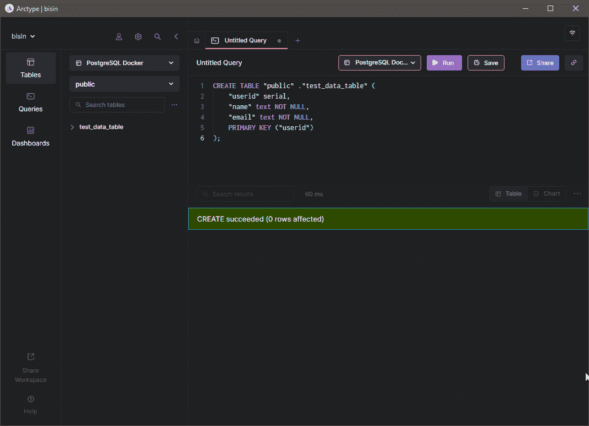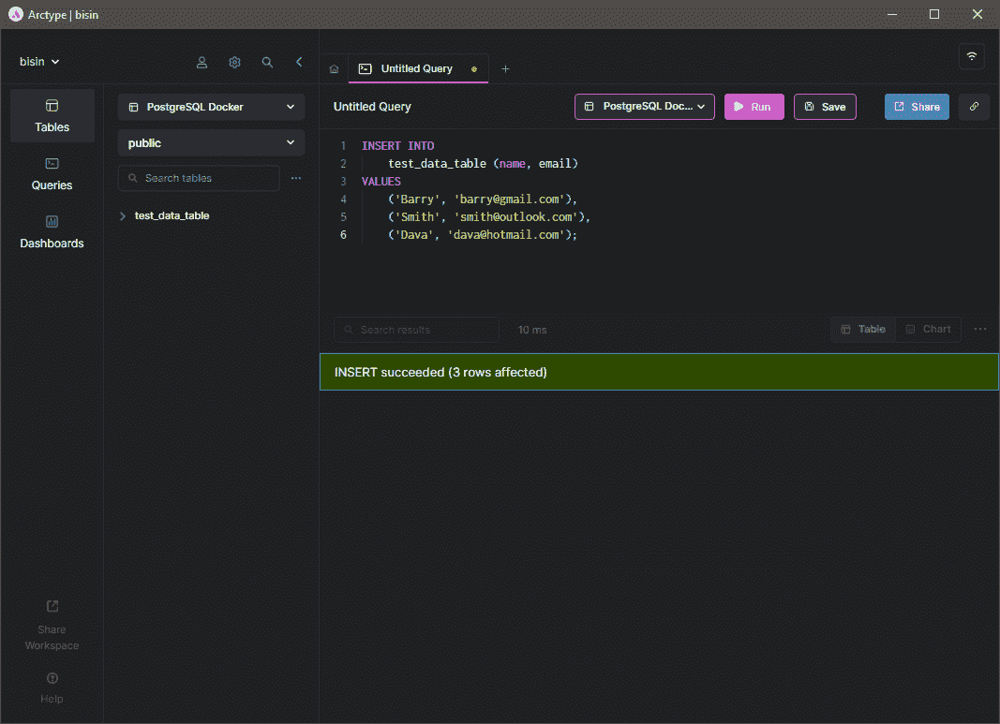

现在我们在数据库中有了一些数据。让我们使用 docker-compose down 命令删除容器，这将从 docker 环境中删除容器。

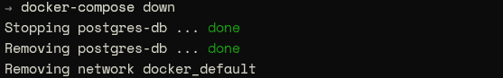

***注意—*** *删除容器时，SQL 客户端会显示一个错误，说连接被拒绝。*

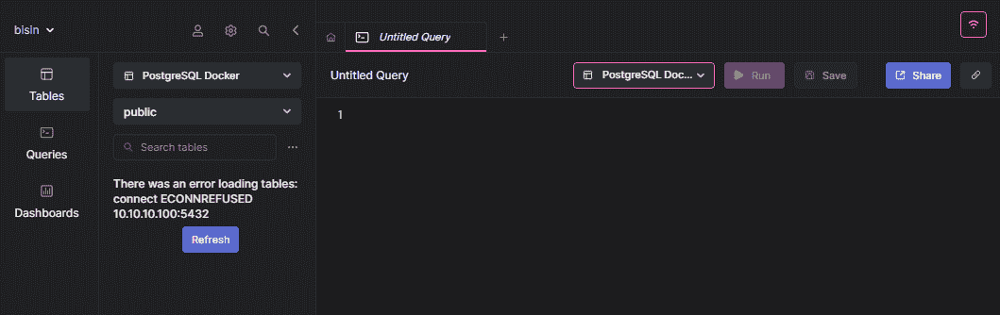

接下来，让我们对合成文件做一点小小的修改，以更改容器的名称。

```
version: '3.1'
services:
	postgres-db:
		# New Container
		container_name: postgres-db-new
		image: postgres:latest
		restart: always
		environment:
			POSTGRES_USER: testadmin
			POSTGRES_PASSWORD: test123
			POSTGRES_DB: testdb
			PGDATA: /var/lib/postgresql/data/pgdata
		volumes:
		- postgres-db-data:/var/lib/postgresql/data
		ports:
		- 5432:5432
volumes:
	postgres-db-data:
		name: postgres-db-data
```

接下来，再次旋转容器，并使用`docker ps`命令验证它是否正在运行。

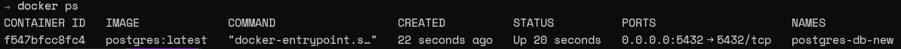

刷新 Arctype 客户端中的表以重新建立连接。然后运行一个简单的 SELECT 命令来查询`test_data_table`中的数据，如下所示。

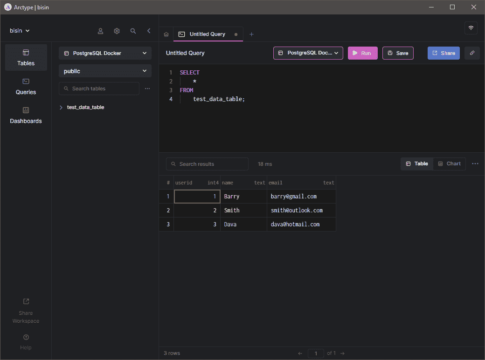

如您所见，即使容器被移除，我们也可以重新创建容器并访问数据。

# 使用 Kubernetes 管理容器

对于本地开发环境，甚至是在生产环境中运行一些容器，Docker 都是一个很好的选择。然而，由于大多数生产环境由许多容器组成，快速管理它们变得不可行。这就是像 Kubernetes 这样的编排平台发挥作用的地方，它提供了一个完整的功能丰富的容器编排平台来大规模管理容器。

在 Kubernetes 中部署 Postgres 容器的最佳方式是使用 StatefulSet。It [使用户能够供应有状态的应用](https://kubernetes.io/docs/tutorials/stateful-application/basic-stateful-set/)，并配置持久存储、唯一网络标识符、自动滚动更新、有序部署和扩展。所有这些特性都是促进像数据库这样的有状态应用程序所必需的。本节将介绍如何在 K8s 集群中部署 Postgres 容器。

# 创建和部署 Postgres Pod

对于这个部署，我们将创建一个`configmap`来存储我们的环境变量、一个在集群外部公开数据库的服务以及 Postgres Pod 的 StatefulSet。

```
# PostgreSQL StatefulSet ConfigMap
apiVersion: v1
kind: ConfigMap
metadata:
	name: postgres-db-config
	labels:
		app: postgresql-db
data:
	POSTGRES_PASSWORD: test123
	PGDATA: /data/pgdata
---
# PostgreSQL StatefulSet Service
apiVersion: v1
kind: Service
metadata:
	name: postgres-db-lb
spec:
	selector:
		app: postgresql-db
	type: LoadBalancer
	ports:
	- port: 5432
	targetPort: 5432
---
# PostgreSQL StatefulSet
apiVersion: apps/v1
kind: StatefulSet
metadata:
	name: postgresql-db
spec:
	serviceName: postgresql-db-service
	selector:
		matchLabels:
			app: postgresql-db
	replicas: 2
	template:
		metadata:
			labels:
				app: postgresql-db
		spec:
			# Official Postgres Container
			containers:
			- name: postgresql-db
			image: postgres:10.4
			imagePullPolicy: IfNotPresent
			ports:
			- containerPort: 5432
			# Resource Limits
			resources:
				requests:
					memory: "265Mi"
					cpu: "250m"
				limits:
					memory: "512Mi"
					cpu: "500m"
			# Data Volume
			volumeMounts:
			- name: postgresql-db-disk
			mountPath: /data
			# Point to ConfigMap
			env:
			- configMapRef:
			name: postgres-db-config
# Volume Claim
volumeClaimTemplates:
	- metadata:
		name: postgresql-db-disk
	spec:
		accessModes: ["ReadWriteOnce"]
		resources:
			requests:
				storage: 25Gi
```

上述配置可以总结为以下几点:

*   **ConfigMap—postgres-d b-config:**这个 config map 定义了 Postgres 容器所需的所有环境变量。
*   **服务— postgres-db-lb:** 负载平衡器类型的服务被定义为使用端口 5432 在容器外部公开 pod
*   **stateful set—PostgreSQL-db:**stateful set 使用 Postgres 容器映像配置了两个副本，其中的数据被装载到永久卷上。为容器和卷配置了额外的资源限制。

创建此配置后，我们可以使用以下命令应用它并验证 StatefulSet。

```
kubectl apply -f .\postgres-statefulset.yaml
kubectl get all
kubectl get pvc
```

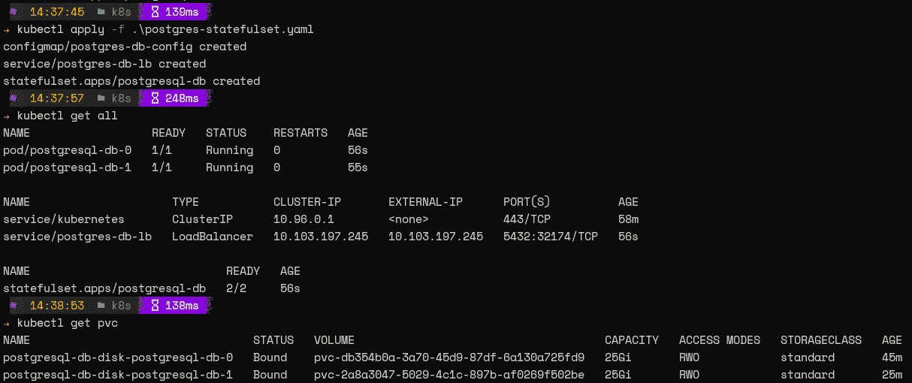

就是这样！您已经成功地在 Kubernetes 上配置了 Postgres 数据库。

# 访问数据库

既然我们现在有了正在运行的 pod，让我们访问数据库。因为我们已经设置了一个服务，所以我们可以使用该服务的外部 IP 来访问数据库。使用 [Arctype 客户端](/arctype.com)提供服务器详细信息，如默认用户和数据库(Postgres)并测试连接。

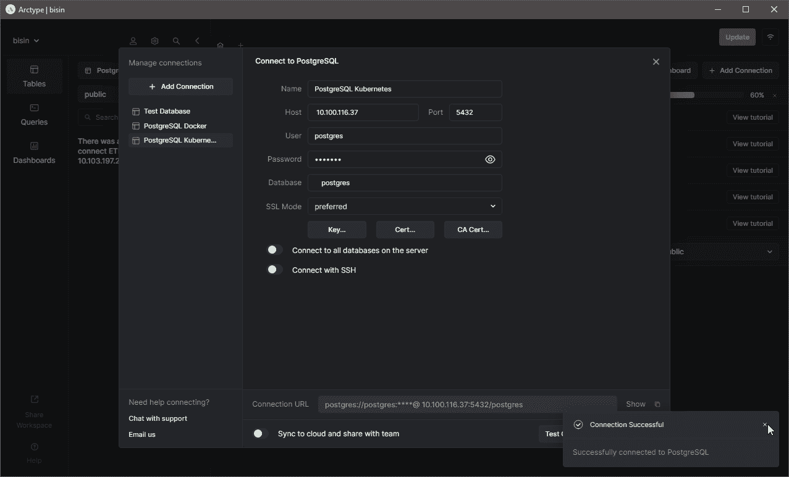

与 docker 示例一样，让我们创建一个名为`test_data_table`的表并添加一些记录。这里，我们将删除整个 StatefulSet。如果我们已经正确地配置了一切，数据将在 pod 被删除时保留。

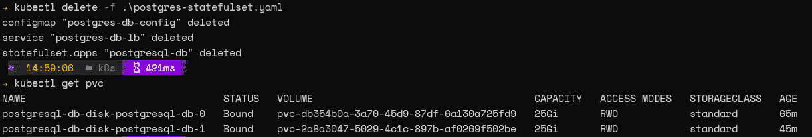

现在，让我们重置 StatefulSet 并尝试访问数据库。由于这是一个新的部署，您将看到一个与服务相关联的新外部 IP。

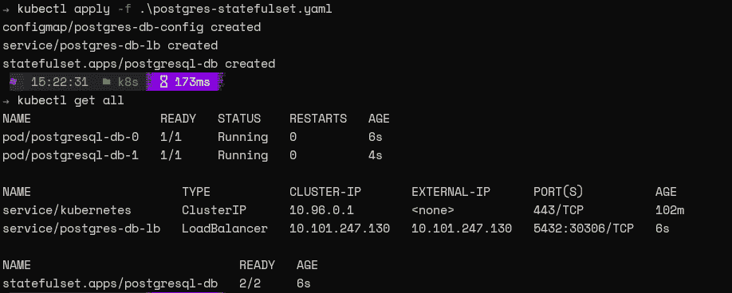

在 Arctype SQL 客户端上修改连接字符串并尝试连接。

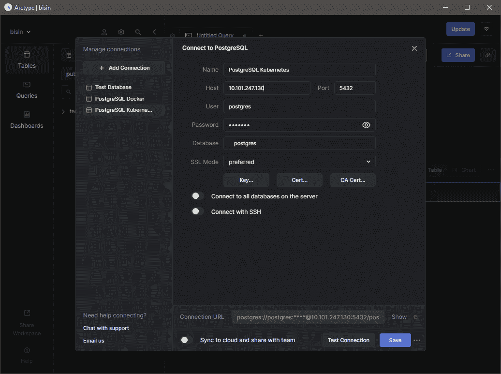

然后您将看到我们之前创建的表。您将能够通过运行 SELECT 命令来显示表中的所有数据，该命令表示无论窗格的状态如何，数据都是可用的。

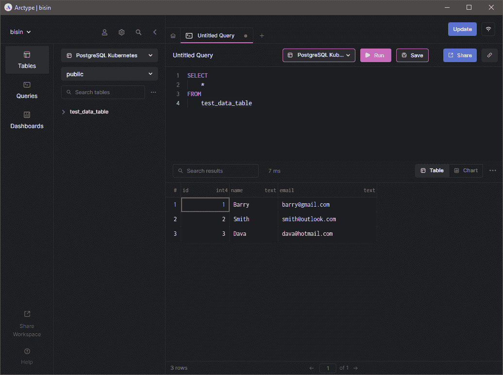

# 使用数据库窗格时的最佳实践

在 Kubernetes 中部署数据库时，有一些最佳实践可以遵循，以获得最佳的可靠性和性能。

1.  使用 [Kubernetes Secrets 存储密码等敏感信息](https://phoenixnap.com/kb/kubernetes-secrets)。尽管为了简单起见，我们在配置中以明文形式存储了用户密码，但是任何敏感信息都应该秘密存储在生产环境中，并在需要时引用。
2.  对 CPU、RAM 和存储实施[资源限制](https://kubernetes.io/docs/concepts/configuration/manage-resources-containers/#requests-and-limits)。这有助于管理集群中的资源，并确保 pod 不会过度消耗资源。
3.  始终为您的卷配置备份。即使可以重新创建 pod，如果底层数据卷损坏，整个数据库也将变得不可用。
4.  实施网络策略和 RBAC，以控制入口和可以修改这些资源的用户，从而实现最佳性能和安全性。
5.  使用单独的名称空间将数据库与普通应用程序隔离开来，并通过服务管理连接。

# 结论

创建容器化数据库允许用户利用容器化的所有好处，并将它们应用到数据库中。

这种容器化适用于任何数据库，从像 [MySQL](https://arctype.com/mysql/connect/client-mysql) 和 [Postgres](https://arctype.com/postgres/connect/client-postgres) 这样的市场领导者到为云原生应用从头设计的新竞争者。

例如，[yugabytdb 是一个新的数据库，可以在任何 Kubernetes 环境下运行，比如亚马逊 EKS](https://dev.to/aws-heroes/yugabytedb-on-amazon-eks-3206) 。管理容器化的数据库使用户能够利用传统数据库部署所需的一小部分资源来实现容错、高可用性和可伸缩的数据库架构。