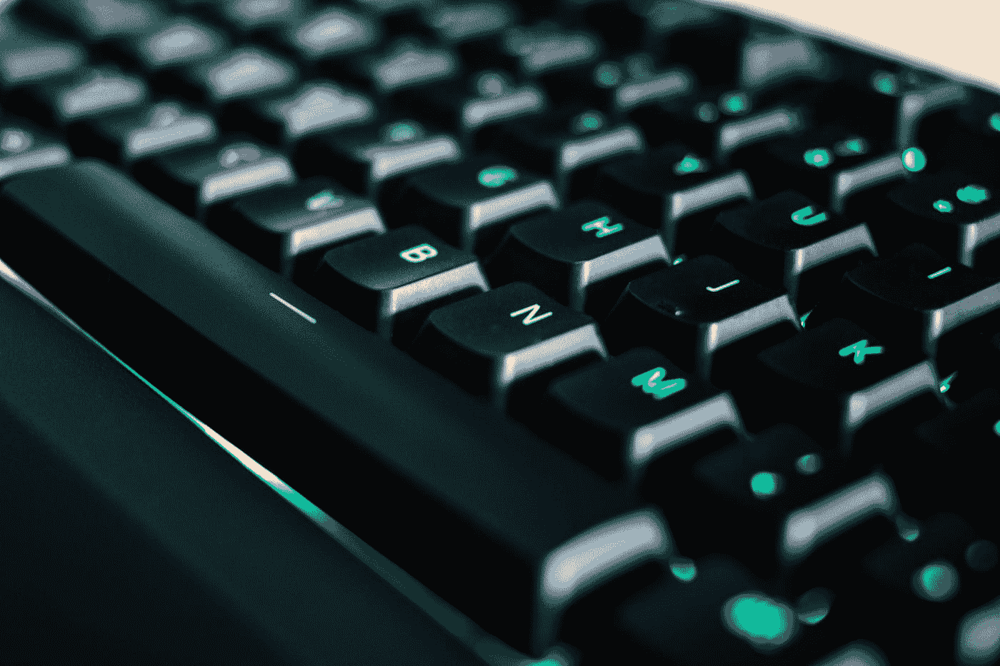

# CSS 中的伪类

> 原文：<https://betterprogramming.pub/pseudo-classes-what-are-they-and-why-you-shouldnt-use-them-8d78b64a760b>

## 它们是什么以及为什么不应该使用它们



照片由 [Dries Augustyns](https://unsplash.com/@drieaugu?utm_source=medium&utm_medium=referral) 在 [Unsplash](https://unsplash.com?utm_source=medium&utm_medium=referral) 上拍摄。

前几天，我正在处理一些设计错误，一位设计师在工作中注意到了我的 web 应用程序。像往常一样，我检查了设计师如此优雅地制作的模拟，并尽我所能在 UI 上重新创建它们。试图移除表格中最后一行的底部边框是一项烦人的小任务。所以我做了。没错，我决定用一个伪类来达到我的目的。

对于那些不知道它们是什么的人来说，伪类是处于特定状态的元素。伪类是以冒号开头的关键字:

*   `:last-child`
*   `:nth-of-type`
*   `:invalid`
*   `:hover`
*   `:focus`
*   [等。](https://developer.mozilla.org/en-US/docs/Learn/CSS/Building_blocks/Selectors/Pseudo-classes_and_pseudo-elements#:~:text=A%20pseudo%2Dclass%20is%20a,over%20by%20the%20mouse%20pointer.)

它们有助于减少标记中多余的类，样式更加灵活，并且可维护。这里有一个如何使用的简单例子。

HTML:

```
<article>
 <p>Hello</p>
 <p>I'm a</p>
 <p>PSUEDO-ClASS</p>
</article>
```

CSS:

```
article p:last-child {
 background-color: red;
}
```

如您所见，`PSEUDO-CLASS`的背景颜色是红色，而其余的`p`标签保持不变，无需更改 HTML。

将`last-child`添加到表格行并将其设置为`border-bottom: none`看起来没有什么害处，但是感觉有些不对劲。我很高兴，因为它确实奏效了，但我能感觉到公关之神在哭泣。所以我做了些调查。

这个巧妙的把戏有一个陷阱，那就是表演。

为了说明伪类的问题，我将回到我的例子。假设我们想在其他段落标签上设置样式。

HTML:

```
<article>
 <p>Hello</p>
 <p >I'm a</p>
 <p>PSUEDO-ClASS</p>
</article>
```

CSS:

这个问题可能不明显，但是您现在已经描述了所有段落的样式，然后为页面上的最后一个段落描述了更具体的样式。最终发生的是，您的页面将重新绘制最后一段，以反映伪类所表示的更具体的样式。这会导致 CSS 效率低下，影响性能。用重复的属性重新设计元素的样式确实会导致重绘，因为伪选择器是在 CSS 呈现时间轴中的稍后时间应用的。

通常，`article p`会先设计所有段落的样式，然后`:last-child`只设计页面上最后一段的样式。所发生的是所有的`p`标签被赋予整体样式，然后`last-child`被重绘成更具体的样式。

在较大的应用程序中，使用这样的伪类会对性能有一点影响。假设您想在使用了数千个`divs`的页面中找到最后一个`div`。是的，寻找`div`会有一些性能损失，但是真正的怪物正在重新绘制`div`的样式。因此，也许在 POC 甚至个人博客项目中，使用伪类是很好的。但是，在为数百万用户提供服务的大型代码库中，要小心与他们进行公关。Web 性能始终是一个相关且重要的话题。

虽然 CSS 选择器不会破坏你的 web 应用程序，但是要注意如何以及何时使用它们。