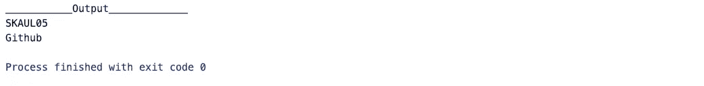
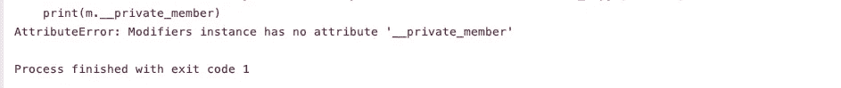

# 公共、私有和受保护 Python 中的访问修饰符

> 原文：<https://betterprogramming.pub/public-private-and-protected-access-modifiers-in-python-9024f4c1dd4>

## 我们如何在 Python 中使用访问修饰符的详细视图

照片由[戴恩·托普金](https://unsplash.com/@dtopkin1?utm_source=unsplash&utm_medium=referral&utm_content=creditCopyText)在 [Unsplash](https://unsplash.com/s/photos/private-public-protected?utm_source=unsplash&utm_medium=referral&utm_content=creditCopyText) 上拍摄

面向对象的语言，如 C++和 Java，使用各种关键字来控制和限制类的资源使用。

这就是像`public`、`private`和`protected`这样的关键词出现的原因。然而，Python 有一种不同的方式来提供这些访问修饰符的功能。

# 公共关键字

每个人都可以使用某个类的成员。所以它们可以从类外部访问，也可以被其他类访问。

公共访问修饰符的输出

在 Python 中，类的所有成员默认都是`public`。这些成员可以在类外部访问，它们的值也可以修改。

# 受保护的关键字

一个类的成员可以被该类中的其他成员访问，也可以被它们的子类访问。

没有其他实体可以访问这些成员。为此，它们可以继承父类。Python 有一个独特的惯例，让成员`protected:`添加一个前缀`**_**`(单下划线)。这可以防止外部实体使用它，除非它是一个子类。

受保护访问修饰符的输出

然而，这并没有完全执行`protected` 修改器的功能。上述程序中定义的属性可以在类范围之外访问。它也可以被修改。

受保护属性的输出已修改

# 私有关键字

一个类的`private`成员只能在类内部访问。在 Python 中，可以使用前缀`**__**` (双下划线)来定义私有成员。

私有访问修饰符的输出

因此，在`private`修饰符的情况下，我们不能访问属性。那么一个`private`修改器是未来的方向吗？

> 答案会是 ***不***

Python 对`private`属性执行名称管理。每一个带双下划线的成员都将被改为`_object._class__variable` *。*

私有属性的输出已修改

因此，这证明 Python 为您提供了访问修饰符功能，但它无法与 C++和 Java 等经典语言相比。这种做法完全取决于程序员。

因此，一个负责任的程序员在看到具有这种命名约定的属性时，会避免在它的作用域之外访问它。在程序员不知道这种命名约定的情况下，这也不好用。

*你认为 python 应该像 C++ & Java 一样拥有访问修饰符的全部功能吗？还是觉得没那么重要？*
*在下面留下你的经历和想法吧！*