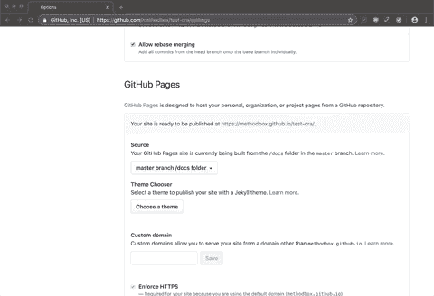
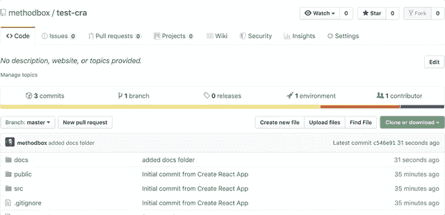

# 将创建-反应-应用程序发布到 GitHub 页面

> 原文：<https://betterprogramming.pub/publish-create-react-app-to-github-pages-the-easy-way-542e864da589>

## (简单的方法)


来自 [Unsplash](https://unsplash.com/@amrvle) 的 [Gustas Brazaitis](https://unsplash.com/@amrvle) 摄影

我首先要说的是，这篇文章**没有使用 gh-page *s* 或任何额外的节点模块来发布到 GitHub 页面。如果你正在寻找如何做到这一点，那就继续读下去，因为那样做是在浪费你的时间。你现在注意到我了吗？很好。**

我最近重建了我的 [FetchDNS](https://methodbox.github.io/fetchDNS/) 应用程序，这是我用[谷歌的 DNS-over-HTTPS API](https://developers.google.com/speed/public-dns/docs/dns-over-https) 创建的。该应用最初是使用 Vue 构建的，但后来我将大部分开发工作转移到了 React 世界。我决定是时候用 React 重构和刷新这个应用了。

> 我最近使用 create-react-app 重建了我的 FetchDNS 应用程序。
> App:[https://methodbox.github.io/fetchDNS/](https://methodbox.github.io/fetchDNS/)GH:[https://github.com/methodbox/fetchDNS](https://github.com/methodbox/fetchDNS)

由于最初的应用程序完全作为一个 SPA(单页应用程序)在 GitHub 页面上运行，我认为使用 create-react-app 构建一个新的应用程序会很简单。然而，我在 GitHub 页面上实际显示页面时遇到了一些问题。当我第一次发布最初的 Vue 应用时，我遇到了类似的问题。但是正如我将要解释的，create-react-app 的解决方案要简单得多。

对于 Vue，它需要重新配置 Webpack，在多个位置更改多个 URL，并对我的目录结构做一些改动。记住，这是几年前的事了。我不确定 Vue 的流程是否已经改变，因为我没有跟上它。

当专业开发人员不能在 30 秒内解决问题时，我决定像他们一样做——我谷歌了一下。

# 额外的依赖是混乱的

不幸的是，我不断发现建议在我的项目中添加另一个节点模块的帖子。我说不幸是因为我确定这是一个配置问题。我也不喜欢添加依赖——尤其是那些实际上并不属于核心应用的依赖。

添加 gh-pages 需要有一个单独的分支，并维护一个比实际需要更混乱的依赖关系。只是多了一个可以维持的东西，又多了一个可以打破的东西。[甚至官方 Create React App 文档都建议这么做](https://facebook.github.io/create-react-app/docs/deployment)，但这并不意味着你*必须这么做。*

# 隔离问题

我决定发布应用程序损坏，并在浏览器控制台中开始我的故障诊断。这是我了解 GitHub 端发生了什么的唯一方法。

Chrome 开发工具拯救世界！我只是将发布的页面拉起来，在 Chrome JavaScript 控制台中查看。



在 Chrome 中检查浏览器控制台。休斯顿，我们有一个问题。

很明显，问题出在根路径上。GitHub 希望被告知我的基本 URL 是什么，以便使用它作为我的文件的根位置的真实来源。这是*发现*我的应用程序对文件的请求，这是*加载*我的索引页面。但是它无法确定其余文件的相对路径。

这是我可以轻松解决的问题。让我们看看如何做到这一点。

# 设置用于发布的存储库

让我们退一步，谈谈 GitHub 发布到 GitHub 页面需要什么:

1.特定名称的分支或文件夹。他们接受 gh-pages 作为发布的分支名称。正如我已经提到的，我们不会这样做。我不会仅仅为了发布构建而维护一个单独的分支。或者，通常，您可以在主分支中使用一个名为“docs”的文件夹

2.在存储库设置下，需要启用 GitHub 页面。

如果你愿意，你可以在这里阅读官方 GitHub 文档[。](https://help.github.com/en/articles/configuring-a-publishing-source-for-github-pages)



启用 GitHub 页面。

就是这样！请注意，您需要创建一个名为 docs 的文件夹，并且*已经将*提交到您的主分支，这样才能工作。如果你不这样做，GitHub 不会在下拉列表中给你选项。

# 修复相对路径

奇怪的是，即使 create-react-app 官方文档推荐使用 gh-pages 插件，他们已经有了一个简单的特性来缓解这种需求。您只需要在您的`package.json`文件中指定`homepage`键。这需要在运行构建之前完成*。*

只需在文件顶部添加密钥。该值应该是 GitHub 显示您的站点发布的 URL。您可以从 repo 设置中启用 GitHub Pages 的同一个位置获得此信息。这通常采用 https:// **用户名** .github.io/ **repo-name** 的格式。包括您的**用户名**和适用的**回购名称，当然还有**。

```
// package.json
{
  "name": "test-cra",
  "version": "0.1.0"
  "private": true,
  **"homepage": "https://username.github.io/test-cra"**
  "dependencies": {
...
}
```

这将修复我们的相对路径问题。现在，我们需要创建一个构建，并将其移动到正确的文件夹中。

# 创建新版本

既然我们的修复已经就绪，您需要构建您的应用程序。为此，只需在项目的根目录下运行`npm run build`。

完成后，我们需要将`build`文件夹重命名为`docs`，因为 GitHub 将使用它来发布我们的应用。

```
npm run buildmv build docs
```

# 出版

一旦你做了这些简单的调整，你就可以继续把你的应用程序推到 GitHub 上。提交您的更改并推送到 master。你的站点在 GitHub 上上线需要几分钟时间，但是你现在应该可以开始了。

# 结论

我希望这能帮助你在 GitHub 页面上简单、快速、尽可能少的麻烦和维护地发布一个创建-反应-应用构建的 web 应用。感谢阅读！