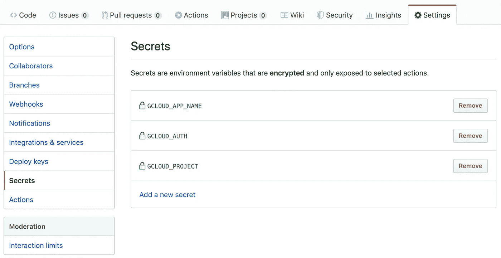

# 使用 GitHub 操作发布您的云跑步应用

> 原文：<https://betterprogramming.pub/publish-your-cloud-run-app-with-github-actions-6c18ff5c5ee4>

## 用 GitHub 快速部署应用程序的方法

艾伦·尼格伦在 Unsplash[上的照片](https://unsplash.com/s/photos/cloud?utm_source=unsplash&utm_medium=referral&utm_content=creditCopyText)

谷歌最近宣布了新的[谷歌云平台](https://cloud.google.com/gcp/?utm_source=google&utm_medium=cpc&utm_campaign=na-US-all-en-dr-bkws-all-all-trial-p-dr-1007179&utm_content=text-ad-lpsitelinkCCexp2-any-DEV_c-CRE_113120493247-ADGP_Hybrid+%7C+AW+SEM+%7C+BKWS+%7C+US+%7C+en+%7C+Multi+~+Cloud+Platform-KWID_43700011014879364-kwd-10876442192&utm_term=KW_cloud%20platform-ST_cloud+platform&gclid=CjwKCAjw2qHsBRAGEiwAMbPoDG8AYhrx-uAWd-_A5PQbzTIHw7LCFPa1E54xXPqJj3nMh1K3Wt55ChoCNG4QAvD_BwE) (GCP)功能 [Cloud Run](https://cloud.google.com/run/) ，可以快速轻松地部署你的 [Docker](https://www.docker.com/) 应用。本指南将解释如何使用 GitHub 提供的新的持续集成/持续交付系统构建和部署一个简单的静态应用程序: [Actions](https://github.com/features/actions) 。

为了让这个项目活起来，我们将使用以下工具:

*   谷歌云运行，执行我们的 Docker 容器
*   [Google Cloud Container Registry](https://cloud.google.com/container-registry/)存储我们的 Docker 图片
*   管理持续部署的 GitHub 操作
*   GitHub 来存储我们项目的源代码。

# 配置 GCP 项目

## 服务帐户创建

第一步是创建一个*服务帐户*，它将允许我们从 GitHub actions 进行连接。为此，您可以在 GCP 界面的“IAM &管理/服务帐户”菜单中单击“创建服务帐户”按钮。现在，在“服务帐户名称”字段中填入值“GitHub-actions”，在“服务帐户描述”字段中填入值“GitHub Actions 用来连接 GCP 的帐户”

此时，保留字段*服务账户 ID* 中生成的值。这是稍后将使用的服务帐户用户名。看起来应该是`github-actions@key-partition-000000.iam.gserviceaccount.com`。

点击“创建”按钮，进入角色配置阶段。我们需要两个角色:

点击“创建”按钮，进入角色配置阶段。我们需要两个角色:

*   **云运行管理员**，该角色允许我们创建新的云运行部署；
*   **存储管理员**，该角色允许我们将 Docker 图像上传到 GCP 的集装箱登记处。
*   **服务账户用户**，允许服务账户充当用户的角色。

“继续”按钮将我们带到第三步，也是最后一步:创建 JSON 密钥。为此，只需点击“创建密钥”按钮，选择“JSON”>“创建”将下载一个文件，称为`key-partition-000000–0123456789ab.json`。留着吧，我们以后会用的。

## API 激活

现在我们有了一个拥有适当权限的用户，我们需要激活我们需要的两个服务。

要启用容器注册表，选择“容器注册表”(显而易见，对吗？)菜单，点击“启用容器注册 API”按钮…我们就完成了。

要启用云运行，选择“云运行”(再明显不过了，对吧？)菜单，点击“开始使用云运行”再一次，我们完成了。

# 项目创建

为了启动这个项目，让我们创建一个 GitHub 存储库并添加几个文件:

*   一个简单的欢迎`<h1>Hello World!</h1>` HTML 页面；
*   一个简单的错误`<h1>Server error</h1>` HTML 页面；
*   将作为欢迎文件的`nginx/default.conf` 文件
*   一个`Dockerfile`打造码头工人形象；
*   用于配置持续部署的`.github/workflows/googlecloudrun.yml`文件。

## `nginx`配置

云运行监听`localhost:8080`。因此，第一步是用`server_name`和`listen`设置这些值。

然后，我们配置`nginx`应该服务的文件位置；`root`键是所有要服务的静态文件所在的位置。在本例中，它在`usr/share/nginx/html`中。`index`键向`nginx`声明要解析什么`root`文件；这里，`index.html`或`index.htm`将被解析。

最后，我们用命令`error_page`将 50X 错误转发到一个特殊文件，并用`location`处理`nginx`中到我们的错误 HTML 文件的映射。

## Dockerfile 文件

因为我们的应用程序非常简单，所以在 Docker 文件中只有三个步骤:

*   我们选择`alpine nginx`图像，以确保我们拥有尽可能最轻的包；
*   我们将`nginx conf`复制到它的目标文件夹中；
*   最后，我们将 HTML 文件复制到新创建的容器的`public`文件夹中。

## GitHub 行动

这可能是项目中最复杂的部分，尽管你会发现它仍然非常简单。

我们的项目将对主分支上的每个提交进行部署。然而，我们将忽略在其他分支上所做的一切，因为这是一个部署脚本。如果您需要更进一步，您可能希望为每个其他分支在不同的端点上进行部署，但这不是今天的主题。

我们的 CD 也只有一个任务，因为我们有一个非常简单的应用程序——简单的带有静态文件的`nginx`服务器。但是在现实生活中，您可能需要其他步骤来构建您的应用程序，或者运行测试。我们选择在`ubuntu-latest`上运行构建，但是[其他可能性也是可用的](https://help.github.com/en/articles/workflow-syntax-for-github-actions#jobsjob_idruns-on)。

这项工作将由几个步骤组成。但是在深入研究之前，让我们看看需要采取哪些措施:

*   `actions/checkout@v1`获取我们将要部署的 GitHub 项目资源；
*   `actions/gcloud/cli@master`执行与 GCP 相关的每一步。

现在让我们进入步骤。他们有六个人:

第一个是确保您从 GitHub 获得应用程序源代码。因为可能会在问题创建时触发操作，例如，我们可能不需要获取来源。GitHub 默认只给出强制数据。

第二个使用 Docker 来建立我们的形象。此外，由于我们将图像上传到 Google Cloud Container Registry，我们必须用目标图像 URI 的名称来标记它。URI 的建造使用了:

*   某主持人:`eu.gcr.io`；
*   一个项目:`secrets.GCLOUD_PROJECT`，一个*秘密*我们一会儿就讲；
*   一个 app 名称:`secrets.GCLOUD_APP_NAME`；也是一个*秘密。*

第三步是 GCP 相关命令的开始。我们首先需要通过`auth`动作用秘密密钥`GCLOUD_AUTH`验证我们自己。

第四步将 GCP 和 Docker 连接在一起，这样它就知道将图像推送到哪里。

第五步是将我们的图像上传到容器注册中心。这个有一个特殊性:我们需要在那个命令中同时使用 Docker 和 GCloud，所以选择 GCloud 操作，并使用`sh`入口点，以便让`gcloud`和`docker`命令都可用，来推送图像。多亏了第四步，Docker 将把图像推到正确的位置。

最后一步实际上是两个命令。在这里，如果我们将第一个步骤的结果分成两个不同的步骤，那么第二个步骤就没有第一个步骤的结果。这两个命令负责:

*   安装测试版组件，因为谷歌云运行仍处于测试阶段；
*   将应用程序部署到云运行中。您需要设置您喜欢的[区域](https://cloud.google.com/sdk/gcloud/reference/beta/run/deploy#--region)和[平台](https://cloud.google.com/sdk/gcloud/reference/beta/run/deploy#--platform)(托管或 [GKE](https://cloud.google.com/kubernetes-engine/) )。

## 公布 GitHub 秘密

GitHub 操作的秘密接口

在我们的 YAML 文件中，我们引用了三个密钥:

*   `GCLOUD_APP_NAME`:云上运行的应用的名称。在这个例子中，它将是`cloud-run-github-actions`。
*   `GCLOUD_PROJECT`:Google 云平台上的项目 ID。您可以在“项目选择”弹出窗口中找到它。
*   `GCLOUD_EMAIL`:我们之前创建的类似`github-actions@key-partition-000000.iam.gserviceaccount.com`的服务帐户电子邮件。
*   `GCLOUD_AUTH`:我们在故事开头下载的 JSON 文件的 base 64 编码内容，`key-partition-000000–0123456789ab.json`。

我们已经准备好从 GitHub Actions 执行我们的部署了！

# 结论

我们现在可以在 Google Cloud Run 上持续轻松地部署我们的项目。我们的例子非常简单，但是因为我们使用了 Docker 图像，所以我们可以自由地拥有任何我们想要的应用程序。只需注意应用程序必须监听`PORT`环境变量:Cloud Run 只会监听那个端口上的一个 app！

你可以在 [Github](https://github.com/brunosabot/cloud-run-github-actions) 上找到源代码。