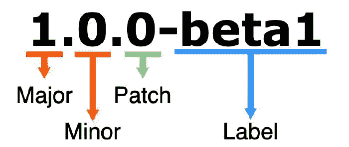

# 使用 npm 发布您的第一个节点库

> 原文：<https://betterprogramming.pub/publish-your-first-node-library-using-npm-ee6bb7052187>

## 了解如何使用 npm 托管您的库，以便其他开发人员可以使用它


如果你是 Node.js 开发人员，使用 npm 包对你来说不会是一个新概念。从复杂的 npm 包(如 express)到简单的包，npm 托管了大量的 Node.js 库，这些库简化了节点开发人员的工作量。但是，您有没有想过发布自己的节点库来帮助其他开发人员呢？在今天的教程中，我们将介绍使用 npm 发布自己的 Node.js 库时必须遵循的步骤。

# 在我们开始之前…

在我们开始之前，您应该设置好以下内容。

*   一个 [GitHub 账户](https://github.com/)
*   Node.js 和 npm 已安装([安装步骤](https://docs.npmjs.com/downloading-and-installing-node-js-and-npm)
*   一个[国家预防机制账户](https://www.npmjs.com/)

如果您已经完成了以上所有的设置，让我们开始发布库。

在本教程中，我们将创建一个简单的库，将一个句子转换为标题格(其中每个单词的第一个字母都是大写的)。

# 选择包名


当选择 npm 包的名字时，你必须检查这个名字是否在官方的 [npm 网站](https://www.npmjs.com/)上。如果您将它发布为未分类(公共)包，那么您的包名应该是唯一的。

但是，如果包是作用域包或私有包，则包名不必是唯一的，其格式为@username/package-name。你可以在这里找到更多关于作用域包[的信息。](https://docs.npmjs.com/using-npm/scope.html#:~:text=Scoped%20packages%20can%20be%20published,registries%20at%20the%20same%20time.)

我们将要创建的包的名称是“标题-案例-转换器”。

# 创建 GitHub 存储库

在 GitHub 中创建一个名为“标题-案例-转换器”的新存储库。确保使用自述文件初始化存储库。选择一个合适的许可证，比如麻省理工学院的许可证。

# 设置作者并登录 npm

将您的姓名、电子邮件和网站(如果有)保存到 npm。这些细节将在创建时添加到项目的 package.json 文件中。

```
npm set init.author.name "<your-name>"
npm set init.author.email "<your-email-address">
npm set init.author.url "<your-website-url>"
```

然后，使用 npm login 命令登录 npm。系统将提示您输入用于创建 npm 帐户的凭据。

# 初始化项目

为项目创建一个新目录，并使用`npm init`命令初始化它。确保填写**包名**、**版本**、**描述**、 **git 库**、**关键字**和**许可证**字段，将这些细节添加到`package.json`文件中。

(如果您已经登录，并且像我们上面所做的那样在初始文档中设置了作者，则可能不会询问作者填写)。

创建的 package.json 文件包含这些细节。

此外，您可以向`package.json`文件添加另一个名为 **engines** 的字段，以指定您的项目兼容的 Node.js 的最低版本。

```
"engines": {
    "node": ">= 8.0.0"
 },
```

# 关于版本的一点点



请注意我们是如何将 1.0.0 版用于这个包的。这是我们应该用于发布到 npm 的包的初始版本的版本。

Npm 使用一种称为语义版本化(SemVer)的版本化系统。默认的起始版本是 1.0.0。在您的软件包的未来更新中，有三种类型的版本更改可以遵循 SemVer 标准。这三个被命名为补丁、小调和大调。

1.  主要版本:当您进行不兼容的 API 更改时，
2.  次要版本:当您以向后兼容的方式添加功能时，并且
3.  补丁版本:当你进行向后兼容的 bug 修复时。

预发布和构建元数据的附加标签可作为主标签的扩展。小调。补丁格式。

你可以在这里阅读更多关于 sever versioning[的内容。](https://semver.org/)

# 创建节点模块

现在我们可以实现我们的包，标题-案例-转换器。

创建一个名为`app.js`(或者您设置为入口点的文件)的文件，并向其中添加以下代码。

它包含一个名为`converter`的函数，该函数接受一个字符串句子，并将其中每个单词的首字母大写。上面代码最重要的部分是使用`module.exports`导出创建的函数。

# 初始化 Git

现在，我们将使用命令`git init`为我们的项目初始化 git。然后，使用以下命令转移我们更改的文件。

```
git add .
```

在下一步中，将代码的更改提交到本地存储库。

```
git commit -m "initial changes"
```

之后，我们必须添加 GitHub 存储库作为项目的远程存储库。

```
git remote add origin <GitHub repository URL>
```

从远程存储库中提取变更，然后将本地变更推送到其中。

```
git pull origin master
git push origin master
```

# 为软件包编写一个好的自述文件

发布 npm 软件包时，包含一个好的自述文件至关重要。它向其他用户简要介绍了您的包是做什么的，以及他们如何在他们的项目中使用它。

你可以在这里找到一个模板来创建一个好的自述文件[。为了更好地了解自述文件的外观，您可以浏览流行的 npm 包和 GitHub 库，看看其他人是如何做到的。](https://gist.github.com/PurpleBooth/109311bb0361f32d87a2)

通常，自述文件应包含以下字段。

*   对您的包的功能的简短描述。
*   另一个用户如何安装该包以便在他们的项目中使用它。
*   如何在项目中使用包。提供解释用法的代码示例。
*   如何为你的套餐做贡献？如果您希望其他开源开发人员也为这个项目做出贡献，那么这个字段必须添加到 README 文件中。
*   包使用的许可证。对于这个包，我们使用了麻省理工学院的许可证。

在这些改变之后，不要忘记承诺和推动。

# 将包发布到 npm

即使第一次听说发布库的概念时感觉工作量很大，但这一步却出奇的简单。您所要做的就是在命令行中运行下面的命令。

```
npm publish
```

如果您选择了一个与现有 npm 包不冲突的包名，这一步应该会很顺利，在几秒钟内，您的第一个包就会发布到 npm。

现在，您可以创建一个新的 Node.js 项目，并使用这个命令将您的新包作为一个依赖项进行安装。

```
npm install title-case-converter --save
```

然后，您可以将该包导入到新项目中，并使用它将句子转换为您希望的标题格。

```
const converter = require("title-case-converter")let convertedSentence = converter("my name is juan") //"My Name Is Juan"
```

就是这样！您现在是一个已发布的 npm 包的自豪的所有者。

您可以尝试创建一个更复杂的 Node.js 模块，然后将其发布到 npm。

# 结论

正如您可能已经预料到的，发布 NPM 包是一项简单的任务，您并不总是需要按照本教程中解释的相同顺序执行相同的步骤。您可以分配作者，或者稍后通过使用 npm 命令或简单地编辑`package.json`文件来修改包名或任何其他属性。

我希望你今天学到了新的东西，一如既往地感谢你的阅读！