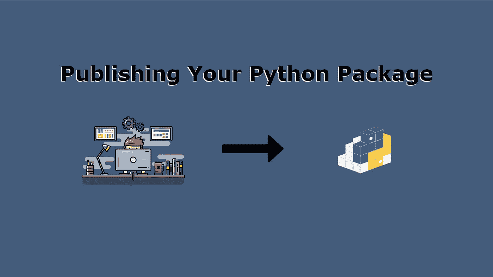
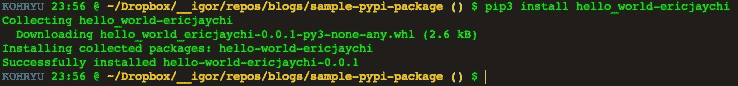
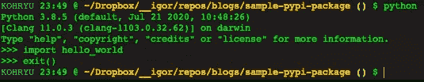

# 将 Python 包发布到 PyPi

> 原文：<https://betterprogramming.pub/publishing-your-python-packages-to-pypi-e48c169f4f09>

## 与全世界分享您的软件包



作者照片。

*注:完整的源代码可以在 GitHub* *上找到* [*。*](https://github.com/ericjaychi/sample-pypi-package)

如果您使用 Python，那么您可能知道可以使用`pip`下载并导入到项目中的包。这是一个强大的工具，允许来自世界各地的开发者上传他们的代码，以便其他人可以使用它。

在今天的文章中，我将向您展示如何将您的 Python 包发布到服务 [PyPi](https://pypi.org/) ，这是 Python 包索引。这里是`pip`下载那些可爱的包的地方，这些包可以在你的项目中使用，也可以在你的计算机上使用命令行工具。

# 1.创建项目

我们需要采取的第一步是创建一个非常简单的包，以便发布到 PyPi 上。根据您希望发布的应用程序，这一步可能会很复杂，但是对于这个例子，我们将创建一个非常简单的包。

让我们为我们的项目创建一个新的目录结构:

```
sample-pypi-package
└── hello_world
    ├── __init__.py
    └── main.py
```

`sample-pypi-package`是项目的根级别，我们正在项目内部创建一个`hello_world`模块。`__init__.py`的内容为空，`main.py`的内容如下所示:

这是第一步。如果你熟悉 Python，没什么不寻常的。对于本教程来说,`main.py`文件甚至不是必需的，但是我添加它只是为了让我们在模块中有一个文件。

# 2.setup.py 文件

我们将创建一个名为`setup.py`的新文件，作为我们包的构建脚本。然而，我们需要通过`pip`安装`setuptools`。您可以运行下面的命令。了解您使用的 Python 版本，并使用合适的`pip`版本。

```
pip install setuptools
OR
pip3 install setuptools
```

现在我们已经安装了`setuptools`，我们可以开始设置我们的`setup.py`。

如前所述，这个文件负责构建我们的发行版文件，该文件将被上传到 PyPi。我留下了一些描述每一行的评论。

我想强调的两行是:

```
requirements = ["requests<=2.21.0"]install_requires=requirements,
```

我特意将它们注释掉，因为在这个练习中不需要它们。然而，如果你的包有依赖项，它们是很重要的。实际上，一个实际的项目会有外部的依赖项，所以这就是你将这些依赖项添加到发行版的方式，这样安装你的包的用户也将安装所需的包，以使代码正确运行。一个典型的做法是创建一个您的`setup.py`可以读取的`requirements.txt`文件，而不是定义一个数组，但是您明白这个想法。

如果你对`setuptools.setup()`提供的所有参数都很好奇，请看[官方文档](https://setuptools.readthedocs.io/en/latest/setuptools.html)。

# 3.README.md 和许可文件

这一部分并不激动人心，但却非常重要。因为您要向全世界发布，所以您希望确保您拥有适当的文档以及适当的开源许可证。我们还需要`README.md`，因为我们要在`setup.py`内部使用它。

所以让我们在项目的根层次上创建一个简单的`README.md`:

```
**#** Sample PyPi Package

This is a simple exercise to publish a package onto PyPi.
```

`README.md`搞定。

选择许可证可能有点棘手。对我们来说幸运的是，[https://choosealicense.com/](https://choosealicense.com/)很好地概述了可以使用的不同开源许可。在这个例子中，我将使用 MIT 许可证，但是如果你要发布一个实际的包，我建议你看看你想用哪个许可证。

现在让我们使用 MIT 许可证在根级别创建一个`LICENSE`文件:

```
MIT License

Copyright (c) [year] [fullname]

Permission is hereby granted, free of charge, to any person obtaining a copy
of this software and associated documentation files (the "Software"), to deal
in the Software without restriction, including without limitation the rights
to use, copy, modify, merge, publish, distribute, sublicense, and/or sell
copies of the Software, and to permit persons to whom the Software is
furnished to do so, subject to the following conditions:

The above copyright notice and this permission notice shall be included in all
copies or substantial portions of the Software.

THE SOFTWARE IS PROVIDED "AS IS", WITHOUT WARRANTY OF ANY KIND, EXPRESS OR
IMPLIED, INCLUDING BUT NOT LIMITED TO THE WARRANTIES OF MERCHANTABILITY,
FITNESS FOR A PARTICULAR PURPOSE AND NONINFRINGEMENT. IN NO EVENT SHALL THE
AUTHORS OR COPYRIGHT HOLDERS BE LIABLE FOR ANY CLAIM, DAMAGES OR OTHER
LIABILITY, WHETHER IN AN ACTION OF CONTRACT, TORT OR OTHERWISE, ARISING FROM,
OUT OF OR IN CONNECTION WITH THE SOFTWARE OR THE USE OR OTHER DEALINGS IN THE
SOFTWARE.
```

务必更换`[year]`和`[fullname]`部分！

现在我们已经创建了`LICENSE`和`README.md`，目录结构应该如下所示:

```
sample-pypi-package/
├── LICENSE
├── README.md
├── hello_world
│   ├── __init__.py
│   └── main.py
└── setup.py
```

# 4.生成分发文件

现在我们已经设置好了我们的包，我们准备好生成我们的发行文件了。分发文件是用户将下载到他们的机器上并解包的文件，这样他们就可以运行您的代码。因此，当您在一个包上运行`pip install`时，您正在本地下载 tarball/zip 以在您的机器上解压缩。

从这里开始，我们将需要另一个工具来创建分发文件:

```
pip install wheel
OR
pip3 install wheel
```

一旦你下载了`wheel`，我们现在可以利用它来创建文件。

在`setup.py`所在的同一个目录中运行这些命令(如果您继续操作，它应该是您的根目录):

```
python setup.py sdist bdist_wheel
OR
python3 setup.py sdist bdist_wheel
```

一旦你运行这个，你的终端应该会显示一些日志。一旦命令运行完毕，您应该会看到一些我在下面用粗体显示的新目录。我不会上传这些目录到回购！

```
sample-pypi-package/
├── LICENSE
├── README.md
**├── build
│   ├── bdist.macosx-10.15-x86_64
│   └── lib
│       └── hello_world
│           ├── __init__.py
│           └── main.py**
**├── dist
│   ├── hello_world_ericjaychi-0.0.1-py3-none-any.whl
│   └── hello_world_ericjaychi-0.0.1.tar.gz**
├── hello_world
│   ├── __init__.py
│   └── main.py
**├── hello_world_ericjaychi.egg-info
│   ├── PKG-INFO
│   ├── SOURCES.txt
│   ├── dependency_links.txt
│   └── top_level.txt**
└── setup.py
```

`build`和`hello_world_ericjaychi.egg-info`都可以忽略。我们希望关注`dist`目录:

```
dist/
├── hello_world_ericjaychi-0.0.1-py3-none-any.whl
└── hello_world_ericjaychi-0.0.1.tar.gz
```

这些是我们的发行文件，当用户通过`pip`下载时，我们会将它们分发给他们。

# 5.上传分发文件

所以现在是时候把这些文件上传到 PyPi 了。在此之前，我们需要首先创建一个 PyPi 帐户。我想强调的一个细节是:PyPi 为发布包提供了一个测试环境，这样您就可以在真正发布之前体验一下这个过程。我将提供两份报名表。我强烈建议在将你的官方网站发布到服务器之前，先修改一下测试网站。

*   [测试环境](https://test.pypi.org/account/register/)
*   [生产环境](https://pypi.org/account/register/)

我将提供在两种环境下发布的例子。

一旦您注册了不同的环境，就该为我们安装最终的工具来将发行包推送到 PyPi 了:

```
pip install twine
OR
pip3 install twine
```

一旦`twine`安装完毕，您将会想要使用这个新工具将包上传到 PyPi。在项目的根级别运行以下命令:

```
twine upload --repository testpypi dist/* (TEST)
twine upload --repository pypi dist/* (PROD)
```

如果这些命令不起作用，将`python`或`python3`放在它们前面。

在您键入相应的命令后，系统会提示您为您选择的相应环境输入凭据。完成后，它会显示一些正在上传的文件的进度条:


上传完成！

它甚至会在最后给你一个链接，告诉你它已经为那个特定的版本发布了。以下是本练习中生成的链接，分别代表测试和生产:

*   [测试](https://test.pypi.org/project/hello-world-ericjaychi/0.0.1/)
*   [产品](https://pypi.org/project/hello-world-ericjaychi/)

最后一部分是检查您是否可以通过使用 PyPi 页面上提供的链接下载它。您应该能够成功下载它，显示一个典型的安装消息。如果不想使用特定版本，可以省略版本号。

如果您希望从 PyPi 的生产版本中提取，也可以省略`-i https//test.pypi.org/simple/`，这与您通常使用`pip`的方式类似。



万岁。

现在我们已经安装了这个包，让我们验证一下，确保它安装正确。

打开 Python 解释器，导入我们在本文中创建的`hello_world`模块。



没有错误！

如果我们做的一切都正确，我们的解释器应该能够没有任何问题地识别导入！

# 结论

恭喜你。您成功地向 PyPi 发布了一个 Python 包。PyPi 是一个很棒的平台，它允许 Python 社区轻松地将代码分发给世界各地的其他人。

正如你所看到的，这个过程对于你想要发布的每个版本来说都是一个小小的手工操作。如果您想了解我们如何实现这一过程的自动化，或者有任何问题，请在下面留下您的回复！

下集再见！