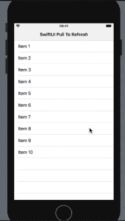
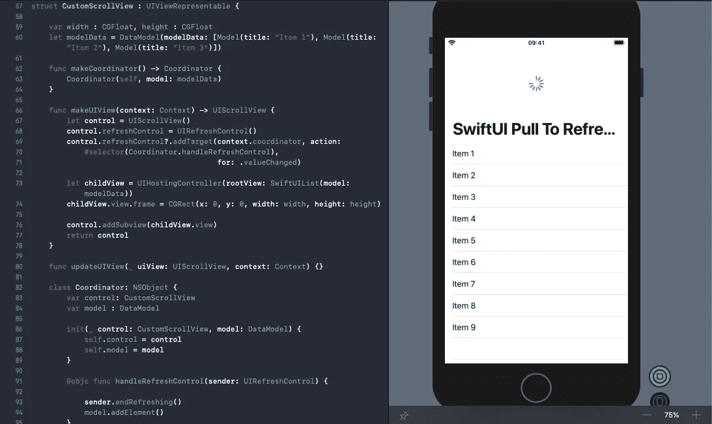

# 在 SwiftUI 中拉动以刷新

> 原文：<https://betterprogramming.pub/pull-to-refresh-in-swiftui-6604f54a01d5>

## 利用 UIViewRepresentable 和 UIHostingController 在 SwiftUI 视图中嵌入刷新控件


照片由[卢肯·萨贝拉诺](https://unsplash.com/@luferlex?utm_source=medium&utm_medium=referral)在 [Unsplash](https://unsplash.com?utm_source=medium&utm_medium=referral) 上拍摄

我们几乎处于年度 WWDC 会议的中间阶段(在撰写本文时，2019 年和 2020 年各有六个月的时间)，尽管 SwiftUI 的引入在 iOS 社区中创造了欢乐，但我们仍然不能放弃 UIKit 框架。

SwiftUI 目前缺少许多功能，这使得 UIKit 现在不可或缺。

在 SwiftUI API 还没有包含的功能中，这么多，*活动指示器*和*拉刷新*是最被错过的两个功能。

几乎每个应用程序都需要向下滑动来刷新视图，还需要一个活动指示器来显示内容加载时的进度。

令人高兴的是，我们支持在 SwiftUI 中嵌入 UIViews 的`UIViewRepresentable`协议和将 SwiftUI 视图添加到`UIViewController`的`UIHostingController`类。

借助 UIKit 和 SwiftUI 之间顺畅的互操作性，我们可以对一些缺失的 SwiftUI 实现提出自己的定制实现，这就是本文背后的想法。

# 我们的目标

*   在我们的 iOS 应用程序中的 SwiftUI 列表上添加一个拉至刷新视图。
*   我们将使用`UIHostingController`和`UIViewRepresentable`来允许在带有`UIRefreshControl`的`UIScrollView`(ui kit 的)中嵌入 SwiftUI 子视图。
*   利用`GeometryReader`获得视图的维度。

# 最终目的地

下图展示了在这篇文章结束时我们将实现的目标:



# 设置我们的数据模型

首先，让我们创建一个保存唯一 ID 和文本的结构。该结构需要符合`Identifiable`协议，以允许 SwiftUI 列表独立于其他元素识别每个行元素。

```
struct Model: Identifiable {var id = UUID()
var title: String}
```

接下来，让我们创建一个符合`ObservableProtocol`的类，它将允许我们宣布模型中的更改，以便它自动更新 SwiftUI 视图的主体。

每次对列表执行拉至刷新操作时，都会触发`shuffleList`。

# 创建 SwiftUI 子视图

让我们创建一个包含列表的子 SwiftUI 视图。这个视图最终将嵌入到一个带有拉至刷新控件的`ScrollView`中。

每当来自`DataModel`的`Published`属性改变时，`ObservedObject`属性包装器更新元素列表。

# SwiftUI 和 UIKit 互操作性

SwiftUI 的`List`和`ScrollView`目前都不具备添加`RefreshControl`视图的能力。

所以，让我们回到 UIKit 的经典`UIScrollView`上来。我们将把它包装在一个符合`UIViewRepresentable`协议的结构中。

在上面的代码中，我们做了相当多的事情。让我们把它们记下来。

*   将`UIRefreshControl`与`UIScrollView`相加，并监听值的变化，以了解拉至刷新控制的状态。
*   Coordinator 类充当我们在`makeUIView`函数中创建的 UIKit 视图的代表。它响应刷新控件上的用户事件，并在刷新完成后向`DataModel`追加一个新元素。
*   `SwiftUIList`是我们创建的自定义 SwiftUI 视图，它将`DataModel`保存在一个列表中。使用`UIHostingController`，我们嵌入`SwiftUIList`作为`UIScrollView`的子`UIView`。

你看到的粗体的宽度和高度属性是设置孩子`UIView`的尺寸所必需的。我们将使用`GeometryReader`来获取这些，如下图所示。

# 构建内容视图，使用 GeometryReader

最后，我们将在`ContentView`的`body`中添加`CustomScrollView` SwiftUI 视图，并使用`GeometryReader`传递宽度和高度，这是一个容器视图，它将其内容定义为自身大小的函数。



# 结论

总之，我们通过利用将 SwiftUI 转换为 UIKit 视图的`UIHostingController`和将 UIKit 视图转换为 SwiftUI 的`UIViewRepresentable`,创建了一个在 SwiftUI 视图中使用的快速拉刷新实现。

每个人的 WWDC 2020 愿望清单上都有一个可以轻松用于生产应用的重大 SwiftUI 升级。

你可以在 [GitHub 库](https://github.com/anupamchugh/iowncode/tree/master/SwiftUIPullToRefresh)中找到上述 iOS 应用的完整源代码。

这一次到此为止。感谢阅读。