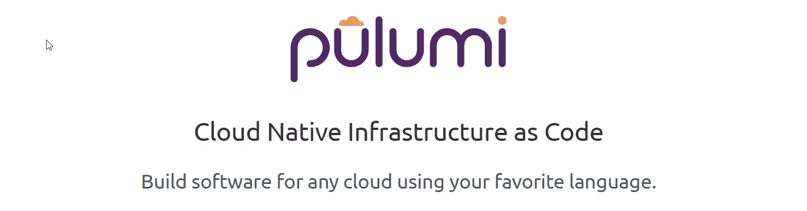
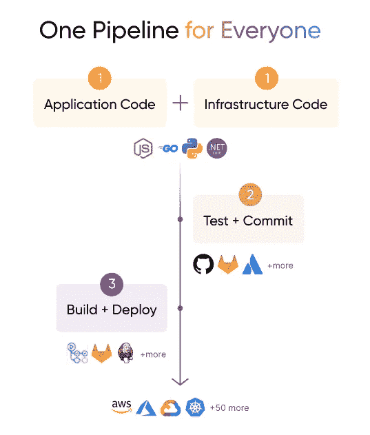

# Pulumi:作为代码范例的真正基础设施

> 原文：<https://betterprogramming.pub/pulumi-a-true-infrastructure-as-code-paradigm-ac07c530e219>

## 为什么您应该考虑将 Pulumi 作为基础设施的代码

由[斯蒂芬·莱昂纳迪](https://unsplash.com/@stephenleo1982?utm_source=medium&utm_medium=referral)在 [Unsplash](https://unsplash.com?utm_source=medium&utm_medium=referral) 上拍摄的照片

作为一个广泛使用 Ansible 和 Terraform 来管理基础设施的人，我一直对软件行业以基础设施作为代码的名义出现的越来越多的新工具、模板和范例感到困惑。

作为代码的基础设施(或缩写为 IaC)实际上应该是——作为代码的基础设施。但是像现代软件世界中的大多数事情一样，IaC 是不必要的复杂——我们没有用我们已经知道的语言来构建库和框架，而是倾向于使用模板语言，这不仅是重新发明了轮子，而且最终还令人痛苦地失败了。

如果您使用过任何流行的 IaC 工具，比如 Terraform，您可能会知道，使用迭代、结合嵌套块和变量引用来编写哪怕是稍微复杂的条件会有多麻烦。每当我不得不在这些模板语言中做一些复杂的事情时，我都痛苦地渴望能够从真正的代码(比如 Python)中简单地做这些事情。毕竟，IaC 完全没有理由不应该存在于我们已经知道的真实代码/语言中。

输入 Pulumi。

# Pulumi:作为代码范例的真正基础设施

图片:[https://www.pulumi.com/](https://www.pulumi.com/)

Pulumi 是一个 IaC 库，使你能够用你喜欢的语言管理你的基础设施。它适用于所有常见语言，如 Python、Go、Javascript、C#、Typescript 等。，并支持所有主要的云提供商，如 AWS、Azure 和 GCP。

为了展示它的简单性，这里有一些例子:

## 1.创建和管理 AWS S3 存储桶的 Python 代码

Python IaC:创建一个 AWS S3 桶

代码几乎不需要任何解释。将这个命令与命令`pulumi up`结合使用，以启动您的基础设施，并使用`pulumi destroy`将其退役。就这么简单。

## 2.使用 AWS EC2 实例、网络安全组和入口配置创建 web 服务器的 Python 代码

Python IaC:在 AWS 上创建一个简单的 web 服务器

# 为什么使用 Pulumi 作为您的 IaC？

因为 Pulumi 只在通用编程语言上工作，所以它简化了许多事情:

## 1.测试

这是一个大的。现在，您不仅可以最终为您的 IaC 编写测试，还可以通过利用您选择的语言中的现有测试框架来这样做(比如 Python 中的 [nose](https://nose.readthedocs.io/en/latest/index.html) 、 [pytest](https://docs.pytest.org/en/6.2.x/) 或 [unittest](https://docs.python.org/3/library/unittest.html) )。

IaC 的单元测试

## 2.版本控制、构建、发布管道

最终，Pulumi 将您的 IaC 简化为真正意义上的普通老式代码，这简化了您的版本控制、发布和管道。

这意味着您可以将所有经过实战检验的软件开发实践应用到您的 IaC 上。

[https://www.pulumi.com/](https://www.pulumi.com/)

## 3.熟悉且易于使用

正如普鲁米的网站所说:

> “你的代码。你的语言。你的方式。将开发人员、基础设施团队和安全工程师团结在一个通用平台周围，这样每个人都可以说同一种语言，并快速可靠地交付。”

与 Terraform 不同，Pulumi 不需要您学习任何新的语言或语法来管理 IaC，因为它只是您已经知道的语言中的另一个库。

人人云工程！

## 4.多云

Pulumi 与所有主要的云提供商合作，包括像 Kubernetes 这样的 PaaS 平台。

## 5.两全其美

Pulumi 从 Terraform 世界借用了有用的想法，比如状态文件。

IaC 状态文件帮助您维护基础设施的状态并使之与代码保持一致。

# 普卢米:前进的道路

虽然 Pulumi 还没有达到像 Terraform 这样的工具的采用和成熟规模，但它的受欢迎程度正在迅速增加。有 Lemonade 和 Mercedes Bens 等组织的支持，Pulumi 将是未来几年值得关注的一个令人兴奋的领域。

毕竟，作为代码的基础设施确实应该是:代码。