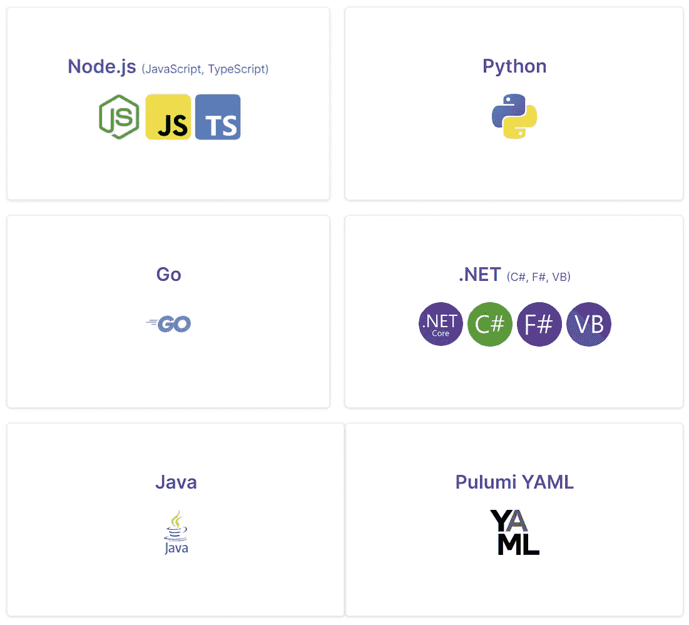

# Pulumi:作为代码工具的终极基础设施

> 原文：<https://betterprogramming.pub/pulumi-the-ultimate-infrastructure-as-code-tool-8be5ae471a9c>

## 利用 Pulumi 基于代码的方法转变基础设施管理


图片由 Pulumi 提供

# 介绍

基础设施代码(IaC)使用配置文件描述和提供基础设施，而不是通过 web 界面手动设置资源。这种方法有几个好处，包括可重复性、版本控制和协作。

Pulumi 是一个 IaC 工具，支持许多云提供商，包括 AWS、Azure、Google Cloud 和 Kubernetes。它可用于管理基础设施和应用程序。

我们将看看 Pulumi 是什么，它是如何工作的，以及为什么它对管理云资源如此有用。我还将提供一个代码示例，展示如何使用 Pulumi 部署一些 AWS 基础设施资源。

# 普鲁米是什么？

Pulumi 是一个开源的基础设施代码(IaC)平台，允许开发人员管理和部署云资源。它使开发人员能够使用他们熟悉的编程语言来定义他们的基础设施，包括 Java、JavaScript/TypeScript、Python 和 Go。

这意味着开发人员可以使用他们首选语言的全部功能，包括循环、条件和函数等功能，来清晰简洁地表达他们的基础设施，而不是用特定领域语言(DSL)编写模板，如 Terraform 或 CloudFormation，或者通过 web 界面进行手动配置。

# 普鲁米是怎么工作的？

如上所述，Pulumi 允许开发人员使用他们选择的编程语言的代码来定义他们的基础设施。然后，这些代码被转换成特定于云的模板，并部署到所需的云提供商。

一旦部署了基础设施，Pulumi 就会跟踪资源的当前状态，并可用于进行更改和更新。这是通过修改代码并像任何其他应用程序一样部署更改来完成的，然后 Pulumi 将这些更改应用于现有的基础设施。这使得协作和版本控制变得容易，因为基础设施可以像任何其他代码库一样对待。

除了管理基础设施，Pulumi 还提供了部署和管理应用程序的工具。通过这种方式，您可以使用一个统一的平台来管理整个堆栈，从基础架构到代码。

## 大量

每个 Pulumi 程序都被部署到一个堆栈中。Pulumi 栈用于管理开发过程的不同阶段。堆栈本质上是相关资源的集合，代表基础设施的特定部署。例如，您可能有一个堆栈用于生产环境，另一个堆栈用于暂存环境。

堆栈对于组织和管理基础设施非常有用，因为它们允许您分别隔离和管理不同的部署。每个堆栈都有自己的配置和状态，可以使用 Pulumi CLI 进行管理。

一个 Pulumi 项目可以有任意多的不同堆栈。例如，当处理一个特性分支时，你也可以创建一个新的堆栈。这样，您可以测试新的更改，而不会影响当前部署的资源。

# 普鲁米的好处

## 使用熟悉的编程语言

使用 Pulumi 的主要好处之一是它允许开发人员使用熟悉的编程语言来定义他们的基础设施。正如我已经提到的，Pulumi 允许您使用您喜欢的编程语言的全部功能。随着时间的推移，这使得理解、维护和发展基础设施变得更加容易。

Pulumi 支持以下语言:



## 丰富的 API

Pulumi APIs 是平台的关键部分，构建在 Terraform 之上。它们提供了开发人员可以用来管理和部署基础设施的工具和库。例如，开发人员可以使用 Pulumi APIs 来创建和配置 AWS EC2 实例、Azure 虚拟机、Google 云存储桶和许多其他资源。

这些 API 还支持常见的基础设施管理任务，例如创建和管理资源之间的依赖关系、定义访问控制策略以及监控所部署资源的健康状况和性能。在处理复杂的基础设施时，这可以节省时间和精力，使您能够专注于应用程序的业务逻辑，而不是底层基础设施。

此外，与其他 IaC 平台相比，Pulumi APIs 提供了更大的灵活性和控制能力。例如，开发人员可以使用 API 创建定制的资源类型，并定义他们自己的部署策略。这对于构建复杂的多云基础设施或者实现定制部署模式和最佳实践非常有用

## 与流行工具的集成

Pulumi 与 Git、Slack 和 CI/CD 系统等流行工具和服务无缝集成。这使得它可以轻松地适应现有的工作流和工具，并有助于改善团队成员之间的协作和协调。

## 普鲁米 CLI

除了它的 API 和与流行工具的集成，Pulumi 还提供了一个命令行界面(CLI ),允许开发人员管理他们的基础设施和配置。Pulumi CLI 提供了一系列用于处理 Pulumi 项目的命令，包括用于创建、更新和删除资源以及用于管理机密、配置设置等的命令。

Pulumi CLI 还允许开发人员在部署之前预览他们的基础设施更改，并查看他们的基础设施的当前状态。这有助于降低错误和意外变更的风险，并对基础设施变更的影响提供有价值的见解。

下面是一个使用 Pulumi CLI 创建新堆栈、预览更改和部署堆栈的示例:

1.首先，使用`pulumi new`命令创建一个新的 Pulumi 项目。这将为 Pulumi 项目创建一个包含必要文件和配置的新目录。

```
pulumi new aws-typescript
```

2.接下来，使用`pulumi stack init`命令为您的项目创建一个新的堆栈。这将创建一个具有唯一名称的新堆栈，并允许您为堆栈指定配置选项。

```
pulumi stack init dev
```

3.在您为您的新堆栈配置并编写代码之后，您现在可以使用`pulumi up`命令来预览将对您的基础设施做出的更改。这将向您显示将要进行的更改的摘要以及任何潜在的问题或冲突。

```
pulumi up -s dev
```

4.如果您对预览感到满意，可以从命令行选择“是”继续部署。一旦您将来对代码进行了任何更改，您可以再次运行该命令，向您显示将对现有堆栈进行的更改。

# 代码示例

我将提供一个简单的例子，使用 Pulumi 框架和 AWS SDK 创建一个 VPC 和多个 EC2 实例。它演示了如何使用循环和数组函数来管理资源集合，以及如何导出值以在程序的其他地方使用。

以下示例创建了一个 AWS 虚拟私有云(VPC)和多个 Amazon 弹性计算云(EC2)实例:

```
import * as pulumi from "@pulumi/pulumi";
import * as aws from "@pulumi/aws";

const vpc = new aws.ec2.Vpc("my-vpc", {
    cidrBlock: "10.0.0.0/16",
});

const instanceNames = ["web1", "web2", "web3"];

const instances = instanceNames.map(name => {
    return new aws.ec2.Instance(name, {
        instanceType: "t2.micro",
        vpcId: vpc.id,
        subnetId: vpc.publicSubnetIds[0],
    });
});

export const instanceIds = instances.map(instance => instance.id);
```

首先，我们从`@pulumi/pulumi`和`@pulumi/aws`包中导入必要的模块开始。这些模块提供了对 Pulumi 框架和我们将使用的 AWS 云资源的访问。

接下来，我们使用`aws.ec2.Vpc`类创建一个 AWS VPC。这个 VPC 将用于托管 EC2 实例。VPC 的`cidrBlock`属性被设置为`10.0.0.0/16`，它定义了 VPC 内使用的 IP 地址的范围。

然后我们创建一个实例名数组，它将用于我们将要创建的 EC2 实例。

最后，我们使用一个`map()`函数遍历实例名，并为每个实例创建一个 EC2 实例。`aws.ec2.Instance`类用于定义每个实例的属性，比如实例类型(`t2.micro`)以及 VPC 和子网 id。然后将结果实例添加到一个数组中，该数组作为`instanceIds`导出，以便程序的其他部分可以访问它们。

现在，这是相同实现，但是是在云结构中:

```
---
AWSTemplateFormatVersion: '2010-09-09'
Resources:
  VPC:
    Type: AWS::EC2::VPC
    Properties:
      CidrBlock: 10.0.0.0/16

  Web1:
    Type: AWS::EC2::Instance
    Properties:
      InstanceType: t2.micro
      VpcId: !Ref VPC
      SubnetId: !GetAtt VPC.PublicSubnetIds[0]

  Web2:
    Type: AWS::EC2::Instance
    Properties:
      InstanceType: t2.micro
      VpcId: !Ref VPC
      SubnetId: !GetAtt VPC.PublicSubnetIds[0]

  Web3:
    Type: AWS::EC2::Instance
    Properties:
      InstanceType: t2.micro
      VpcId: !Ref VPC
      SubnetId: !GetAtt VPC.PublicSubnetIds[0]

Outputs:
  InstanceIds:
    Description: The IDs of the EC2 instances
    Value:
      - !Ref Web1
      - !Ref Web2
      - !Ref Web3
```

如您所见，Pulumi 代码比同等的 Cloudformation 语法更容易阅读、维护和更新(在我看来)。

# 结论

Pulumi 是一个使用熟悉的编程语言管理云资源的强大而方便的平台。然而，像任何技术一样，它也有其局限性和缺点。

例如，Pulumi 是一个相对较新的平台，可能没有像 Terraform 这样更成熟的 IaC 工具那样得到相同水平的社区支持和采用。此外，因为它使用编程语言来定义基础设施，所以与其他使用声明性语言的 IaC 工具相比，它可能需要更多的专业知识和精力。

尽管有这些限制，Pulumi 的无服务器架构、API 的组合，以及与其他服务的集成，使其成为希望利用基础设施作为代码的好处的开发人员和组织的一个引人注目的选择。

无论是部署一个简单的 web 应用程序还是管理一个复杂的多云环境，Pulumi 都拥有帮助您成功的工具和能力。尝试一下，看看它如何帮助您更有效地管理云资源。Pulumi 会指导你完成一些很酷的小挑战，帮助你熟悉并开始使用他们的平台:[https://www.pulumi.com/challenge/](https://www.pulumi.com/challenge/)

```
**Want to Connect?**

You can reach me through my [website](https://www.michaelphamill.com/) where I have links to my other socials
and a contact form. I am always happy to connect with new people!
```