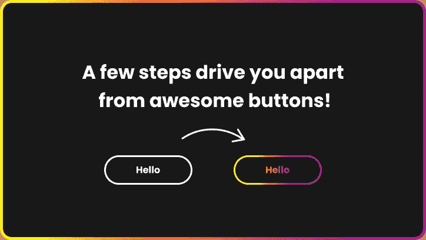
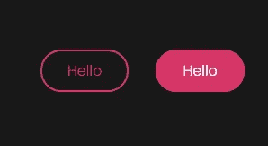
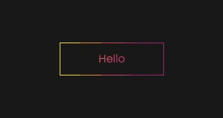
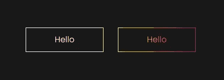

# 构建一个纯 CSS 动画渐变颜色按钮比你想象的要简单

> 原文：<https://betterprogramming.pub/pure-css-animated-gradient-colour-button-is-easier-than-you-think-f19e86bbbc4f>

## 给你的网站增添一些活力



作者照片。

大部分按钮都很无聊。标准实心边框。大部分都没有对齐正确。在今天的文章中，让我们学习如何创建一个带有动画边框和文本的渐变颜色按钮！一个 CSS 属性将处理所有的动画。

# 轮廓按钮——简单、直接、枯燥

让我们从一个带有悬停的基本轮廓按钮开始。它可以这样创建:

HTML:

```
<a href="/" title="Hello button" class="btn">Hello</a>
```

CSS:



标准和悬停

# 渐变按钮和文本

更进一步，让我们添加渐变边框和文本。为了实现这一目标，我们需要做几件事:

*   用`div`包裹我们的按钮，并将背景设置为我们的身体颜色。
*   添加伪元素以创建边框。
*   最后，我们需要添加三个 CSS 属性(`[background-clip: text; -webkit-background-clip: text;](https://developer.mozilla.org/en-US/docs/Web/CSS/background-clip)`)。
*   `[-webkit-text-fill-color: rgba(255,255,255,0.001)](https://developer.mozilla.org/en-US/docs/Web/CSS/-webkit-text-fill-color)`

HTML:

```
<a href="/" title="Hello button" class="btn">Hello</a>
```

CSS:



厉害！您已经创建了一个带有渐变文本的渐变边框按钮！现在我们将通过额外的 CSS 来赋予它生命。

# 最终凸台—动画渐变按钮

在 CSS 中，我们不能过渡渐变。如果能看到 CSS 像这样流畅的动画就太棒了:

但是行不通。它立即转换到另一个，没有过渡。有一些黑客可以做到这一点，但我最喜欢的是动画`background-position`。

首先，我们需要向按钮添加两个属性:

*   `background-size` : 200%自动
*   `background-position`:左侧居中

然后悬停:

*   `background-position`:右居中

在这种情况下，我添加了一个从白色开始的渐变。它增强了动画边框的效果。

HTML:

```
<a href="/" title="Hello button" class="btn">Hello</a>
```

CSS:



标准和悬停

就是这样！

可以用 CodePen 上的最后一个按钮[来玩。](https://codepen.io/walickialbert/pen/BazrpZM)