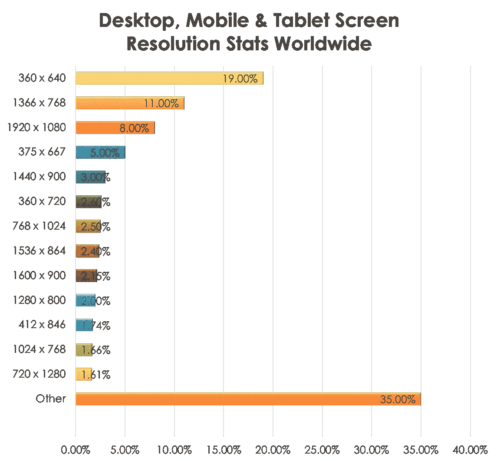
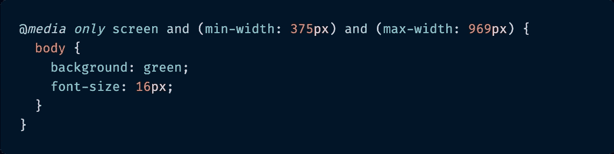
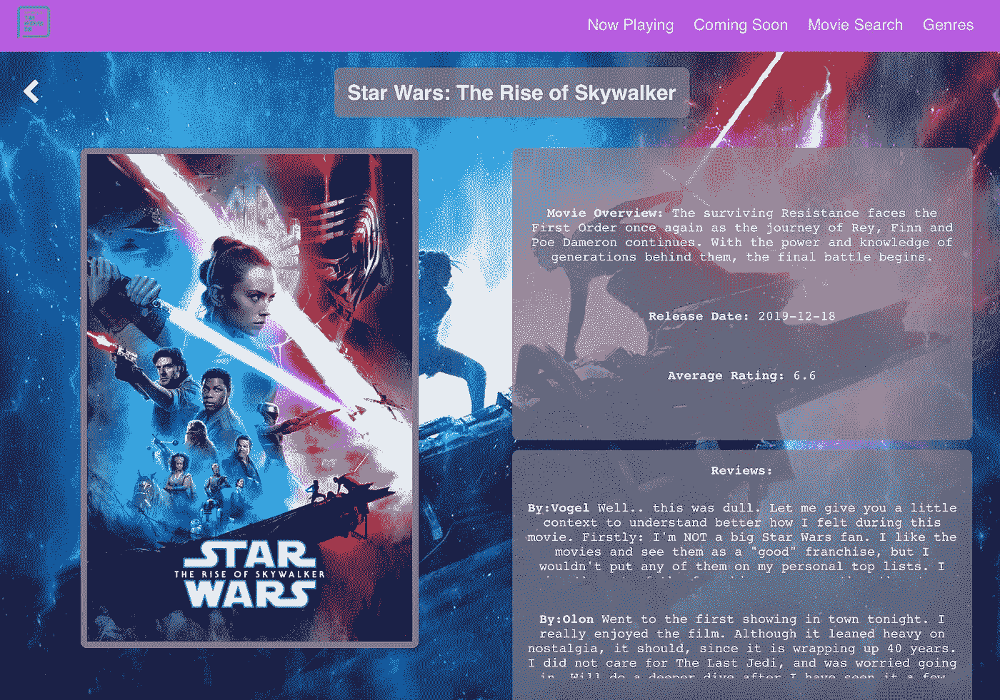
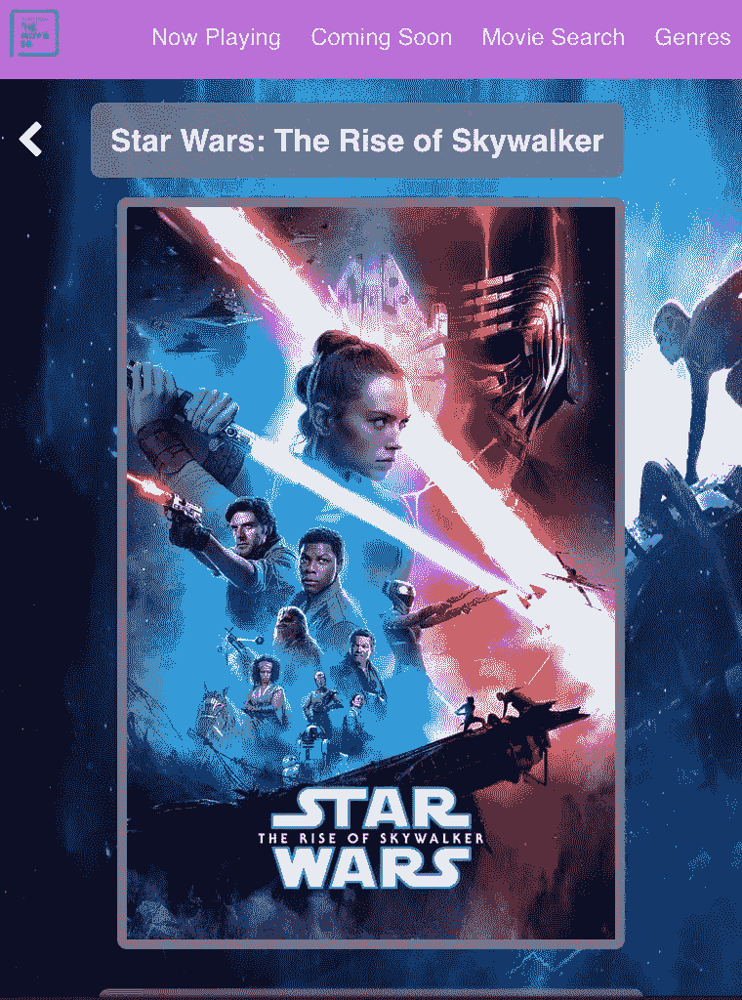
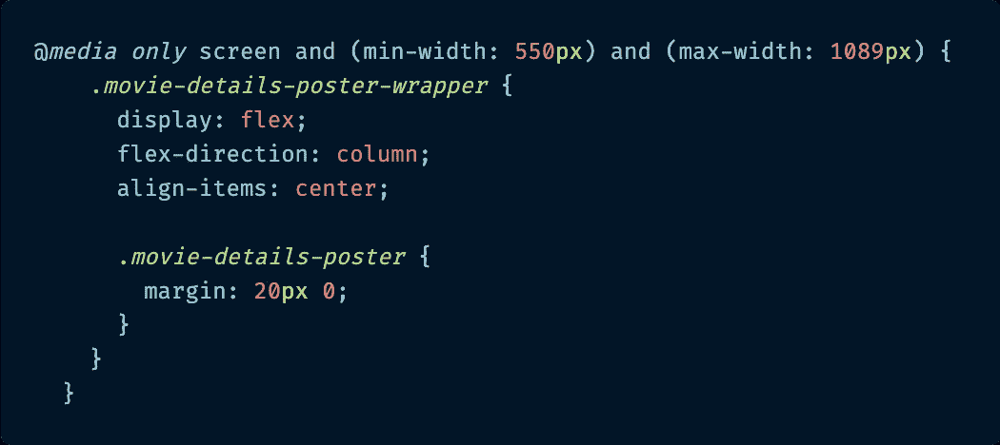
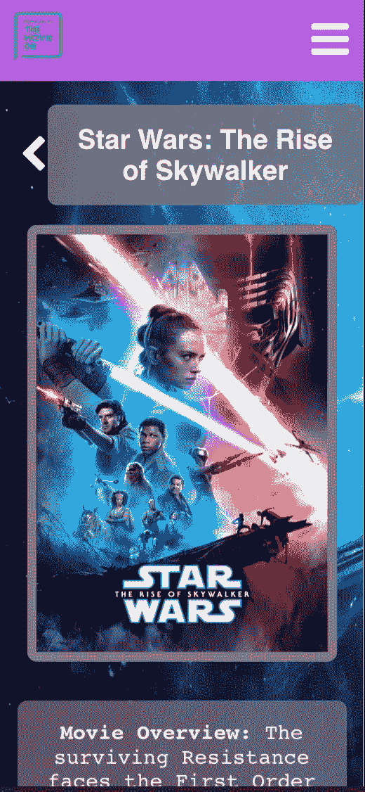
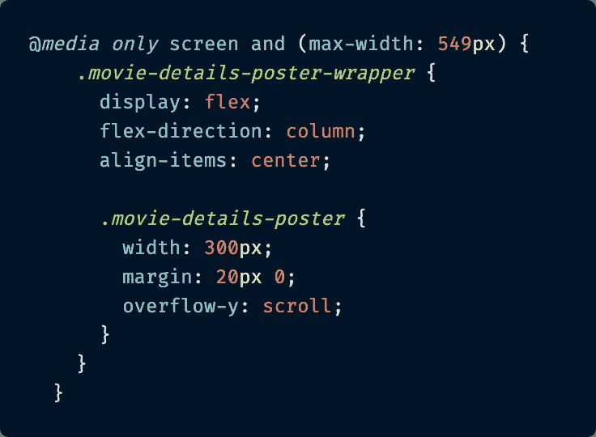

# 纯 CSS 媒体查询和响应式网页设计

> 原文：<https://betterprogramming.pub/pure-css-media-queries-and-responsive-web-design-with-react-bac7a31e84b4>

## 构建适合用户设备大小的网页和应用程序


多梅尼科·洛亚在 [Unsplash](https://unsplash.com/s/photos/responsive-design?utm_source=unsplash&utm_medium=referral&utm_content=creditCopyText) 上拍摄的照片

# 介绍

最近，我和一位同事在科技大会 [Connect 上做了一次演讲。Tech](https://connect.tech/) 关于构建应用程序时对响应式 web 设计日益增长的需求，以及实现这一需求的几种不同方式，特别是在 JavaScript 框架方面，React。

如果你不熟悉这个术语，让我快速定义一下*响应式网页设计*，这样我们都从同一个地方开始。我发现的最好的定义直接来自于《粉碎》杂志，它是网站开发者和网站设计者的主要编辑声音。

> “响应式网页设计是一种方法，它建议设计和开发应该根据屏幕大小、平台和方向来响应用户的行为和环境。”— [砸弹匣](https://www.smashingmagazine.com/2011/01/guidelines-for-responsive-web-design/)

在构建应用程序时，从多种浏览器/设备尺寸的响应式设计开始，这在当今世界越来越有必要，这一点应该是有道理的，但如果您想要一些统计数据，这里有一些应该有助于说服您。

> “2018 年，全球所有网站流量的 52.2%是通过手机产生的，高于上一年的 50.3%。”— [统计人员](https://www.statista.com/statistics/241462/global-mobile-phone-website-traffic-share/)

并且:

> "平均而言，88%的全球消费者表示他们同时使用 2.42 台设备进行多重屏幕操作."— [土坯](https://blogs.adobe.com/creative/files/2015/12/Adobe-State-of-Content-Report.pdf)

或者考虑一下这张 2018 年 8 月-2019 年 8 月的图表，显示了全球用户的平均屏幕尺寸。



数据来源:[global stats](https://gs.statcounter.com/screen-resolution-stats/desktop-mobile-tablet/worldwide/#monthly-201808-201908-bar)2018 年 8 月—2019 年 8 月。

在 2020 年及以后，所有迹象都表明，无论用户身在何处，都需要响应式设计来满足他们。

虽然我不会深入讨论如何实现响应式设计的所有细节(如果你愿意，你可以看到演讲的完整[幻灯片)，但我想分享两种实现响应式设计的可能方法，供其他希望开始使用它的人参考。](https://t.co/WFHmJsDZ4d?amp=1)

本文将介绍响应式 web 设计的第一个解决方案:CSS 媒体查询，它适用于任何使用 CSS 样式的 JavaScript 应用程序。

# 什么是 CSS 媒体查询？

[媒体查询](https://www.w3schools.com/cssref/css3_pr_mediaquery.asp)是一种向台式机、笔记本电脑、平板电脑和手机发送定制样式表(响应式网页设计)的流行技术。

CSS 媒体查询通常用于检查以下内容:

*   视口的宽度和高度。
*   设备的宽度和高度。
*   方向(设备是横向模式还是纵向模式？).
*   分辨率。

它们还可以用于指定某些样式仅用于打印文档或屏幕阅读器。

## CSS 媒体查询剖析

但是到目前为止，媒体查询最常见的用途属于上面的第一组要点:检查视口和设备的宽度和高度，以了解要提供哪种 CSS 样式。

这里有一个 CSS 媒体查询代码的例子。

CSS 媒体查询的典型示例:



这里有一个你可能在 CSS 中看到的典型媒体查询的例子。

```
@*media* *only* screen and (min-width: 375px) and (max-width: 969px) {  
  body { 
    background: green;
    font-size: 16px;
  }
}
```

CSS3 引入的`@media`规则用于为不同的媒体类型/设备应用不同的样式。`only screen`适用于所有电脑屏幕、平板电脑、智能手机等。

在上面的例子中，这个 start 指定了在中定义的 CSS 样式(`background: green`和`font-size: 16px`)将只应用于尺寸至少在 375px ( `min-width: 375px)`，一直到 969px ( `max-width: 969px`)之间的屏幕的`body` HTML 标签。

这是一个非常基本的例子，但是 CSS 媒体查询非常强大。它们可以用来显示和隐藏 DOM 的不同元素，调整字体大小，以及相对容易地切换整个页面布局。

在向您展示我是如何使用它们的之前，让我们先来谈谈媒体查询的两种基本设计方法。

# CSS 媒体查询方法

编写 CSS 媒体查询有两种常见的方法。它们被称为*减法 CSS* 和*加法 CSS* 。

没有哪一个真的比另一个更好，它更多地取决于应用程序的主要受众来帮助确定哪种方法适合您。

有助于弄清楚这一点的问题可能包括:“它将更多地用于移动设备还是台式机，还是将用于一大群不同的用户，还是一个公司内部的一小群用户？诸如此类的事情。

以下是关于这两种方法的更多细节。

## 减法 CSS

第一种方法是减法 CSS，这种方法可能更常用于拥有更小、更同质用户群的应用程序。

想想组织内用于非常特定目的的内部应用程序，这些应用程序通常只能通过特定设备访问，原因可能是公司防火墙、网络或硬连线终端等。

减色 CSS 通常从最大分辨率的构图和屏幕样式开始。它从最大的显示器开始，然后添加媒体查询以*撤销*较小视窗不需要的 CSS。

基本上，它加入了一些样式，撤销了一些以更高分辨率布局的更复杂的布局。

尽管它的名字中有减法，但它通常会导致更多的 CSS 行不得不覆盖底层样式。

你可以看看这个代码笔，它展示了减法 CSS 的工作原理。看看我必须添加多少 CSS 来从宽屏视图撤销布局以适应更小的视窗。

如果扩展和收缩视口，可以看到大屏幕、平板电脑和移动设备的样式发生变化。

一个交互式的减法 CSS 代码笔。

## 加法 CSS

加法 CSS 是减法的反义词，顾名思义。使用附加 CSS，你首先从最小分辨率的样式开始，随着屏幕尺寸的增加，向*添加媒体查询来构建*CSS。

开始很简单，随着水平屏幕空间的增加，布局变得更加复杂。

一般来说，附加 CSS 可能是开始设计新应用程序的更推荐的方式。如果它是移动优先设计的，并且需要覆盖和撤销的 CSS 更少，那么它会使在不同断点加载的 CSS 数量更少(对您的最终用户体验更好)。

此外，用户很有可能会从各种不同的屏幕尺寸和设备上访问应用程序，这是你无法想象的，因此对他们进行分类是非常重要的。

这是另一个显示附加 CSS 工作的代码笔。您可以看到，在这个示例中，我首先从最小的视窗开始，随着媒体查询下视窗大小的增加，慢慢添加更多的细节和布局复杂性。

尝试调整视口大小以查看 CSS 的变化。

附加 CSS 的交互式代码笔。

我知道这两个例子看起来都很简单，但是想象一下一个更大的多屏应用程序(见鬼，看看你经常在手机和笔记本上使用的大多数应用程序)，然后想想你如何使用这两种方法来构建它们。

# 我如何在 React 中使用 CSS 媒体查询

除了我们在会议上的发言，我还建立了三个 React 电影演示站点来说明我的观点，使用了[电影数据库 API](https://developers.themoviedb.org/3/getting-started/introduction) 作为数据源。

第一个站点完全没有响应，显示了跨多个设备的糟糕用户体验。

第二个网站是用 CSS 媒体查询构建的，使其能够响应平板电脑和移动设备。第三个站点是使用名为 [React-socks](https://github.com/flexdinesh/react-socks) 的 React 专用响应库构建的，以使其具有响应性。

第二个演示是我将在博客中展示的代码片段。如果你想看完整的代码库，可以在 GitHub 上找到[，如果你想看现场版，可以在这个网站](https://github.com/paigen11/movie-demo-2)上找到[。](https://movie-demo-2.paigen11.now.sh/)

## 基本组件示例

**桌面视图**

我将向您展示我的应用程序中的`MovieDetails` React 组件的一部分 CSS。下面是使用该组件的桌面页面的外观。



我的应用程序中使用“MovieDetails”组件的页面。

正如你从截图中看到的，在桌面大小的布局相当复杂:电影海报背景，官方预告片海报在左侧，电影简介，上映日期，评级和评论在右侧，等等。

这是制作电影海报的 CSS 片段。这是我用来构建小屏幕视图的基础 CSS。没错，这就是减法 CSS 的一个例子。

`MovieDetails.scss`


这是进入“MovieDetails.js”组件页面的所有 CSS 的一小部分。

好的，你可以看到我在桌面布局中使用了 [CSS 网格](https://css-tricks.com/snippets/css/complete-guide-grid/)布局。现在，让我们看看视图和组件的 CSS 是如何随着屏幕尺寸的缩小而变化的。

## 具有媒体查询的相同组件

**平板电脑视图**

这是同样的 React 组件`MovieDetails`在平板电脑上的外观。



使用“MovieDetails”组件的应用程序中的平板电脑视图页面。

在平板电脑视窗尺寸下，电影海报位于视窗中央，剧情简介、评分和评论在海报下方滑动。

这是这个视图中 CSS 的一部分。

`MovieDetails.scss`



相同的“MovieDetails”组件 CSS，但现在是平板电脑大小。

对于 tablet 视图，CSS 布局从 Grid(设计布局的二维方式)切换到 [CSS Flexbox](https://css-tricks.com/snippets/css/a-guide-to-flexbox/) (安排布局的更一维方式)。更适合每个元素一个接一个按顺序排列的视图。

够直接了。

接下来是最后一个例子:移动视图。

**移动视图**



最后，应用程序中使用“MovieDetails”组件的移动视图页面。

移动视图更类似于`MovieDetails` React 组件的平板视图。同样，电影海报是最前面和最中心的，总览和收视率排在后面。

对于手机，字体大小也增加了，现在评论上有一个“阅读更多…”的切换，而不是用户可以从头开始滚动整个评论，因为他们可以在更大的视图大小。

这是伴随它的 CSS 的最后一个例子。

`MovieDetails.scss`



“MovieDetails”组件的 CSS，但适用于移动大小。

如您所见，`.movie-details-poster-wrapper`的`display`属性在 CSS Flexbox 中保持这个视口大小，而它的`flex-direction`保持`column`，因此其中包含的所有子元素都排列得很好。

不过您会注意到，对于这个视图，`.movie-details-poster`设置了一个`width`属性来防止它超出视口的宽度(默认情况下，TMDB API 提供的实际图像是 500px 大)，以及它的其他样式属性。

有道理？很好，现在我将快速概述一下我在使用 CSS 媒体查询时遇到的利与弊。

# CSS 媒体查询的利与弊

我已经介绍了 CSS 媒体查询的基础知识，以及如何在 React 中使用它们，但是我觉得有必要讨论一下它们的优缺点。

有时，它们可能是一个很好的解决方案，但它们可能并不完美，无法解决每一个响应式设计问题。

先说亮点。

## CSS 媒体查询的好处

*   当在不同的布局中稍微重用相同的组件时非常有用*——只要组件中元素的位置或可见性没有太大的不同，CSS 媒体查询应该能够完成这项工作。当需要以不同的视口大小添加全新的组件时，JavaScript 和 JSX 组件代码可能会变得复杂。*
*   *断点可以跨组件重用——这是一个很好的节省时间的方法。通常，您为一个组件设置的视口断点对其他组件也有意义，因此不需要为应用程序的每个页面重新设计。*
*   *关注点分离——对于不属于 CSS-in-JS 阵营的人(我知道有很多)，CSS 媒体查询提供了逻辑和表示的良好分离。CSS 严格处理布局，JavaScript 和 React 框架处理数据获取和逻辑操作。*

*虽然 CSS 媒体查询有很多优点，但也有一些缺点。*

## *CSS 媒体查询的缺点*

*   *CSS 可能很快变得又长又乱——如果一个组件有三个或更多大小的断点，并且使用了更多的减法样式的 CSS，那么 CSS 文件可能会变得很长。例如，我在上面的例子中引用的`MovieDetails.scss`文件在被 [webpack](https://webpack.js.org/) 打包用于部署之前有 176 行长。这是一个相对简单的例子，它可以变得比这复杂得多。*
*   *从一个尺寸到另一个尺寸非常不同的布局需要用`display: none`复制代码来实现结果——这一点是不言自明的，但是如果你有一个桌面布局，顶部有一个`title`元素，下面有一个图像，但是移动布局在`title`上面有一个图像，可能没有办法编写 JSX，这样你就不会在代码的两个地方重复`title`。这意味着在一个组件中不同视口级别的重复元素，这意味着可读性更差，维护代码更复杂。*

*CSS 媒体查询很棒，但它们并不总是正确的答案，在使用它们之前了解这一点很重要。*

# *结论*

*响应式网页设计是当今每个设计师和开发者都需要思考的问题。我们甚至无法想象应用程序可能被使用的一些场景，我们不能给用户不好的体验，因为我们的竞争对手不会。*

*有很多解决方案，但是我选择研究的方法之一是在 React 应用程序中使用 CSS 媒体查询。它们原生于 CSS3，这意味着不管您的 JavaScript 框架如何，只要它使用 CSS 进行样式化，您就可以利用它们。*

*实现它们只需要很少的额外 CSS，至少最初是这样。如果您正确构建 CSS(使用随着屏幕变大而增加的附加 CSS 方法)，移动 CSS 包的大小可以非常小，这意味着用户可以获得更快的加载时间和更好的体验。这是一个非常可靠的选择。*

*过几周再来看看，我会用 React.js 写这个关于响应式设计的系列的第二篇文章，这篇文章将重点讨论一个让站点具有响应性的 React 专用解决方案。*

*感谢您的阅读，我希望您在设计和构建自己的响应式 web 应用程序时，能够考虑 CSS 媒体查询。它们是一种强大、通用的解决方案。*

# *参考资料和更多资源*

*   *GitHub repo，React app 用 CSS 媒体查询响应式设计: [GitHub](https://github.com/paigen11/movie-demo-2) 。*
*   *[响应式 app](https://movie-demo-2.paigen11.now.sh/) 现场演示现场。*
*   *响应式网页设计，粉碎杂志:[粉碎杂志](https://www.smashingmagazine.com/2011/01/guidelines-for-responsive-web-design/)。*
*   *响应式设计采用 React.js [演示平台](https://drive.google.com/drive/folders/1oRtHrgzpPorn9ogGpAxA5lPrH3ycCYK9)。*
*   *媒体查询， [W3 学校](https://www.w3schools.com/cssref/css3_pr_mediaquery.asp)。*
*   *CSS 网格参考， [CSS 招数](https://css-tricks.com/snippets/css/complete-guide-grid/)。*
*   *CSS Flexbox， [CSS 招数](https://css-tricks.com/snippets/css/a-guide-to-flexbox/)。*