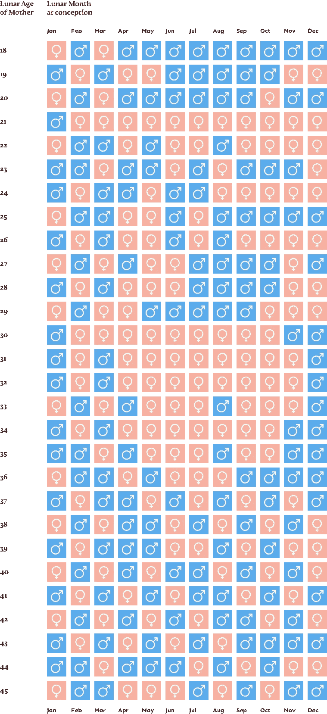
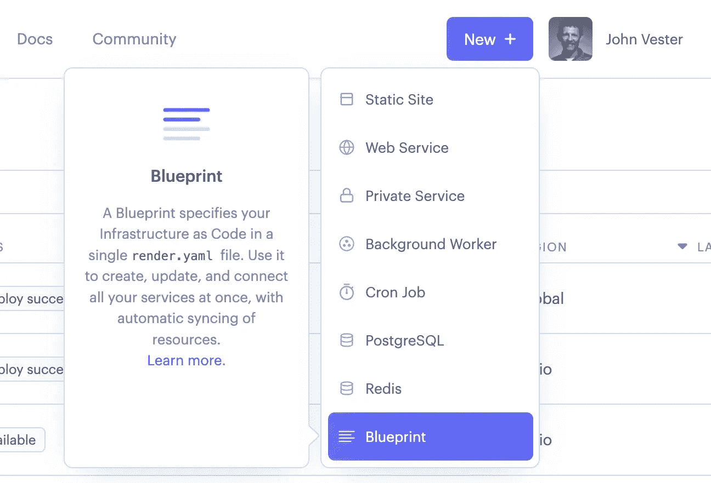
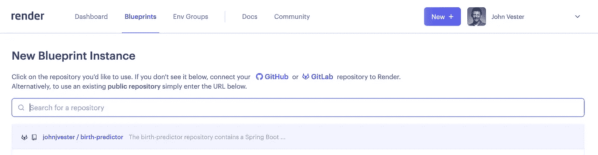
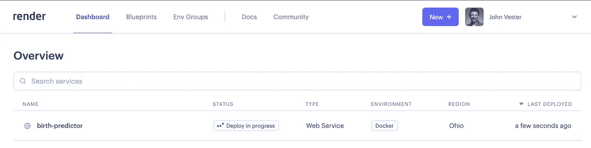
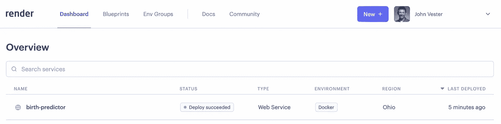

# 目的驱动的微服务设计

> 原文：<https://betterprogramming.pub/purpose-driven-microservice-design-c25fa2a3ad0e>

## 创建目的驱动的微服务应该永远是一个目标。了解渲染蓝图如何提供可重复的策略。


当我开始我的职业生涯时，流行语并不是我所期望的。在那些日子里，大多数技术新闻都是通过纸质的周刊，如《信息周刊》和《网络世界》来发布的。我记得我对自己说，“伙计，他们每个星期都在一遍又一遍地使用这些相同的词。”

也就是说，人们一直在使用流行语。那时候，我最喜欢的两个词是把互联网称为“万维网”和“信息高速公路”。我总是想知道在某个时候是否会有一条超级高速公路。

然而，最近，我注意到流行语被用作占位符，在它们不太有意义的地方。微服务、事件驱动架构、人工智能和 ML 等术语在上下文中使用，这让我得出结论，许多人不太理解这些术语。我也没想到会这样…

想象一下与一个被误解的问题相关的简单对话:

你的航班什么时候起飞？

**人物 2** :今年晚些时候。

虽然 2 号人物提供了一个正确的答案，但是这个回答并没有真正给 1 号人物的询问带来任何价值。

同样，迁移到微服务的探索也经历了类似的挑战。我经常与客户和公司合作，他们的“微服务”设计产生了单一服务。基本上，一个单一的应用程序被一个真正大的 RESTful API 所取代。

对于本出版物，我认为通过正确的方式创建一个目的驱动的微服务设计的例子会很有趣。

# 目的驱动的微服务设计

目的驱动的微服务是一种可以独立存在的服务，它可以在需要时包含一个专用的持久性存储。通过目的驱动，微服务将提供一组集中的信息，并成为相关 API 中管理的数据的记录系统。

通过采用目的驱动的微服务方法，用户可以添加额外的节点并缩减现有节点，以满足该时间点的 API 需求。

例如，专注于所得税某个方面的目的驱动的微服务可能在上半年使用量最高，而在下半年需要运行的实例较少。

让我们通过一个非常简单的例子来关注目的驱动的微服务设计的创建。

# 创建基于 Docker 的微服务

[中国性别预测器](https://www.thebump.com/chinese-gender-chart)是一个网格系统，用于预测出生婴儿的性别。这是通过提供受孕月份和母亲在受孕时的当前年龄来完成的。

有传言说，清朝皇室依靠同样的网格来选择儿子的性别，他们更喜欢为家庭提供工作和金钱，以及延续家族血统。

以下是中国性别预测网格的图示:



举个例子，一个 18 岁的母亲在一月份怀孕，将会生下一个女婴。

对于本出版物，我们将创建一个目的驱动的微服务，该服务基于相同的标准返回性别预测。上面示例的最终有效负载如下所示:

```
{
    "month": 1,
    "age": 18,
    "gender": "female",
    "errorMessage": **null**
}
```

微服务将利用 Java 和 Spring Boot，并采用多级 Docker 文件来编译服务，并构建一个可以托管出生预测 API 的 Docker 映像。

该服务的代码可在 GitLab 上找到，地址如下:

https://gitlab.com/johnjvester/birth-predictor

# 使用渲染蓝图创建可再现的图案

我在以下出版物中写过关于[渲染](https://render.com/)平台的文章:

*   [第一次使用 Render and Go](/how-to-create-a-web-service-using-render-and-go-75d211421a00)
*   [引擎盖下:渲染统一云](/render-unified-cloud-under-the-hood-940d097cede8)

对于我在 Render 上运行的个人实例，我使用了 Go 编程语言、静态站点和 Postgres 实例。这一次，我用 Java/Spring Boot 编写了服务。虽然对 Java 的原生支持尚不存在，但 Render 平台确实支持在 Docker 容器中运行的任何东西。

由于出生预测服务包括一个多阶段 Docker 文件，我想看看在渲染平台上部署一个基于 Docker 的服务有多容易。然而，我注意到了[蓝图规范](https://render.com/docs/infrastructure-as-code)，也想看看它是如何工作的。

## 什么是蓝图？

蓝图是 Render 的基础设施即代码(IaC)实现。IaC 也是我归类到一个更大的概念中的东西，叫做“*作为代码”。需要管理多个服务的部署或服务需要大量选项的组织可以将其渲染基础架构(服务、数据库和环境组)定义为 render.yaml 文件中的代码。

## 使用渲染蓝图

基于此处[提供的蓝图示例](https://render.com/docs/blueprint-spec#sample-blueprint-spec)，我能够通过 Docker 容器快速创建我的 Spring Boot 服务的蓝图:

```
services:
  - type: web
    name: restful-api-spring-boot
    env: docker
    region: ohio # optional (defaults to oregon)
    plan: free # optional (defaults to starter)
    branch: master # optional (uses repo default)
    numInstances: 1 # optional (defaults to 1)
    healthCheckPath: /actuator/health
    envVars:
      - key: SERVER_PORT
        value: 443
```

在那里，我为 birth-predictor 服务定制了 YAML 数据，以更新 **name** 属性并添加一个 **repo** 属性，如下所示:

```
services:
  - type: web
    name: birth-predictor
    env: docker
    repo: https://gitlab.com/johnjvester/birth-predictor
    region: ohio # optional (defaults to oregon)
    plan: free # optional (defaults to starter)
    branch: master # optional (uses repo default)
    numInstances: 1 # optional (defaults to 1)
    healthCheckPath: /actuator/health
    envVars:
      - key: SERVER_PORT
        value: 443
```

这些信息存储在出生预测器存储库的根目录下，一个名为 render.yaml 的文件中。提交并合并此更改后，服务就可以部署在渲染平台上了。

从渲染面板中，我选择了**新建|蓝图**选项:



接下来，我选择了出生预测库，我使用这里的指令[将它连接到我的 GitLab 账户。](https://render.com/docs/gitlab)



因为我使用的是蓝图，所以我所要做的就是为我的新服务提供一个服务组名称:


按下**应用**按钮后，展开过程开始:



几分钟后，服务部署完毕，没有出现任何问题:



# 运行中的出生预测器

随着 birth-predictor 服务的运行，我可以发出以下 cURL 命令来获得新的预测:

```
curl --location --request POST 'https://birth-predictor.onrender.com/predict' \
--header 'Content-Type: application/json' \
--data-raw '{
    "conceptionMonth" : 11,
    "conceptionAge" : 43
}'
```

产生的响应负载如下所示:

```
{
    "month": 11,
    "age": 43,
    "gender": "male",
    "errorMessage": **null**
}
```

这些信息恰好与我妻子怀上我们的儿子(芬尼)的月份和年龄相吻合。2017 年 8 月，他到了！


就像他们在清朝所做的那样，我们能够依靠中国的性别预测器成功地预测我们孩子的性别。

# 结论

自 2021 年以来，我一直试图按照以下使命宣言生活，我觉得这可以适用于任何 IT 专业人士:

> *“将您的时间集中在提供扩展您知识产权价值的特性/功能上。将框架、产品和服务用于其他一切。”*
> 
> *- J. Vester*

Render 的蓝图规范坚持我的使命声明，允许功能和服务团队专注于实现既定的目标，而不用担心任何与 DevOps 相关的事情。

一旦服务、组件或应用程序准备就绪，团队只需将 render.yaml 文件包含在其存储库的根目录中，然后使用 Blueprint 选项在 render 平台上创建一个新服务。今后，对连接的存储库的任何更新都将在将代码提交到指定的分支几分钟后自动部署。

Render 平台以 Zero DevOps 的心态生存，这在 Blueprint 概念的起源中显而易见。特性和服务开发人员希望——也应该——专注于提供更新和功能，为他们的利益相关者提供最大的价值。Render 真正理解这个现实。

我确信，流行语将永远是技术空间的一部分。然而，我希望技术人员能够理解并采纳这些流行词汇背后的真实意图。

如果您对本出版物的源代码感兴趣，可以在 GitLab 上找到，地址如下:

[https://gitlab.com/johnjvester/birth-predictor](https://gitlab.com/johnjvester/birth-predictor)

祝你今天过得愉快！