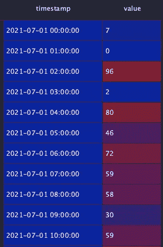
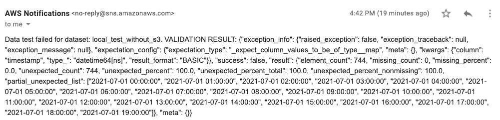
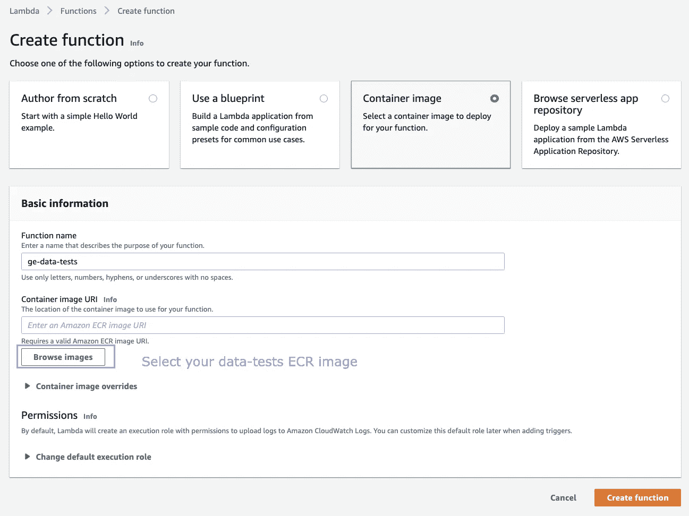
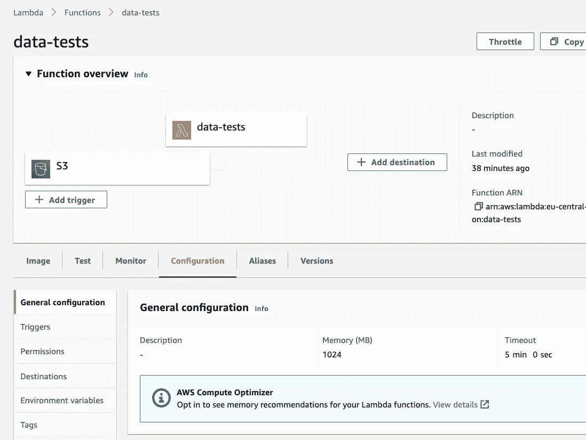
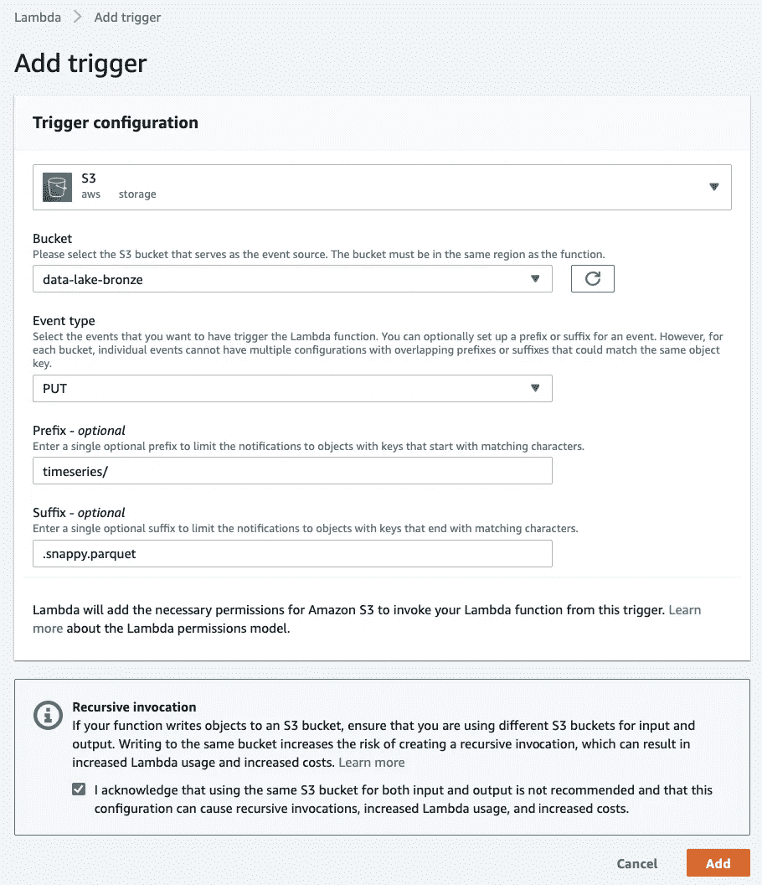
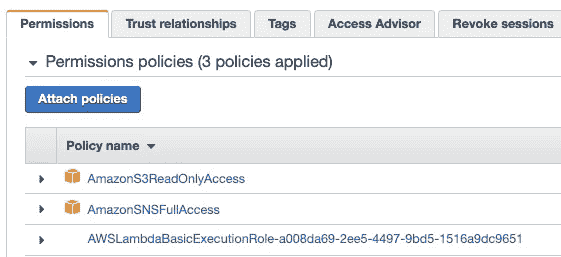
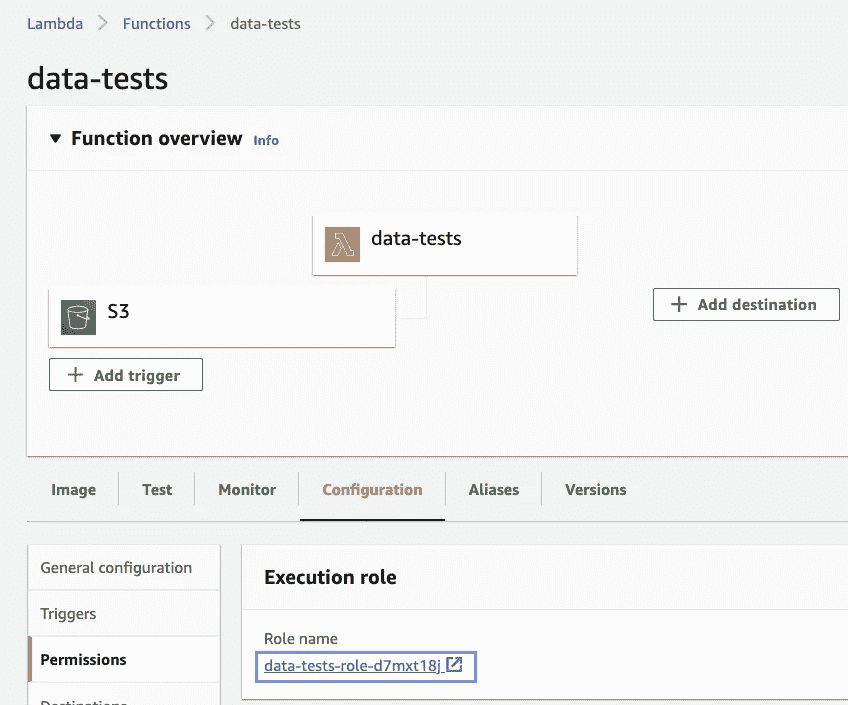
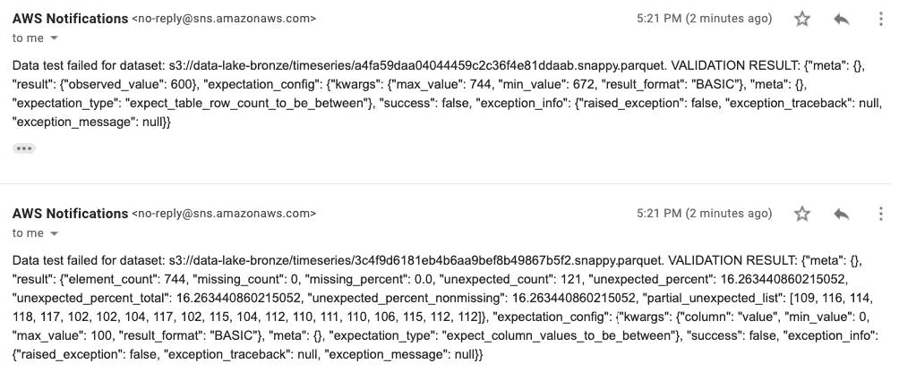
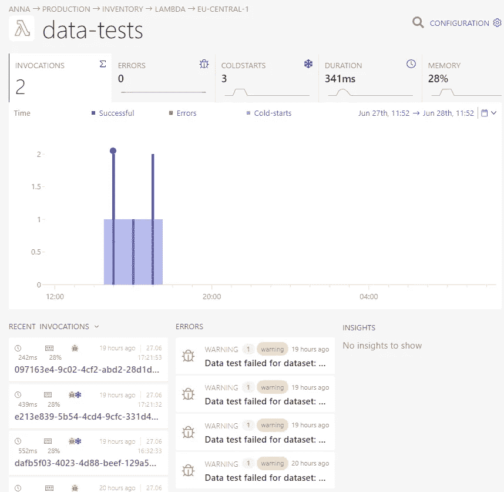
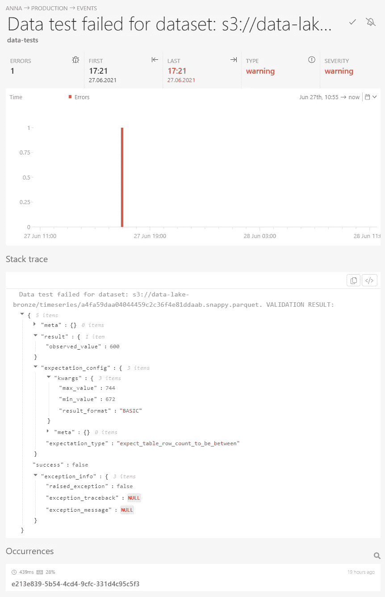

# 用事件驱动的数据测试来停止数据沼泽

> 原文：<https://betterprogramming.pub/put-a-stop-to-data-swamps-with-event-driven-data-testing-203d9c1be073>

## 使用 Python、AWS Lambda、SNS 和 Great Expectations 确保 S3 数据湖中的数据质量


来自 [Pexels](https://www.pexels.com/photo/pen-business-eyewear-research-6801648/?utm_content=attributionCopyText&utm_medium=referral&utm_source=pexels) | [品牌内容披露](https://www.annageller.com/disclosure)Anna Nekrashevich 的照片。

数据湖曾经在数据质量方面名声不佳。与数据仓库相反，在我们加载数据之前，数据不需要遵循任何预定义的模式。如果没有适当的测试和治理，您的数据湖很容易变成数据沼泽。

在本文中，我们将研究如何构建自动数据测试，这些测试将在新数据加载到数据湖时执行。我们还将配置基于 SNS 的警报，以便在数据偏离我们的*预期*时得到通知。

# **目录**

[用于数据质量的 Python 库](#e55b)
[使用远大前程](#38bf)
[使用远大前程进行事件驱动的数据测试](#8c40)
[演示:生成用于测试的时间序列数据](#cace)
[使用远大前程实现数据测试](#5412)
∘ [我们可以为这些数据运行哪些测试？](#2ee7)
∘ [如何实现数据测试？∘如何在本地运行数据测试？](#5e5a)
∘ [如何在 AWS Lambda 上运行数据测试？](#3fcc)
∘ [通过上传新文件到数据湖来测试 AWS 流程](#085f)
[如何监控这个流程？](#d291)
[结论](#7e81)

# 用于数据质量的 Python 库

有如此多的工具用于数据分析和数据测试。仅列举其中一些:

*   [Pandas Profiling](https://pandas-profiling.github.io/pandas-profiling/docs/master/index.html) 允许我们生成一个 HTML 报告，显示分位数统计、直方图、相关性、空值分布、文本分析、高基数分类变量等等。
*   [dbt 测试](https://docs.getdbt.com/docs/building-a-dbt-project/tests)让我们验证惟一性、可接受值、空值，并构建任何自定义数据测试，通过使用 SQL 查询来检测异常。
*   [壁垒](https://bulwark.readthedocs.io/en/latest/index.html)为返回熊猫`DataFrames`(例如`@dc.HasNoNans()`)的函数提供装饰器。
*   [mobyDQ](https://ubisoft.github.io/mobydq/) 是 Ubisoft 的一个工具，用于生成基于 GraphQL 的 web 应用程序进行数据验证。
*   [TensorFlow 数据验证](https://www.tensorflow.org/tfx/guide/tfdv)检测训练和模型服务数据中的异常。

我们将关注用于验证和分析数据的开源 Python 库，名为[远大前程](https://greatexpectations.io/)。

# 利用巨大的期望

使用远大前程的建议方式是:

*   安装包:`pip install great_expectations`。
*   初始化一个项目:`great_expectations --v3-api init`。
*   配置到您的数据源的连接(例如，您的数据仓库或 pandas 的平面文件或 Pyspark 验证):`great_expectations --v3-api datasource new`。
*   手动创建一个初始的期望套件，使用一批数据交互地创建，或者使用一个内置的分析器自动创建:`great_expectations --v3-api suite new`。
*   在 Jupyter 笔记本中编辑这个期望套件(`great_expectations --v3-api suite edit suite_name`)或者直接通过修改 JSON 文件(`great_expectations/expectations/<suite_name>.json`)。
*   创建一个检查点，将期望套件映射到一个`data_asset_name`，这是您想要测试的实际数据:`great_expectations --v3-api checkpoint new checkpoint_name`。
*   对新的一批数据运行验证过程:`great_expectations --v3-api checkpoint run checkpoint_name`。
*   最后，弄清楚如何部署它并按计划运行它。比如通过创建一个 Python 脚本:`great_expectations --v3-api checkpoint script suite_name`。

如果你想实现所有这些步骤，你可以遵循[官方教程](https://docs.greatexpectations.io/en/latest/guides/tutorials/getting_started_v3_api.html)。整个文档中最重要的一页列出了你可以使用的所有期望。

如果您查看上面的要点，您可能会注意到这个设置相当复杂。它甚至没有涵盖如何打包和部署代码以使其为生产做好准备，如何设置失败警报，如何托管和共享数据文档，或者如何围绕它构建可重复的过程以在数据管道中进行数据测试。

# 对事件驱动的数据测试寄予厚望

让我们试着用一种更“Pythonic 化”的方式来接近它。我们希望对存储在 S3 自动气象站的数据寄予厚望。我们希望数据测试在新文件到达 S3 时自动运行。虽然 Great Expectations 为 Athena 提供了一个[数据源连接器，但是它需要在整个 Athena 表上运行验证，而不是只验证加载到数据湖中的特定一批数据。因此，很难跟踪哪个 S3 PUT 操作导致了相应数据源中的异常。](https://docs.greatexpectations.io/en/latest/guides/how_to_guides/configuring_datasources/how_to_configure_an_athena_datasource.html)

作为 Athena 数据源的替代方案，我们可以使用 pandas 和平面文件作为数据源来配置 expectations suite，但即使这样，整个过程似乎还是有点麻烦。

让我们看看如何只使用 Python 来实现它——没有配置文件。最终目标是将这个脚本部署到 AWS Lambda，并配置函数，使其在每个 S3 PUT 操作中触发到我们的 S3 数据湖中的期望路径。

# 演示:生成用于测试的时间序列数据

我们将从生成一个每小时的时间序列开始，这个时间序列有一个精心选择的值范围。生成合成数据集将允许我们方便地插入额外的“坏值”,并查看我们的数据测试是否检测到这些异常。以下是我们将使用的数据集示例:



示例数据集-按作者分类的图像

# 使用远大期望实现数据测试

## 我们可以对这些数据进行哪些测试？

总的来说，任何潜在的异常都可以(并且*应该*)被测试。例如，我们可以验证:

*   列的顺序。
*   行数(即我们的时间序列的粒度)。因为我们处理的是每小时的时间序列数据，所以如果没有数据丢失(*并且没有夏令时，我们可以期望每天有 24 行！*)。
*   任何潜在的空值的存在。
*   数据类型。时间戳应该是一个`datetime`列，而值应该是一个`integer`列。
*   价值观的范围是否符合我们的期望。在这个例子中，它必须在`0`和`100`之间。

## 如何实现数据测试

下面是在单个类中实现这些测试的示例。它允许您单独运行每个数据测试，也可以一次运行所有的测试。此外，`parse_data_test_result()`方法会在任何失败的数据测试时发送 SNS 电子邮件警报。

要创建电子邮件提醒的 SNS 主题，您可以运行下面的代码。然后，按照 AWS 电子邮件中的链接确认您的产品升级和技术支持服务电子邮件订阅。

## 如何在本地运行数据测试

在进入生产之前，您可能希望在本地测试您的数据。来自`TimeseriesDataTestRunner`的数据测试可以在本地开发机器上执行。下面的代码片段实现了:

*   一个快乐路径测试将会成功，因为它生成的数据符合我们的预期。
*   与先前定义的测试用例相对应的七个失败测试。通过故意生成有偏差的数据，我们可以确保我们的测试工作正常，并检测出偏离我们预期的数据。

当我们在本地运行时，我们应该会收到七封类似的电子邮件:



关于数据测试失败的电子邮件-作者图片

## 如何在 AWS Lambda 上运行数据测试

自动运行这些测试的最有效的方法是构建一个 Lambda 函数，使用 S3 PUT 对象事件触发器。这样，每当一个新文件被上传到指定的 S3 位置，Lambda 函数就会被自动触发来测试我们的数据。

为此，我们需要一个 Lambda 函数，它将从事件元数据中读取 S3 键，将上传的文件读入 pandas `DataFrame`，并最终运行测试。这是一个简单的实现:

为了构建这个 Lambda 函数，我们需要:

*   `requirements.txt`:

*   `Dockerfile`:

*   构建 Docker 映像并将其推送到 ECR 的几个 shell 命令:

注意`timeseries_data_test_runner.py`、`timeseries_data_generator.py`和`lambda.py`位于`src`文件夹中。如果你想使用上面显示的`Dockerfile`，这很重要。项目结构如下所示(最后一个文件将在下一节解释):

```
|-- Dockerfile
|-- requirements.txt
|-- src
|   |-- lambda.py
|   |-- timeseries_data_generator.py
|   `-- timeseries_data_test_runner.py
`-- upload_new_timeseries_to_s3.py
```

现在剩下要做的就是:

1.  创建你的 Lambda 函数。
2.  根据您的用例调整内存和超时设置(默认值对于数据测试来说太小，您可以为 Lambda 函数分配高达 10GB 的内存，并将超时设置为 15 分钟)。
3.  配置 S3 触发器。
4.  为 Lambda 函数设置 IAM 权限，以便它可以从 S3 读取文件并触发 SNS 警报。
5.  通过上传新文件到您的数据湖来测试这个过程。



创建您的 Lambda 函数—作者图片



更改内存和超时设置-图片作者



设置 S3 触发器-作者图片



设置 IAM 权限-按作者分类的图像

## 通过向数据湖上传新文件来测试 AWS 流程

类似于我们如何在本地运行数据测试，我们现在可以开始将我们的数据上传到 S3，并查看由于 AWS 上失败的数据测试而触发的警报。

如果您执行了上述所有测试，您应该会收到来自 AWS 的七封电子邮件，类似于下面的邮件:



失败的数据测试结果会在每次上传到 S3 时自动触发—图片由作者提供

我们的自定义警报的最大优点是，它们准确地显示了哪个 S3 文件上传导致了特定数据测试失败。当使用 Great Expectations 的默认实现时，这似乎很难完成。

此外，使用纯粹基于 pandas 的期望使测试更容易，并且似乎比使用配置文件和 Jupyter 笔记本更“Pythonic 化”。然而，这种方法的缺点是缺少数据文档。如果你关心那些，可以看看[官方的《远大前程》教程](https://docs.greatexpectations.io/en/latest/guides/tutorials/getting_started_v3_api.html)。

# 如何监控这一过程

可以想象，如果你用 Lambda 为大量 S3 数据集构建数据测试，监控会变得难以承受。 [Dashbird](https://dashbird.io/) 是一个解决这个问题的平台，它通过提供仪表板和格式良好的日志来监控、警告和观察 AWS 上的无服务器资源。下图显示了 [Dashbird](https://dashbird.io/) 如何帮助检测无服务器数据测试中的问题和瓶颈:



Dashbird 中无服务器功能的监控——图片由作者提供



# 结论

在本文中，我们研究了用于数据分析和测试的各种 Python 库。我们研究了使用 Great Expectations 的两种方法:传统的基于配置文件的方法，以及使用定制测试运行程序和电子邮件提醒的更“Pythonic 化”的自己动手的方法。然后，我们研究了如何在本地执行数据测试，以及如何在任何新文件上传到 S3 后确保自动测试运行。

感谢您的阅读！