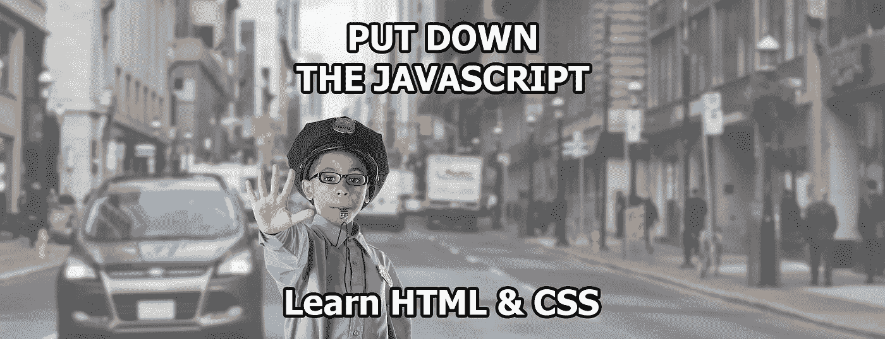
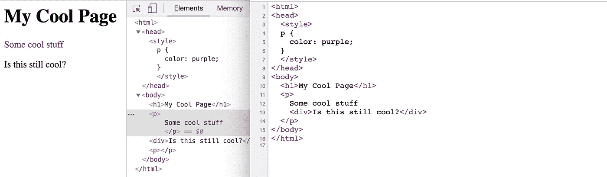
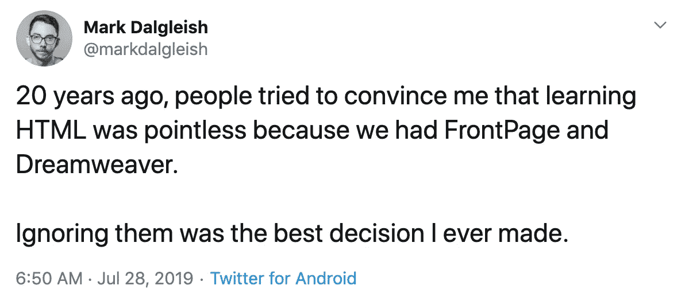

# 放下 Javascript——学习 HTML 和 CSS

> 原文：<https://betterprogramming.pub/put-down-the-javascript-learn-html-css-e8990d2ef9e6>

## 至少对引擎盖下发生的事情有一个基本的了解会对你有很大的帮助



前端开发的一个日益增长的趋势是，你可以一头扎进 JavaScript 并取得成功。老实说，不管是好是坏，你可能可以，但你只是建立在一个脆弱的基础之上，它会回来咬你。

# 为什么我需要 HTML 或者 CSS？

我们今天所知的 UI 框架，如 [React](https://reactjs.org/) 和 [Vue](https://vuejs.org) 建立在网页的基本构件之上:HTML 和 CSS。尽管这些 UI 框架通过一些很酷的工具和 JavaScript 强化了这些基础知识，但你所构建的基本上与 1996 年的 [Space Jam 网站](https://www.spacejam.com/archive/spacejam/movie/jam.htm)是一样的。

但是我明白了，手工编写 HTML 和 CSS 已经过时了，对吗？

## 了解您的工具在做什么

当您开发和调试应用程序时，至少对幕后发生的事情有一个基本的了解会对您有很大的帮助。

您可能会遇到一些奇怪的事情，比如 HTML 在浏览器中转换代码。以下面的例子为例:

```
<style>
p {
  color: purple;
}
</style>
<h1>My Cool Page</h1>
<p>
  Some cool stuff
  <div>Is this still cool?</div>
</p>
```

当你在 Chrome 中加载时，你会注意到一些变化…



示例浏览器固定 HTML

为什么不是所有的段落都是冷色调和紫色的？

事实证明你的浏览器是个好人，它会自动修复你的代码。一个段落标签(`<p>` ) [不能包含另一个块级元素](https://www.w3.org/TR/html401/struct/text.html#h-9.3.1)，所以 Chrome 和其他浏览器会动态调整你的 HTML 使其有效。HTML 这样就很宽大了！但是这是一个常见的错误，它难倒了不熟悉 HTML 工作原理的新老开发人员。

# 了解 CSS 的魔力

如今 CSS 可以做很多事情。不仅仅是设置几个颜色；它使您能够在整个应用程序中提供一致的 UI 模式。

不要害怕！如果您从 JavaScript 开始，您可能会尝试在那里做任何事情，但是您会很快发现在您的 JS 中管理 CSS 的所有真正功能是一件痛苦的事情，坦白地说，[没有必要，除非您是脸书](https://www.colbyfayock.com/2019/07/you-dont-need-css-in-js-why-i-use-stylesheets)。

你能做什么？用纯 CSS 搭建[外星人电影片头场景](https://www.colbyfayock.com/2019/07/you-dont-need-css-in-js-why-i-use-stylesheets)。为你的按钮抓取一些[悬停效果。或者只是](https://ianlunn.github.io/Hover/)[动画任何东西](https://daneden.github.io/animate.css/)！

我最喜欢的是创建一个奇特的类似脸书的 loading animation 类，它可以将动画渐变背景应用到你添加的任何东西上:

```
.loading {
  background: linear-gradient(90deg, #eff1f1 30%, #f7f8f8 50%, #eff1f1 70%);
  background-size: 400%;
  animation: loading 1.2s ease-in-out infinite;
}

@keyframes loading {
  0% {
    background-position: 100% 50%;
  }
  100% {
    background-position: 0 50%;
  }
}
```


加载动画示例

打开[一个密码笔](https://codepen.io/colbyfayock/pen/aKKoJP)自己试试吧！

# 让你的搜索结果相关

搜索引擎尽最大努力找出你写的内容如何与搜索它的用户相关，但你如何编写 HTML 在帮助他们确定价值方面有所不同。我看到的一个常见错误是不正确地使用`[Heading](https://developer.mozilla.org/en-US/docs/Web/HTML/Element/Heading_Elements)`元素，或者根本不使用它们。

```
<h1>All</h1>
<h1>My</h1>
<h1>Content</h1>
<h1>Is</h1>
<h1>Important</h1>
```

考虑这篇博文的大纲:

```
- Put Down the Javascript - Learn HTML & CSS
  - Why do I need HTML or CSS?
  - Understand what Your tools are doing
  - Learn the magic of CSS
...
```

“学习 CSS 的魔力”并不是该页面的关键要点，所以我不想强调它是最重要的。然而，这篇文章的标题“放下 Javascript——学习 HTML & CSS”反映了整个故事，使它成为最重要的。

所以对于我的 HTML，我想让它看起来更像:

```
<h1>Put Down the Javascript - Learn HTML & CSS</h1>
<h2>Why do I need HTML or CSS?</h2>
<h2>Understand what Your tools are doing</h2>
<h2>Put Down the JS - Learn HTML & CSS/h2>
```

这让 Google、Bing 和所有其他搜索引擎确切地知道什么应该是页面最重要的部分，并帮助识别总体层次结构。

# 通过包容性发展推动无障碍环境

不负责任地编码，我们会自动排除人们访问我们辛辛苦苦建立的网站。通过第一次做一点功课，多花一秒钟思考我们写的内容，我们可以包容所有访问我们网站的人。

就拿今天大多数网站常见的简单导航列表来说吧。你可能会忍不住写下一些`div`因为它们有用，对吗？

```
<div className="nav">
  <div><a href="#">Link 1</a></div>
  <div><a href="#">Link 2</a></div>
  <div><a href="#">Link 3</a></div>
</div>
```

问题是，它们不容易被屏幕阅读器识别。为了解决这个问题，从技术上讲，你可以编写更少的 HTML ( `div`是三个字符，`ul`和`li`是两个)。

```
<ul className="nav">
  <li><a href="#">Link 1</a></li>
  <li><a href="#">Link 2</a></li>
  <li><a href="#">Link 3</a></li>
</ul>
```

更进一步，如果这是你的导航菜单，将它包装在一个 [HTML 5 导航元素](https://developer.mozilla.org/en-US/docs/Web/HTML/Element/nav) ( `<nav>`)和[中，用户现在将能够直接访问菜单](https://www.w3.org/WAI/tutorials/menus/structure/#identify-menus)。

查看 A11y 项目的[以获得更多关于可访问性的好建议。](https://a11yproject.com)

# 简化您的代码，拥抱原生功能

你会惊讶于现代浏览器中有如此多的功能[，比你可能需要的更多的浏览器支持(对不起那些仍然支持](https://dev.to/ananyaneogi/html-can-do-that-c0n) [IE9](https://en.wikipedia.org/wiki/Internet_Explorer_9) 的人)。

使用一些基本的 HTML，您可以构建一个文本输入，在下拉列表中包含可搜索的、类似自动完成的文本:

```
<label>My Favorite Color</label>
<input type="text" name="color" list="colors">
<datalist id="colors">
  <option value="Magenta">
  <option value="Purple">
  <option value="Ultraviolet">
</datalist>
```


最喜欢的颜色选择器

利用 CSS 伪选择器，我们可以根据复选框类型的元素是否被选中来动态地设置它的样式:

```
<style>
.is-checked {
    display: none;
}

#my-checkbox:checked + span .is-checked {
    display: inline;
}

#my-checkbox:checked + span .not-checked {
    display: none;
}
</style>

<label for="my-checkbox">
  <input id="my-checkbox" type="checkbox" />
  <span>
    <span class="not-checked">Not Checked</span>
    <span class="is-checked">Checked</span>
    </span>
</label>
```


动态复选框

# 这是你的手艺，注意点



发自[https://www.w3.org/TR/html401/struct/text.html#h-9.3.1](https://medium.com/u/d7225e72eea#h-9.3.1)

*   [https://www . colbyfayock . com/2019/07/you-dont-need-CSS-in-js-why-I-use-style sheets](https://www.colbyfayock.com/2019/07/you-dont-need-css-in-js-why-i-use-stylesheets)*   [https://ianlunn.github.io/Hover/](https://ianlunn.github.io/Hover/)*   【https://daneden.github.io/animate.css/】*   [https://developer . Mozilla . org/en-US/docs/Web/HTML/Element/Heading _ Elements](https://developer.mozilla.org/en-US/docs/Web/HTML/Element/Heading_Elements)*   [https://www . w3 . org/WAI/tutorials/menus/structure/# identify-menus](https://www.w3.org/WAI/tutorials/menus/structure/#identify-menus)*   【https://a11yproject.com *   [https://dev.to/ananyaneogi/html-can-do-that-c0n](https://dev.to/ananyaneogi/html-can-do-that-c0n)