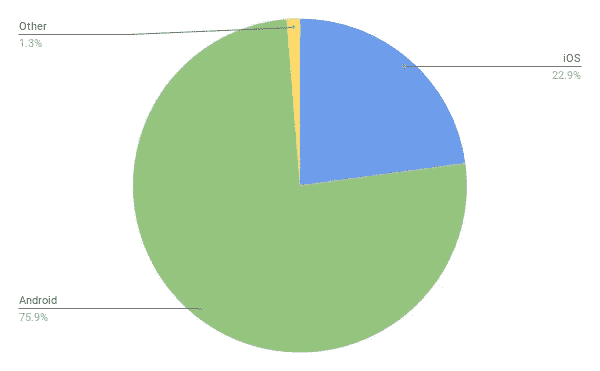
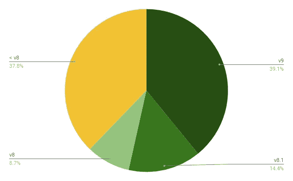
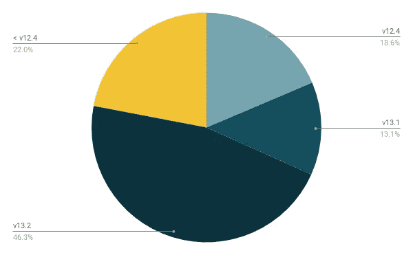

# 渐进式网络应用是移动开发的未来吗？

> 原文：<https://betterprogramming.pub/pwas-the-future-of-mobile-development-1acb85d7db60>

## 你或你的公司应该投资 PWAs 吗？

使用移动操作系统的原生编程语言进行原生开发，或者使用 React Native、 [Ionic](https://ionicframework.com/) 、 [Xamarin](https://dotnet.microsoft.com/apps/xamarin) 等技术进行混合移动开发，这两种方式一直主导着构建具有原生和离线工作感觉的移动应用。

但所有这些方法都需要将应用程序运送到谷歌 Play 商店和苹果应用商店等应用商店。

这就是 PWAs 的用武之地。它们以更小的封装尺寸接近本地应用运行，它们被部署到网络上，并且可以容易地添加到主屏幕上。

# 什么是 PWA？

渐进式 web 应用程序是用典型的 web 技术(HTML、CSS 和 JavaScript)构建的应用程序，它像任何其他 web 应用程序一样进行分发，但具有类似本机的功能。

谷歌[定义](https://developers.google.com/web/progressive-web-apps)PWA 应该是:

*   可靠:即使在网络连接不好或没有网络连接的情况下，加载速度也很快——因为事实上，如果网站在三秒钟内没有加载，超过一半的互联网用户会离开网站。当没有互联网连接时，pwa 使用服务人员来消除对网络服务器的依赖。
*   快速:流畅的动画和交互，让应用程序感觉很自然。(没有笨重的网页滚动。)
*   引人入胜:应该拥有尽可能接近原生设备的用户体验。这意味着它至少应该能够全屏运行(如果添加到主屏幕)并处理通知。(iOS 还没到。)

## 服务人员

服务工作者是浏览器在后台运行的 JavaScript 文件。它主要用作 web 服务器的代理。这意味着，如果浏览器没有稳定的互联网连接，这些请求将由服务人员处理。

因此，它可以模仿 web 服务器的动作，但是是从缓存中模仿的，这给了它在离线模式下工作的能力。

服务人员还可以用来创建不需要网页或用户交互的功能，例如推送通知。

服务人员在不断发展，在未来，他们可能会有新的功能，如地理参考，以使用户体验尽可能地本地化。

# 数字不会说谎

现在我们对 PWAs 有了更多的了解，让我们来看看为什么他们会成为移动开发行业的重要参与者。先来看几个统计数据(2019 年 11 月)。

全球移动操作系统市场份额:

[来源](https://gs.statcounter.com/os-market-share/mobile/worldwide)

Android 版本市场份额:

[来源](https://gs.statcounter.com/android-version-market-share/mobile-tablet/worldwide)

iOS 版本市场份额:

[来源](https://gs.statcounter.com/ios-version-market-share/mobile-tablet/worldwide)

看这些图表，我们可以看到，Android 拥有全球移动操作系统市场份额的 75%以上，iOS 拥有约 23%。我们还可以看到，大约 75%的 iOS 手机运行 12.4 版本，超过 70%的 Android 手机运行 Android 8 以上的版本。

这些统计数据背后的原因是这些操作系统运行在功能强大的手机上。iOS 12.4 是 2019 年发布的，Android 8 是 2017 年发布的，也就是说运行这些操作系统的手机都是相当快的。

即使是相对较老的低端手机也有大约 2GB 的内存和一个不错的骁龙处理器。这些手机加上谷歌的 Chrome 能够运行 PWAs，而无需进行原生开发。

因此，最近和新的 iphone/Android 手机可以轻松运行它们，并提供几乎类似本机的体验，而没有本机应用程序的效率。

这不包括任何需要大量图形能力和动画的应用程序(我们都知道 pwa 不是为游戏开发设计的)。

# iOS 和 PWAs？

正如我之前所说，苹果拥有超过 20%的手机市场份额，如果我们只看欧洲和北美，甚至更多，他们在 iOS 上添加 PWAs 支持的速度非常慢。

iOS 11.3 以上支持 pwa，但这并不意味着与其他浏览器(尤其是 Chrome)相比，pwa 得到了完全支持。这种支持在以后的版本中变得更好，尤其是在 iOS 13 上。

虽然一些最重要的功能，如推送通知和后台同步，在 iOS 上仍然不支持。这是否意味着苹果反对 PWAs？不，我不这么认为，我只是认为他们的策略还没有完全支持 PWAs 的想法。

每个版本的改进都表明苹果看到了增加更多支持的需要，这只是时间问题。

我相信这一点，因为根据 2017 年末的这项[美国研究](https://www.comscore.com/Insights/Presentations-and-Whitepapers/2017/The-2017-US-Mobile-App-Report)，用户在仅仅 10 个应用程序中花费了 97%,顶级移动网站获得的独立用户比移动应用程序多 800 多万。

随着谷歌在 PWA 支持方面的领先，以及微软将 Outlook 变成 PWA 并使其 Edge 浏览器基于 Chromium，我相信苹果的 iOS 将(最终)遵循这一趋势。

# 前端框架

采用最新的前端框架(Vue、Angular、React 等。)建造 PWA 从未如此简单。

它们具有超快的渲染能力，使过渡和动画看起来尽可能平滑，并且通过像 Ionic 这样的框架，它甚至可以更容易地使您的应用程序具有原生的外观和感觉。

其中一些框架有现成的模板可用于 PWA 开发。构建 PWAs 的技术已经成熟，随时可以使用。只需要浏览器厂商达成共识。

# 从 PWA 中获益的公司

许多公司在开发本地应用的同时也在开发 pwa，让用户有机会通过网络浏览器访问他们的移动应用服务。

这里有几个这样做的公司的例子。(这里是[来源](https://www.pwastats.com/)如果你想了解更多)。

## **火绒**

通过创建 PWA，他们将加载时间从 11.91 秒减少到 4.69 秒，因为 PWA 比他们的原生 Android 应用程序小 90%。这导致 PWA 用户参与度的增加。

## **繁琐**

Trivago 见证了将 PWA 添加到主屏幕的用户激增 150%。

离线支持允许用户即使在没有互联网连接的情况下也能继续他们的会话，并且 67%的用户在重新上线时继续使用 PWA。这也导致酒店报价点击量增加了 97%。

## **Pinterest**

Pinterest 将其移动网站升级为 PWA，与前两个例子一样，核心参与度增加了 60%。

他们还见证了花在网站上的时间增加了 40%，广告收入增加了 44%。

## **优步**

优步的主要目标之一是让尽可能多的人使用他们的服务。这意味着他们还需要瞄准网速慢(2G)的人群。

他们的 PWA 2G 加载时间不到三秒，因为核心应用程序的整个 gzip 大小为 50K。

谷歌，微软，推特，福布斯，还有很多都有 PWAs。这些以及更多 PWA 的例子向我们展示了拥有 PWA 如何使人们更容易获得服务，从而提高用户参与度。

# 结论

pwa 已经存在了一段时间，但其受欢迎程度的增加主要是由于功能强大的移动电话和谷歌、微软等大公司社区的支持。

随着时间的推移，pwa 将变得更加流行/强大，一旦苹果的 iOS 完全支持它们，pwa 可能会成为构建移动应用的主要方式。

 [## 费萨尔·舒拉💙

### 费萨尔·舒拉的最新推文💙(@fchoura)。瑞士信贷|day☀️的 Javascript 开发者#Flutter 开发者…

twitter.com](https://twitter.com/fchoura)