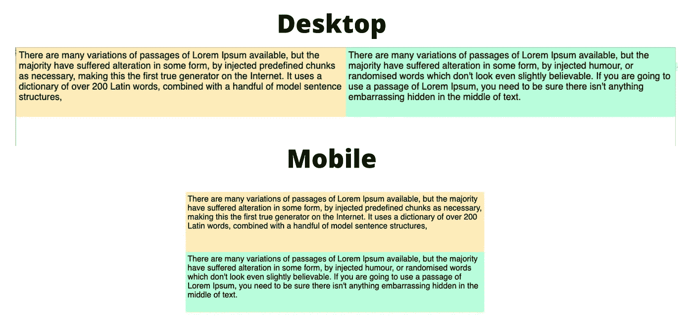
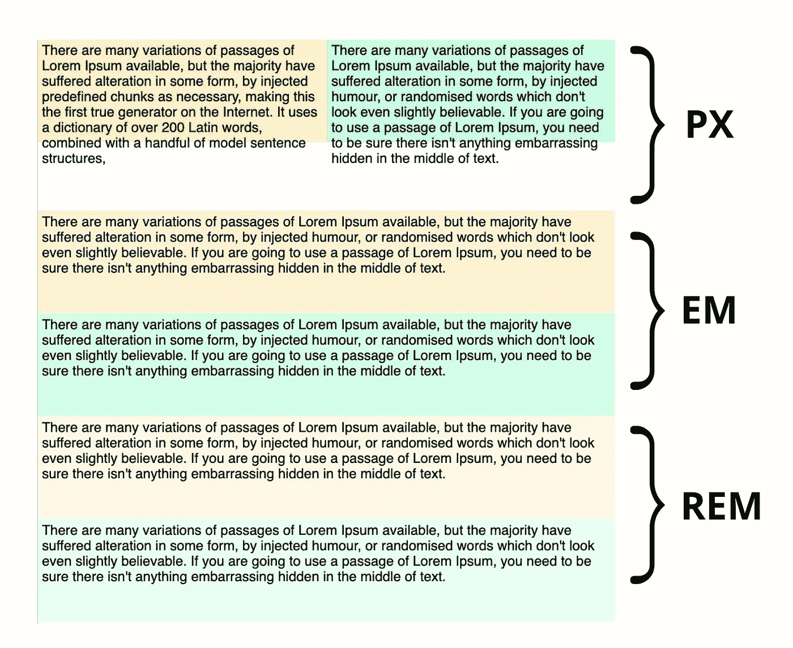
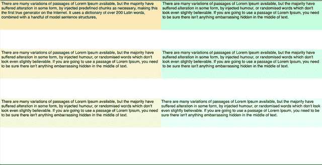

# PX，EM，还是 REM？2021 年考察媒体查询单位

> 原文：<https://betterprogramming.pub/px-em-or-rem-examining-media-query-units-in-2021-e00cf37b91a9>

## 在不同浏览器中测试断点行为


图片由作者通过[Canva.com](http://Canva.com)提供

我最近写了[一篇文章](/3-reasons-to-abandon-bootstrap-in-2021-aa71bbc1af14)，在文章中我提出了使用基于像素的断点的引导。我提到过相对的(例如基于`em`或`rem`的断点)对于可访问性更好。这就是我不久前改用`em`回答媒体提问的原因。但是因为我不再写代码了，我从来没有考虑过这个决定。

文章发表后，这一声明在开发人员中引发了很多讨论。虽然我采访的许多开发人员说，他们从未真正考虑过选择`em`或`rem`而不是像素，但其他人强烈主张选择一个单元而不是另一个。

所以我很好奇，想看看它们各自的优缺点。我看到了 Zell Liew 的文章，其中包括一些精彩的实验，并最终得出结论，基于`em`的断点在所有浏览器中都工作得最好，而基于像素的断点引起的问题最多。然而这首曲子是 2016 年写的。

所以我们来看看 2021 年的断点单位。我们是否仍然面临同样的可访问性和浏览器兼容性问题？还是现代浏览器变好了还是变坏了？

# 可访问性是怎么回事？

首先，我想检查一下相对单位对于可访问性更好的说法，以及这背后的推理。

让我们来看一个断点的经典例子。一页上有两个框，里面有文字。他们并排坐着，有固定的高度。文本应该留在框中，所以设计者要求文本一重叠，框就堆叠在一起。



断点用法示例

为了简单起见，我将元素浮动在我定义的断点的最小宽度处。我使用相同的设置，但有三个不同的断点:

```
[@media](http://twitter.com/media) (min-width: 1000px) {
... 
}
[@media](http://twitter.com/media) (min-width: 62.5em) {
... 
}
[@media](http://twitter.com/media) (min-width: 62.5rem) {
... 
}
```

根据我的基本设置，这些都相当于一个 1000 像素的断点。如果在所有浏览器中都到达了断点，我的盒子可以很好地堆叠。

但是我使用的所有浏览器都设置为默认字体大小。

一些研究表明，多达 11%的用户使用不同的默认字体大小。例如在 Chrome 中，这可以在设置- >外观下更改。我可以帮助有视觉障碍或阅读小文本困难的用户改变所有网站的字体大小。如果网站是使用字体大小的`em`或`rem`单位构建的，文本应该缩放。

所以让我们来看看默认字体大小改变时断点会发生什么。



1100 像素屏幕尺寸的布局

当浏览器字体大小设置得更大时，相对断点会触发得更快，而基于像素的断点仍然会以 1000px 的速度触发。Chrome、Firefox、Edge 和 Safari 都是如此。

文本变大意味着在基于像素的例子中，它现在将溢出，而基于媒体查询的相对单位的框将很快破裂，以使文本总是留在里面。

总之:使用像素的相对单位作为断点将确保网站布局在用户改变浏览器字体大小时仍能正常工作。

# 而放大呢？

2016 年的帖子中强调的另一个可访问性问题是，当用户放大时，Safari 不支持像素断点。让我们在 2021 年进行测试。

在 Chrome、Firefox 和 Edge 中，当放大时，断点都在 1000px 处触发。由于文本大小和文本框现在也发生了变化，这是所期望的行为。文本从不溢出。

然后是 Safari:



放大时 Safari 中的断点

这是放大了 120%的窗口。断点似乎无处不在。在 1250 像素触发`rem`媒体查询，然后在 1150 像素触发`em`媒体查询，最后在 1000 像素触发`px`媒体查询。

与 Liew 实验中的结论相反，在 Safari 中似乎只有 pixel 媒体查询的行为与在其他浏览器中一样。

然而，在我们的盒子布局的情况下，这仅仅意味着当视图被放大时，它更快地改变到移动布局。虽然这看起来有点奇怪，但我们没有出现文本重叠的情况。

# 压力测试 Safari

由于 Safari 似乎是最难取悦的浏览器，我决定再做一些测试。

首先，我将媒体查询从最小宽度改为最大宽度，看看是否会有所不同。**它没有**。行为仍然如上所示。

然后我把浏览器字体大小改成大**和**同时放大。奇怪的是，现在`rem`和`em`断点同时被触发——但都比 1000px 早得多。

然后我将 HTML 中的基本字体大小改为 150%。这是 2016 年文章中的一个实验，强调了 Safari 过早地在`rem`中触发断点。

在最新版本的 Safari 中，`rem`和`em`都以 1500px 触发。

这个实验有趣的是，似乎在 2016 年，所有断点的预期行为都是在 1500 像素触发，因为字体大小设置为 150%。Chrome 不再是这种情况了。所以奇怪的是，Safari 的像素断点更符合其他浏览器。

最后，我尝试将基本字体大小设为 150% **和**放大。这给了我们与上面类似的行为，它们都在不同的点触发。

# 结论

通过这些实验，我发现选择断点单元并不像我最初想的那样简单。

看来你得在支持 Safari 和支持辅助功能之间做出选择了。但是那么有无障碍需求的用户有多少使用 Safari 呢？

总体来说我还是会选择`rem`或者`em`。虽然在 Safari 的某些情况下它们会过早地断开，但至少它们不会导致文本重叠。在我的场景中，我在内容下面留了很大的空白，以便更容易发现问题。然而，在真实的网站上，这可能意味着内容与其他内容重叠，变得难以辨认。

好消息是，从 pixel 切换对设置为默认字体设置且未放大的浏览器没有任何影响。所以大多数人不会注意到这个变化。如果它至少对一些用户有帮助，也许值得一试？

让我知道你正在使用什么，如果你发现任何其他浏览器不一致或建议的无障碍布局。这是我用于测试的笔:

# 更多来自艾里斯·温特

[](/3-reasons-to-abandon-bootstrap-in-2021-aa71bbc1af14) [## 2021 年放弃 Bootstrap 的 3 个理由

### 已经 10 年了，让我们继续前进

better 编程. pub](/3-reasons-to-abandon-bootstrap-in-2021-aa71bbc1af14) [](/how-to-nail-any-technical-interview-question-f540fc252c06) [## 如何搞定任何技术面试问题

### 最好的部分是你不必准备很多

better 编程. pub](/how-to-nail-any-technical-interview-question-f540fc252c06)