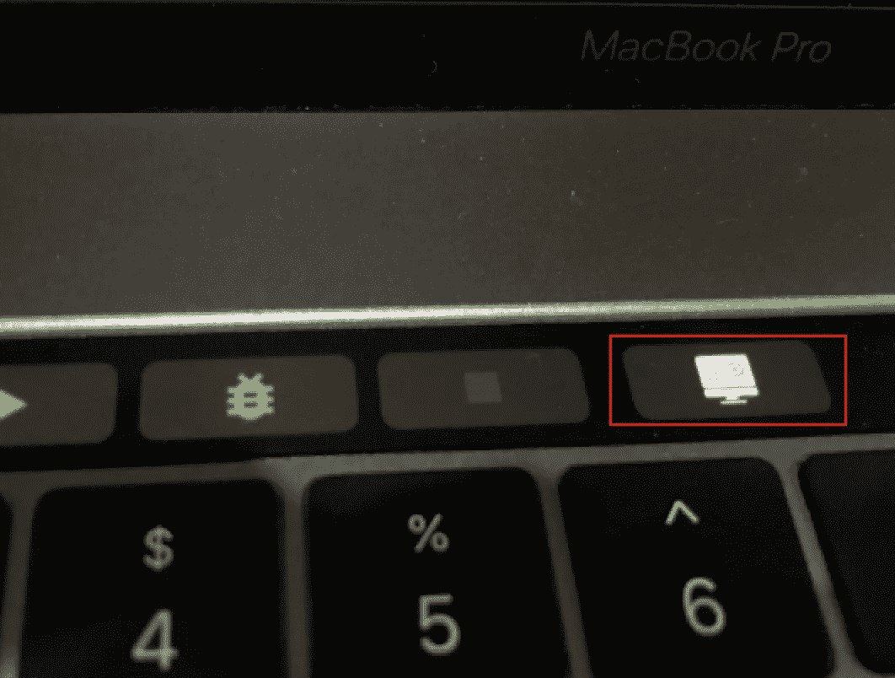
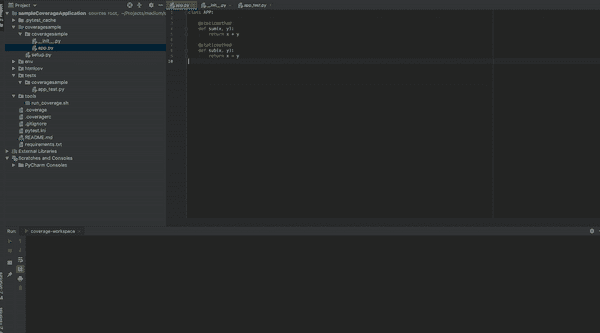
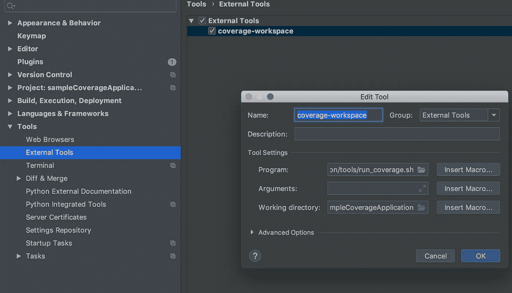
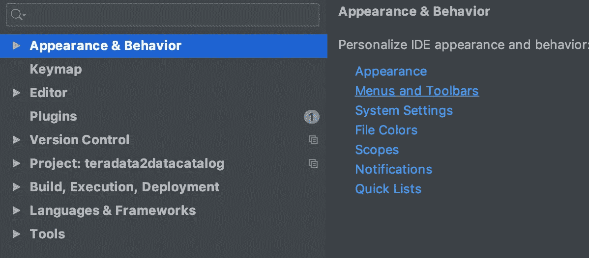
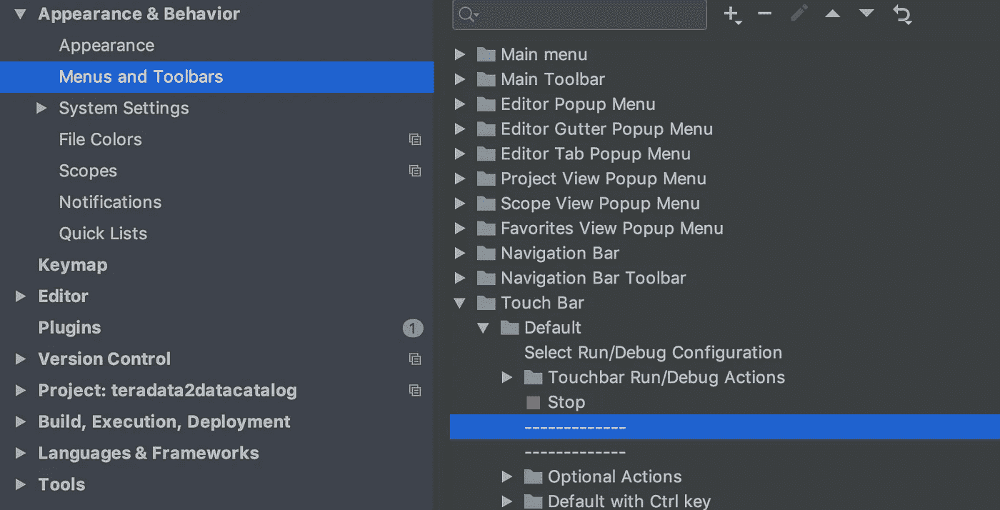
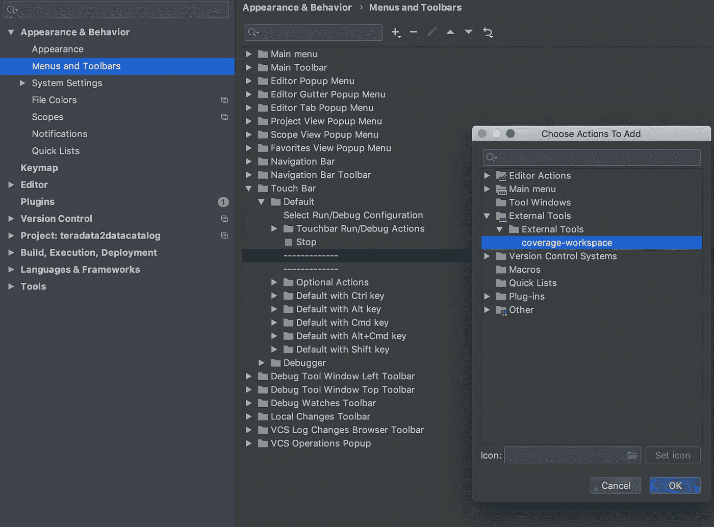

# PyCharm、Mac、Touch Bar 和代码覆盖率=神奇覆盖率按钮

> 原文：<https://betterprogramming.pub/pycharm-mac-touch-bar-coverage-fun-tooling-a285e9028efc>

## 为您的触摸条配置图标

帕特里克·沃德在 [Unsplash](https://unsplash.com/search/photos/mac?utm_source=unsplash&utm_medium=referral&utm_content=creditCopyText) 上的照片

首先也是最重要的，我不是 100%代码覆盖率的支持者，也没有设定一个数字作为你的代码覆盖率目标。如果你看看[古德哈特定律](https://en.m.wikipedia.org/wiki/Goodhart's_law)或者[帕累托法则](https://en.wikipedia.org/wiki/Pareto_principle)，你就会明白神奇的数字是如何误导人的。

我相信代码覆盖率有助于您识别差距，并在提高代码质量时支持您的决策。

介绍完之后，我们来看看这张图片:

图一。覆盖范围魔法按钮

您是否想知道图像中有标记的按钮是做什么用的？你有没有把你的 [Mac Touch bar](https://support.apple.com/en-us/HT207055) 发挥到极致？

如果我告诉你，你可以配置一个图标，当你打开 PyCharm IDE 时，这个图标就会出现在你的 Touch Bar 上，当你按下它时，会发生这样的事情:

1.  在您的工作区中运行单元测试。
2.  生成覆盖文件。
3.  打开 Chrome 并向您展示覆盖率结果。

让我们来看一个现场演示:

图二。覆盖按钮的执行

真的很酷！

你可以通过创建一个快捷键来达到同样的目的，但是这有什么意思呢？

让我们看看如何配置这个神奇的覆盖率按钮。

# 1.找一个好看的图标

我发现了这个免费图标[网站](https://www.flaticon.com/packs/science-and-technology-9)，这个吸引了我的注意:

图 3。覆盖图标。来自 www.flaticon.com 的 Freepik 制作的图标

# 2.创建您的覆盖率脚本

我们将使用此脚本来运行覆盖作业:

该脚本执行以下操作:

1.  激活工作区中的[虚拟按钮](https://virtualenv.pypa.io/)。
2.  使用覆盖标志执行 [pytest](https://docs.pytest.org/en/latest/) 。
3.  打开 Chrome，传递覆盖报告文件。

你还需要一些配置文件，看看这个例子 [Git repo](https://github.com/mesmacosta/coverage_button_sample) 。这就是在演示 gif 中执行的那个。你需要的文件是:`.coveragerc`和`requirements.txt`里面的依赖关系。

# 3.将脚本添加到 Mac Touch Bar

在 PyCharm IDE 中，进入*首选项*->-外部工具:

图 4。PyCharm 外部工具配置

创建一个新的配置，并添加覆盖率脚本作为程序。记得将*工作目录*设置为您工作空间的根目录。

创建外部工具后，转到*首选项*内的*外观&行为*。

图 5。PyCharm 外观和行为

选择*菜单和工具栏*选项。

图 6。PyCharm 菜单和工具栏

选择*触摸条*选项- > *默认*。然后，选择一个空选项，即上图中高亮显示的值。

图 7。选择要添加的操作

然后，点击 *+* ，添加你的动作，这将是我们创建的外部工具，`coverage-workspace`。

在 OK 按钮的顶部，有一个*图标*选项，点击文件夹选择你下载的图标。

然后，您的新 Touch Bar 操作将被配置，您将看到如下图所示的图标:

图 9。覆盖率-工作区活动

就是这样！现在，享受你的覆盖按钮！

# 资源

1.  GitHub 回购:[https://github.com/mesmacosta/coverage_button_sample](https://github.com/mesmacosta/coverage_button_sample)
2.  MAC Touch Bar:[https://support.apple.com/en-us/HT207055](https://support.apple.com/en-us/HT207055)