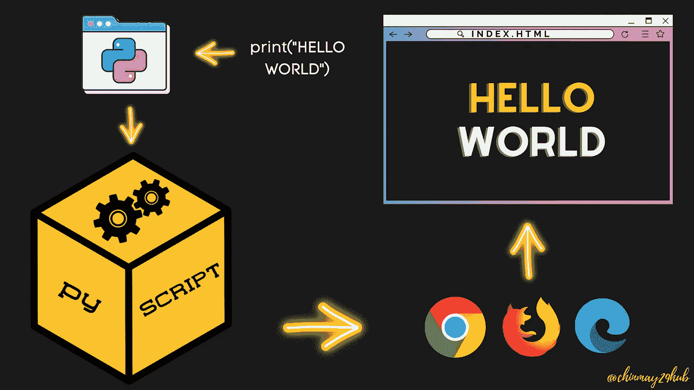
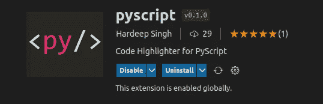
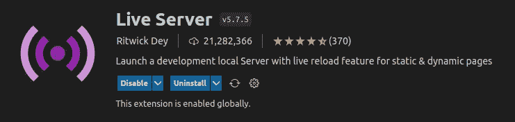
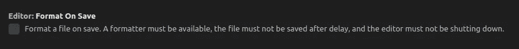
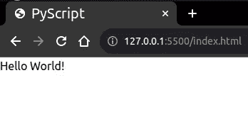
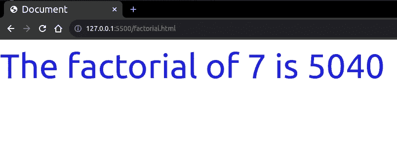
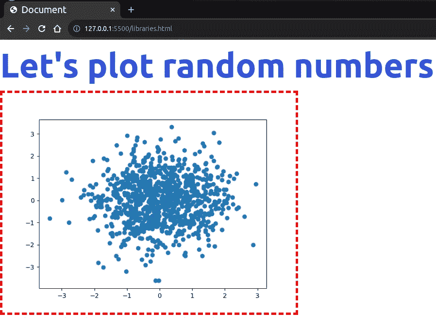

# 如何在 VS 代码中使用 PyScript

> 原文：<https://betterprogramming.pub/pyscript-run-python-with-html-e77f1786a062>

## 并且知道如何在 PyScript 中集成 Python 包



PyScript —在 HTML 中运行 Python

你甚至无法想象我们将要经历什么。Anaconda 的首席执行官王蒙杰在 2022 年的 [PyCon](https://pycon.org/) 活动上公布了一个相当令人惊讶的项目——[PyScript，](https://pyscript.net/)。Anaconda 的开发人员已经开发出一种新的方式，可以在 HTML 内的网络浏览器上运行 python 脚本。

PyScript 是一个使用 HTML 界面在浏览器中构建强大的 [Python](https://www.python.org/) 程序的框架。要阅读完整的指南，请访问他们的官方博客。

# 安装和设置

没有安装任何使用 PyScript 的包。

## 安装和使用 PyScript 有两种方法

1.  您可以下载 [zip 文件](https://github.com/pyscript/pyscript/archive/refs/heads/main.zip)，并在解压缩后在 HTML 文件的`<head>`标签中包含以下代码行

```
...
<link rel="stylesheet" href="path/to/pyscript.css" />
<script defer src="path/to/pyscript.js"></script>
...
```

请确保将提取的文件移动到主 HTML 文件的根目录下

2.或者您可以将这些行直接包含在您的`<head>`标签中:

```
...
<link rel="stylesheet" href="https://pyscript.net/alpha/pyscript.css" />
<script defer src="https://pyscript.net/alpha/pyscript.js"></script>
...
```

现在，让我们进入下一部分。

## 设置 VS 代码

我将推荐使用 [**VS Code**](https://code.visualstudio.com/) 作为编辑器，因为它提供了扩展、最好的语法高亮显示以及更多的东西。安装 VS 代码后，转到扩展选项卡并安装以下扩展—

*   [**py script**](https://marketplace.visualstudio.com/items?itemName=HardeepSingh.pyscript)**:**py script 漂亮的语法和作用域片段。



屏幕截图

*   [**直播服务器**](https://marketplace.visualstudio.com/items?itemName=ritwickdey.LiveServer)



实时服务器—自动加载网页

在这之后，有一个设置你需要在 VS 代码中更改，这样我们就不会得到任何类似“缩进错误”*的错误。*为此，进入文件>首选项>设置。并在搜索栏中键入【保存格式】，取消勾选以下:



这样做的原因是，当 VS 代码保存文件时，它会格式化文本并添加/删除空格，这会导致 Python 中的错误。

我们已经完成了所有的设置，现在是写代码的时候了。

让我们创建一个新的 HTML 文件，并将以下代码粘贴到其中:

你好世界节目

点击保存并点击右下角的 ***上线*** 选项:


这将在您的默认浏览器中打开一个链接[http://127 . 0 . 0 . 1:5500/index . html](http://127.0.0.1:5500/index.html)。结果如下:



铬

正如你在代码中看到的，我们把我们的 python 代码写在`<py-script></py-script>` 标签中。代码应该像我们正常编写 python 代码一样编写，左边没有任何空格，除非需要。

让我们玩一点 CSS，让代码变得复杂一点——

阶乘程序

在上面的代码中你可以看到，我们使用了`pyscript.write()`方法，而不仅仅是`print()`方法——这是因为纯文本作为输出并不总是好的。

为了应用 CSS，我们创建了一个空的`<div>`，并给它分配了一个`id`。为 id 添加各自的 css 样式。然后，在`write()`方法中，它以`**id**` 为参数，用`f`格式化指定需要打印的文本。

下面是实际输出:



铬

# 使用库

是的，您还可以使用 PyScript 处理 Python 模块。我们在`<head>`标签中使用`<py-env></py-env>` 。

您可以使用本地系统的完整路径指定`.whl` 文件，如下所示:

```
...
<py-env>
- './static/wheels/travertino-0.1.3-py3-none-any.whl'
</py-env>
...
```

或者您可以直接将内置的模块 [Pyodide](https://pyodide.org/en/stable/usage/packages-in-pyodide.html) 包含在`<head>`标签中，如下所示:

```
...
<py-env>
  - numpy
  - matplotlib
  - another module here
</py-env>
...
```

这里有一个例子:

运行该页面会产生以下输出:



铬

唉！我们可以在 HTML 中运行 Python 脚本。

[](https://github.com/pyscript/pyscript) [## GitHub - pyscript/pyscript

### PyScript 是 Scratch、JSFiddle 或其他“易于使用”的编程框架的 Pythonic 替代品，使 web 成为一个…

github.com](https://github.com/pyscript/pyscript) 

如果你正在寻找更多的特性，你可以浏览上面库中的例子。PyScript 的官方文档将很快发布。截至目前，可以参考[入门。Github 上的 MD](https://github.com/pyscript/pyscript/blob/main/GETTING-STARTED.md) 模板。

```
**Want to Connect?**Follow me [LinkedIn](https://www.linkedin.com/in/chinmay-sonawane-38474019a/).
```